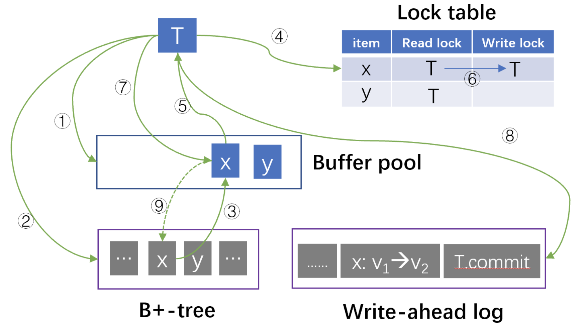
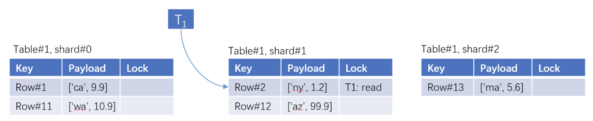

In this blog post, we introduce our transformative concept **Data Substrate**. Data Substrate abstracts core functionality in online transactional databases (OLTP) by providing a unified layer for [CRUD](https://en.wikipedia.org/wiki/Create,_read,_update_and_delete) operations. A database built on this unified layer is modular: a database module is optional, can be replaced and can scale up/out independently of other modules.

<!--truncate-->

## Motivation

In the early days of computing, data were stored in plain files and processed using custom programs. [Relational database management systems (RDBMS)](https://en.wikipedia.org/wiki/Relational_database) emerged in the 1970s to model data as tables, store them on disk with consistency and integrity and provide [SQL](https://en.wikipedia.org/wiki/SQL) as a standard API 　 to access them. RDBMS has been the _de facto_ solution for data management for more than two decades.

However, this changed in the early 2000s with the rapid growth of the Internet. Internet applications, such as search engines, social networks and e-commerce websites, generates large volumes of data and redefined data-intensive workloads. ["One Size Does Not Fit All"](https://cs.brown.edu/~ugur/fits_all.pdf) was the catching phrase that defined the next couple of decades in database systems. Over the last two decades, the database landscape evolved mainly in two directions: scalability and data models.

Making a database scale is hard. Doing so while maintaining [ACID](https://en.wikipedia.org/wiki/ACID) properties and minimizing performance impact is even harder. The NoSQL trend, epitomized by Google BigTable and Amazon Dynamo, became known for trading ACID for scalability. NewSQL and distributed SQL databases, such as [CockroachDB](https://www.cockroachlabs.com/), later brought back transactions, but often at a hefty cost to efficiency. Most recently, cloud-native databases such as Amazon [Aurora](https://aws.amazon.com/rds/aurora/) decouple compute and storage to allow storage to scale and avoid the more difficult task of scaling transactions.

The second trend was the emergence of diverse data models. Simple key-value pairs are sufficient for caching purposes, graphs become important for modeling relationships, and streams and time series are ideal for modeling continuously changing data. It was increasingly clear that the relational model can not support all applications well. With the rise of diverse data types and structures, specialized databases for these new data models emerged, accompanied by new query languages.

The database evolution in past twenty-plus years leads to a database landscape that is extremely complex. Now, we have a myriad of databases for different data models, further fragmented by scale (single-node, distributed storage, shared-nothing-distributed), environment (on-premises, cloud) and storage device (in-memory, SSD, non-volatile memory). This fragmentation presents daunting challenges for users. As [illustrated](https://a16z.com/wp-content/uploads/2023/04/Unified-Data-Infrastructure-2.0-1.png) in [an article](https://a16z.com/emerging-architectures-for-modern-data-infrastructure/) from Andreessen Horowitz, the modern data pipeline now consists of numerous specialized components, each designed to handle specific tasks, creating a maze of tools and systems that users must navigate to manage their data. If cloud providers need [multiple](https://docs.aws.amazon.com/whitepapers/latest/choosing-an-aws-nosql-database/decision-making.html) [articles](https://docs.aws.amazon.com/decision-guides/latest/databases-on-aws-how-to-choose/databases-on-aws-how-to-choose.html) and [decision diagrams](https://docs.aws.amazon.com/images/whitepapers/latest/choosing-an-aws-nosql-database/images/decision-tree2.png) to explain how to choose the right database, many would agree that we might have gone a little [too far](https://medium.com/koalabs/one-size-does-not-fit-all-in-database-systems-true-in-early-2000s-now-we-have-the-opposite-d41146bc6693).

Must we build a new database for every type of data model, environment or hardware? If we examine a new database and compare it with an existing one, it is evident that the vast majority of functionality is the same. A new database has to re-implement many features that have been developed many times before offering some new value. We should, and we believe that we can, do better.

At EloqData, our answer to this grand question is **Data Substrate**.

## Inspiration: Single-Node RDBMS

Data substrate draws inspirations from the canonical design of single-node relational database management systems (RDBMS). To understand where Data Substrate originates, let us revisit what RDBMS does. In a simplified form, a RDBMS kernel contains 4 modules: (1) a disk-resident B+-tree to store data items, (2) a write-ahead log to persist data changes, (3) a buffer pool to cache B+-tree pages in memory, and (4) a lock table to coordinate reads and writes for concurrency control.

import EnlargeableImage from '@site/src/pages/enlarge_pic';

<EnlargeableImage src={require('./img/blog_ds_1.png').default} alt="Data Substrate Architecture" />

<!-- 

 -->

Considering a transaction T that reads and updates a data item x. T traverses the B+-tree and searches the buffer pool for each page (①). If there is is a cache miss, T locates the disk-resident page (②) and loads it into the buffer pool (③). T then pins the page containing x in the buffer pool, adds a read lock on x in the lock table (④), reads x (⑤) and unpins the page.

To update x, T upgrades the lock on x to a write lock (⑥), modifies the page of x in the buffer pool (⑦) and appends redo/undo operations to the log (⑧). T commits by synchronously flushing a commit record to the log, which also forces the persistence of the prior redo/undo log entries.

By the time T commits, the change on x is recorded in the log and the in-memory page in the buffer pool, but not yet in the disk-resident B+-tree. A background process called checkpointing periodically flushes dirty pages to disk (⑨).

Although originally designed for transaction processing of tabular data, the design priniciples are optimal for supporting CRUD operations. The four most important pillars of this process are:

- _Durability_. To ensure data durability, the system uses an append-only log to persist changes. Sequential writes offer the highest write throughput achievable from stable storage. With only one synchronous write in the critical path, no design provides higher throughput and lower latency than using the log to achieve durability. The log is also crucial for data safety, as most storage devices cannot avoid partial writes during power failures.

- _Cache_. With the log providing durability, data changes are retained in memory. This reduces IO in the write path and prevents stale reads in subsequent operations. Caching in memory also optimizes performance for future reads.

- _Asynchrony_. Cached data changes are asynchronously flushed to stable storage, which reduces the cost of writing to stable storage in two ways. First, multiple changes on the same data item are coalesced. Second, a batch of changes can be accumulated and reorgnized to optimize sequential writes.

- _Consistency and fault tolerance_. Asynchrony creates in a window between when the data change becomes visible in cache and when it is flushed to stable storage. To handle failures, the system maintains an invariant: the data change must reside in either cache, stable storage, or both. This invariant ensures that (1) during cache replacement, a dirty page cannot be evicted unless it has been flushed, and (2) during failover, unflushed changes must be recovered in either stable storage or the cache.

## Data Substrate

The values of the design principles go beyond RDBMS. Whether the data item is a row in a table, a data structure or a JSON document, the durability principle applies as long as we want to store it safely in stable storage. Regardless of whether the database runs in a single node or a distributed environment, memory is fast but scarce, storage is abundant but slow, so we need the cache and asynchrony principles to balance the two to serve reads and writes. In Data Substrate, we extend these principles to (non-transactional) CRUD operations of any data models in distributed environments.

- _Durability_. Data substrate uses a distributed, replicated log for persisting data changes. Each logger is replicated for high availability. Having multiple loggers provides scalability for write throughput.

- _Cache and concurrency control_. Data substrate uses a distributed, in-memory map for cache and concurrency control. We call this map the "TxMap". The map key identifies a data item, and the payload includes the value and meta-data for concurrency control. Accessing a map entry reads/writes the cached value and performs concurrency control. Concurrency control is optional: if the operation is non-transactional or does not require locks, the access does not change the meta-data.

<EnlargeableImage src={require('./img/blog_ds_2.png').default} alt="Data Substrate Architecture 2" />

<!-- 

 -->

- _Asynchrony_. Changed data items are first flushed to the log and then updated in the TxMap. Modified data items are asynchronously written to a persistent data store. The data store plays the same role as a B+-tree and stores data items in stable storage. The data store exposes Get(), Put() APIs for reading and writing data items.

<EnlargeableImage src={require('./img/blog_ds_3.png').default} alt="Data Substrate Architecture 3" />

<!-- 

 -->

- _Consistency and fault tolerance_. Data substrate maintains the same invariant as RDBMS: (1) a changed data item cannot be evicted from the TxMap until it is flushed to the persistent store, and (2) A fail-over node of the TxMap cannot start serving unless unflushed data items are recovered in the TxMap from the log.

<EnlargeableImage src={require('./img/blog_ds_4.png').default} alt="Data Substrate Architecture 3" />

<!-- 

 -->

## Modularity

<EnlargeableImage src={require('./img/substrate_arch.png').default} alt="Data Substrate Architecture 4" />

<!-- 

 -->

What makes Data Substrate unique is modularity. The TxMap exposes APIs for runtime to access data and manage concurrency control. The persistent storage exposes APIs for the TxMap to flush changed data and to retrieve data that have been evicted. The log provides APIs to persist data changes and to ship unflushed data to the TxMap for recovery. Modules communicate with each other via carefully designed APIs, with no assumption about where the other modules are located, how they are implemented, or what hardware resources they use.

Data Substrate and the persistent store is agnostic to the data types. Concurrency control and cache replacement algorithms would not change if a data item represents a row or a JSON document. Log entries contain serialized changes to data items, which are also agnostic to data types. The persistent store indexes data items by identifiers and use the same index structures. In essence, data of different types face the same system challenges and Data Substrate solves them once for all. Building an operational database of a certain data model is greatly simplified by porting a specific query engine on top.

Modularity also changes how a database scales. Conventionally, a database either scales vertically or horizontally. The recent trend of disaggregating compute and storage in cloud-native databases allows CPU and storage to scale separately. Data Substrate’s modularity goes a step further and scales the database at the finest granularity: CPU, cache (memory), the log (storage) and the persistent store (storage). This scaling flexibility allows the database to use minimal resources to meet applications’ performance requirements.

- For a read-intensive, latency-sensitive application (such as social network feeds), the database caches hot data in memory and only scales the cache when the workload surges. Today, a single VM's memory goes from 4 GB to over 256 GB. Thus, scaling the database cache first scales up, and beyond a certain point scales out. The log scale is small, as the workload is mostly-read.
- For a write-heavy application (such as hi-frequency trading), the database scales the log horizontally to many storage devices to persist changes quickly. Horizontal scaling ensures the write throughput is high, while keeping write latency low. Logging is independent of the cache size and data volume, which may be small and can fit into a single machine’s memory and a disk.

While we believe ACID transactions are essential to applications, we also believe that ACID transactions should be optional such that applications that do not need them shall not pay the cost. In Data Substrate, this is achieved by disabling some modules or bypass ACID transaction logics. For example, by disabling the log, the database drops durability and becomes a cache system.

## EloqKV and Beyond

Data Substrate opens the door to many opportunities. Regardless of whether building a kv cache, an in-memory graph db, or a relational database, a developer just needs to put a query parser and an execution engine on top of the Data Substrate, and we are all set. You get an elastic, performant and fault tolerant operational database.

We are working on the first database based on the Data Substrate technology, a key-value database called **EloqKV**, stay tuned. Do you have a favorite data model or specific database capabilities you value most? [Reach out to us](/contact)—we’d love to hear from you! We invite you to share your database challenges. Your feedback will help shape the next-generation solutions powered by Data Substrate.
