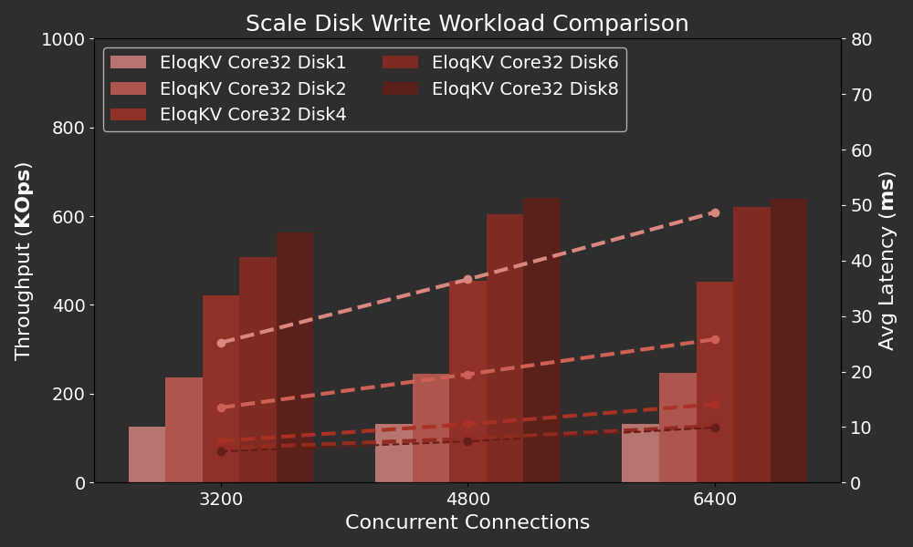
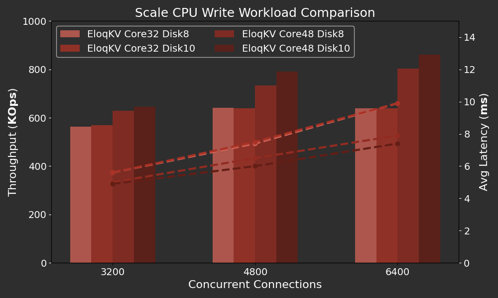

In our previous blogs, we benchmarked **EloqKV** in memory cache mode, discussing both [single node](/blog/2024/08/17/benchmark-single-node) and [cluster](/blog/2024/08/22/benchmark-cluster) performances. In this post, we we benchmark **EloqKV** with durability enabled.

<!--truncate-->

All benchmarks were conducted on AWS (region: us-east-1) EC2 instances running Ubuntu 22.04. Workloads were generated using the [memtier-benchmark](https://github.com/RedisLabs/memtier_benchmark) tool. In all tests, we use **EloqKV** version 0.7.4.

### Understanding Durability

Durability is crucial for data stores, especially in applications where data loss during server failures is unacceptable. Most persistent data stores achieve durability through [Write-ahead Logging (WAL)](https://en.wikipedia.org/wiki/Write-ahead_logging), ensuring that data is written to disk before responding to users. Additionally, many stores periodically checkpoint the data into a more compact form, allowing the log to be truncated.

However, many key-value (KV) caches prioritize performance over durability. For example, Redis uses an [Append Only File (AOF)](https://redis.io/docs/latest/operate/oss_and_stack/management/persistence/) to achieve _some_ level of durability by fsyncing data to a log file, either periodically or after each write command. Redis's single threaded architecture significantly increases latencies of other operations if a write operation blocks the thread, therefore, AOF sync writing for every write command is rarely deployed in practice. Consequently, [DragonflyDB](https://www.dragonflydb.io/docs/managing-dragonfly/aof) forgoes AOF altogether due to lack of demand, instead offering only periodic checkpointing similar to [Redis's RDB](https://redis.io/docs/latest/operate/oss_and_stack/management/persistence/).

**EloqKV** is a fully ACID-compliant database, providing full data durability through WAL. Leveraging our decoupled Data Substrate architecture, the WAL for an **EloqKV** server can either be embedded within the same process or run as a separate LogService. The log can be replicated across multiple machines or Availability Zones, can scale using multiple disk devices, and can utilize tiered storage to archive older data on more cost-effective storage.

However, we recognize that durability may not always be necessary for all applications. Currently, **EloqKV**, persistency can be turned on and off through a configuration. In a future release, **EloqKV** durability can be enabled on a per-database basis so that durable and non-durable workload can co-exists on a single **EloqKV** instance. When durability is disabled, **EloqKV** avoids the overhead associated with durability, delivering uncompromised performance as demonstrated in a [previous blog post](/blog/2024/08/17/benchmark-single-node). In this blog, we evaluate **EloqKV** with durability enabled.

### Comparing with Kvrocks

In the first experiment, we compare **EloqKV** with Apache [Kvrocks](https://kvrocks.apache.org/), a Redis-compatible NoSQL database that supports persistence. We evaluate the performance of **EloqKV** and Kvrocks under write-intensive and mixed workloads. To ensure data durability, we enable fsync Write-Ahead Logging (WAL) for both databases. For **EloqKV**, both the transaction service and log service are deployed on the same node (c7gi.8xlarge). To fully utilize available disk IO, we start two LogService processes to write WAL logs in **EloqKV**.

### Hardware and Software Specification

**Server Machine:**

| Service type | Node type    | Node count | Local SSD       | EBS gp3 volume |
| ------------ | ------------ | ---------- | --------------- | -------------- |
| Kvrocks      | c7gd.8xlarge | 1          | 1 x 1900GB NVME | 1              |
| EloqKV       | c7gd.8xlarge | 1          | 1 x 1900GB NVME | 1              |

For **EloqKV**, we enable persistent storage and turn on WAL (Write-Ahead Logging).

```
# set it to on to turn on persistent storage
enable_data_store=on
# set it to on to turn on WAL
enable_wal=on
```

For Kvrocks, we mainly changed two configuration options.

```
# If yes, the write will be flushed from the operating system
# buffer cache before the write is considered complete.
# If this flag is enabled, writes will be slower.
# If this flag is disabled, and the machine crashes, some recent
# writes may be lost.  Note that if it is just the process that
# crashes (i.e., the machine does not reboot), no writes will be
# lost even if sync==false.
#
# Default: no
# rocksdb.write_options.sync no
rocksdb.write_options.sync yes

# The number of worker's threads, increase or decrease would affect the performance.
# workers 8
workers 24
```

Disk performance plays a critical role in write-intensive workloads. Therefore, we conducted benchmarks using both local SSDs and Elastic Block Store (EBS). Local SSDs offer low latency and high IOPS, making them ideal for high-performance needs. However, in a cloud setup data on local SSD may get lost if the virtual machine (VM) is stopped. On the other hand, EBS provides high availability, allowing the volume to be attached to a new VM if the original VM fails. Moreover, EBS is elastic, allowing precise control over number of volumes and their sizes. In our case, a 50GB [EBS gp3](https://aws.amazon.com/ebs/volume-types/) volume is plenty for our WAL needs. Such a volume only cost $4 per month while providing 3000 IOPS and 125 MB/s throughput. Given the distinct advantages and limitations of local SSDs and EBS, we conducted our experiments with both.

We run `memtier_benchmark` with the following configuration:

```
memtier_benchmark -t $thread_num -c $client_num -s $server_ip -p $server_port --distinct-client-seed --ratio=$ratio --key-prefix="kv_" --key-minimum=1 --key-maximum=5000000 --random-data --data-size=128 --hide-histogram --test-time=300
```

- `-t`: Number of threads for parallel execution, which we set to 80.

- `-c`: Number of clients per thread. We set it to 5, 10, 20, 40 to evaluate different concurrency levels. This resulted in total concurrency values of 400, 800, 1600, and 3200, calculated as `thread_num × client_num`.
- `--ratio`: Set\:Get ratio is set to 1:0 for write-only workload, and 1:10 for mixed workload.

#### Results

Below are the results of the write-only workload.

X-axis: Represents the varying concurrencies (`thread_num × client_num`), simulating different levels of concurrent database access.

Left Y-axis: Throughput in Thousand OPS (Operations Per Second).

Right Y-axis: Average latency in milli seconds (ms).

<p align="center">
<div style={{ width: '720px', textAlign: 'center'}}>
import EnlargeableImage from '@site/src/pages/enlarge_pic';

<EnlargeableImage src={require('./img/eloqkv_kvrocks_set.png').default} alt="EloqKV vs Kvrocks Set" />

</div></p>

**EloqKV** significantly outperforms Kvrocks on both EBS and local SSD. On EBS, **EloqKV** achieves a write throughput that is 10 times higher than Kvrocks, while on local SSD, it is 2-4 times faster. This performance improvement is due to **EloqKV**'s architecture, which decouples transaction and log services, allowing multiple log workers to write Write-Ahead Logs (WAL) and perform fsync operations in parallel, thereby enhancing overall throughput. Additionally, **EloqKV** maintains significantly lower latency compared to Kvrocks, even under high concurrency.

Below are the results of the mixed workload.

<p align="center">
<div style={{ width: '720px', textAlign: 'center'}}>

<EnlargeableImage src={require('./img/eloqkv_kvrocks_setget.png').default} alt="EloqKV vs Kvrocks SetGet" />

</div></p>

<!-- <p align="center">
<div style={{ width: '720px', textAlign: 'center'}}>

</div>
</p> -->

Results show that **EloqKV** outperforms Kvrocks on mixed workloads as well. **EloqKV** maintains a read latency of less than 1 ms even under a heavy mixed workload with nearly 900K OPS. In contrast, Kvrocks on EBS exhibits significantly higher latencies, with both read and write latencies exceeding 10 ms even at relatively low concurrency, and rising to over 50 ms as concurrency increases. Even on local SSDs, Kvrocks' read latency remains much higher than that of **EloqKV**. This demonstrates that **EloqKV** can sustain low read latency even when the cluster is under a heavy write workload.

### Experiment II: Scaling Disks of WAL

**EloqKV**'s decoupled WAL log service can deploy multiple log workers writing WAL logs to multiple disks. Since WAL logs can be truncated once a checkpoint is completed, the required disk size is often quite small. Kvrocks does not support writing redo logs across multiple disks, so this experiment is conducted with **EloqKV** only.

**Server Machine:**

| Service type     | Node type    | Node count | EBS gp3 volume |
| ---------------- | ------------ | ---------- | -------------- |
| EloqKV Log       | c7g.12xlarge | 1          | up to 10       |
| client - Memtier | c6gn.8xlarge | 1          | 0              |

We benchmarked **EloqKV** with different numbers of WAL disks and varying thread counts using the following command:

```
memtier_benchmark -t $thread_num -c $client_num -s $server_ip -p $server_port --distinct-client-seed --ratio=1:0 --key-prefix="kv_" --key-minimum=1 --key-maximum=5000000 --random-data --data-size=128 --hide-histogram --test-time=300
```

- `-t`: Number of threads for parallel execution, which we have set to a fixed value of 80.
- `-c`: Number of clients per thread. We configured it to 40, 60 and 80, this resulted in total concurrency values of 3200, 4800 and 6400, calculated as `thread_num × client_num`.

In this experiment, we have higher concurrency compared with previous experiments due to increased latency caused by seperating LogService from TxService.

#### Results

The following graph shows how disk count impacts the performance of **EloqKV**.

X-axis: Represents the varying thread numbers employed during the benchmark, simulating different levels of concurrent database access.

Left Y-axis: The throughput in Thousand Operations Per Second (KOPS)

Right Y-axis: The average Latency in ms.

<p align="center">
<div style={{ width: '720px', textAlign: 'center'}}>

<EnlargeableImage src={require('./img/eloqkv_scale_disk_set.png').default} alt="EloqKV Disk Scale Set" />

</div></p>

<!-- <p align="center">
<div style={{ width: '720px', textAlign: 'center'}}>

</div>
</p> -->

We can observe that as the number of disks increases, the throughput scales near linearly when the disk count is 1, 2, and 4, with a corresponding decrease in latency. Adding even more disks continues to boost throughput, but at a slower rate. For 6 and 8 disks, the throughput levels off and remains nearly the same even under high concurrency.

### Experiment III: Scaling Up TxServer

As observed previously, throughput does not increase further when the number of disks exceeds six. This indicates that logging is no longer the bottleneck; to achieve even higher throughput, scaling up the CPU in TxServer could be the next step. Obviously, scaling-out could be another option, but we will leave that to another blog.

**Server Machine:**

| Service type  | Node type    | Node count | EBS gp3 volume |
| ------------- | ------------ | ---------- | -------------- |
| EloqKV TX 8x  | c7gi.8xlarge | 1          | 1              |
| EloqKV TX 12x | c7g.12xlarge | 1          | 1              |

#### Result

The following graph shows how the number of CPU cores affects the performance of **EloqKV** as we have many disks providing logging IOPs.

<p align="center">
<div style={{ width: '720px', textAlign: 'center'}}>

<EnlargeableImage src={require('./img/eloqkv_scale_cpu_set.png').default} alt="EloqKV CPU Scale Set" />

</div></p>

<!-- <p align="center">
<div style={{ width: '720px', textAlign: 'center'}}>

</div>
</p> -->

Adding more disks beyond 8 on a 32-vcore CPU does not significantly increase throughput. By scaling up the CPU of TxServer from 32 to 48 vcores, we can achieve a notable increase in throughput and a decrease in latency. Under heavy concurrency, latency decreases significantly from 10ms to under 8ms when more CPU cores are added.

### Analysis and Conclusion

In this blog, we evaluate **EloqKV** and show its performance when data durability is strongly enforced. On a plain low end server, **EloqKV** can easily sustain over 200,000 writes per second with acceptable latency. While this is lower than the pure in-memory cache performance highlighted in our [previous blog](/blog/2024/08/17/benchmark-single-node), it is still quite suitable for many real-world applications. Notice that this performance number is not much different from what a _single-process_ Redis server can achieve on the same hardware in pure memory mode.

Additionally, we showcase **EloqKV**'s architectural advantage by scaling the LogService to enhance write throughput while maintaining resources used by the TxService. This capability is made possible by our [Data Substrate](/blog/2025/07/14/technology) architecture. Considering a scenario where, despite high volume of updates, the total data volume can easily fit on a single server's memory (an example is high-frequency trading). **EloqKV**'s full scalability is crucial to support such applications without wasting valuable resources.
