# Table of Contents

1.  [Grafana](#orgc32ad03)
    1.  [Download and install Grafana](#orgbba2d44)
2.  [Prometheus](#org461e301)
    1.  [Install and run Prometheus service by using docker:](#org9445d97)
3.  [Trouble Shooting](#org1bf7faf)
    1.  [Make Sure the Prometheus client is work properly](#org7019c1a)
    2.  [Check the Prometheus service status](#org94030b9)

# Grafana

Grafana is a powerful open-source analytics and monitoring platform used to visualize and analyze data. It supports various data sources, including popular databases, cloud services, and monitoring tools. This guide will walk you through the installation process of Grafana on your preferred system.

## Download and install Grafana

1.  Go to download page: <https://grafana.com/grafana/download?edition=enterprise>
2.  The [Download page](https://grafana.com/grafana/download?edition=enterprise) lists several ways to download and install Grafana, the following is one of them:
    
        sudo apt-get install -y adduser libfontconfig1
        wget https://dl.grafana.com/enterprise/release/grafana-enterprise_10.0.2_amd64.deb
        sudo dpkg -i grafana-enterprise_10.0.2_amd64.deb

3.  Start Grafana service
    
        sudo service grafana-server start
4.  Check the status
    
        sudo service grafana-server status
5.  Set the Grafana service to auto restart after reboot
    
        sudo systemctl enable grafana-server.service
    
    check if `/etc/systemd/system/grafana-server.service` if a correct link to `/lib/systemd/system/grafana-server.service`
    
    If not, create `/lib/systemd/system/grafana-server.service` the source file is here :
    
        sudo ln -s /lib/systemd/system/grafana-server.service /etc/systemd/system/grafana-server.service
6.  By default, Grafana listens on port 3000. You can access the Grafana web interface by navigating to <http://your_server_ip:3000> in your web browser.
7.  Login
    The default login credentials are:
    
    <table border="2" cellspacing="0" cellpadding="6" rules="groups" frame="hsides">
    
    
    <colgroup>
    <col  class="org-left" />
    
    <col  class="org-left" />
    </colgroup>
    <thead>
    <tr>
    <th scope="col" class="org-left">Username</th>
    <th scope="col" class="org-left">Password</th>
    </tr>
    </thead>
    
    <tbody>
    <tr>
    <td class="org-left">admin</td>
    <td class="org-left">admin</td>
    </tr>
    </tbody>
    </table>

# Prometheus

Prometheus is an open-source monitoring and alerting toolkit designed for reliability and scalability. It is widely used to monitor various services and applications in a distributed environment.

There are multiple ways to install and run Prometheus service, but **this guide only covers the method using docker**.

To install Prometheus in other ways, follow the [official installation guide](https://prometheus.io/docs/prometheus/latest/getting_started/).

## Install and run Prometheus service by using docker:

Steps to install and start Prometheus service by using docker:

1.  Create some directories for data persistence.
    
        mkdir prometheus && cd prometheus
        mkdir data
        sudo chown -R nobody data
2.  Prepare a config file for Prometheus.
    
        vi monograph-prometheus.yaml
    
    Here is a config example for MonographDB with 3 nodes:
    
        # my global config
        global:
          scrape_interval: 1s # Set the scrape interval to every 15 seconds. Default is every 1 minute.
          evaluation_interval: 1s # Evaluate rules every 15 seconds. The default is every 1 minute.
          # scrape_timeout is set to the global default (10s).
        
        # Alertmanager configuration
        alerting:
          alertmanagers:
            - static_configs:
                - targets:
                  # - alertmanager:9093
        
        # Load rules once and periodically evaluate them according to the global 'evaluation_interval'.
        rule_files:
          # - "first_rules.yml"
          # - "second_rules.yml"
        
        # A scrape configuration containing exactly one endpoint to scrape:
        # Here it's Prometheus itself.
        scrape_configs:
          # The job name is added as a label `job=<job_name>` to any timeseries scraped from this config.
          - job_name: "monograph-node"
            static_configs:
              - targets: ["localhost:9100"]
        
          # - job_name: "monograph-mysqld"
          #   static_configs:
          #     - targets: ["localhost:9300", "localhost:9301", "localhost:9302"]
        
          - job_name: "prometheus"
        
            # metrics_path defaults to '/metrics'
            # scheme defaults to 'http'
        
            static_configs:
              - targets: ["localhost:9090"]
        
          - job_name: "monograph-tx"
        
            # metrics_path defaults to '/metrics'
            metrics_path: "/mono_metrics"
            # scheme defaults to 'http'.
        
            static_configs:
              - targets: ["localhost:18081", "localhost:18082", "localhost:18083"]

3.  Start Prometheus service.
    
        docker run -d \
            --name prometheus\
            --network host \
            -e TZ=Asia/Shanghai \
            -v ${PWD}/monograph-prometheus.yml:/etc/prometheus/prometheus.yml \
            -v ${PWD}/data:/prometheus \
            -v /etc/timezone:/etc/timezone:ro \
            -v /etc/localtime:/etc/localtime:ro \
            prom/prometheus

4.  Set up Prometheus data source on Grafana.
    **Please confirm that Prometheus service is working properly before setting the data source.**
    -   Press the `Home` bottom.
        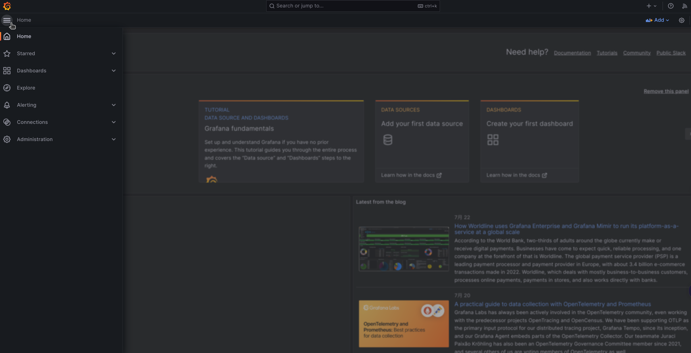
    -   Select `Data sources`
        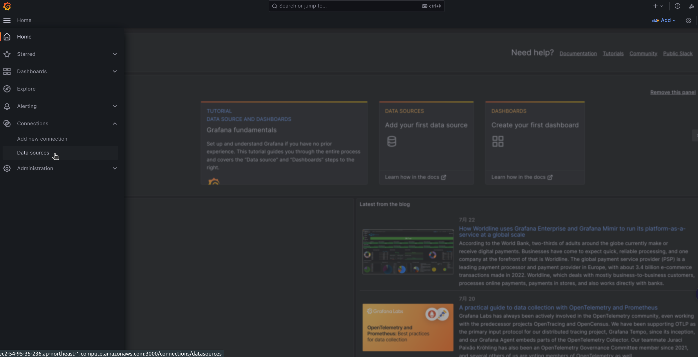
    -   Add datasource
        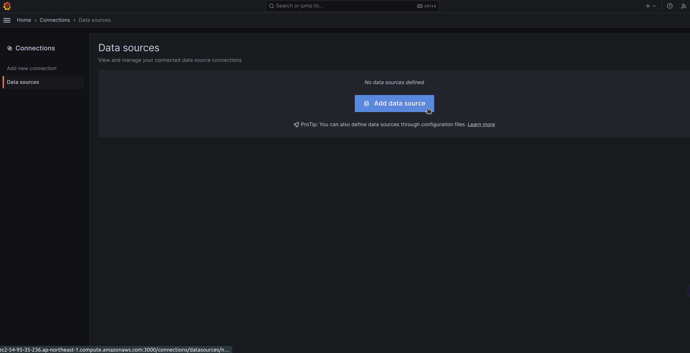
    -   Select `Prometheus`
        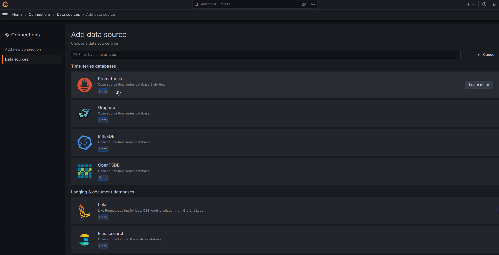
    -   Set up URL
        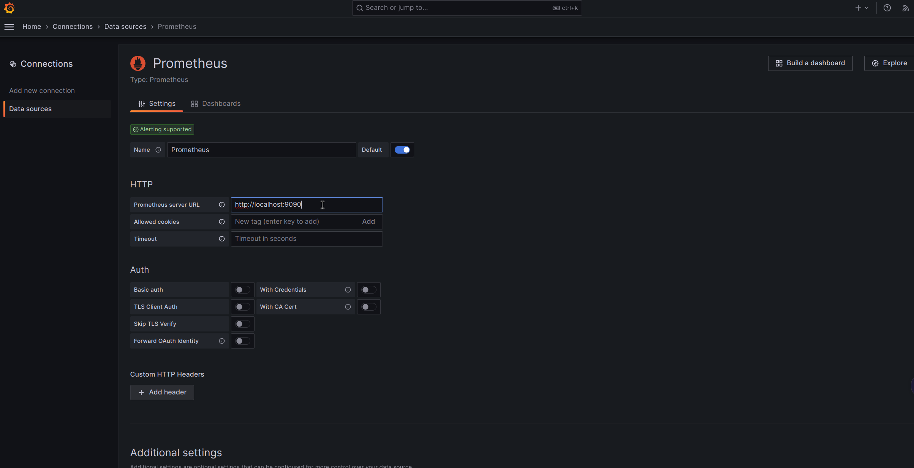
    -   Save and test
        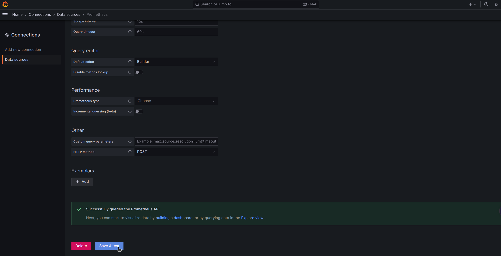

5.  Import dashboards.
    Download our dashboard config files: <https://github.com/monographdb/monograph_waiter/tree/main/src/cluster_mgr/config/dashboard/>
    -   Press `Dashboard`
        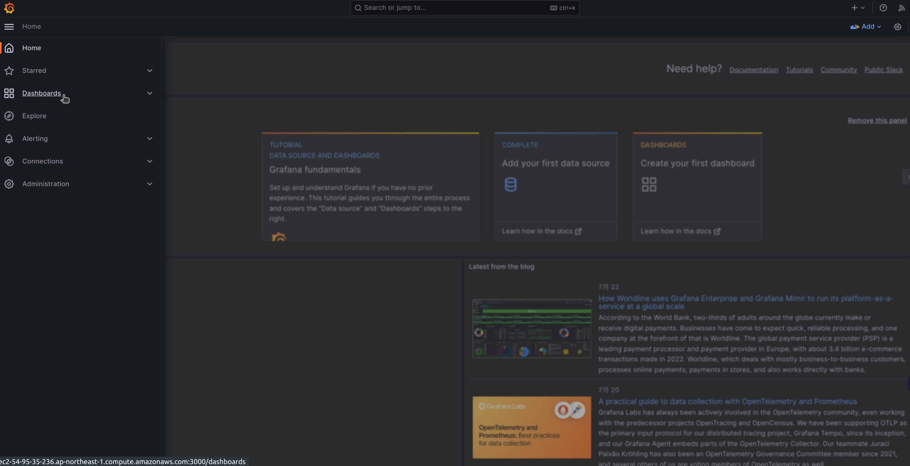
    -   Press `New` and select `Import`
        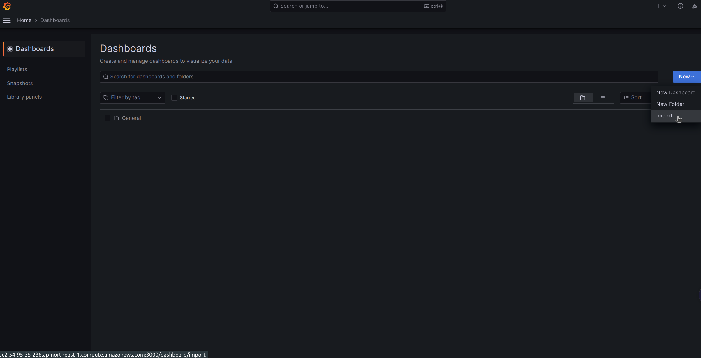
    -   Upload dashboard config file
        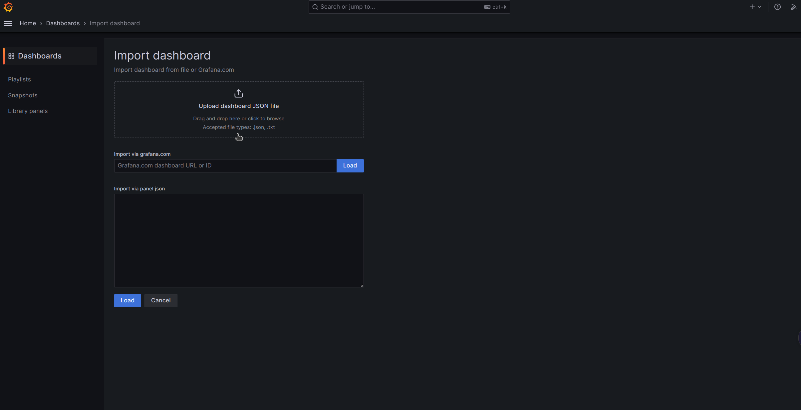

# Trouble Shooting

Here is an example of the `mysqld.cnf`:

    [mariadb]
    plugin_maturity=experimental
    datadir=/path/to/monograph_workspace/monograph/datafarm/data_0
    lc_messages_dir=/path/to/monograph_workspace/monograph/install/share
    max_connections=500
    skip-log-bin
    port=3317
    socket=/tmp/mysqld3317.sock
    plugin_load_add=ha_monograph
    monograph
    monograph_cass_hosts=127.0.0.1
    monograph_core_num=2
    monograph_cass_user=cassandra
    monograph_cass_password=cassandra
    monograph_local_ip=127.0.0.1:8000
    monograph_ip_list=127.0.0.1:8000,127.0.0.1:8010,127.0.0.1:8020
    monograph_metrics_port=18081
    monograph_kv_storage=cass
    monograph_node_memory_limit_mb=512
    
    ## metrics
    monograph_enable_collect_metrics=ON
    monograph_enable_collect_log_metrics=ON
    monograph_enable_collect_cass_metrics=ON

**NOTICE**:

1.  If you want to monitor metrics, at least `monograph_enable_collect_metrics` must be set to `ON`
2.  Make sure the value of `monograph_metrics_port` is the same as the setting in your Prometheus config file (`monograph-prometheus.yml`).

## Make Sure the Prometheus client is work properly

1.  Run MonographDB
2.  Check all collected metrics data:
    
        curl http://localhost:18081/mono_metrics
        curl http://localhost:18082/mono_metrics
        curl http://localhost:18083/mono_metrics

## Check the Prometheus service status

1.  Open your browser.
2.  Access <http://localhost:9090>
3.  Press the `Status` bottom and select `Targets`
    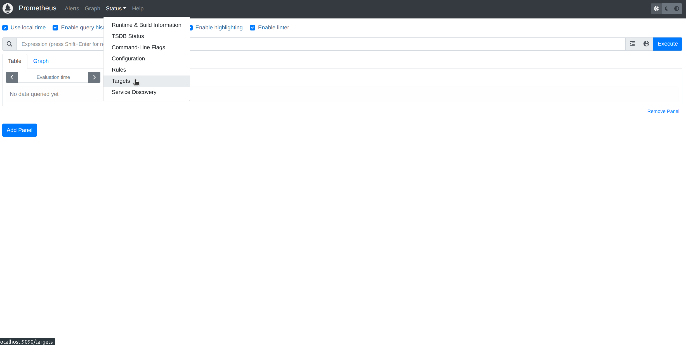
4.  Press `show more` for the endpoint
    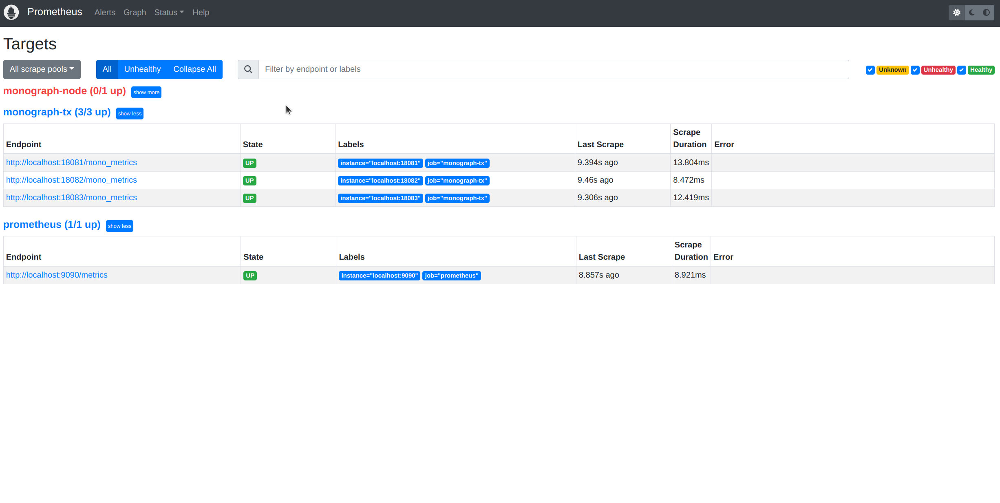

