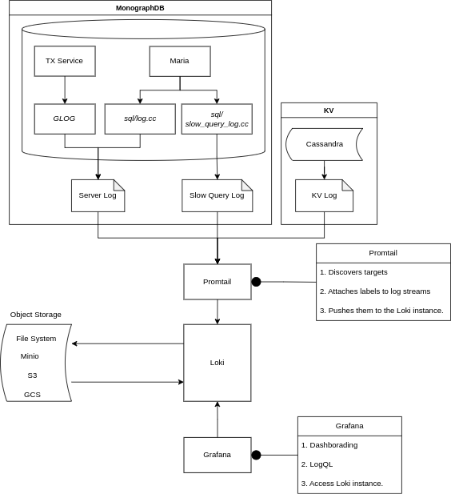

<!-- markdown-toc start - Don't edit this section. Run M-x markdown-toc-refresh-toc -->
**Table of Contents**

- [Local log aggregation system architecture](#local-log-aggregation-system-architecture)
- [Loki](#loki)
- [Promtail](#promtail)
- [Run Loki and Promtail services](#run-loki-and-promtail-services)
- [Connect Loki data source on Grafana](#connect-loki-data-source-on-grafana)

<!-- markdown-toc end -->
Grafana Loki is a horizontally scalable, highly available, and
multi-tenant log aggregation system. It is designed to work seamlessly
with Grafana and Prometheus, allowing users to store, explore, and
monitor logs efficiently. Promtail is a lightweight log shipping agent
used to scrape logs and send them to Loki for storage and analysis. This
document will guide you through the installation process of both Grafana
Loki and Promtail.

**Prerequisites**

1.  Docker
2.  Grafana

# Local log aggregation system architecture

The following shows the architecture of deploying MonographDB and log
aggregation system in the local environment.


-   MonographDB  
    In MonographDB, `maria` and `tx_service` are two components that
    generate logs. There are two types of logs generated `error_log` and
    `slow_query_log`.
-   KV storage  
    The KV store of MonographDB can be Cassandra, DynamoDB, or BigTable.
    If the KV store is Cassandra, then we have KV logs.
-   Promtail  
    In this system, Promtail has the following responsibilities:
    1.  Log discovery
    2.  Log streaming preprocess
    3.  Call Loki writer API to write data to log storage
-   Loki  
    The invention of Loki was inspired by Prometheus, which is similar
    to Prometheus, but in log version. Loki provides read and write APIs
    for log storage (object storage) in the system. Loki does not index
    the text of logs. Instead, entries are grouped into streams and
    indexed with labels. This not only saves storage costs, but also
    enables the system to support millisecond-level log lines query.

# Loki

Here is an example for Loki.

``` yaml
auth_enabled: false

server:
  http_listen_port: 3100
  grpc_listen_port: 9096

schema_config:
  configs:
    - from: 2021-08-01
      store: boltdb-shipper
      object_store: filesystem
      schema: v11
      index:
        prefix: index_
        period: 24h

common:
  path_prefix: /tmp/loki
  replication_factor: 1
  storage:
    filesystem:
      chunks_directory: /tmp/loki/chunks
      rules_directory: /tmp/loki/rules
  ring:
    instance_addr: 127.0.0.1
    kvstore:
      store: inmemory

ruler:
  alertmanager_url: http://localhost:9093
```

``` bash
docker run -d \
    --network host \
    --name loki \
    -e TZ=Asia/Shanghai \
    -v $(pwd):/mnt/config \
    -v /etc/timezone:/etc/timezone:ro \
    -v /etc/localtime:/etc/localtime:ro \
    grafana/loki -config.file=/mnt/config/loki-config.yaml
```

# Promtail

Here is an example for Promtail config file.

``` yaml
server:
  http_listen_port: 9080
  grpc_listen_port: 0

positions:
  filename: /tmp/positions.yaml

clients:
  - url: http://localhost:3100/loki/api/v1/push
    tenant_id: tenant1

scrape_configs:
  - job_name: mysqld-log
    static_configs:
      - targets:
          - localhost
        labels:
          job: mysqld-log
          __path__: /monograph/logs/mysqld-*.log
    pipeline_stages:
      - regex:
          expression: '(?P<ts>\d{4}-\d{2}-\d{2}T\d{2}:\d{2}:\d{2}\.\d{6}) \[(?P<host>[^\]]+)\]\s+(?P<thread>\d+)\s+\[(?P<level>INFO|WARNING|ERROR]+)\]\s+(?P<message>.+)$'
      - labels:
          host:
          level:
      - timestamp:
          source: ts
          format: '2006-01-02T15:04:05.999999'
          location: 'Asia/Shanghai'
```

``` bash
docker run -d \
    --network host \
    --name promtail \
    -e TZ=Asia/Shanghai \
    -v $(pwd):/mnt/config \
    -v /path/to/monograph_workspace/monograph/logs:/monograph/logs \
    -v /etc/timezone:/etc/timezone:ro \
    -v /etc/localtime:/etc/localtime:ro \
    grafana/promtail -config.file=/mnt/config/promtail-local-config.yaml -config.expand-env=true
```

# Run Loki and Promtail services

1.  Run MonographDB

    ``` bash
    export GLOG_logtostderr=1
    export GLOG_colorlogtostderr=1
    ./install/bin/mysqld --defaults-file=./etc/my-conf-3317.cnf > ./logs/mysqld-3317.log 2>&1 &
    ./install/bin/mysqld --defaults-file=./etc/my-conf-3318.cnf > ./logs/mysqld-3318.log 2>&1 &
    ./install/bin/mysqld --defaults-file=./etc/my-conf-3319.cnf > ./logs/mysqld-3319.log 2>&1 &
    ```

2.  Start

    ``` bash
    docker start loki promtail
    ```

**NOTICE**

-   The path of the log generated by mysqld must be consistent with the
    log discovery path configured in Promtail.
-   The Loki service must be started before the Promtail service,
    otherwise you will get an error.

# Connect Loki data source on Grafana
 to be completed.
