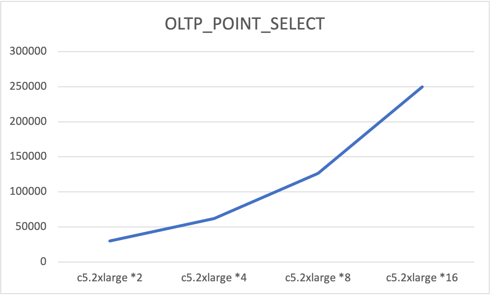
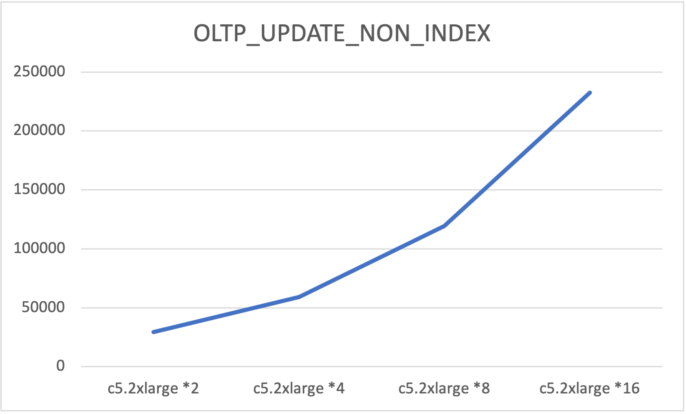
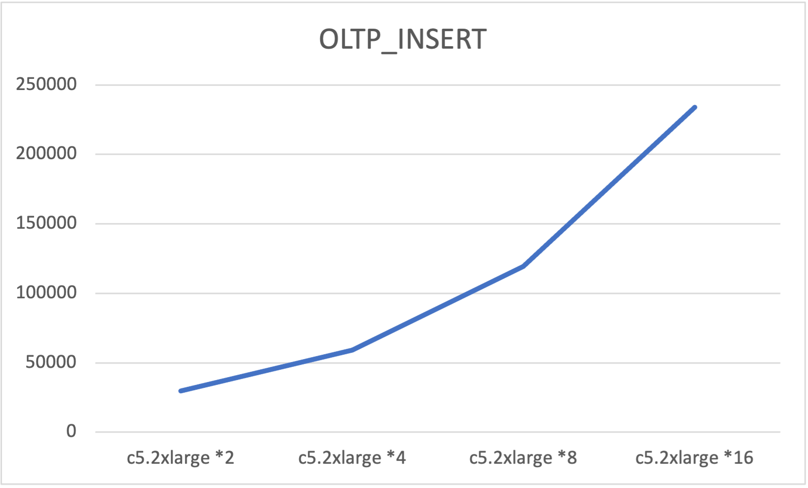

# Sysbench benchmark report of MonoSQL

## Test environment (AWS EC2/Auto Scaling Group)

### Hardware configuration
| Service type | EC2 type    | Instance count |
| ------------ | ----------- | -------------- |
| MonoSQL      | c5.2xlarge  | 2-16           |
| Sysbench     | c5.9xlarge  | 1              |

### Software version

| Service type | Software version |
| ------------ | -----------      |
| MonoSQL      | 1.3.1            |
| Sysbench     | 1.0.20_2         |
| OS           | Ubuntu20.04      |

### Parameter configuration

**MonoSQL parameter configuration**

```
plugin_maturity=experimental
datadir=/home/ubuntu/data0
max_connections=1200
plugin_dir=/home/ubuntu/install/lib/plugin
max_connect_errors=2147483647
performance_schema=ON
skip-log-bin
port=3306
socket=/tmp/mysqld3306.sock
plugin_load_add=ha_monosql
monosql
monosql_dynamodb_default_credentials=on
monosql_dynamodb_region=us-east-1
monosql_keyspace_name=mono
monosql_sqs_queue_name=monosql-queue
```


## Prepare test data

Run the following command to prepare the test data. Note that table number is set 100 due to the DynamoDB on-demand table's initial throughput limit is 3000. If you use provisioned table with high RCU and WCU, table number could be set to 1 and table size can be set to 10 milltion or more.

```
sysbench /usr/share/sysbench/oltp_common.lua --mysql_storage_engine=monosql --tables=100 --table_size=10000 --mysql-user=sysb --mysql-password=sysb --mysql-host=$host --mysql-port=3306 --mysql-db=sbtest --time=600 --threads=240 --report-interval=10 --auto_inc=off --create_secondary=false --mysql-ignore-errors=all prepare
```

## Run the test

Run the following command to perform the test:

$testname's value includes: oltp_point_select/oltp_update_non_index/oltp_insert
```
sysbench $testname --mysql_storage_engine=monosql --tables=100 --table_size=10000 --mysql-user=sysb --mysql-password=sysb --mysql-host=$host --mysql-port=3306 --mysql-db=sbtest --time=600 --threads=$thr_num --report-interval=10 --auto_inc=off --create_secondary=false --mysql-ignore-errors=all run
```

The following performance result shows that MonoSQL has a linear scalibility powered by DynamoDB. By adding more MonoSQL instances and more database connections, you can get single-digit millisecond latency at scale.

**OLTP_POINT_SELECT Performance**

| Test Type       | Thread Num | TPS       | Avg Latency | 95th percentile |
| --------------- | ---------- | ----------| ----------- | --------------- |
c5.2xlarge * 2    | 240        | 30338.69  | 7.9         | 12.52           |
c5.2xlarge * 4    | 480        | 61920.87  | 7.7         | 12.30           |
c5.2xlarge * 8    | 960        | 126394.36 | 7.5         | 11.87           |
c5.2xlarge * 16   | 1920       | 249806.74 | 7.6         | 12.30           |

<p align="center">

</p>

**OLTP_UPADTE_NON_INDEX Performance**

| Test Type       | Thread Num | TPS       | Avg Latency | 95th percentile |
| --------------- | ---------- | ----------| ----------- | --------------- |
c5.2xlarge * 2    | 240        | 29365.00  | 8.1         | 11.87           |
c5.2xlarge * 4    | 480        | 59023.22  | 8.1         | 11.87           |
c5.2xlarge * 8    | 960        | 119305.26 | 8.0         | 11.45           |
c5.2xlarge * 16   | 1920       | 232533.59 | 8.2         | 11.87           |

<p align="center">

</p>

**OLTP_INSERT Performance**

| Test Type       | Thread Num | TPS       | Avg Latency | 95th percentile |
| --------------- | ---------- | ----------| ----------- | --------------- |
c5.2xlarge * 2    | 240        | 29564.20  | 8.1         | 11.87           |
c5.2xlarge * 4    | 480        | 59280.73  | 8.1         | 11.87           |
c5.2xlarge * 8    | 960        | 119394.46 | 8.0         | 11.45           |
c5.2xlarge * 16   | 1920       | 233812.24 | 8.2         | 11.87           |

<p align="center">

</p>

