# Deploy MonoSQL Using Auto Scaling Group
 
This document describes how to deploy MonoSQL on AWS. For more information about MonoSQL, please refer to the [MonoSQL Introduction](./monosql-introduction.md)

## Deployment prepare
1. The user needs to be able to access AWS services and select a region, take `ap-northeast-1(Tokyo)` region as example for the subsequent operations and deployments.
2. Create an `IAM role` named **monosql** as the instance configuration file for subsequent `MonoSQLServer` and `MonoSQL Monitor`, the role's permission must include `AmazonEC2ReadOnlyAccess`、`AmazonSQSFullAccess`、`AmazonDynamoDBFullAccess`、`CloudWatchLogsFullAccess` and `CloudWatchAgentServerPolicy`. The specific creation process can refer to the following demonstration or the official AWS documentation on[ Creating an IAM Role in IAM](https://docs.aws.amazon.com/zh_cn/mediaconvert/latest/ug/creating-the-iam-role-in-iam.html)
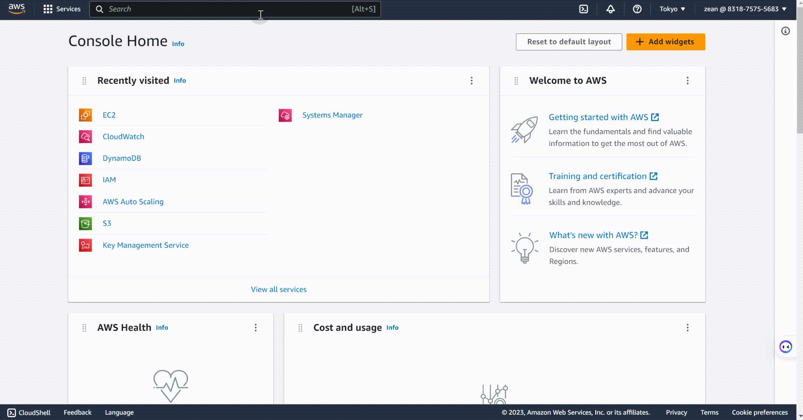

## Bootstrap MonoSQL to Create System Tables in DynamoDB
Before using MonoSQL to access DynamoDB, you are required to create system tables firstly.

1. Create the EC2 instance using MonoSQL AMI.

Select **EC2** > **instances** > **instances**
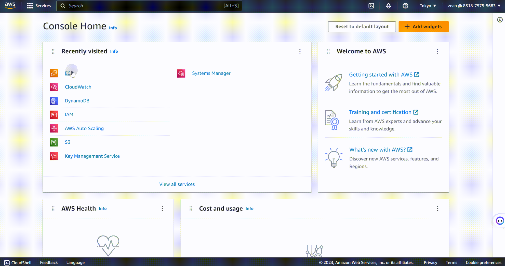
Click **launch instance**, to enter the specific configuration process for the EC2 instance.
   + Step 1: Configure the instance name, set as `Mono-Bootstrap`.
   + Step 2：Choose the AMI image named `MonoSQL for DynamoDB` from `AWS Market Place`.
   + Step 3：Set the instance type to `c5.large`.
   + Step 4：Set the ssh keypair for SSH login without password, you can use the existing key pair or create a new one.
   + Step 5：Configure the network of the EC2 instance, note that the security group set here must allow flow from port 3306 or database access and setting. After completing the above configuration, verify that it is correct, then you can launch the instance.
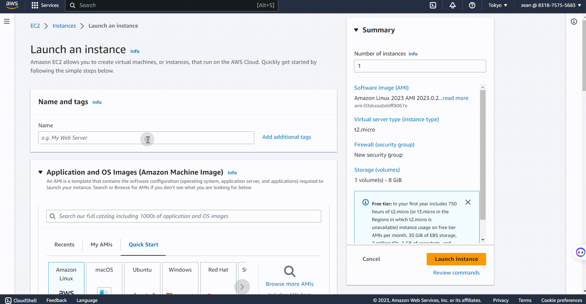

2. Create system table corresponding to MonoSQL in DynamoDB
   + SSH into the newly created EC2 instance and run the following command to bootstrap MonoSQL to create system tables in `AWS DynamoDB`
        ```bash
        /home/ubuntu/install/scripts/mysql_install_db --defaults-file=/home/ubuntu/dynosql.cnf --basedir=/home/ubuntu/install --datadir=/home/ubuntu/data0 --plugin-dir=/home/ubuntu/install/lib/plugin > log 2>&1 &
        ```
        
       Run the tail -f log command to check if the execution was successful. If there is a ok prompt, it means that the bootstrapping was successful. Bootstrap may take several minutes.
        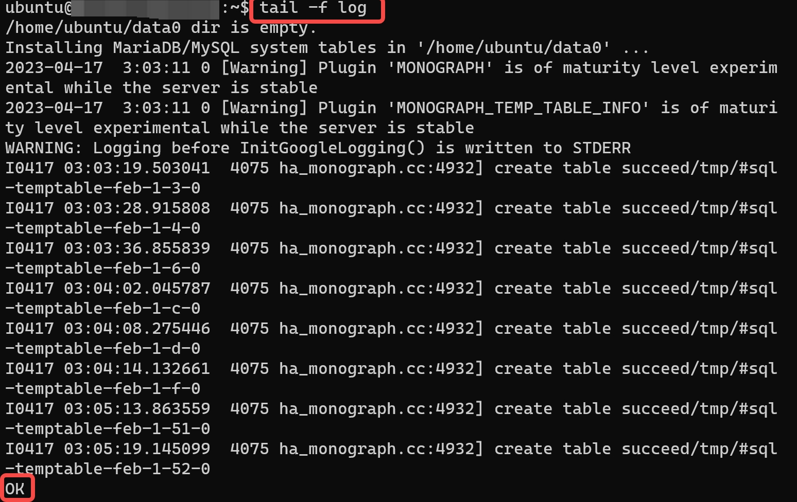
    + View the tables in `AWS DynamoDB`, You can see the tables created by MonoSQL in MonoSQL in `AWS DynamoDB`, further indicating that the bootstrapping was successful.
        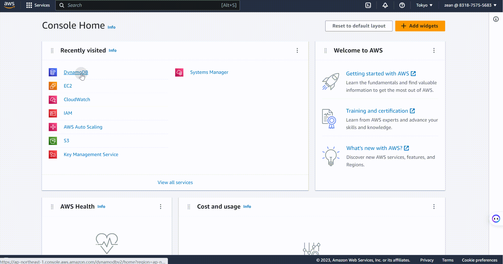
    + Start the database service
        ```bash
        /home/ubuntu/install/bin/mysqld --defaults-file=/home/ubuntu/dynosql.cnf > mysql_log 2>&1 &
        ```
    + Connect to the database by the socket.
        ```bash
        # connect to db.
        sudo /home/ubuntu/install/bin/mysql -S /tmp/mysqld3306.sock test
        ```
    + Create a SQL user `sysb`for benchmark testing and a user `mono` for database monitoring by the following command.
        ```sql
        # create sysbench user and monitor user.
        delete from mysql.user where User='';
        CREATE USER 'sysb'@'%' IDENTIFIED BY 'sysb';
        GRANT ALL PRIVILEGES ON * . * TO  'sysb'@'%';

        CREATE USER IF NOT EXISTS 'mono'@'%' IDENTIFIED BY 'mono' WITH MAX_USER_CONNECTIONS 5;
        GRANT ALL PRIVILEGES ON *.* TO 'mono'@'%' IDENTIFIED BY 'mono' WITH GRANT OPTION;
        FLUSH PRIVILEGES;
        ```
        

## Create an Auto Scaling Group Based on MonoSQL
`Auto Scaling Group` is a cloud service provided by AWS that allows you to automatically adjust the number of EC2 instances to meet the needs of your application. With   `Auto Scaling Group`, you can automatically configure the number of MonoSQL instances based on request flow without manual intervention.
Select **EC2** > **Auto Scaling** > **Auto Scaling Group** 
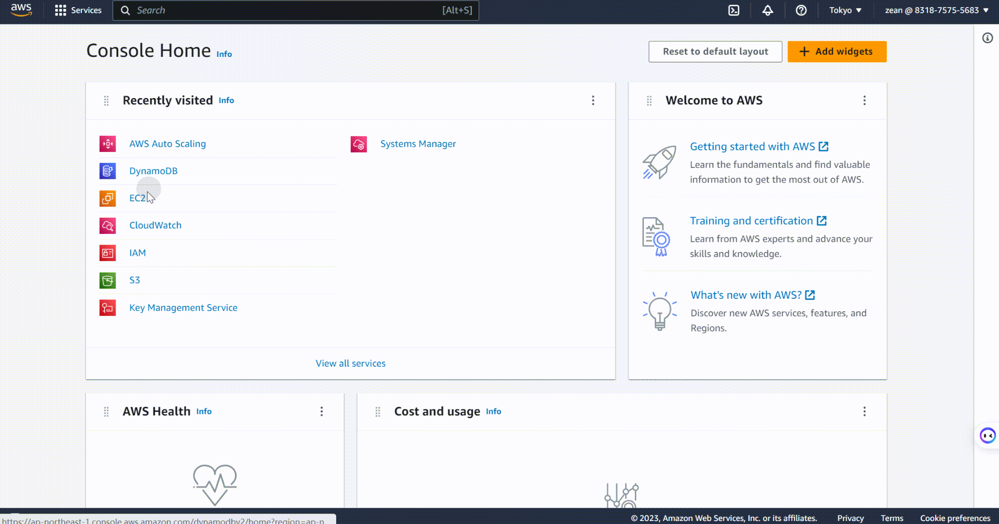
Click **Crate Auto Scaling Group**, enter the specific configuration process for the Auto Scaling Group.
1. **Step 1** Choose a launch template or configuration
      + Set **Auto Scaling Group** name，Note that the group name **must** be set to `MonoSQL`，because the monitor components `Prometheus` and `Grafana` will monitor this resource group based on this name.
          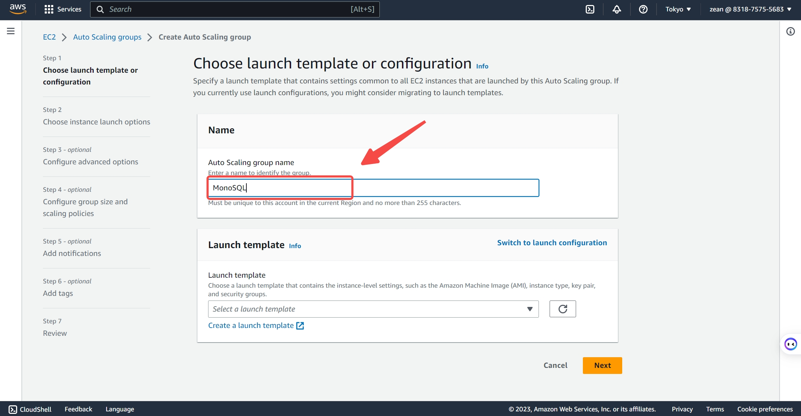
      + Set the **launch template**, Choose **Launch Configuration**, ignore the warnings,  and click  **create a launch configuration**.
          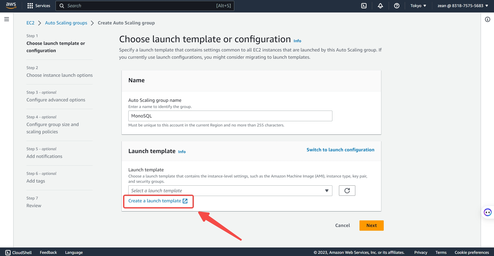
          Configure a custom launch template according to the following demonstration. 
          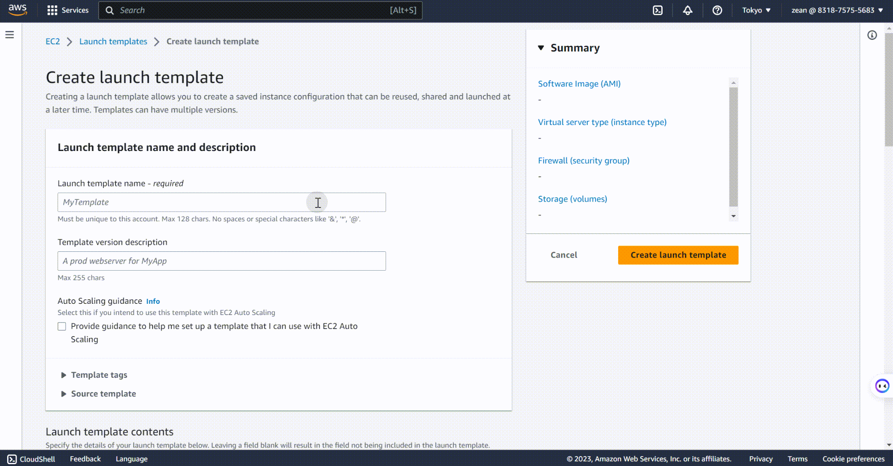
        >**Note**
        >
        >When configure the launch template, the IAM instance configuration must meet condition 2 in [Deployment prepare](#deployment-prepare) that is select the user role named `monosql` that has already been created. 
        >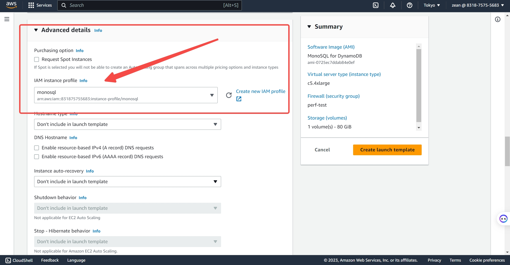
2. **Step 2** Choose instance start-up options
        Choose the appropriate availability zone and subnet `ap-northeast-1a | subnet-015bc66fedce1b8c0`
        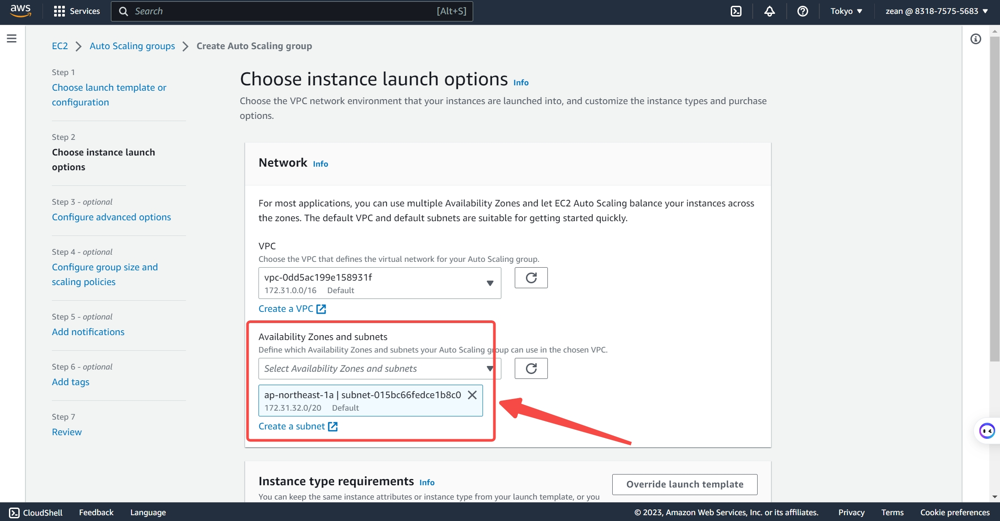
3. **Step 3** Configure advanced options
    + Create a new network load balancer
         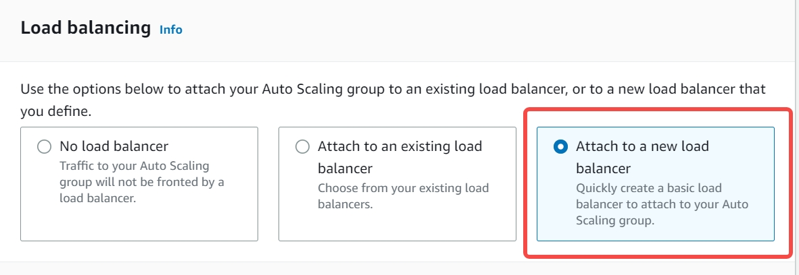
    + Set the`load balancer type` to `Network Load Balancer`    
   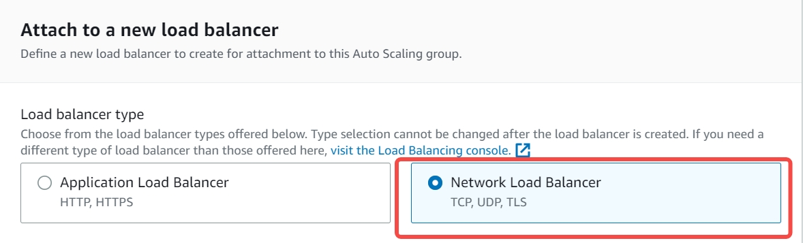
    + Configure the `load balancer name`，Here you can configure the desired name that complies with the AWS naming convention. Here, it is set to **MonoSQL-LB-ALPHA**
    + Set `load balancer scheme` to `Internal`
   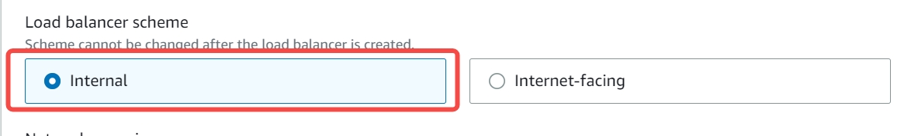
    + Set `availability zone and subnet` to `subnet-015bc66fedce1b8c0(公有)`
   
    + Configure the `listener and routing` to listen on port 3306 and route to `MonoSQL-LB-Zean|TCP` by default.
     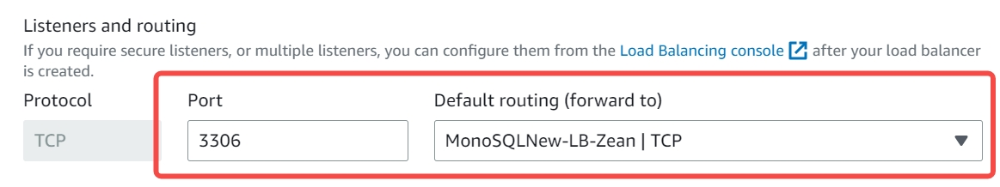
4. **Step 4** Configure group size and scaling policies 
        Set the VM instance requirement value to 3, with a maximum value of 8 and a minimum value of 0. You can configure it as needed. 
        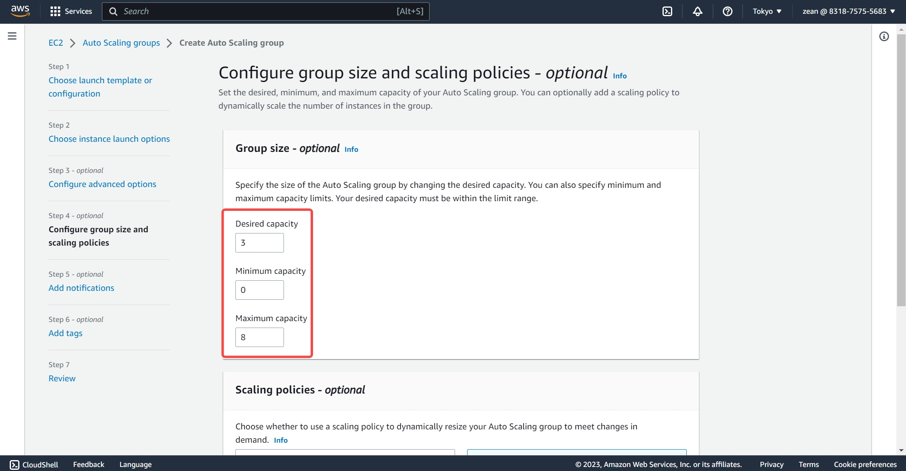

After all settings are completed, you can successfully create an `Auto Scaling Group` named `MonoSQL`, and the load balancer **MonoSQL-LB-ALPHA** will also be created along with it. The load balancer has a binded target group. If you enable health check, please edit the target group health check settings by setting Health check protocol to `TCP` and Health check port to `18081`.
*  In the AWS console, select **EC2** > **Load Balancer** > **Load Balancers**:
    
* In the AWS console, select  **EC2** > **Instances** > **Instances**:
    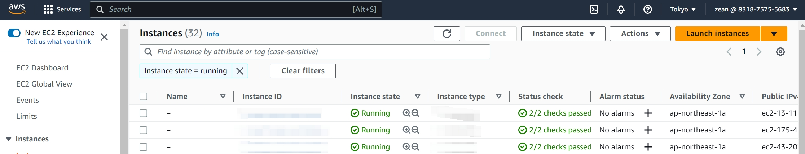
  As you can see, three new running instances have been added, which are the three demanded nodes we set in the `Auto Scaling Group`.
## Create a Monitor Instance based on MonoSQLMonitor Virtual Image
The MonoSQLMonitor virtual image integrates Prometheus and Grafana monitoring components, which can be used to monitor the Auto Scaling Group. Prometheus is a monitoring tool that can collect and store metric data for distributed databases, and Grafana is a data visualization tool that can display this metric data in charts and other formats, helping users to better understand and analyze the performance and operating status of distributed databases.
   1. Create an EC2 Instance based on MonoSQLMonitor. The process of creating a monitoring instance is basically the same as creating a MonoSQLServer instance, with one important point to note: the corresponding AMI needs to be set to `MonoSQLServer`.
   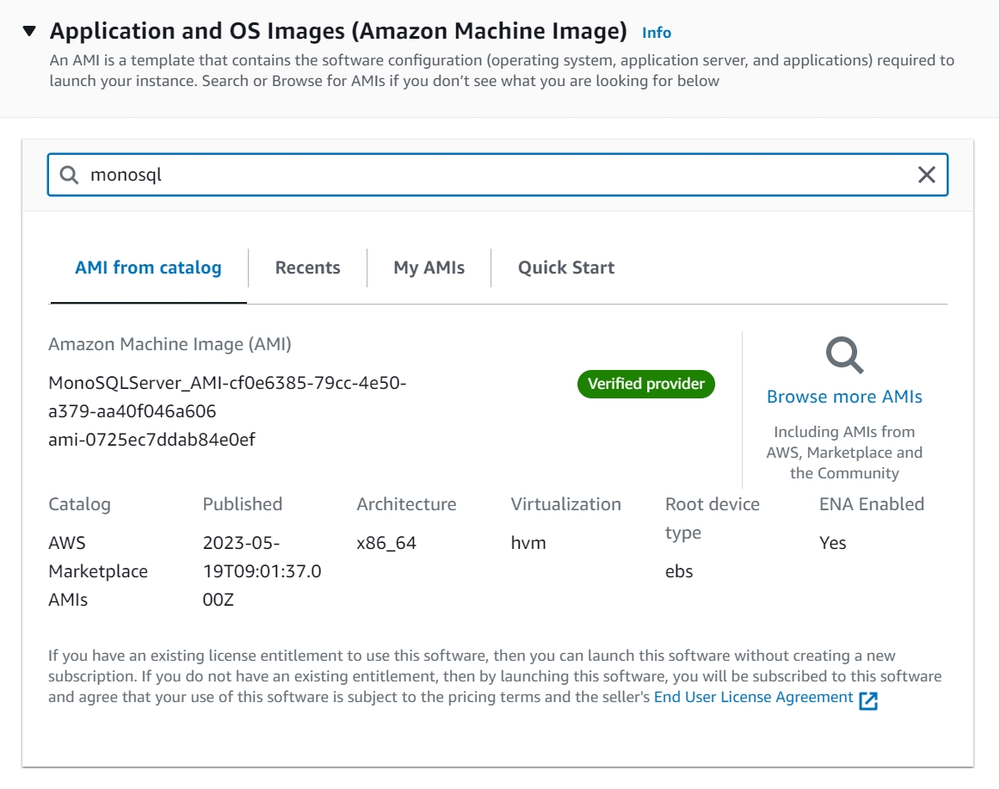
   2. Access the WebUI of Grafana. After creating the MonoSQLMonitor monitor instance, the instance will by default monitor the Auto Scaling Group with the name `MonoSQL`, You can enter `monitor_EC2_instance_IP:3000` in a browser to acces Grafana.
   
   The default username and password are both **admin**, Please change it in your first login.
   Select**Dashboards**> **General** > **Monograph Server** to enter the following interface
   
   Click **Monograph Server**  to enter the following interface, where you can see that the three started instances under the `Auto Scaling group` are all being monitored by the monitor instance
   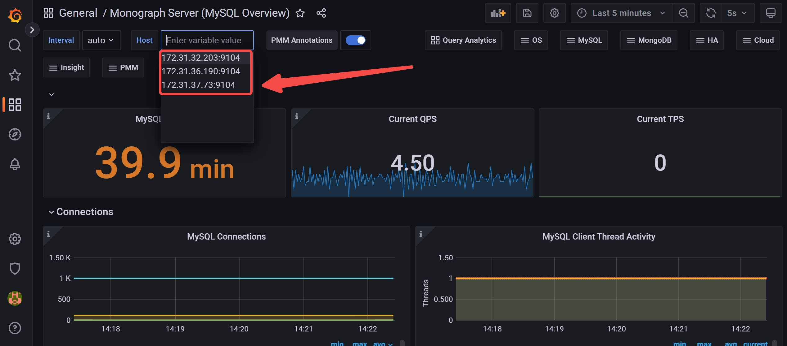

## Use CloudWatch for Metric Tracking and Log Management
CloudWatch is a monitor service provided by AWS, which can be used to monitor resources and applications in the AWS cloud environment. It can monitor the metrics of AWS services, collect and track log files to help diagnose application and system problems. MonoSQL saves the running logs of instances in the Auto Scaling group in CloudWatch. Users can enter CloudWatch to view the logs and can also use CloudWatch to monitor their predictive scaling policies.
   Select **CloudWatch** > **Logs** > **Log Groups**, and click on **monosql-service** to display the following interface
   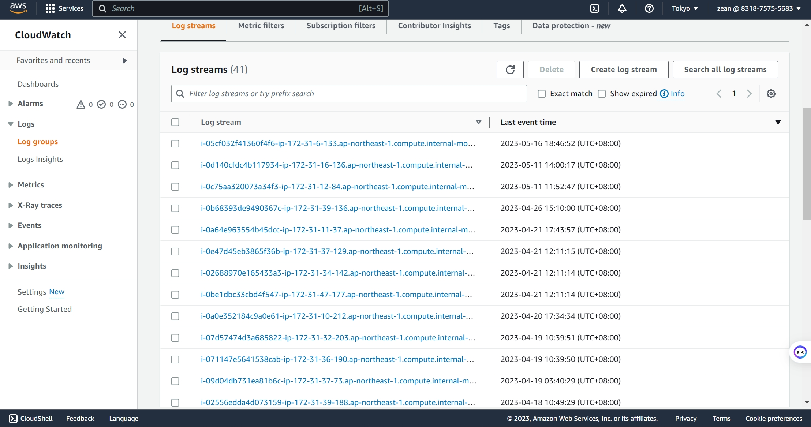
You can view the corresponding log information as needed.
