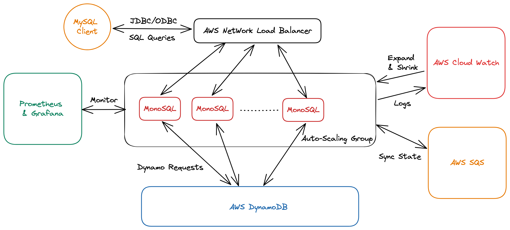

# MonoSQL Introduction

MonoSQL is a stateless SQL wrapper for Amazon DynamoDB. Customer is enable to migrate from RDS to DynamoDB without modifying their application code, but can still benefit from the consistent performance at scale, full managed and high availability features supplied by DynamoDB. MonoSQL is MySQL8.0 compatible. Customer can still use JDBC/ODBC to connect to database and use rich SQL query language like join, aggrgate and recursive cte to query data.

MonoSQL servers are stateless, with all the catalog and user data stored in DynamoDB. This design makes MonoSQL simple and stable. MonoSQL is fault tolerant, a new instance or pod will be created automatically by auto scaling group or Kubernetes cluster when MonoSQL server failure is detected. The traditional database recovery process is skipped in MonoSQL, since all the data is persistent at DynamoDB following a synchronous way.

## Key Features

1. **MySQL Compatible**: MonoSQL supports JDBC/ODBC drivers, basic transactions and complete SQL query API incuding Join, Aggregation and Recursive CTE etc.

2. **Auto Scaling**: MonoSQL can dynamically expand and shrink based on workload.

3. **Flexibility**: MonoSQL supports fast schema change.

4. **Security**: MonoSQL has full access control and supports encryption at rest.

5. **High Availability**: MonoSQL supports global tables in DynamoDB which survives region failure.

## MonoSQL architecture

MonoSQL's overall architecture can be divided into multiple modules that communicate with each other to form an integrated service, as shown in the following architecture diagram (Auto Scaling group based architecture):

- MySQL client sends SQL query to Amazon Network Load Balancer(NLB).
- Network Load Balancer redirects queries to MonoSQL servers in Auto Scaling Group.
- MonoSQL servers parse and execute SQL query. It will request the actual data from DynamoDB by using GetItem, PutItem, etc. requests.
- DynamoDB processes GetItem, PutItem requests, and send result back to MonoSQL servers.
- MonoSQL servers ship log to cloud watch service.
- Cloud watch can monitor the MonoSQL cluster CPU usage and adjust the cluster size based on pre-defined rules.
- MonoSQL Monitor collect metrics from MonoSQL servers and display the TPS, latency graph to user powered by Prometheus and Grafana.
- Amazon simple queue service(SQS) is used to synchronie the state between MonoSQL servers.

## The reason to use MonoSQL

When your MySQL database suffers from performance degradation as the data size increases, it's a good time to evaluate whether your workload is more suitable for a NoSQL database like DynamoDB. If the answer is yes, then MonoSQL can help you to migrate from MySQL to DynamoDB in a cost effective and smooth way.

Compared to MySQL, MonoSQL(DynamoDB) has the following advantages:

- **High scalability**
  MonoSQL is a highly scalable NoSQL database that can easily scale to billions of rows of data and high-concurrency access. MySQL database, on the other hand, requires complex cluster architecture(using sharding middleware) and tuning to achieve similar scale and performance.

- **Serverless architecture**
  DynamoDB is a serverless database provided by AWS that eliminates the tedious task of maintaining database servers, allowing developers to focus on application development and deployment. MonoSQL is stateless and can be managed by Auto Scaling group automatically.

- **Consistent performance**
  MonoSQL is a high-performance database that supports millisecond-level response times. This makes it ideal for handling real-time applications and high-concurrency workloads. Moreover the performace is consistent with data at any scale.

- **High Availability**
  Inherit from DynamoDB, MonoSQL has high availability and durability features. It replicate table across regions and support up to 99.999% availability. While MySQL requires complex backup and recovery operations to achieve similar results.

The biggest challenge and pain point in migrating from MySQL or MariaDB to DynamoDB is that they have different APIs and query languages, requiring modifications to application code to access DynamoDB using SDK instead of SQL. MonoSQL can help users directly use their existing programs to complete the above data access operations, reducing the migration costs significantly.

## Usage Limitation

MonoSQL does not support the following MySQL features:

- Trigger
- Auto increment keyword

## Best Practice

- range scan on partition key is not recommended, since it requires a full table scan. Full table scan is disabled by default to help user save cost. User can execute `set monosql_full_tbl_scan=on` to run range scan query on partition key. Note that range scan on sort key is supported.
