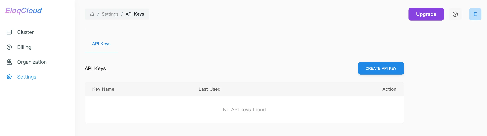
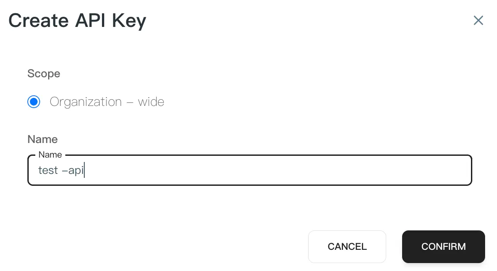
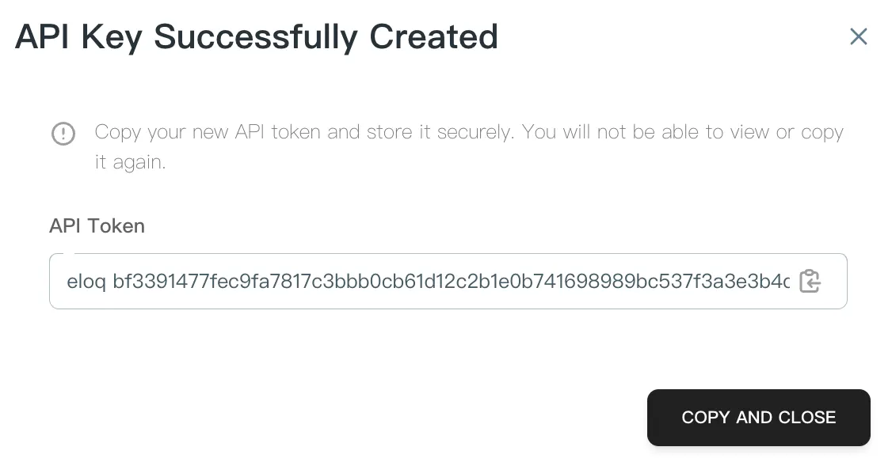
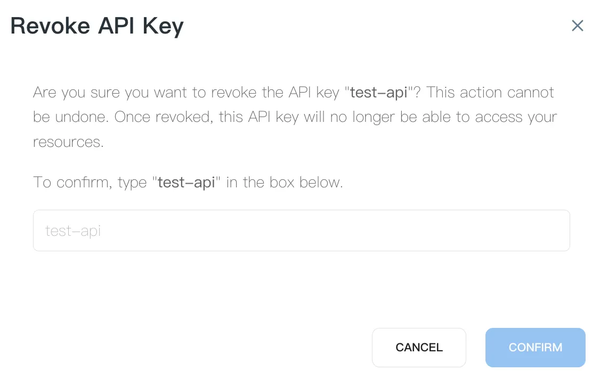

EloqCloud provides a robust API management interface within the console, allowing you to create, manage, and delete clusters.

## Accessing API Settings

To manage your API keys, navigate to the **Settings** section in the left-hand sidebar of the EloqCloud console. From there, select the **API Keys** tab to view your current keys and management options.

## Creating a New API Key

Generating a new key is necessary for authenticating your applications or scripts with EloqCloud services.

**Steps to Create :**

1. **Initiate Creation:** Click the blue **"CREATE API KEY"** button located at the top right of the API Keys panel.
2. **Set Scope:** In the "Create API Key" dialog, the **Scope** is currently set to **"Organization – wide"** by default.
3. **Provide a Name:** Enter a descriptive **Name** for your key (e.g., `production-app-key`) in the input field to help you identify its purpose later.
4. **Confirm:** Click the **"CONFIRM"** button to generate the key.
**Note:** Ensure you copy and securely store the generated key immediately, as it may not be visible again for security reasons.

## Revoking an API Key

If a key is compromised or no longer needed, you can revoke it to immediately terminate its access to your EloqCloud resources.

**Steps to Revoke:**

1. **Open Action Menu:** Click the `...` icon next to the key you wish to remove and select **"Revoke"**.
2. **Safety Confirmation:** A "Revoke API Key" dialog will appear, warning that this action cannot be undone.
3. **Identity Verification:** To prevent accidental deletion, you must manually **type the exact name of the key** (e.g., `test-1`) into the confirmation box.
4. **Finalize Revocation:** Click the blue **"CONFIRM"** button to permanently deactivate the key.

