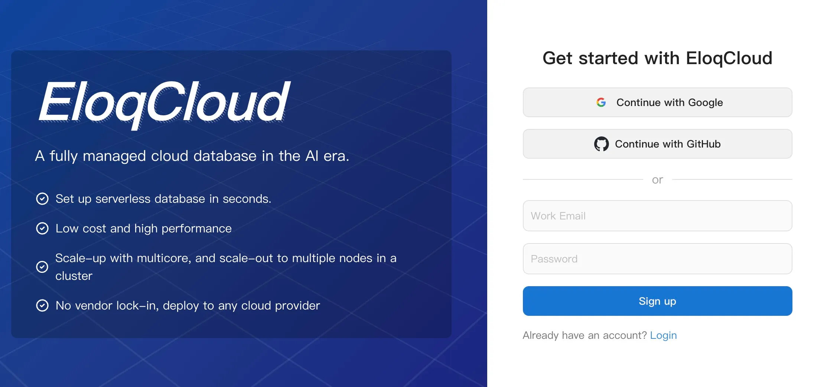
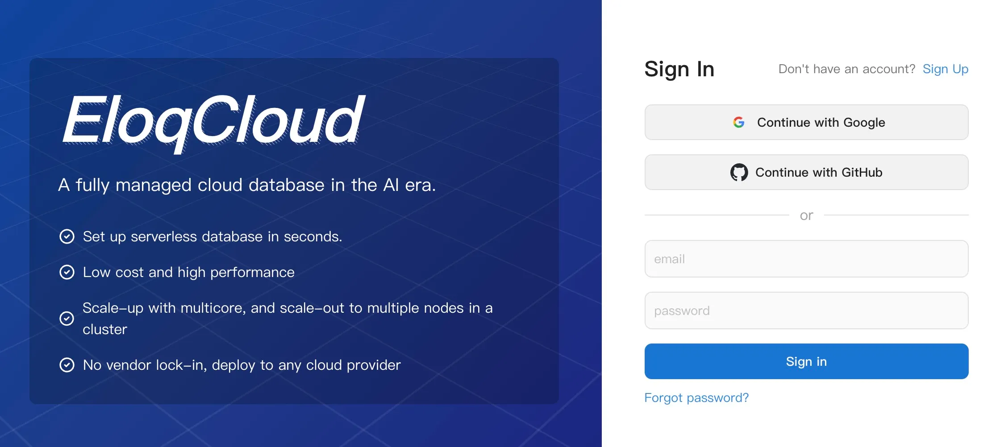
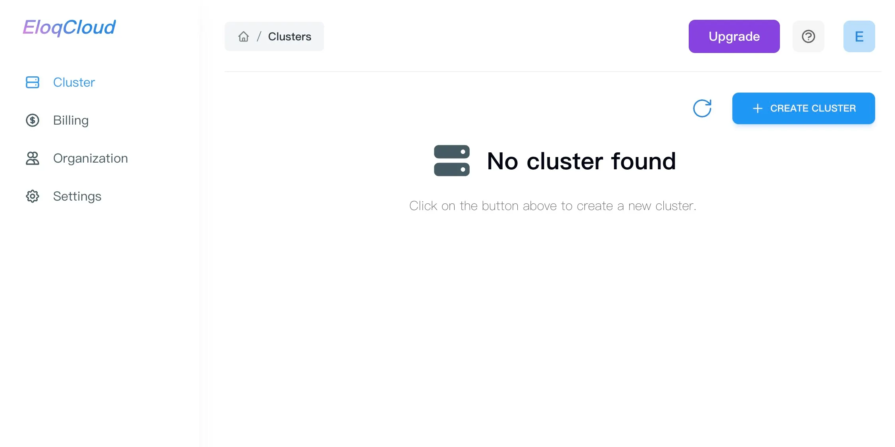
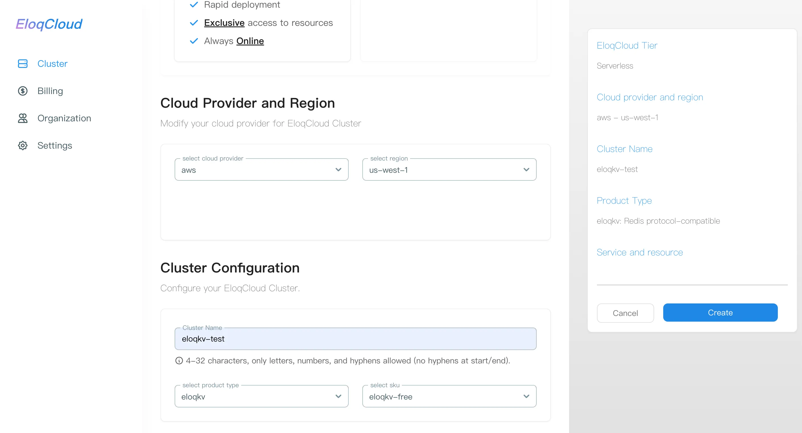
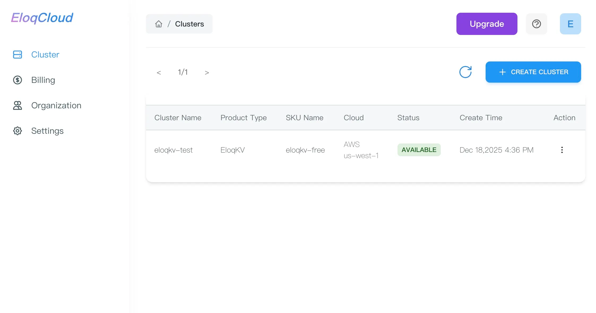
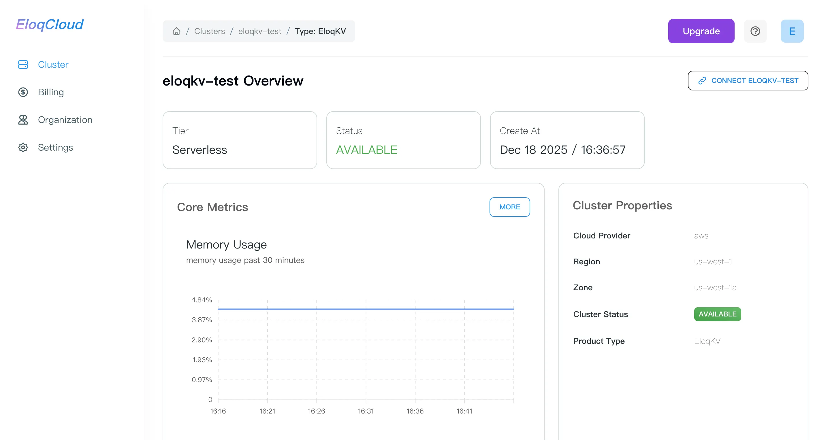
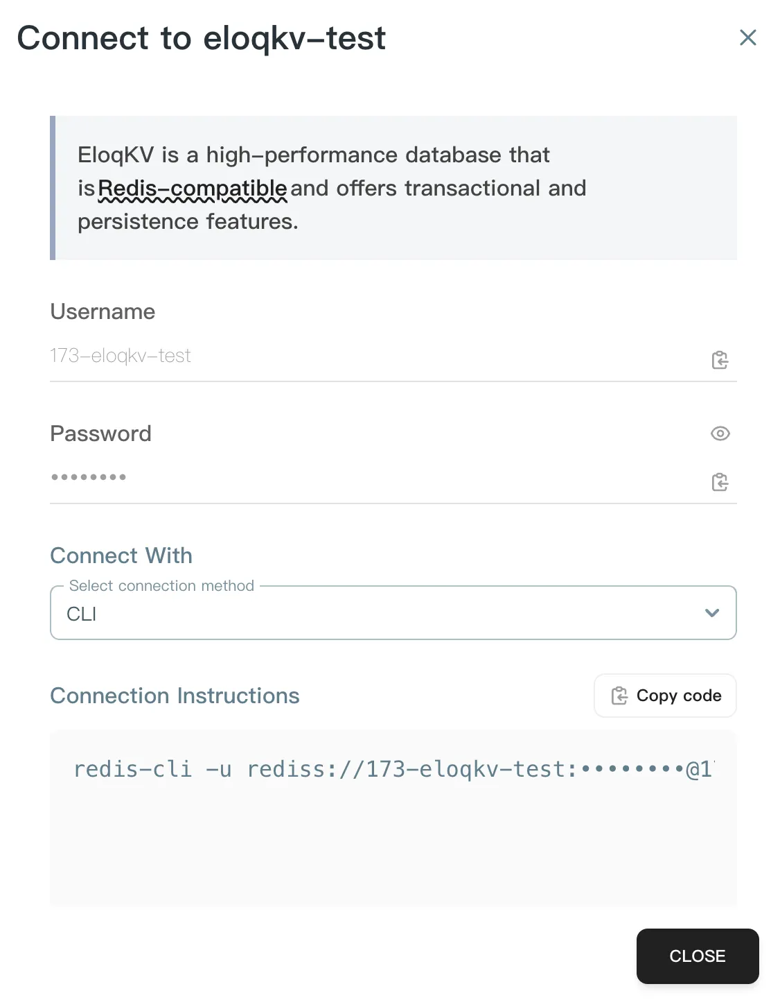
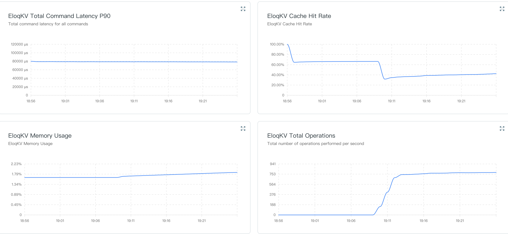

## Registration

The registration process is the initial step to access the EloqCloud console and its database services (such as EloqKV, EloqSQL, etc.).

**Steps to Register:**

1. **Navigate to the Registration Page:** Go to the EloqData main website and look for the "Sign Up" or "Create an Account" link.or go to the login page (`https://cloud.eloqdata.com/login`). 
2. **Provide Account Details:**
    - **Email Address:** Enter a valid email address. This will be used for verification and platform communications.
    - **Password:** Create a secure password, typically requiring a minimum length (6 sizes) and a mix of uppercase/lowercase letters and numbers.
3. **Email Verification:** An automated email will be sent to the address you provided. Follow the link in the email to verify your account.
4. **Access the Console:** Once verified, you can proceed to the login page.

## Login

Once your account is registered and verified, you can access the EloqCloud management console.

**Steps to Log In:**

1. **Access the Login Page:** Navigate to `https://cloud.eloqdata.com/login`.
2. **Enter Credentials:** Input the email address and password used during the registration process.
3. **Sign In:** Click the "Login" button.
4. **Dashboard Access:** Upon successful login, you will be directed to your **EloqCloud Dashboard** , where you can view existing clusters and create new ones.

## Creating Your First EloqCloud Cluster

After logging in, the first major step is provisioning a database cluster.

**Steps to Create:**

1. From the main Dashboard, locate and click the **"Create Cluster"** button, typically found in the upper-right corner.

2. You will be presented with a configuration form to define your cluster specifications.

**Step 2: Configure Cluster Attributes (Detailed）**

You must configure the following mandatory and optional settings for your new cluster:

- **Cluster Name：**A unique, user-friendly name for your database instance.
- **Product Type：**Specifies the type of database service you wish to deploy.

[**Options:** `EloqKV` (Key-Value Store),  `EloqDoc` (Document Database), etc. Select the service that fits your application's needs.]

- **Cloud Provider:** The physical cloud platform where your cluster resources will be provisioned.

[Options: AWS, GCP]

- **Region and Zone:** The geographic location and specific availability zone (AZ) for your cluster.

**SKU:** Defines the cluster's performance characteristics, including compute (CPU/Memory) and storage capacity.

**Step 3: Review and Create**

1. Once all attributes are configured, click the **"Create"** button. The cluster status  will change to **`AVAILABLE`**  once ready.
2. It is particularly useful during the initial provisioning phase. If your cluster status is stuck on  **`UNAVAILABLE`** or you are waiting for an **`IDLE`** cluster to wake up, clicking this button ensures the dashboard displays the most current state (e.g., transitioning to **AVAILABLE**).

## Connecting to Your Cluster

After the cluster is **`AVAILABLE`**, you can connect your application to use a command-line interface (CLI) tool or languages.

**Steps to Connect：**

1. From the Dashboard, click on your newly created cluster's name to view its detailed page.
2. Locate the **"CONNECT XXX"** panel.
    

    
3. This panel will provide:
- **Username:** The required username for authentication.
- **Password:** The required password/token for authentication.
- **Connect with：**The connection instruction to connect directly.
 

- CLI
- Python
- Typescript
- Javascript
- Go
- Java
- Parameters

## Monitoring Cluster Performance

EloqCloud provides a comprehensive monitoring dashboard that allows you to track the health and performance of your instances in real-time. Understanding these metrics is essential for optimizing your application's responsiveness and resource efficiency.

**Steps to Monitor：**

1. **Navigate to Cluster Details:** Click on the specific **Cluster Name** (e.g., `eloqdoc-test`) you wish to monitor. Then you will be redirected to the **Cluster Overview** page, which displays the cluster’s tier, status, and creation time
2. **View Core Metrics:** On the Overview page, the **"Core Metrics"** section provides an immediate snapshot of your cluster's **Memory Usage**. This allows you to quickly check if the instance is reaching its allocated RAM capacity without leaving the main dashboard.
3. **Access Advanced Metrics:** To perform a deeper analysis of your cluster’s performance locate the **"MORE"** button in the top right corner of the Core Metrics box, clicking this will take you to the full **Metrics Dashboard**, where you can adjust the **Time Range** (e.g., Past 30 minutes) and the **Refresh Interval**.
4. **Detailed Chart Descriptions:** The following charts are available in the advanced metrics view to help you diagnose performance bottlenecks:
    1. Total Command Latency P90：
        1. **What it measures:** The 90th percentile latency (in microseconds, **$\mu s$**) for all commands processed by the cluster.
        2. **Significance:** P90 latency is a critical "tail latency" metric. It means 90% of your requests are faster than the value shown. Monitoring this helps ensure that the majority of your users are experiencing consistent, high-speed performance.
    2. Cache Hit Rate
        1. **What it measures:** The percentage (**%**) of data requests successfully served from the cache rather than the primary storage.
        2. **Significance:** A higher hit rate (ideally close to 100%) indicates that your cache is performing efficiently. If this rate drops significantly, it may suggest that your active dataset has grown too large for the current SKU, leading to increased latency as the system fetches data from slower storage layers.
    3. Memory Usage
        1. **What it measures:** The percentage (**%**) of allocated RAM currently being used by the cluster.
        2. **Significance:** Monitoring memory is vital for preventing "Out of Memory" (OOM) errors. If this chart consistently stays above 80-90%, it is a strong signal that you should consider scaling your SKU to a higher Compute Unit (CU) level to provide more RAM.
    4. Total Operations
        1. **What it measures:** The total number of operations (Reads and Writes) performed per second.
        2. **Significance:** This chart tracks the overall throughput or workload of your cluster. Rapid spikes in operations can explain corresponding increases in latency or memory usage, helping you correlate application traffic with database performance.
         