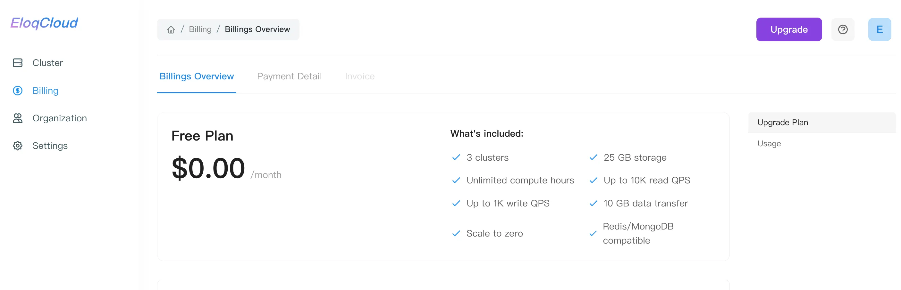
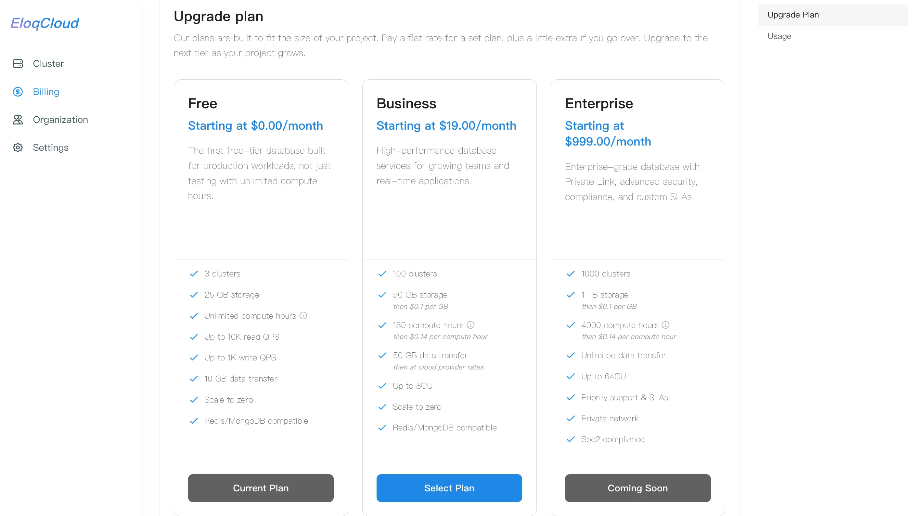
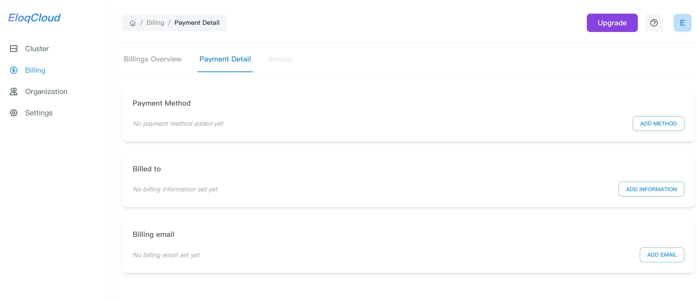
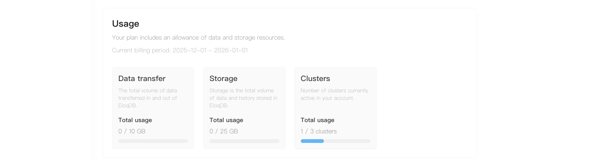

This section details how to upgrade your EloqCloud plan to access more resources and features, as well as how to manage your payment and billing information.

## 1. Upgrading Your Plan

You may need to upgrade your plan (e.g., from the Free/Trial Tier to Business or Enterprise) to handle higher workloads, increase storage, or unlock advanced features .

**Step 1.1: Compare and Select the Target Plan**

1. **Navigate to Billing:** In the EloqCloud Console, click on **"Billing"** in the left navigation menu.
2. **View Plan Tiers:** On the **Billings Overview** tab, you will see a detailed breakdown of the available plans. Then you can review the available plans: **Free**, **Business**, and **Enterprise**.
    - **Free Plan:** Starting at **$0.00/month**, offering limited clusters (3) and storage (25 GB), suitable for testing.
    - **Business Plan:** Starting at **$19.00/month**, providing higher limits (100 clusters, 50 GB storage) and more compute hours (180).
    - **Enterprise Plan:** Starting at **$999.00/month**, offering the highest limits and features like Private Network and Priority support, currently marked as **Coming Soon**.

1. **Initiate Upgrade:**
    - Click the **"Select Plan"** button for your chosen tier. You will be prompted to review and confirm the subscription change, agreeing to the monthly charge (e.g., $19.00/month for the Business Plan).
    - **Upgrade Button (Alternative):** Alternatively, you can always click the **"Upgrade"** button located in the top-right corner of the billing screen to jump to the plan selection process.

**Step 1.2: Check and Update Payment Details**

Before finalizing a paid plan upgrade (e.g., Free to Business), you could ensure your payment information is on file.

1. **Navigate to Payment Detail:** Click the **"Payment Detail"** tab next to "Billings Overview" to verify your financial information.
2. **Add Payment Method:** If the Payment Method section shows "No payment method added yet," click "ADD METHOD" to enter your credit card or other accepted payment information.
3. **Add Billing Information:** If "No billing information set yet" is shown under Billed to, click "ADD INFORMATION" to input your name, address, postal code and any required invoice details..
4. **Add Billing Email:** Ensure your preferred email for receiving invoices is set by clicking "ADD EMAIL".

## 2. Manage Your Limits and Scale

 The **Usage** section provides real-time visibility into your resource consumption during the current billing cycle. Monitoring this section helps you stay within your plan’s limits and avoid potential overage charges (for paid plans).

**Step 1: Manage Your Limits and Scale**

The progress bars below each metric help you visualize your remaining capacity:

1. **Monitor Regularly:** If a progress bar is low (Blue), your resources are well-managed.
2. **Optimize Resources:** If you are nearing the limit for **Clusters** or **Storage**, you can delete unused clusters by navigating to the **"Cluster"** menu to free up space.
3. **Upgrade for Growth:** If your **Data transfer** or **Compute hours** are nearly exhausted due to increased traffic, click the purple **"Upgrade"** button at the top right to switch to a higher-tier plan and avoid service interruptions.

## 3. Scaling Your Cluster (Switching SKU)

Follow these steps to change the performance specifications of an existing cluster.

**Step 1: Open the Action Menu：**Navigate to the **"Cluster"** section in the left-hand sidebar to view your active instances. And click the **Action menu** (represented by the three vertical dots `...`) at the far right of the cluster row.

**Step 2: Select the Edit Option：**From the dropdown menu, click on **"Edit"**. This will open the "Edit Cluster" configuration modal.

**Step 3: Change the Product SKU：**In the modal, locate the **"Product SKU"** dropdown field. Click the dropdown to see the available SKUs allowed by your current plan.

- **Note:** If you are on the **Business Plan**, you can select SKUs offering up to **8CU**.
- **Resource Reference:** As shown in the interface, **1 CU** typically provides **0.25 vCPU** and **8GB RAM**. Selecting a higher SKU will multiply these resources accordingly.

**Step 4: Confirm the Changes：**Review your selection to ensure it meets your performance requirements. Then click the blue **"Confirm"** button to apply the new SKU.The cluster status may briefly transition to **"UPDATING"** or **"PROVISIONING"** while the new resources are being allocated.