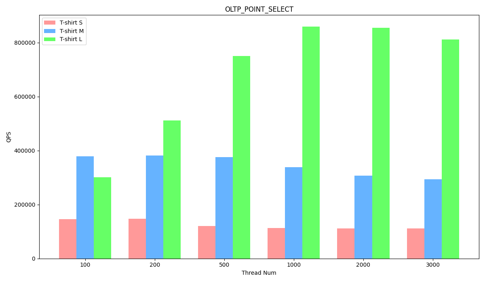
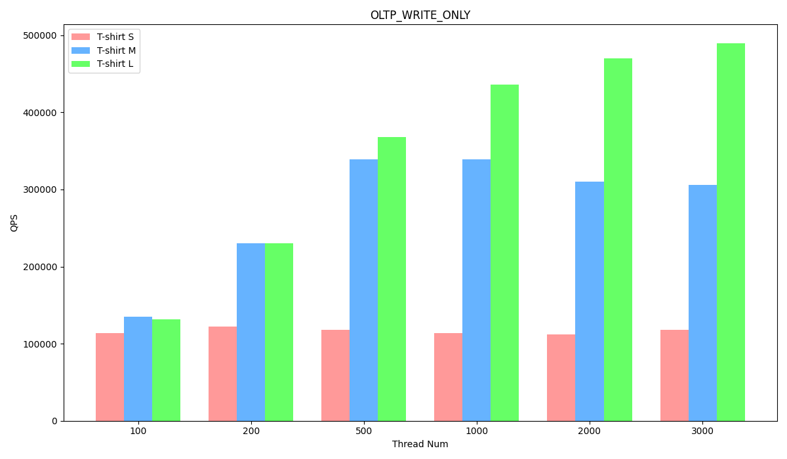

# Sysbench benchmark report of EloqSQL

## Test environment (GCP)

### Hardware configuration

This test assesses the scalability of EloqSQL using three different cluster configurations:

1. T-Shirt S: Single txservice node with low CPU, 16 vCores.
2. T-Shirt M: Single txservice node with high CPU, 48 vCores.
3. T-Shirt L: Three txservice nodes with high CPU, 48 vCores each.

T-Shirt S to T-Shirt M investigates scale-up capabilities, while T-Shirt M to T-Shirt L evaluates scale-out potential. Traditional databases struggle to increase write IOPS when scaling up due to disk bottlenecks. EloqSQL circumvents this issue by enabling separate scaling of the log service, achieving high write IOPS while maintaining lower TCO.

Configuration details are provided below.

T-shirt size: S

| Service type | EC2 type       | Node count | Disk count |
| ------------ | -------------- | ---------- | ---------- |
| txservice    | n2-standard-16 | 1          | 1          |
| logservice   | n2-standard-8  | 1          | 3          |
| cassandra    | n2-standard-16 | 1          | 1          |
| sysbench     | n2-standard-32 | 1          | 1          |

T-shirt size: M

| Service type | EC2 type       | Node count | Disk count |
| ------------ | -------------- | ---------- | ---------- |
| txservice    | n2-standard-48 | 1          | 1          |
| logservice   | n2-standard-8  | 1          | 3          |
| cassandra    | n2-standard-16 | 1          | 1          |
| sysbench     | n2-standard-32 | 1          | 1          |

T-shirt size: L

| Service type | EC2 type       | Node count | Disk count |
| ------------ | -------------- | ---------- | ---------- |
| txservice    | n2-standard-48 | 3          | 1          |
| logservice   | n2-standard-16 | 1          | 6          |
| cassandra    | n2-standard-16 | 1          | 1          |
| sysbench     | n2-standard-32 | 1          | 1          |

### Software version

| Service type | Software version |
| ------------ | ---------------- |
| EloqSQL      | 0.3.0            |
| Sysbench     | 1.0.20_2         |
| OS           | Ubuntu20.04      |

### Parameter configuration

**EloqSQL parameter configuration**

T-shirt size: S

```
max_connections=5000
mariadb_thread_pool_size=6
eloq_core_num=6
eloq_node_memory_limit=32000
```

T-shirt size: M

```
max_connections=5000
mariadb_thread_pool_size=16
eloq_core_num=16
eloq_node_memory_limit=96000
```

T-shirt size: L

```
max_connections=5000
mariadb_thread_pool_size=16
eloq_core_num=16
eloq_node_memory_limit=96000
```

## Prepare test data

Please install [haproxy](https://www.haproxy.org/) on sysbench node.

Run the following command to prepare the test data. Port 3390 is listened by haproxy.

```
sysbench /usr/share/sysbench/oltp_common.lua --mysql_storage_engine=eloq --tables=10 --table_size=1000000 --mysql-user=sysbench_test --mysql-password=sysbench123 --mysql-host=127.0.0.1 --mysql-port=3390 --mysql-db=sbtest --threads=100 --report-interval=10 --auto_inc=off prepare
```

## Run the test

Run the following command to perform the test:

`test_name`'s value includes: oltp_point_select/oltp_write_only/oltp_update_non_index/oltp_read_only/oltp_read_write
`thread_num`'s value includes: 100/200/500/1000/2000/3000

```
sysbench /usr/share/sysbench/$test_name.lua --mysql_storage_engine=eloq --tables=10 --table_size=1000000 --mysql-user=sysbench_test --mysql-password=sysbench123 --mysql-host=127.0.0.1 --mysql-port=3390 --mysql-db=sbtest --time=60 --threads=$thread_num --report-interval=10 --mysql-ignore-errors=all --rand-type=special --auto_inc=off --range_selects=true run
```

EloqSQL demonstrates excellent scalability in both read and write scenarios. In read-only workloads, it exhibits linear scalability, allowing for efficient handling of high read volumes. For write-intensive workloads, EloqSQL offers impressive single-node write performance and the ability to scale horizontally, ensuring data availability and performance even under heavy write loads.

**OLTP_POINT_SELECT Performance**

T-shirt size: S

| Thread Num | TPS       | QPS       | 95th percentile |
| ---------- | --------- | --------- | --------------- |
| 100        | 145709.23 | 145709.23 | 0.97            |
| 200        | 147126.59 | 147126.59 | 2.11            |
| 500        | 120378.40 | 120378.40 | 5.18            |
| 1000       | 113480.04 | 113480.04 | 10.27           |
| 2000       | 111825.66 | 111825.66 | 19.65           |
| 3000       | 111853.52 | 111853.52 | 29.19           |

T-shirt size: M

| Thread Num | TPS       | QPS       | 95th percentile |
| ---------- | --------- | --------- | --------------- |
| 100        | 378984.20 | 378984.20 | 0.36            |
| 200        | 381346.88 | 381346.88 | 0.75            |
| 500        | 376213.56 | 376213.56 | 2.11            |
| 1000       | 339065.83 | 339065.83 | 3.96            |
| 2000       | 306995.35 | 306995.35 | 8.13            |
| 3000       | 293260.17 | 293260.17 | 11.87           |

T-shirt size: L

| Thread Num | TPS       | QPS       | 95th percentile |
| ---------- | --------- | --------- | --------------- |
| 100        | 300504.05 | 300504.05 | 0.50            |
| 200        | 512275.19 | 512275.19 | 0.58            |
| 500        | 750484.17 | 750484.17 | 1.18            |
| 1000       | 859885.48 | 859885.48 | 2.26            |
| 2000       | 854481.67 | 854481.67 | 4.65            |
| 3000       | 812597.52 | 812597.52 | 6.09            |



**OLTP_WRITE_ONLY Performance**

T-shirt size: S

| Thread Num | TPS      | QPS       | 95th percentile |
| ---------- | -------- | --------- | --------------- |
| 100        | 18969.98 | 114024.78 | 6.79            |
| 200        | 20285.62 | 122059.31 | 14.21           |
| 500        | 19608.02 | 118383.20 | 36.89           |
| 1000       | 18738.20 | 113850.77 | 77.19           |
| 2000       | 18228.53 | 111994.08 | 158.63          |
| 3000       | 19035.88 | 118349.57 | 227.40          |

T-shirt size: M

| Thread Num | TPS      | QPS       | 95th percentile |
| ---------- | -------- | --------- | --------------- |
| 100        | 22495.50 | 135235.11 | 5.47            |
| 200        | 38246.14 | 230340.29 | 6.32            |
| 500        | 55957.52 | 338667.67 | 11.65           |
| 1000       | 55699.45 | 339019.13 | 23.52           |
| 2000       | 50350.94 | 309962.83 | 63.32           |
| 3000       | 49213.04 | 306280.23 | 101.13          |

T-shirt size: L

| Thread Num | TPS      | QPS       | 95th percentile |
| ---------- | -------- | --------- | --------------- |
| 100        | 21873.79 | 131499.62 | 5.47            |
| 200        | 38271.08 | 230439.25 | 6.21            |
| 500        | 60839.96 | 368035.89 | 11.87           |
| 1000       | 71618.89 | 436397.47 | 21.89           |
| 2000       | 76147.14 | 470420.96 | 43.39           |
| 3000       | 78195.09 | 489690.61 | 62.19           |



**OLTP_READ_WRITE Performance**

T-shirt size: S

| Thread Num | TPS     | QPS      | 95th percentile |
| ---------- | ------- | -------- | --------------- |
| 100        | 3839.92 | 76893.95 | 31.94           |
| 200        | 4020.89 | 80552.95 | 58.92           |
| 500        | 3999.69 | 80425.53 | 150.29          |
| 1000       | 3854.17 | 77794.61 | 308.84          |
| 2000       | 3572.60 | 72579.76 | 601.29          |
| 3000       | 3393.22 | 69706.56 | 926.33          |

T-shirt size: M

| Thread Num | TPS     | QPS       | 95th percentile |
| ---------- | ------- | --------- | --------------- |
| 100        | 8199.31 | 164273.10 | 17.01           |
| 200        | 9759.38 | 195694.06 | 25.74           |
| 500        | 8960.47 | 179847.43 | 376.49          |
| 1000       | 9413.23 | 189506.90 | 816.63          |
| 2000       | 8619.23 | 174610.38 | 419.45          |
| 3000       | 7879.51 | 159079.63 | 4280.32         |

T-shirt size: L

| Thread Num | TPS      | QPS       | 95th percentile |
| ---------- | -------- | --------- | --------------- |
| 100        | 7410.98  | 148413.65 | 16.12           |
| 200        | 11409.70 | 228829.64 | 23.52           |
| 500        | 14427.15 | 289716.38 | 45.79           |
| 1000       | 16198.52 | 326014.85 | 90.78           |
| 2000       | 14696.28 | 296302.22 | 240.02          |
| 3000       | 15133.48 | 305691.68 | 287.38          |


