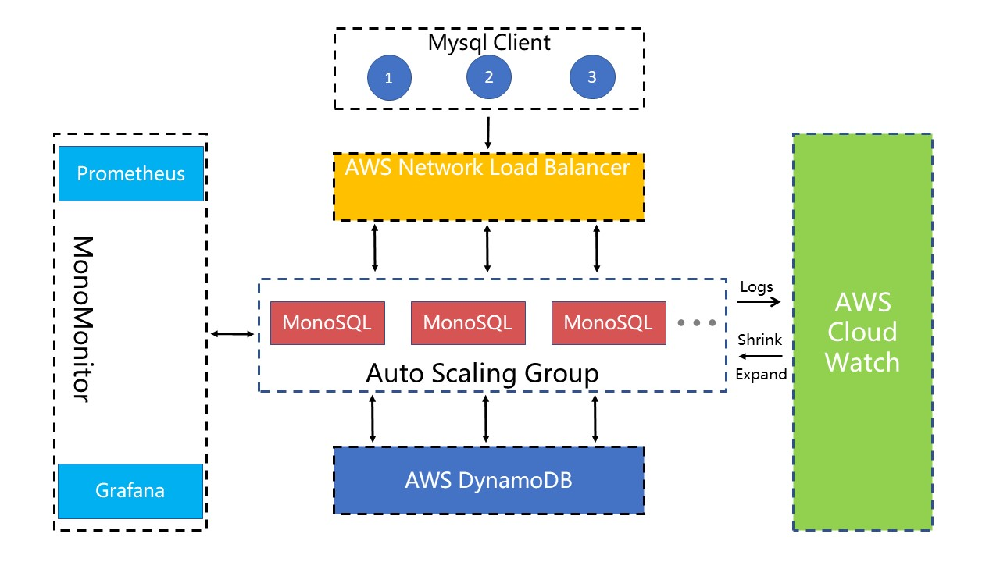

# MonoSQL简介
MonoSQL是[成章数据](http://www.monographdata.com/)公司自主设计、研发的基于DynamoDB的封装器，是一款可以帮助用户从Mysql或者MariaDB迁移到DynamoDB的虚拟镜像产品，具备无状态，自动扩容，数据安全等优点，借助MonoSQL，您可以继续使用JDBC或ODBC协议在DynamoDB实现数据的存储、检索和更新等操作，而不需更改原先的引用程序。

在内核设计上，MonoSQL整体架构可以拆分为多个模块，各个模块之间互相通信，组成一体化的服务、运维、监控系统，对应的架构图如下：

## 功能特性
MonoSQL server是无状态的，所有的目录和数据都存储在DynamoDB中。SQL查询将被MonoSQL服务器解析、优化和执行，而MonoSQL服务器将通过使用GetItem、PutItem等请求向DynamoDB请求实际数据。MonoMonitor实现对整个Auto Scaling组的监控，AWS Cloud Watch实现整个Auto Scaling组日志的存储。

## 核心特性
- 用户和权限管理。使用 CREATE USER 命令在 MonoSQL 中管理用户。使用 GRANT 命令管理权限。两者都与 MySQL 兼容。
- DDL 操作。使用 CREATE TABLE 和 DROP TABLE 来管理表结构。
- DML 操作。支持 SELECT、INSERT、UPDATE、DELETE 命令。
- 连接操作符。
- 聚合操作符。
- CTE 和递归 CTE 操作符。
## 应用场景
相比于Mysql与MariaDB，DynamoDB具有如下特点：
- 高扩展性：DynamoDB是一种高度可扩展的NoSQL数据库，可以轻松地扩展到数十亿行数据和高并发访问，而MySQL或MariaDB则需要复杂的集群架构和调优才能达到类似的规模和性能。

- 无服务器架构：DynamoDB是AWS提供的一种无服务器数据库，可以免去维护数据库服务器的繁琐任务，让开发者能够专注于应用程序的开发和部署。

- 高性能：DynamoDB是一种高性能的数据库，支持毫秒级别的响应时间和数百万次的并发访问。这使得它非常适合处理实时应用程序和高并发负载，而MySQL或MariaDB则需要进行复杂的优化和调整才能达到类似的性能。

- 弹性伸缩：DynamoDB支持弹性伸缩，可以根据实际负载自动调整数据库实例的数量和配置。这使得它非常适合处理不稳定的负载和峰值访问，而MySQL或MariaDB则需要进行手动调整和管理。

- 可用性和耐用性：DynamoDB具有高可用性和耐用性，可以保证数据不会丢失或损坏。这使得它非常适合处理重要的数据和应用程序，而MySQL或MariaDB则需要进行复杂的备份和恢复操作才能达到类似的效果。

从MySQL或MariaDB到DynamoDB的迁移最大的**难点与痛点**在于：由于DynamoDB和MySQL/MariaDB具有不同的API和查询语言，因此需要相应地修改应用程序和代码，以便能够正确地访问DynamoDB。MonoSQL可以帮助您直接使用原来的程序完成上述的数据访问操作，极大的节省企业或个人的转型成本。

## 使用限制
以下是MonoSQL不支持的MySQL特性
- CREATE INDEX 不受支持（即将推出！）
- FLUSH PRIVILEGE 对所有节点的应用不受支持（即将推出！）
- ALTER TABLE 不受支持。
- Trigger不受支持。
