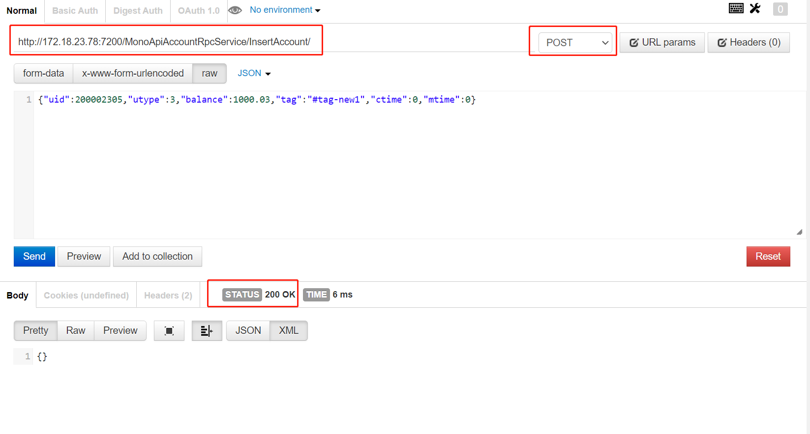
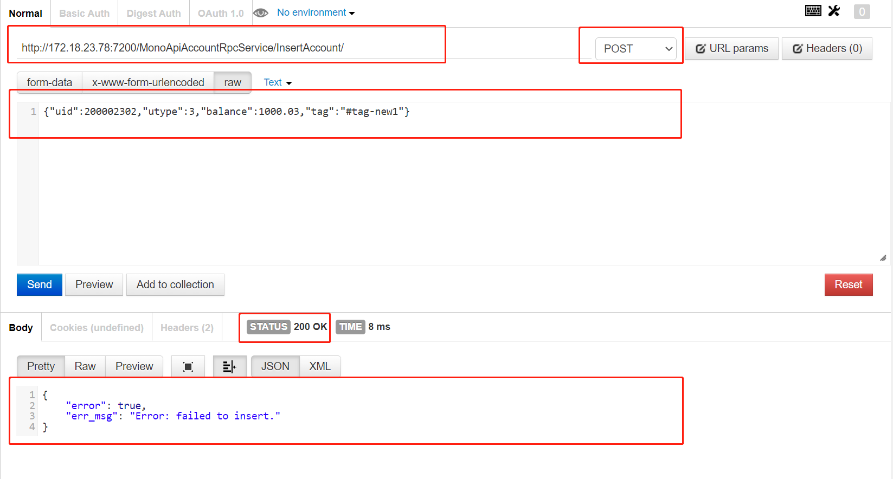
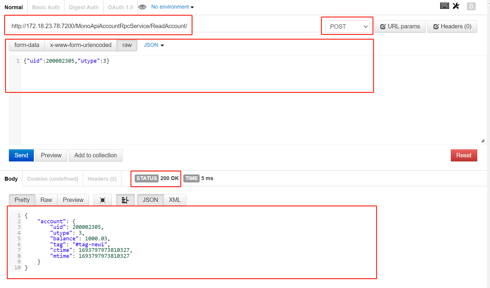
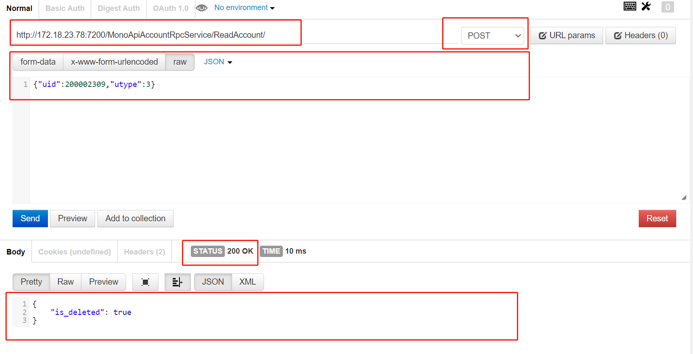
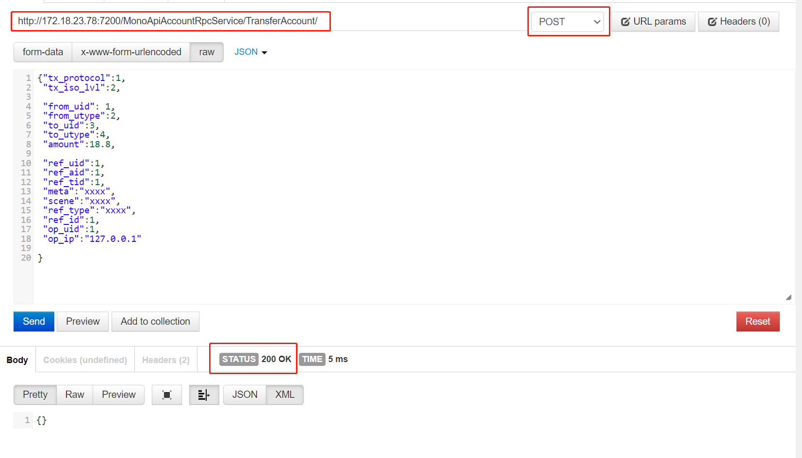
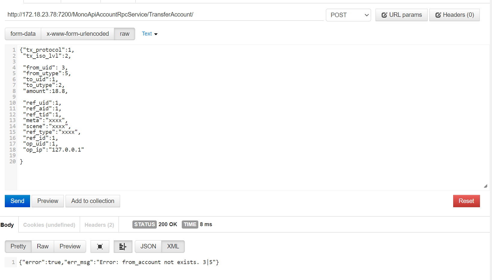
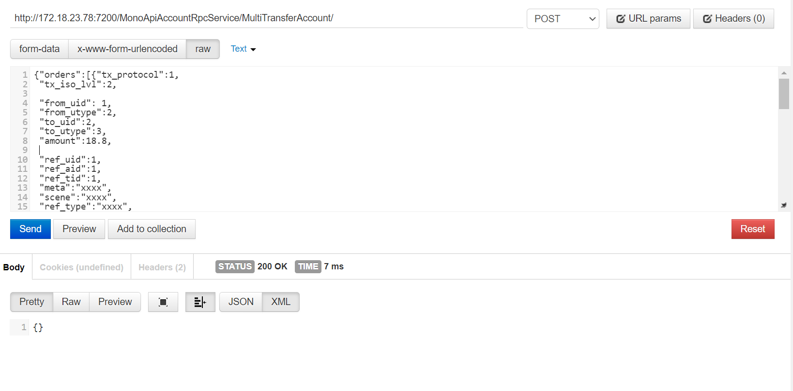
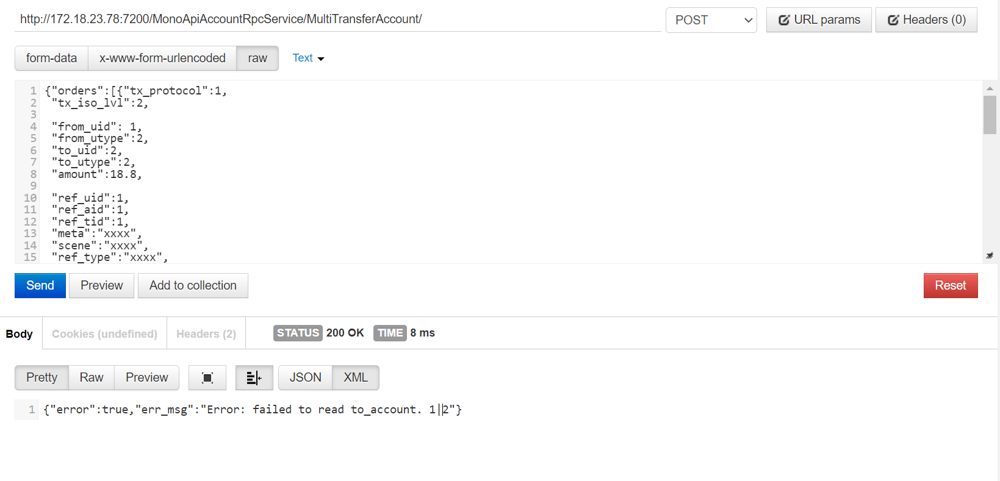

# HTTP client example

(NOTICE: use "127.0.0.1:7200" as service endpoint in follow examples.)

## InsertAccount
【请求参数】  
url:  http://127.0.0.1:7200/MonoApiAccountRpcService/InsertAccount/  
method: POST  
body:
```
{"uid":200002305,"utype":3,"balance":1000.03,"tag":"#tag-new1"}  
``` 

【成功返回】  
result-status: 200  
result-body:  
```{}```



【失败返回】
result-status: 200  
result-body: 
```
{"error":true,"err_msg":"Error: failed to insert."}  
```



## ReadAccount
【请求参数】  
url:  http://127.0.0.1:7200/MonoApiAccountRpcService/ReadAccount/  
method: POST  
body:  
```
{"uid":200002305,"utype":3}  
```
【成功读取到账户信息时的返回】  
result-status: 200  
result-body:
```
{"account":{"uid":200002305,"utype":3,"balance":1000.03,"tag":"#tag-new1","ctime":1693797973810327,"mtime":1693797973810327}} 
```



【未读取到账户信息时的返回】  
result-status: 200  
result-body: 
```
{"is_deleted":true}
```




## TransferAccount
【请求参数】  
url:  http://127.0.0.1:7200/MonoApiAccountRpcService/TransferAccount/  
method: POST  
body:   
```
{"tx_protocol":1,
 "tx_iso_lvl":2, 
 
 "from_uid": 3,
 "from_utype":4,
 "to_uid":1,
 "to_utype":2,
 "amount":18.8,
 
 "ref_uid":1,
 "ref_aid":1,
 "ref_tid":1,
 "meta":"xxxx",
 "scene":"xxxx",
 "ref_type":"xxxx",
 "ref_id":1,
 "op_uid":1,
 "op_ip":"127.0.0.1"
}
```
(NOTIC: value of "tx_protocol" and "tx_iso_lvl" are fixed, dont change now. )

【成功时的返回】  
result-status: 200  
result-body: 
```
{}
```



【失败时的返回】  
result-status: 200  
result-body: 
```
{"error":true,"err_msg":"xxxx"}
```




## MultiTransferAccount (transfer account with multi orders)
【请求参数】  
url:  http://127.0.0.1:7200/MonoApiAccountRpcService/MultiTransferAccount/  
method: POST  
body:   
```
{"orders":[
        {"tx_protocol":1,
        "tx_iso_lvl":2, 
        "from_uid": 1,
        "from_utype":2,
        "to_uid":2,
        "to_utype":3,
        "amount":18.8,
        "ref_uid":1,
        "ref_aid":1,
        "ref_tid":1,
        "meta":"xxxx",
        "scene":"xxxx",
        "ref_type":"xxxx",
        "ref_id":1,
        "op_uid":1,
        "op_ip":"127.0.0.1"
        }
    ,
        {"tx_protocol":1,
        "tx_iso_lvl":2, 
        "from_uid": 3,
        "from_utype":4,
        "to_uid":4,
        "to_utype":1,
        "amount":10,
        "ref_uid":1,
        "ref_aid":1,
        "ref_tid":1,
        "meta":"xxxx",
        "scene":"xxxx",
        "ref_type":"xxxx",
        "ref_id":1,
        "op_uid":1,
        "op_ip":"127.0.0.1"
        }
    ,
        {"tx_protocol":1,
        "tx_iso_lvl":2, 
        "from_uid": 5,
        "from_utype":2,
        "to_uid":6,
        "to_utype":3,
        "amount":15,
        "ref_uid":1,
        "ref_aid":1,
        "ref_tid":1,
        "meta":"xxxx",
        "scene":"xxxx",
        "ref_type":"xxxx",
        "ref_id":1,
        "op_uid":1,
        "op_ip":"127.0.0.1"
        }
    ]}
```
(NOTIC: value of "tx_protocol" and "tx_iso_lvl" are fixed, dont change now. )

【成功时的返回】  
result-status: 200  
result-body: 
```
{}
```
<p align="left">

</p>

【失败时的返回】  
result-status: 200  
result-body: 
```
{"error":true,"err_msg":"xxxx"}
```

<p align="left">

</p>