本章介绍如何在AWS上部署MonoSQL，关于MonoSQL的具体介绍，可查看[MonoSQL产品介绍](../monosql/monosql-introduction.md)

# MonoSQL快速上手指南

## 部署准备
1. 用户首先需要能够访问AWS服务，并且选择区域(Region)为`ap-northeast-1(东京)`进行后面的操作与部署。
2. 创建名称为**monosql**的IAM角色，作为后续`MonoSQLServer`以及`MonoSQL Monoitor`的实例配置文件，该角色的权限**必须**包括`AmazonEC2ReadOnlyAccess`、`AmazonSQSFullAccess`、`AmazonDynamoDBFullAccess`、`CloudWatchLogsFullAccess`和`CloudWatchAgentServerPolicy`。具体创建过程可参考下面的演示或者参考AWS官方文档[在 IAM 中创建 IAM 角色](https://docs.aws.amazon.com/zh_cn/mediaconvert/latest/ug/creating-the-iam-role-in-iam.html)
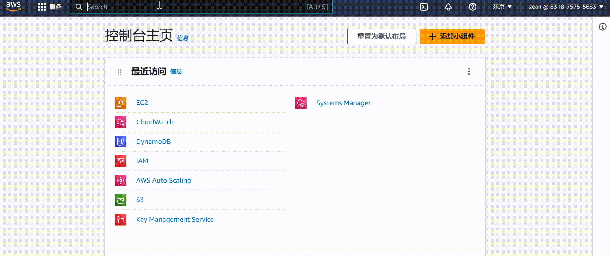
## 引导MonoSQL在DynamoDB中创建系统表
DynamoDB是有AWS提供的NoSQL数据库服务，它可以快速、可靠地存储和检索数据。借助MonoSQL，您可以无痛的从Mysql或者MariaDB的轻松迁移到DynamoDB。在使用MonoSQL进行DynamoDB的访问之前需要先在DynamoDB上创建系统表，系统表是DynamoDB中的一种特殊表格，用于存储与DynamoDB服务本身相关的元数据和配置信息。通过运行引导程序来创建系统表格，可以确保DynamoDB服务能够正常运行并提供所需的功能。
1. 基于MonoSQL的EC2实例创建
选择**EC2** > **实例** > **实例**，进入如下页面

点击`启动新实例`，进入后续的EC2实例具体配置环节。
   + 步骤1：配置实例名称，设置为`Mono-Bootstrap`。
   + 步骤2：从`AWS Market Place`中查找AMI镜像`MonoSQLServer`，设置AMI为`MonoSQLServer`。
   + 步骤3：设置实例类型为`c5.4xlarge`
   + 步骤4：设置密钥对，用于ssh免密登陆，可以使用已有密钥对或者创建新密钥对
   + 步骤4：配置EC2实例的网络，注意此处设置的安全组必须允许来自3306端口的流量，以进行数据库的访问与设置。
完成上述配置后，检查无误后，则可以启动实例。具体设置过程可以查看如下的演示：
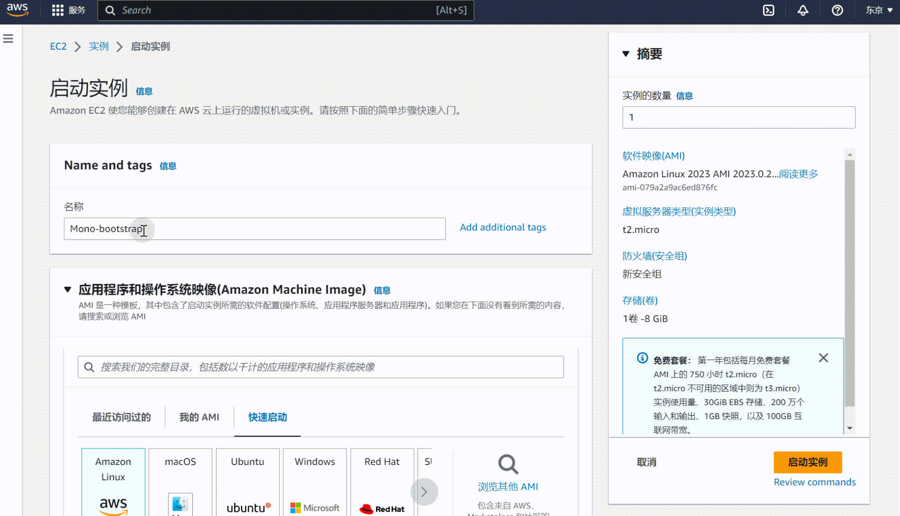

1. 在DynamoDB中创建MonoSQL对应的系统表
   + 以ssh登陆到新建的EC2实例运行下面的命令，引导MonoSQL在`AWS DynamoDB`中创建系统表格
        ```bash
        /home/ubuntu/install/scripts/mysql_install_db --defaults-file=/home/ubuntu/dynosql.cnf --basedir=/home/ubuntu/install --datadir=/home/ubuntu/data0 --plugin-dir=/home/ubuntu/install/lib/plugin > log 2>&1 &
        ```
        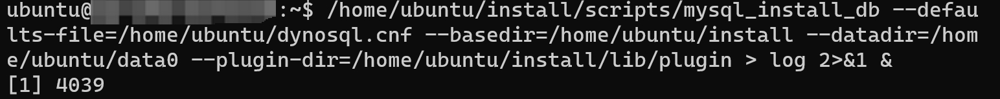
        运行`tail -f log`命令查看执行是否成功，如出现`ok`提示，则说明引导成功
        
    + 查看此时`AWS DynamoDB`中的表格，可以看到我们通过MonoSQL在`AWS DynamoDB`中创建的表格，进一步表明MonoSQL引导成功。
        
    + 启动数据库服务
        ```bash
        /home/ubuntu/install/bin/mysqld --defaults-file=/home/ubuntu/dynosql.cnf > mysql_log 2>&1 &
        ```
    + 使用sock连接数据库
        ```bash
        # connect to db.
        cd ~/install
        sudo ./bin/mysql -S /tmp/mysqld3306.sock test
        ```
    + 通过下面的命令创建SQL用户`sysb`进行基准测试，创建用户`mono`用于数据库监控。
        ```sql
        # create sysbench user and monitor user.
        delete from mysql.user where User='';
        CREATE USER 'sysb'@'%' IDENTIFIED BY 'sysb';
        GRANT ALL PRIVILEGES ON * . * TO  'sysb'@'%';

        CREATE USER IF NOT EXISTS 'mono'@'%' IDENTIFIED BY 'mono' WITH MAX_USER_CONNECTIONS 5;
        GRANT ALL PRIVILEGES ON *.* TO 'mono'@'%' IDENTIFIED BY 'mono' WITH GRANT OPTION;
        FLUSH PRIVILEGES;
        ```
        创建上述角色后，可以进入`mysql`数据库下，查看`user`表中，是否存在用户`sysb`与`mono`，验证创建是否成功
        
## 基于MonoSQL创建Auto Scaling Group
Auto Scaling Group是AWS提供的一种云端服务，它允许您自动地调整EC2实例的数量，以满足应用程序的需求。借助Auto Scaling Group，您可以实现根据请求流量自动配置MonoSQL的实例数量，而无需手动干预。
选择 **EC2** > **Auto Scaling** > **Auto Scaling组**，进入如下界面
点击**创建Auto Scaling组**，进入后续的Auto Scaling Group具体配置。

1. **步骤1** 选择启动模板或配置
      + 设置`Auto Scaling`组名称，注意此处的组名称**必须**设置为`MonoSQL`，因为后续的监控组件`Prometheus`与`Grafana`会依据此名称来对该资源组进行监控。
          
      + 设置`启动模板`，启动模板选择`启动配置`，忽略警告项，选择创建启动配置
          
          按照如下的演示，配置自定义的启动模板
          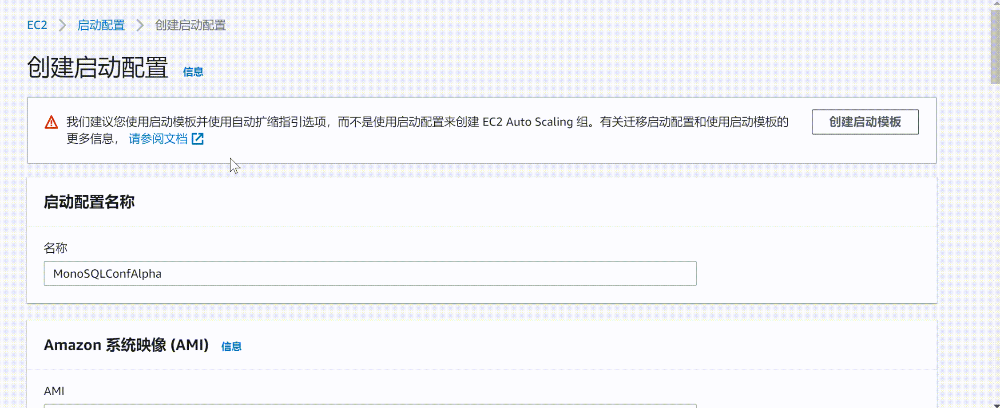
        >**注意**
        >
        >在配置启动模板的时候，设置的IAM实例配置文件需要满足[部署准备](#部署准备)中的条件2，即选择已经创建好的名称为**monosql**的用户角色。
        >
2. **步骤2** 选择实例启动选项
        选择相应的可用区与子网为`ap-northeast-1a | subnet-015bc66fedce1b8c0`
        
3. **步骤3** 配置高级选项
    + 创建新的网络负载均衡器(Network Load Balancer)
         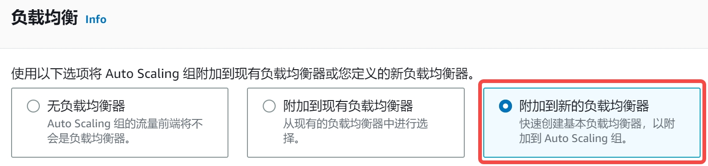
    + 设置`负载均衡器类型`为`Network Load Balancer`    
   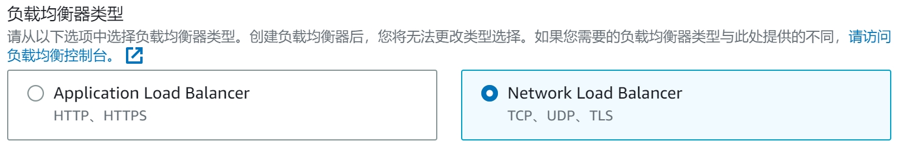
    + 配置`负载均衡器名称`，此处可自行配置想要的名称，符合AWS命名规范即可，此处设置为**MonoSQL-LB-ALPHA**
    + 设置`负载均衡器方案`为`Internal`
   
    + 设置`可用区与子网`为`subnet-015bc66fedce1b8c0(公有)`
   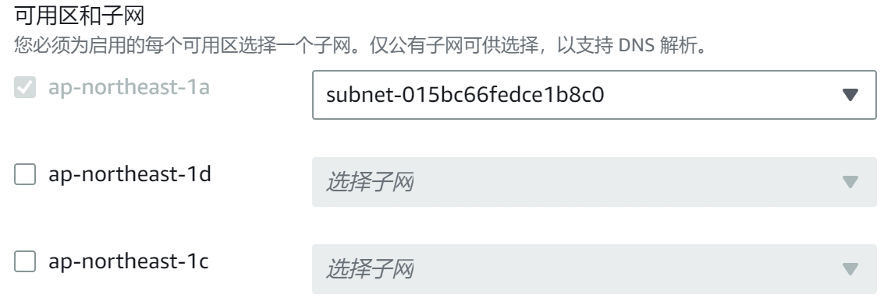
    + 设置`侦听器与路由`监听3306端口，并且默认路由转发到`MonoSQL_LB|TCP`
     
4. **步骤4** 配置组大小和扩展策略
        此处设置vm实例的需求值为3，最大值为8，最小值为0。这里可以按需进行配置
        

上述选项设置完成后，其他步骤设置为默认即可，不需要特别修改。所有的设置完成后，即可成功创建名称为`MonoSQL`的`Auto Scaling`组，随之一同创建成功的还有负载均衡器**MonoSQL-LB-ALPHA**。
*  在AWS控制台中，选择 **负载平衡** > **负载均衡器**，进入如下页面
    
* 在AWS控制台中，选择 **实例** > **实例**，进入如下页面
    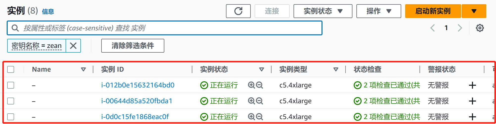
    可以发现多了三个新的运行实例，这三个实例就是我们在`Auto Scaling`组中设置的3个需求节点。
## 基于MonoSQLMonitor虚拟镜像创建监控实例
MonoSQLMonitor虚拟镜像中集成了Prometheus与Grafana监控组件，可以实现对Auto Scaling Group的监控。Prometheus是一种监控工具，可以收集和存储分布式数据库的指标数据，而Grafana则是一种数据可视化工具，可以将这些指标数据以图表等形式展示出来，帮助用户更好地理解和分析分布式数据库的性能和运行状况。
   1. 创建基于MonoSQLMonitor的EC2实例
   创建监控实例的过程与创建MonoSQLServer实例基本一致，需要注意的一点是相应的AMI,需要设置为`MonoSQLMonitor`。
   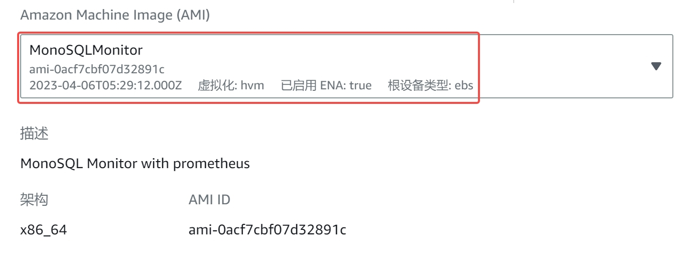
   2. 访问WebUI，查看Grafana监控情况
   创建完MonoSQLMonitor监控实例后，该实例默认会监控名称为`MonoSQL`的`Auto Scaling`组，您可以在浏览器中输入`监控EC2实例ip:3000`，查看组件对于该`Auto Scaling`组的监控情况，出现如下界面
   
   默认用户名与密码都为**admin**，
   选择**Dashboards**> **General** > **Monograph Server**，进入如下界面
   
   点击**Monograph Server**，进入如下界面，可以看到`Auto Scaling`组下的三个启动实例都处在监控实例的监控中
   
## 使用Sysbench进行基准测试
   1. 创建MySQL Client EC2实例
  创建Mycleint实例的过程与创建MonoSQLServer实例基本一致，但是需要注意的是相应的AMI，需要设置为`dynosqlalpha`。创建该EC2实例的目的在于使得该实例作为MySQL客户端，与我们设置的`Network Load Balancer`进行交互
   1. 进行基准测试
        + 登陆到创建的MySQL Client实例，执行下述命令进行`Sysbench`测试
        ```shell
        sysbench /usr/share/sysbench/oltp_insert.lua --mysql_storage_engine=monograph --tables=1 --table_size=100000 --mysql-user=sysb --mysql-host=<MonoSQL-dns-example> --mysql-port=3306 --mysql-password=sysb --mysql-db=test --time=120 --threads=100 --report-interval=5 --auto_inc=off --create_secondary=false --mysql-ignore-errors=all prepare
        sysbench /usr/share/sysbench/oltp_insert.lua --mysql_storage_engine=monograph --tables=1 --table_size=100000 --mysql-user=sysb --mysql-host=<MonoSQL-dns-example> --mysql-port=3306 --mysql-password=sysb --mysql-db=test --time=120 --threads=300 --report-interval=5 --auto_inc=off --create_secondary=false --mysql-ignore-errors=all run
        ```
       将字段`<MonoSQL-dns-example>`字段替换为[基于MonoSQL创建Auto Scaling Group](#monosql启动实例的创建)中创建的负载均衡器的实际DNS。
       
       根据我们配置的Auto Scaling Group中的实例数量为3，您可以将线程数`threads`设置为300，下图展示了测试时的运行结果
       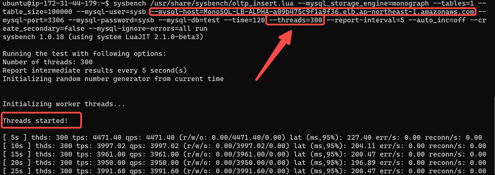
关于利用`Sysbench`进行基准测试的详细解释与过程，参考[MonoSQL Benchmark Result](https://github.com/zhangh43/dynosql/blob/main/monosql_benchmark.md)
## 使用CloudWatch进行指标跟踪与日志管理
CloudWatch是AWS提供的一项监控服务，可用于监控AWS云环境中的资源和应用程序。它可以监控AWS服务的指标，并收集和跟踪日志文件，以帮助诊断应用程序和系统问题。MonoSQL将Auto Scaling组中的实例的运行日志保存在CloudWatch中，用户可以进入CloudWatch中进行查看日志，并且可以使用CloudWatch监控其预测式扩展策略。
   选择 **CloudWatch** > **日志** > **日志组**，点击**monosql-service**，出现如下界面
   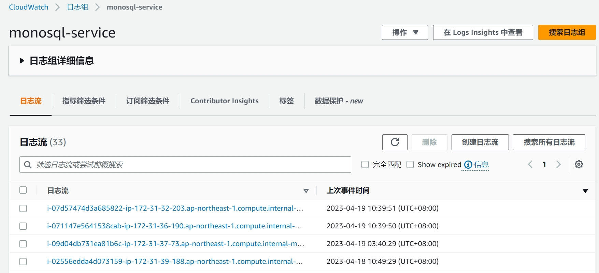
您可以按需查看相应的日志信息。
