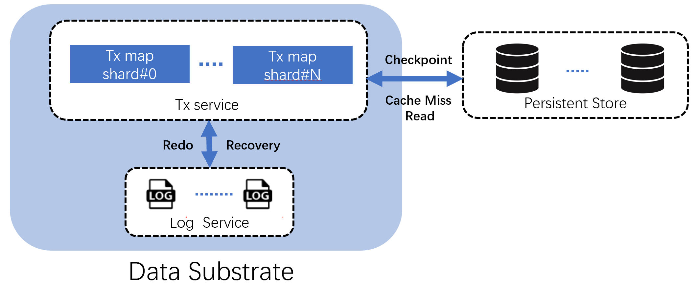

In this blog post, we introduce our transformative concept **Data Substrate**. Data Substrate abstracts core functionality in online transactional databases (OLTP) and provides a unified layer for [CRUD](https://en.wikipedia.org/wiki/Create,_read,_update_and_delete) operations of any data models. A database built on this unified layer is modular: a database module is optional, can be replaced and can scale up/out independently of other modules.

<!--truncate-->

## Motivation

In the early days of computing, data were stored in plain files and processed using custom programs. [Relational database management systems (RDBMS)](https://en.wikipedia.org/wiki/Relational_database) emerged in the 1970s to model data as tables, store them in disk with consistency and integrity and provide [SQL](<(https://en.wikipedia.org/wiki/SQL)>) to access them. RDBMS is the de facto solution for data management and people were happy with it.

But that was changed in the early 2000s, with the meteoric rise of the Internet. Internet applications, such as search engines and e-commerce websites, generated a large volume of data every second and redefined data-intensive workloads. The database landscape had since evolved in two directions: scalability and data models. Making a database scale is hard. Doing so while maintaining the [ACID](https://en.wikipedia.org/wiki/ACID) properties and not sacrificing too much performance is even harder. The NoSQL trend was known for dropping ACID to scale the database. NewSQL and distributed SQL databases later brought back transactions. Most recently, cloud-native databases decouple compute and storage to scale storage separately. The second trend was the emergence of diverse data models. It was increasingly clear that the relational model didn’t fit all applications. With the advent of diverse data types and structures, databases for new data models emerged.

The last 20-year evolution leads to a database landscape that is extremely complex. Now we have at least one type of databases for a data model and query language, which are further fragmented by scales (single-node, distributed storage, shared-nothing-distributed), environments (on-premises, cloud) and storage device (in-memory, SSD, non-volatile memory). This fragmentation presents daunting challenges for users. As [illustrated](https://a16z.com/wp-content/uploads/2023/04/Unified-Data-Infrastructure-2.0-1.png) in [an article](https://a16z.com/emerging-architectures-for-modern-data-infrastructure/) from Andreessen Horowitz, the modern data pipeline now consists of numerous specialized components, each designed to handle specific tasks, creating a maze of tools and systems that users must navigate to manage their data.

This does not seem sustainable. Do we have to build a new database all over again for every new type of data model/environment/hardware? If we examine a new database and compare it with an existing one, it's evident that the vast majority of functionality is same. A new database has to re-implement myriad features that have been done before just to offer some new values. We should do better.

Our answer to this grand question is Data Substrate that modularizes databases.

## Inspiration: Single-Node RDBMS

Data substrate draws inspirations from the canonical design of single-node relational database management systems (RDBMS). To understand where Data Substrate originates, let us revisit what RDBMS does. In a simplified form, a RDBMS kernel contains 4 modules: (1) a disk-resident B+-tree to store data items, (2) a write-ahead log to persist data changes, (3) a buffer pool to cache B+-tree pages in memory, and (4) a lock table to coordinate reads and writes for concurrency control.

Now consider a transaction T that reads and updates a data item x. T traverses the B+-tree and for each page searches the buffer pool (①). If this is a cache miss, T locates the disk-resident page (②) and brings it into the buffer pool (③). T eventually pins the page containing x in the buffer pool, adds a read lock on x in the lock table (④), reads x (⑤) and unpins the page.

To update x, T upgrades the lock on x to the write lock (⑥), updates the page of x in the buffer pool (⑦) and appends redo/undo operations to the log (⑧). T commits by synchronously flushing a commit record to the log, which also forces the prior redo/undo log entries to persist.

By the time T commits, the change on x appears in the log, the in-memory page in the buffer pool, but not in the disk-resident B+-tree. There is a background process known as checkpointing that periodically flushes dirty pages to disk (⑨).

Though originally designed for transaction processing of tabular data, the design priniciples are optimal in supporting CRUD operations. The four most important pillars are:

- _Durability_. To make data durable, the system uses an append-only log to persist changes. Sequential writes provide the highest write throughput one can get out of stable storage. There is only one synchronous write in the critical path, so no design provides higher throughput and lower latency than using the log to achieve durability. The log is also necessary for data safety, because most storage devices have no support of atomicity and cannot prevent partial writes upon power failures.

- _Cache_. With the log providing durability, data changes are kept in memory. This incurs less IO in the write path and prevents stale reads for following operations. Caching in memory also provides the optimal performance for following reads.

- _Asynchrony_. Cached data changes are asynchronously flushed to stable storage. This amortizes the cost of writing to stable storage in two ways. First, multiple changes on the same data item are coalesced to one. Second, it accumulates a batch of changes and may re-organize them to sequence writes.

- _Consistency and fault tolerance_. Asynchrony results in a window between when the data change is visible in cache and when it is flushed to stable storage. To cope with failures, the system maintains an invariant: the data change must be in cache or stable storage or both. The invariant means (1) for cache replacement, the dirty page cannot be evicted unless it is flushed, and (2) for failover, unflushed changes must be recovered in stable storage or cache.

## Data Substrate

The values of the design principles go beyond RDBMS. Whether the data item is a row in a table, a data structure or a JSON document, as long as we want to store it safely in stable storage, the durability principle applies. Regardless of whether the database runs in a single node or a distributed environment, memory is fast but scarce, storage has high volume but is slow and we need the cache and asynchrony principles to balance the two to serve reads and writes. In Data Substrate, we extend these principles to (non-transactional) CRUD operations of any data models in distributed environments.

- _Durability_. Data substrate uses a distributed, replicated log for persisting data changes. Each logger is replicated for high availability. Having one or more loggers provides elasticity for write throughput.

- _Cache and concurrency control_. Data substrate uses a distributed, in-memory map for cache and concurrency control. We call this map the "tx map". The map key identifies a data item, and the payload includes the value and meta-data for concurrency control, e.g., a lock. The tx map kills one two birds with one stone: accessing a map entry reads/writes the cached value and performs concurrency control, e.g., adding a lock. Indeed, only is a data item accessed should it be cached and coordinated with other readers and writers. Concurrency control is optional: if the operation is non-transactional or does not require locks (e.g., reads under the isolation level READ COMMITTED), the access does not change the meta-data. The tx map is partitioned across multiple cores in a single node or across multiple nodes.

- _Asynchrony_. Changed data items are first flushed to the log and then updated in the tx map. Updated data items are asynchronously flushed to a persistent store in parallel. The persistent store plays the same the role as B+-tree and stores data items in stable storage. The persistent store exposes Get(), Put() APIs for reading and writing data items.

- _Consistency and fault tolerance_. Data substrate maintains the same invariant as RDBMS: (1) a changed data item cannot be evicted from the tx map until it is flushed to the persistent store, and (2) A failed over node of the tx map cannot start serving, until unflushed data items are recovered in the tx map from the log.

## Modularity

What makes Data Substrate unique is modularity. The tx map exposes APIs for runtime to read and write cached data and manage concurrency control. The persistent storage exposes APIs for the tx map to flush changed data and to bring back data who have been evicted due to insufficient cache capacity. The log provides APIs to persist data changes and to ship unflushed data to the tx map for recovery. All modules talk to each other via carefully designed APIs and they make no assumption on where the other modules locate, how they are implemented or what hardware resources they use.

Modularity has profound implications on how a database is developed, deployed and scaled. Data Substrate and the persistent store disregard what a data item looks like: concurrency control and cache replacement algorithms wouldn't change if a data item represents a row or a JSON document; log entries contain serialized post (and optionally pre) images of changed data items or commands that modify them, which are agnostic to data types too; the persistent store index data items by identifiers and values and use same index structures (e.g., B+-tree, LSM-tree). In essence, data of different types face same system challenges for CRUD and Data Substrate solves them all. Building an operational database of a data model is greatly simplified by porting a model-specific query engine on top.

Modularity also changes how a database scales. Conventionally, a database either scales vertically or horizontally. The recent trend of disaggregating compute and storage in cloud-native databases allows CPU and storage to scale separately. Data Substrate’s modularity goes a step further and scales the database at the finest granularity: CPU, cache (memory), the log (storage) and the persistent store (storage). This scaling flexibility allows the database to use minimal resources to meet applications’ performance requirements.

- For a read-intensive, latency-sensitive application, the database caches hot data in memory and only scales the cache when the workload surges. Today, a single VM's memory goes from 4 GB to over 256 GB. So, scaling the database cache first scales up and beyond a certain point scales out.The log scale is small, as the workload is mostly-read. Data storage does not need scaling when the workload changes.
- For a write-heavy, high-frequency trading application, the database scales the log horizontally to many storage devices to persist changes fast and safely. Horizontal scaling ensures the write throughput is high, while keeping write latency low. The scale of the log is independent of the cache size and data volume, which may fit into a single machine’s memory and a single disk.

Data Substrate’s modularity embraces optionality. While we believe ACID transactions are essential to applications, we also believe that ACID transactions should be optional such that applications who don’t need them shall not pay the corresponding cost. In Data Substrate, this is done by disabling some modules or using the system in such a way that ACID transactions are bypassed. For example, by disabling the log, the database drops durability and becomes a cache system. This cache system has the persistent store, so it can swap cold data to stable storage when cache is full. The execution path of writing a single key, which conventionally consists of lock-log-unlock phases in transaction processing, skips the logging phase and is collapsed into a single phase of applying the change in the tx map. This path is same as in native cache systems and incurs no extra cost.

## Incarnation

Data Substrate opens the door to many opportunities. No matter whether you build a cache, an in-memory database, or a cloud-native database for a data model, place a query parser, optimizer and execution engine on top of Data Substrate, and you are all set. You get an elastic, performant and fault tolerant operational database.

We are working on the first incarnation of Data Substrate, a key-value database. What’s your favorite data model? What are the capabilities you expect most for the next database? [Drop us a note](/contact). We’ll keep you posted as we make a move on the next database and give you a private preview.
