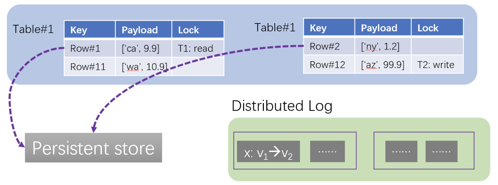
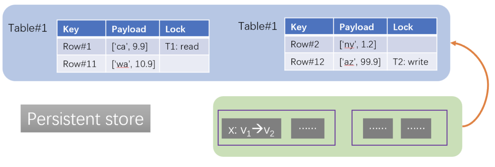

In last blog post, we discussed three properties we envision for future databases: optional ACID, fully elastic, hybrid scaling. In this blog post, we introduce the architecture behind EloqKV that realizes our visions. The architecture centers on a transformative concept called “Data Substrate”. Data substrate abstracts core functionality in online transactional databases (OLTP) and provides a unified layer for CRUD operations. A database built on this unified layer is modular: a database module is optional, can be replaced and can scale up/out independent of other modules.

<!--truncate-->

# Inspiration: Single-Node RDBMS

Data substrate draws inspirations from the canonical design of single-node relational database management systems (RDBMS). In a simplified form, a RDBMS kernel contains 4 modules: (1) a disk-resident B+-tree to store data items, (2) a write-ahead log to persist data changes, (3) a buffer pool to cache B+-tree pages in memory, and (4) a lock table to coordinate reads and writes for concurrency control.

Consider a transaction T reading a data item x. T traverses the B+-tree and for each page searches the buffer pool (①). If this is a cache miss, T locates the disk-resident page (②) and brings it into the buffer pool (③). T eventually pins the page containing x in the buffer pool, adds a read lock on x in the lock table (④), reads x (⑤) and unpins the page.

To update x, T upgrades the lock on x to the write lock (⑥), updates the page of x in the buffer pool (⑦) and appends redo/undo operations to the log (⑧). T commits by synchronously flushing a commit record to the log, which also forces the prior redo/undo log entries to persist, and finally releasing the lock.

By the time T commits, the change on x appears in the log, the in-memory page in the buffer pool, but not in the disk-resident B+-tree. There is a background process known as checkpointing that periodically flushes dirty pages to disk (⑨).

Though originally designed for transaction processing, the design principles in RDBMS are optimal in supporting CRUD operations.

- Durability. To make data durable, the system uses an append-only log to persist changes. Sequential writes provide the highest write throughput one can get out of stable storage. There is only one synchronous write in the critical path, so no design provides higher throughput and lower latency than using the log to achieve durability. The log is also necessary for data safety, because most storage devices have no support of atomicity and cannot prevent partial writes upon power failures.

- Cache. With the log providing durability, data changes are kept in memory. This incurs less IO in the write path and prevents stale reads for following operations. Caching in memory also provides the optimal performance for following reads.

- Asynchrony. Cached data changes are asynchronously flushed to stable storage. This amortizes the cost of writing to stable storage in two ways. First, multiple changes on the same data item are coalesced to one. Second, it accumulates a batch of changes and may re-organize them to sequence writes.

- Consistency and fault tolerance. Asynchrony results in a window between when the data change is visible in cache and when it is flushed to stable storage. To cope with failures, the system maintains an invariant: the data change must be in cache or stable storage or both. The invariant means (1) for cache replacement, the dirty page cannot be evicted unless it is flushed, and (2) for failover, unflushed changes must be recovered in stable storage or cache.

# Data Substrate

Data substrate abstracts the modules of RDBMS to a higher level and extends the design principles to CRUD operations in distributed environments.

- Durability. Data substrate uses a distributed, replicated log for persisting data changes. Each logger is replicated for high availability. Having one or more loggers provides elasticity for write throughput.

- Cache and concurrency control. Data substrate uses a distributed, in-memory map for cache and concurrency control. We call this map “CC map”. The CC map key identifies a data item, and the payload includes the value and meta-data for concurrency control, e.g., the lock of the data item. The CC map kills one two birds with one stone: accessing a map entry retrieves the cached value and performs concurrency control, e.g., adding a read lock. Concurrency control is optional: if the operation is non-transactional or does not require locks (e.g., reads under the isolation level of READ COMMITTED), the access does not change the meta-data. The CC map is partitioned across multiple cores in a single node or across multiple nodes.

- Asynchrony. Changed data items are first flushed to the log and then updated in the CC map. Updated data items are asynchronously flushed to a persistent store in parallel. The persistent store plays the same the role of B+-tree and stores data items in stable storage. The persistent store exposes Get(), Put() APIs for reads and writes.

- Consistency and fault tolerance. Data substrate maintains the same invariant as RDBMS: (1) a changed data item cannot be evicted until it is flushed to the persistent store, and (2) A failed over node of the CC map cannot start serving, until unflushed data items are recovered in the CC map from the log.

Data substrate implements four core functions for CRUD: caching, concurrency control, durability and fault tolerance. The CC map is elastic and can scale up or out. The log is too elastic and scale from one storage device to multiple. The persistent store is a separate module outside of data substrate and scales separately. Both the persistent store and the log are optional. When both disabled, the CC map becomes a pure cache. When both enabled, the data substrate and the persistent store form a classical ACID-compliant database. Whether this is an in-memory database or larger-than memory one depends on if the CC map is large enough to hold all data in memory.
