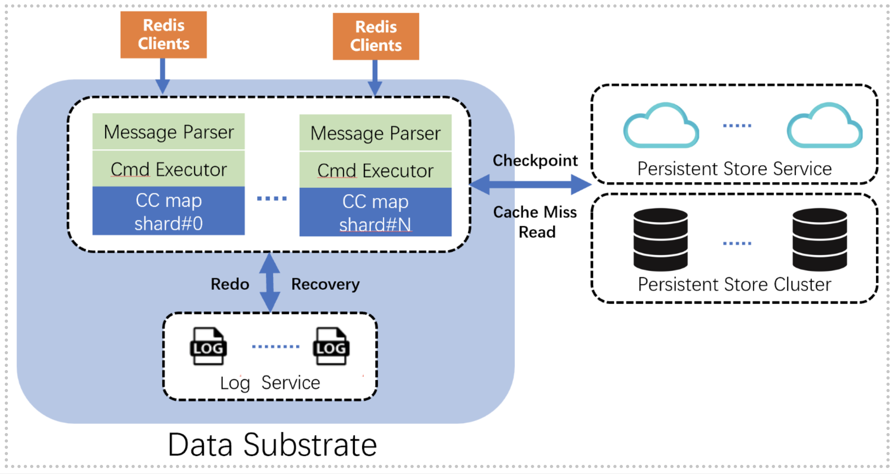

It is a great pleasure for us to formally announce **EloqKV**. EloqKV is the first product based on our revolutionary **Data Substrate** technology，which is a brand new architecture to construct high performance, modular, scalable, and transactional databases in the cloud era. We introduced the Data Substrate technology in several previous blog posts:

1. [Why We Need a Common Underpinning for Modern Databases](https://link1)
2. [How We End Up With So Many Databases Today](https://link2)
3. [What is Data Substrate, and How Can It Help](https://link3)

Similar to many existing key-value stores, EloqKV is highly performant, supporting millions of operations per second in a single server node with sub-milisecond latencies. However, by leveraging Data Substrate technology, EloqKV offers some unique properties that makes it stands out compared with other key-value databases.

# Fully ACID Transactions when You Need Them.

To achieve consistent latency, many key-value stores keep all data in memory, thus significantly increase operational cost because cold data still occupies precious memory space. Durability is often another aspect to be sacrificed in the name of performance, even though well optimized Write Ahead Log (WAL) on fast SSD devices can often achieve acceptable overhead. Last but not least, due to the high cost of distributed transactions, almost all distributed key-value stores forgo transaction support.

EloqKV takes the philosophy that ACID is a desirable feature that should not be ignored, but neither should the feature cost extra when not needed. EloqKV can turn on the ACID features on a per-database basis, and a single-key read is never going to cost extra even when the database is set to be transactional.

Even when a database is fully ACID, EloqKV still contains several innovative technologies to reduce overhead. For example, latency of WAL logging on SSD highly depend on logging data volume. In EloqKV, logging can scale independently of the writers, thus reducing the logging latency when more hardware is provided (we have to obey basic physics, afterall). We also avoid using the expensive 2-phase commit protocol for our distributed transactions. Unfortunately, the details of this technology have to be wait to be discussed in a blog or paper in the future.

# Scale as You See Fit

EloqKV is built to be scalable from ground up. Each resource types, including memory, CPU cores, logging SSD devices, and persistent storage can be scaled independently. Such full scalability is especially important in the cloud era, as we can buy the type of resources as we see fit from public cloud providers. Your workload is latency sensitive and you need to keep all data in memory? Reserve a bunch of virtual machines with large memory. You have a lot of updates that need to be persisted? Just buy a few extra EBS volumes to work as logging devices. Your data size is humongous? Use cloud storage such as DynamoDB and S3 to store all your data.

Some of these features are currently not available in our preview release. Please contact us if you are interested to learn more.

Dynamic scaling, i.e. adding resources as the workload changes, is a feature we are currently working on, and will be released to public preview very soon. Stay tuned.

# You Want Ease of Use? You Get Ease of Use

EloqKV is compatible with the Redis API, and it supports most of the important data structures in Redis. Therefore, existing applications can take advantage of EloqKV's rich features with practically zero effort.

However, the ease of use of EloqKV is far beyond API compatibility. In fact, the main reason EloqKV is easy to use is because of the architecture design choices we made, and is much more fundmental.

EloqKV can be easily deployed as a single node KV store, just as most of the existing KV stores exising today, such as Redis, DragonflyDB, or Garnet. It can compete head-to-head with them with regard to performance and features. However, EloqKV is a distributed system by design. It can be easily deployed in a cluster, and immediately enjoy the high-availability and scalability offered by a real distributed system. No more sentinels, no more special cluster mode.

Moreover, due to the built-in cluster awareness and ACID support, a cluster of EloqKV nodes behaves almost exactly the same as a single node EloqKV server. Connecting to one of the nodes, and the Redis compatible client can access and modify data on all nodes in the cluster (potentially with an extra network hop, obviously. We have to obey basic physics, afterall). Moreover, MULTI commands (i.e. Redis transactions) can run in the cluster just as on a single node. No more SLOTS and "CROSSSLOT Keys" errors.

# Performance and Cost

Performances and costs are always the main metrics used to measure any database systems. It is sufficient to say that we put great amoount of thoguhts on these topics and we invite users to try out EloqKV and evaluate on your own workloads. We won't elaborate too much on these issues in this blog and a seperate blog post will show some performance numbers of EloqKV.

One thing we do want to point out is that some of the advanced capabilities of EloqKV, such as enabling WAL for durability, atomic MULTI operations across multiple nodes, and use SSD to store relatively cold data to reduce memory consumnption may not be as expensive as you might think. Again, please try it out with your own workload, and if you have any comments, suggestions or questions, you can always [contact us](http://link) and we are here to help.

# Introduction to the Preview Release of EloqKV

[//]: <> (Transactions in the data substrate embrace optionality. For non-Multi, non-Lua commands, a transaction accesses a single key. This means that the transaction obtains no read lock and thus no unlocking if the command is read-only. If the command modifies the data structure, the transaction 1 obtains the write lock, 2 writes the log and 3 finally releases the lock and applies the command to the data structure. If the log is disabled, the lock-log-unlock path is collapsed into a single phase of applying the command. Hence, when the log is disabled, the execution path of a single Redis command is same as a native cache system. Only if the log is enabled do Redis commands become ACID-compliant and pay the cost of transactions. For Multi commands or Lua scripts, the transaction employs a variant of two-phase locking protocol to ensure global atomicity. Between the locking and unlock phases lies logging the transaction’s commands if the log is enabled.)

[//]: <> (EloqKV can be deployed as a cache by disabling the log and the persistent store, an in-memory database enabling the log and the persistent store and a larger-than-memory database when allocated memory is insufficient to host all data. The transition between the last two is driven by scaling memory cache. EloqKV can scale out the log separately for high write throughput and low latency. Scaling the persistent store is driven by data volume and is outside the scope of the data substrate.)

[//]: <> (EloqKV is a key-value database assembled using the data substrate. In front of the data substrate are RPC servers that receive network messages from Redis clients, parse Redis commands and execute them. The executor initializes a transaction via which requests are sent to the CC map to read and write keys and associated data structures. Upon commit, the transaction flushes write commands to the log and updates the in-memory data structure. Changed data structure are periodically flushed to a persistent store, which is either an on-premises system or a cloud service. A flushed key can be evicted from the CC map if there is no sufficient memory capacity. A later read on it will load it back into memory from the persistent store.)

In our current preview release, EloqKV supports two persistent stores: Apache Cassandra and RocksDB. Cassandra is a disaggregated store and may run in a different set of nodes from the data substrate. RocksDB is an embedded store and deployed with nodes hosting the DataSubstrate. Deployment of the persistent store is automatic when EloqKV is started.

In the ext blog post, we will share some results of performance benchmarks of EloqKV. We will show that EloqKV, when used as a cache, delivers excellent performance as mainstream cache solutions. The scaling capability of the log makes EloqKV especially unique in delivering extremely high write performance as an ACID database.

<!--truncate-->

Transactions in the data substrate embrace optionality. For non-Multi, non-Lua commands, a transaction accesses a single key. This means that the transaction obtains no read lock (and thus no unlocking) if the command is read-only. If the command modifies the data structure, the transaction (1) obtains the write lock, (2) writes the log and (3) finally releases the lock and applies the command to the data structure. If the log is disabled, the lock-log-unlock path is collapsed into a single phase of applying the command. Hence, when the log is disabled, the execution path of a single Redis command is same as a native cache system. Only if the log is enabled do Redis commands become ACID-compliant and pay the cost of transactions. For Multi commands or Lua scripts, the transaction employs a variant of two-phase locking protocol to ensure global atomicity. Between the locking and unlock phases lies logging the transaction’s commands if the log is enabled.

EloqKV can be deployed as a cache (disabling the log and the persistent store), an in-memory database (enabling the log and the persistent store) and a larger-than-memory database (when allocated memory is insufficient to host all data). The transition between the last two is driven by scaling memory (cache). EloqKV can scale out the log separately for high write throughput and low latency. Scaling the persistent store is driven by data volume and is outside the scope of the data substrate.

In current release, EloqKV supports two persistent stores: Apache Cassandra and RocksDB. Cassandra is a disaggregated store and may run in a different set of nodes from the data substrate. RocksDB is an embedded store and deployed with nodes hosting the CC map. Deployment of the persistent store is automatic when EloqKV is started.

In next blog post, we will share some results of performance benchmarks of EloqKV. We will show that EloqKV, when used as a cache, delivers excellent performance as mainstream cache solutions. The scaling capability of the log makes EloqKV especially unique in delivering extremely high write performance as CRUD databases.
