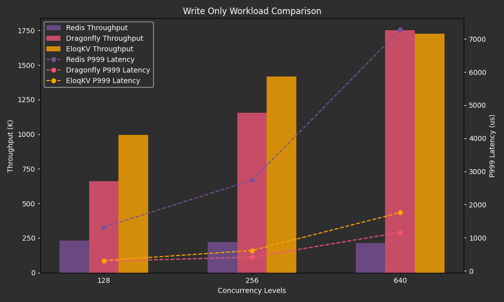
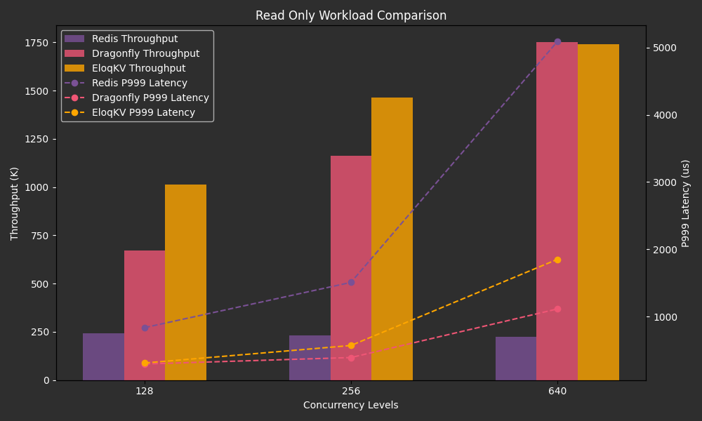
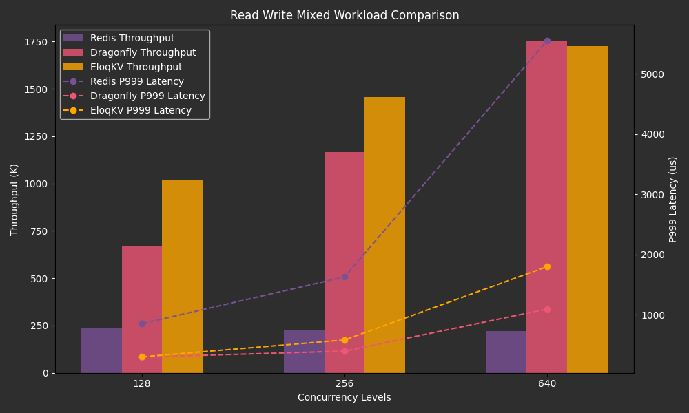

**EloqKV** is a Redis API-compatible, transactional, distributed key-value database designed for scalability, high througput and low latency.

In this blog, we will benchmark **EloqKV** in its memory cache mode, focusing first on single-node performance and later discussing its scalability in cluster mode. The benchmarks are conducted using the memtier-benchmark tool, evaluating write-only, read-only, and mixed read-write workloads.

## Single Node Performance

In the first scenario, we compare the performance of EloqKV with DragonflyDB. The goal of this comparison is to evaluate the performance of EloqKV in pure memory mode, without enabling persistent storage and transactional features.

### Hardware and Software Specification

The benchmark was conducted on AWS (region: us-east-1) EC2 instances with the following deployment details:

Server Machine:

| Service type | Node type   | Node count |
| ------------ | ----------- | ---------- |
| Redis        | c7g.8xlarge | 1          |

| Service type | Node type   | Node count |
| ------------ | ----------- | ---------- |
| DragonflyDB  | c7g.8xlarge | 1          |

| Service type | Node type   | Node count |
| ------------ | ----------- | ---------- |
| EloqKV       | c7g.8xlarge | 1          |

Client Machine:

| Service type | Node type    | Node count |
| ------------ | ------------ | ---------- |
| Memtier      | c6gn.8xlarge | 1          |

**Software version:**

- OS version: Ubuntu 22.04
- Redis version: 6.0.16
- DragonflyDB version: 1.21.2
- EloqKV version: 0.6.6

### Software Deployment and Configuration

Follow link [Get Started](/eloqkv/install-from-binary) to setup EloqKV.

Follow link [Install from Binary](https://www.dragonflydb.io/docs/getting-started/binary) to setup Dragonflydb.

Follow link [Install Redis](https://redis.io/docs/latest/operate/oss_and_stack/install/install-redis/) to setup Redis.

### Experiment I: Write-Only Workload

To assess EloqKV’s write performance, we run memtier_benchmark with ratio of 1:0 (write-only) with the following configuration:

```
memtier_benchmark -t $thread_num -c $client_num -s $server_ip -p $server_port --distinct-client-seed --ratio=1:0 --key-prefix="kv_" --key-minimum=1 --key-maximum=50000000 --random-data --data-size=128 --hide-histogram --test-time=300
```

- Thread Number (-t): Specifies the number of threads for parallel execution, which we have set to a fixed value of 32.
- Client Number (-c): Represents the number of clients per thread. We configured it to 4, 8, and 20 to evaluate different concurrency levels. In our experiment, this resulted in total concurrency values of 128, 256, and 640, calculated as `thread_num` × `client_num`.
- Ratio (--ratio): 1:0 for write-only workload.

#### Results

Below are the results of the write-only workload, presented in a graph that illustrates the Redis, EloqKV & Dragonflydb's throughput and latency across varying thread numbers, simulating different levels of concurrent database access.

X-axis: Represents the varying thread numbers employed during the benchmark, simulating different levels of concurrent database access.

Left Y-axis: Measures the QPS (Queries Per Second).

Right Y-axis: Measures the Latency (P999).

<p align="center">
<div style={{ width: '640px', textAlign: 'center'}}>

</div>
</p>

**EloqKV** and DragonflyDB both outperform Redis due to their support for multiple worker threads. EloqKV delivers higher throughput than DragonflyDB in low-concurrency scenarios. However, as concurrency increases, **EloqKV**'s throughput and latency become comparable to DragonflyDB's. Thus, we can conclude that **EloqKV** is a robust cache solution, particularly well-suited for write-heavy workloads.

### Experiment II: Read-Only Workload

For the read-only workload, we adjusted the ratio to 0:1 (read-only):

```
memtier_benchmark -t $thread_num -c $client_num -s $server_ip -p $server_port --distinct-client-seed --ratio=0:1 --key-prefix="kv_" --key-minimum=1 --key-maximum=50000000 --random-data --data-size=128 --hide-histogram --test-time=300
```

- Ratio (--ratio): Set to 0:1 for read-only operations.

#### Results

The following graph displays the results of the read-only workload, highlighting the throughput and latency of **EloqKV**, Redis, and DragonflyDB across different thread counts, effectively simulating various levels of concurrent database access.

<p align="center">
<div style={{ width: '640px', textAlign: 'center'}}>

</div>
</p>

Again, **EloqKV** and DragonflyDB both excel in performance compared to Redis, primarily due to their ability to leverage multiple worker threads. In scenarios with low concurrency, **EloqKV** demonstrates superior throughput. However, as concurrency levels rise, its performance, in terms of throughput, aligns closely with that of DragonflyDB. **EloqKV** exhibits slightly higher latency compared to DragonflyDB, primarily because it has not yet implemented io_uring for enhanced network I/O, a feature currently under development.

### Experiment III: Mixed Write-Read Workload

Finally, the mixed workload with a 1:10 ratio:

```
memtier_benchmark -t $thread_num -c $client_num -s $server_ip -p $server_port --distinct-client-seed --ratio=1:10 --key-prefix="kv_" --key-minimum=1 --key-maximum=50000000 --random-data --data-size=128 --hide-histogram --test-time=300
```

- Ratio (--ratio): Set to 1:10 for mixed write-read operations.

#### Results

The following graph presents the results of the mixed read-write workload, showcasing the throughput and latency of **EloqKV**, Redis, and DragonflyDB across varying thread counts, effectively simulating different levels of concurrent database access.

<p align="center">
<div style={{ width: '640px', textAlign: 'center'}}>

</div>
</p>

Even in this balanced scenario, **EloqKV** and DragonflyDB both outperform Redis, largely due to their capacity to utilize multiple worker threads. In low-concurrency scenarios, **EloqKV** delivers superior throughput. However, as concurrency increases, its performance in terms of both throughput and latency becomes comparable to that of DragonflyDB. Similar to other workloads, EloqKV proves to be an effective solution, particularly for mixed read-write workloads.

## Scaling to Cluster Mode

While this blog focuses on single-node performance, the next post will delve into the scalability of EloqKV when deployed in cluster mode. We will explore how it handles distributed workloads, providing insights into its capability to maintain performance as it scales horizontally.

Stay tuned for our upcoming benchmarks on EloqKV's cluster mode performance!
