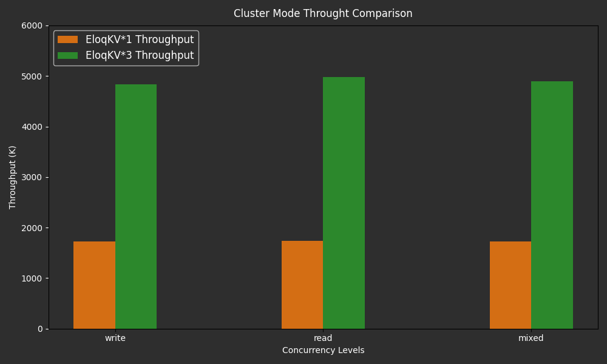

**EloqKV** is a Redis API-compatible, transactional, distributed key-value database designed for scalability, high througput and low latency.

In our previous blog, we benchmarked **EloqKV** in memory cache mode, focusing on single-node performance. In this post, we delve into its scalability in cluster mode. The benchmarks were conducted using the memtier-benchmark tool, evaluating write-only, read-only, and mixed read-write workloads.

## Cluster Performance

We compare the performance of a single-node **EloqKV** instance with that of an **EloqKV** cluster to evaluate its linear scalability. In this assessment, **EloqKV** operates in pure memory mode, with persistent storage and transactional features disabled."

### Hardware and Software Specification

The benchmark was conducted on AWS (region: us-east-1) EC2 instances with the following deployment details:

**Server Machine:**

| Service type  | Node type   | Node count |
| ------------- | ----------- | ---------- |
| EloqKV Single | c7g.8xlarge | 1          |

| Service type   | Node type   | Node count |
| -------------- | ----------- | ---------- |
| EloqKV Cluster | c7g.8xlarge | 3          |

**Client Machine:**

| Service type | Node type    | Node count |
| ------------ | ------------ | ---------- |
| Memtier      | c6gn.8xlarge | 3          |

**Software version:**

- OS version: Ubuntu 22.04
- EloqKV version: 0.6.6

### Software Deployment and Configuration

Follow link [Deploy Cluster](/eloqkv/install-from-binary) to setup **EloqKV** cluster.

Note: To enable pure memory mode, please disable persistent storage and turn off WAL (Write-Ahead Logging).

```
# set it to none to turn off persistent storage for all databases
enable_data_store=none
# set it to none to turn off WAL for all databases
enable_wal=none
```

### Experiment:

We benchmarked a single-node **EloqKV** with different read-write ratios using the following command:

```
memtier_benchmark -t 32 -c 20 -s $server_ip -p $server_port --distinct-client-seed --ratio=$ratio --key-prefix="kv_" --key-minimum=1 --key-maximum=5000000 --random-data --data-size=128 --hide-histogram --test-time=300
```

To assess **EloqKV**’s scalability under different workloads, we ran memtier_benchmark in cluster mode with varying read-write ratios using the following configuration:

```
memtier_benchmark -t 32 -c 20 --cluster-mode -s $server_ip1 -p $server_port1 -s $server_ip2 -p $server_port2 -s $server_ip3 -p $server_port3 --distinct-client-seed --ratio=$ratio --key-prefix="kv_" --key-minimum=1 --key-maximum=5000000 --random-data --data-size=128 --hide-histogram --test-time=300
```

- Thread Number (-t): Specifies the number of threads for parallel execution, which we have set to a fixed value of 32.
- Client Number (-c): Represents the number of clients per thread, which is set to a fixed value of 20. In our experiment, this resulted in a total concurrency of 640, calculated as `thread_num` × `client_num`.
- Ratio (--ratio): Specifies the write:read ratio of the workload. We tested different workloads with ratios of 1:0, 0:1, and 1:10.
- Cluster Mode (--cluster-mode): Enables the smart client feature when cluster mode is activated. This allows memtier_benchmark to be aware of the key's mapping to **EloqKV** shards.

#### Results

Below are the results of **EloqKV**'s scalability benchmark, comparing the throughput between a single-node **EloqKV** and a three-node **EloqKV** cluster across various workloads.

X-axis: Represents the different workload types (read/write/mixed) used in the benchmark, simulating a range of real-world scenarios.

Y-axis: Measures the QPS (Queries Per Second).

<p align="center">
<div style={{ width: '640px', textAlign: 'center'}}>

</div>
</p>

As we can see, **EloqKV** three nodes cluster's throughput is almost three times higher than the single node **EloqKV** among different types of workload. It verify **EloqKV**'s capability to maintain performance as it scales horizontally. We can conclude that **EloqKV** is a robust cache solution, particularly well-suited for all kinds of workloads.
