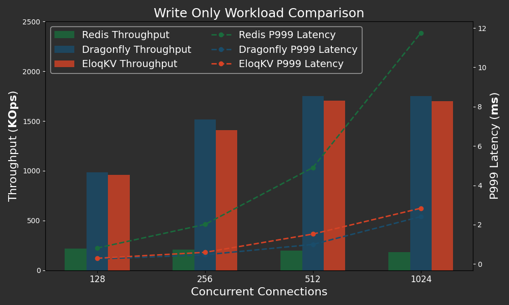

In this blog, we benchmark **EloqKV** to evaluate it as an in-memory cache, focusing on single-node performance. We benchmark **EloqKV** against the popular in-memory data structure store [Redis](https://github.com/redis/redis) as well as a recent contender [DragonflyDB](https://www.dragonflydb.io), which claims to achieve high performance due to its multi-threaded worker architecture and a highly optimized implementation leveraging some [modern innovations](https://github.com/dragonflydb/dragonfly?tab=readme-ov-file#background).

<!--truncate-->

All benchmarks were conducted on AWS (region: us-east-1) EC2 instances, with Ubuntu 22.04. Workloads were generated using the [memtier-benchmark](https://github.com/RedisLabs/memtier_benchmark) tool.

## Single Node Performance

We compare the performance of **EloqKV** with Redis and DragonflyDB. The goal of this comparison is to evaluate the performance of **EloqKV** in memory-only mode, without persistent storage and transactional features enabled. Both Redis and DragonflyDB have limited [persistency capabilities](https://redis.io/docs/latest/operate/oss_and_stack/management/persistence/). Redis offers two mechanisms for persistency: logging (AOF) and checkpointing (RDB). However, AOF is not a proper implementation of [Write-Ahead-Log (WAL)](https://en.wikipedia.org/wiki/Write-ahead_logging), as data is written to disk asynchronously. RDB periodically saves in-memory state as checkpoints. Therefore, Redis can lose committed data if a node crashes. DragonflyDB currently only supports checkpointing and does not offer AOF. As Redis and DragonflyDB are typically used as pure in-memory caches, we benchmarked EloqKV against them under this configuration.

### Hardware and Software Configurations

Server Machine:

| Service            | Node type    | Node count |
| ------------------ | ------------ | ---------- |
| Redis 6.0.16       | c7g.8xlarge  | 1          |
| DragonflyDB 1.21.2 | c7g.8xlarge  | 1          |
| EloqKV 0.6.9       | c7g.8xlarge  | 1          |
| Client - Memtier   | c6gn.8xlarge | 1          |

We follow the official instructions to setup [**EloqKV**](/eloqkv/install-from-binary), [DragonflyDB](https://www.dragonflydb.io/docs/getting-started/binary) and [Redis](https://redis.io/docs/latest/operate/oss_and_stack/install/install-redis/).

For Redis, we disable AOF and RDB persistency.

```
redis-server --save "" --appendonly no
```

For DragonflyDB, we only need to disable checkpointing since it does not yet support logging.

```
dragonfly --dbfilename=
```

For EloqKV, we disable persistent storage and turn off WAL (Write-Ahead Logging) in its `config.ini` file.

```
# set it to none to turn off persistent storage for all databases
enable_data_store=none
# set it to none to turn off WAL for all databases
enable_wal=none
```

### Write-Only Workload

To assess **EloqKV**’s write performance, we run memtier_benchmark with ratio of 1:0 (write-only) with the following configuration:

```
memtier_benchmark -t $thread_num -c $client_num -s $server_ip -p $server_port --distinct-client-seed --ratio=1:0 --key-prefix="kv_" --key-minimum=1 --key-maximum=5000000 --random-data --data-size=128 --hide-histogram --test-time=300
```

- `-t`: Number of threads, which was set to a fixed value of 32.
- `-c`: Number of clients per thread. We configured it to 4, 8, 16 and 32 to evaluate different concurrency levels. This resulted in total concurrency of 128, 256, 512 and 1024, calculated as `thread_num × client_num`.
- `--ratio`: Set\:Get ratio, 1:0 for write-only workload.

#### Results

Below are the results of the write-only workload.

X-axis: Represents the varying concurrencies (`thread_num × client_num`), simulating different levels of concurrent database access.

Left Y-axis: Throughput in QPS (Queries Per Second).

Right Y-axis: 99.9 Percentile latency in milli seconds (ms).

<p align="center">
<div style={{ width: '720px', textAlign: 'center'}}>

</div>
</p>

**EloqKV** and DragonflyDB both outperform Redis due to their support for multiple worker threads. **EloqKV** delivers the same high throughput and low latency as DragonflyDB across various concurrency scenarios.

### Read-Only Workload

For the read-only workload, we adjusted the Set\:Get ratio to 0:1 (read-only):

```
memtier_benchmark -t $thread_num -c $client_num -s $server_ip -p $server_port --distinct-client-seed --ratio=0:1 --key-prefix="kv_" --key-minimum=1 --key-maximum=5000000 --random-data --data-size=128 --hide-histogram --test-time=300
```

- `--ratio`: Set to 0:1 for read-only operations.

#### Results

<p align="center">
<div style={{ width: '720px', textAlign: 'center'}}>

</div>
</p>

Again, **EloqKV** offers similar throughput, while exhibits slightly higher but still very respectable latency compared to DragonflyDB. Both **EloqKV** and DragonflyDB significantly outperform Redis, both in throughput and in latency.

### Mixed Write-Read Workload

Finally, the mixed workload with a 1:10 ratio:

```
memtier_benchmark -t $thread_num -c $client_num -s $server_ip -p $server_port --distinct-client-seed --ratio=1:10 --key-prefix="kv_" --key-minimum=1 --key-maximum=5000000 --random-data --data-size=128 --hide-histogram --test-time=300
```

- `--ratio`: Set to 1:10 for mixed write-read operations.

<p align="center">
<div style={{ width: '720px', textAlign: 'center'}}>

</div>
</p>

**EloqKV** exhibits similar throughput to DragonflyDB. As concurrency increases, **EloqKV** shows a slightly higher P999 latency than DragonflyDB, but remains under 4ms even with over a thousand concurrent connections.

### Analysis and Conclusion

Based on the previous experiments, we can obtain some interesting observations. In this section, we will give some (opinionated) analysis.

#### Single Worker vs Multiple Workers

We can observe that for in-memory caching applications, **EloqKV** and DragonflyDB can significantly outperform _single process_ Redis on a modern multi-core server. The difference is a result of a fundamental [design philosophy](https://medium.com/@yashpaliwal42/redis-single-threaded-and-still-fast-89625094048b) took by Redis. Redis restricts internal in-memory data structure operations to a single worker thread, while multiple IO threads handle networking and persistency. In comparison both **EloqKV** and DragonflyDB allow multiple workers.

There is already plenty of [debate](https://redis.io/blog/redis-architecture-13-years-later/) on whether the performance comparison is fair. Redis is supposed to scale horizontally even on a single server node, by being deployed as a _cluster_ with multiple instances/shards. Moreover, even for single worker architecture, there is still space for optimization. For example, the good folks at [Valkey](https://valkey.io/) have done very nice work [pushing the performance](https://valkey.io/blog/unlock-one-million-rps/) of kv store based on the Redis architecture.

We do believe that a single threaded design will eventually hit its limitations as CPU cores keep increasing and the computation performed for each database access becomes more complex. The people in Redis also have done some work to multithreading at least [certain queries](https://redis.io/blog/announcing-faster-redis-query-engine-and-our-vector-database-leads-benchmarks/).

#### Do We Really Need to Specialize?

Compared with DragonflyDB, **EloqKV** currently lacks a few optimizations such as [io_uring](https://en.wikipedia.org/wiki/Io_uring) based networking support. Due to these limitations, our profiling shows that **EloqKV** is bound by the networking stack when serving the workloads in the experiments.

Even so, as the experiments demonstrated, **EloqKV** works _almost_ as well as DragonflyDB on a workload that DragonflyDB was specifically designed and optimized for. This begs the question of whether designing special database software for limited use cases is profitable. Notice that unlike Redis and DragonflyDB, **EloqKV** is much more than a single node memory cache. Indeed, experiments in the next section and our follow up blog posts will show that **EloqKV** performs very well as a clustered system, as a durable data store, or even as a fully ACID transactional store.

**EloqKV** is based on our [Data Substrate](/blog/2024/08/11/data-substrate) technology. We believe that with this revolutionary technology, users can greatly reduce the complexity of their data infrastructures by eliminatating many specialized databases for their data management needs.
