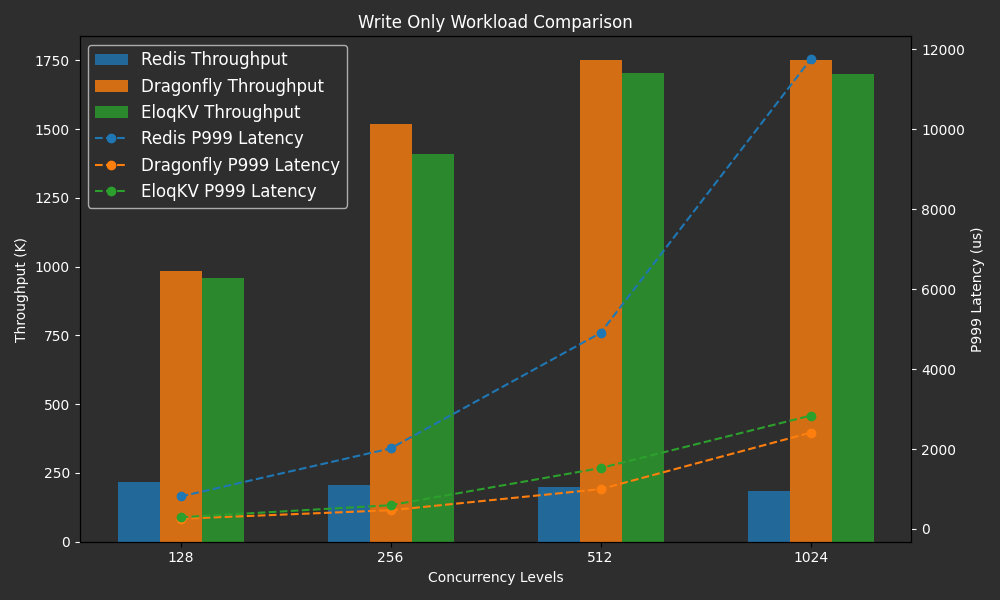
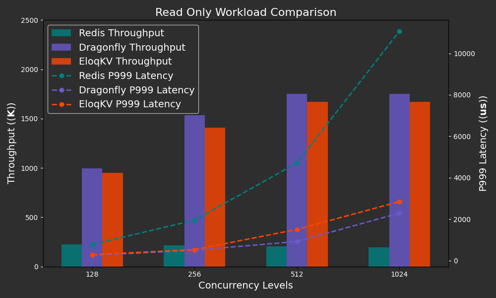
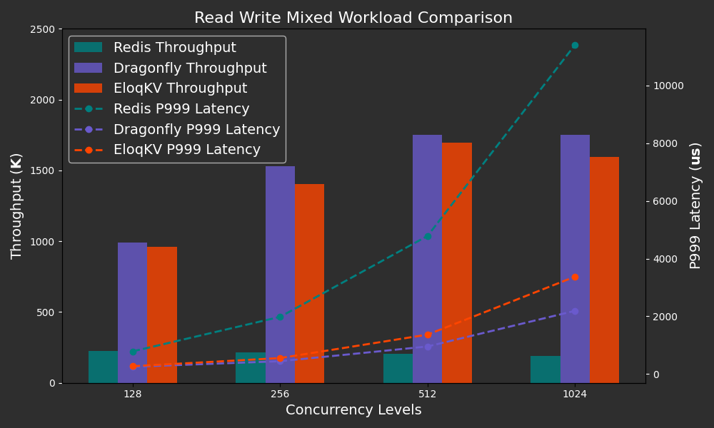

In this blog, we benchmark **EloqKV** to evaluate it as an in-memory cache, focusing first on single-node performance and later discussing its scalability in cluster mode. In the single node case, we benchmark **EloqKV** against the popular in-memory data structure store [Redis](https://github.com/redis/redis) as well as a new contender [DragonflyDB](https://www.dragonflydb.io), which claims to achieve high performance due to its multi-threaded architecture.

<!--truncate-->

The benchmarks are conducted using the [memtier-benchmark](https://github.com/RedisLabs/memtier_benchmark) tool, evaluating write-only, read-only, and mixed read-write workloads.

## Single Node Performance

We compare the performance of **EloqKV** with Redis and DragonflyDB. The goal of this comparison is to evaluate the performance of **EloqKV** in memory-only mode, without enabling persistent storage and transactional features.

### Hardware and Software Specification

The benchmark was conducted on AWS (region: us-east-1) EC2 instances with Ubuntu 22.04.

Server Machine:

| Service            | Node type    | Node count |
| ------------------ | ------------ | ---------- |
| Redis 6.0.16       | c7g.8xlarge  | 1          |
| DragonflyDB 1.21.2 | c7g.8xlarge  | 1          |
| EloqKV 0.6.9       | c7g.8xlarge  | 1          |
| Client - Memtier   | c6gn.8xlarge | 1          |

### Software Deployment and Configuration

We follow the official instructions to setup [**EloqKV**](<(/eloqkv/install-from-binary)>), [DragonflyDB](https://www.dragonflydb.io/docs/getting-started/binary) and [Redis](https://redis.io/docs/latest/operate/oss_and_stack/install/install-redis/).

For EloqKV, we disable persistent storage and turn off WAL (Write-Ahead Logging) in its `config.ini` file.

```
# set it to none to turn off persistent storage for all databases
enable_data_store=none
# set it to none to turn off WAL for all databases
enable_wal=none
```

### Experiment I: Write-Only Workload

To assess **EloqKV**’s write performance, we run memtier_benchmark with ratio of 1:0 (write-only) with the following configuration:

```
memtier_benchmark -t $thread_num -c $client_num -s $server_ip -p $server_port --distinct-client-seed --ratio=1:0 --key-prefix="kv_" --key-minimum=1 --key-maximum=5000000 --random-data --data-size=128 --hide-histogram --test-time=300
```

- Thread Number (-t): Specifies the number of threads for parallel execution, which we have set to a fixed value of 32.
- Client Number (-c): Represents the number of clients per thread. We configured it to 4, 8, and 20 to evaluate different concurrency levels. In our experiment, this resulted in total concurrency values of 128, 256, and 640, calculated as `thread_num` × `client_num`.
- Ratio (--ratio): 1:0 for write-only workload.

#### Results

Below are the results of the write-only workload, presented in a graph that illustrates the Redis, **EloqKV** & DragonflyDB's throughput and latency across varying thread numbers, simulating different levels of concurrent database access.

X-axis: Represents the varying thread numbers employed during the benchmark, simulating different levels of concurrent database access.

Left Y-axis: Measures the QPS (Queries Per Second).

Right Y-axis: Measures the Latency (P999).

<p align="center">
<div style={{ width: '640px', textAlign: 'center'}}>

</div>
</p>

**EloqKV** and DragonflyDB both outperform Redis due to their support for multiple worker threads. **EloqKV** delivers the same high throughput and low latency as DragonflyDB across various concurrency scenarios. Thus, we can conclude that **EloqKV** is a robust cache solution, particularly well-suited for write-heavy workloads.

### Experiment II: Read-Only Workload

For the read-only workload, we adjusted the ratio to 0:1 (read-only):

```
memtier_benchmark -t $thread_num -c $client_num -s $server_ip -p $server_port --distinct-client-seed --ratio=0:1 --key-prefix="kv_" --key-minimum=1 --key-maximum=5000000 --random-data --data-size=128 --hide-histogram --test-time=300
```

- Ratio (--ratio): Set to 0:1 for read-only operations.

#### Results

The following graph displays the results of the read-only workload, highlighting the throughput and latency of **EloqKV**, Redis, and DragonflyDB across different thread counts, effectively simulating various levels of concurrent database access.

<p align="center">
<div style={{ width: '640px', textAlign: 'center'}}>

</div>
</p>

Again, **EloqKV** and DragonflyDB both excel in performance compared to Redis, primarily due to their ability to leverage multiple worker threads. **EloqKV** offers similar throughput to DragonflyDB. While **EloqKV** exhibits slightly higher latency compared to DragonflyDB, primarily because it has not yet implemented io_uring for enhanced network I/O, a feature currently under development.

### Experiment III: Mixed Write-Read Workload

Finally, the mixed workload with a 1:10 ratio:

```
memtier_benchmark -t $thread_num -c $client_num -s $server_ip -p $server_port --distinct-client-seed --ratio=1:10 --key-prefix="kv_" --key-minimum=1 --key-maximum=5000000 --random-data --data-size=128 --hide-histogram --test-time=300
```

- Ratio (--ratio): Set to 1:10 for mixed write-read operations.

#### Results

The following graph presents the results of the mixed read-write workload, showcasing the throughput and latency of **EloqKV**, Redis, and DragonflyDB across varying thread counts, effectively simulating different levels of concurrent database access.

<p align="center">
<div style={{ width: '640px', textAlign: 'center'}}>

</div>
</p>

Even in this balanced scenario, **EloqKV** and DragonflyDB both outperform Redis, largely due to their capacity to utilize multiple worker threads. **EloqKV** exhibits similar throughput to DragonflyDB. As concurrency increases, **EloqKV** shows a slightly higher P999 latency than DragonflyDB, but it remains under 4ms even at 1024 concurrent connections. Similar to other workloads, **EloqKV** proves to be an effective solution, particularly for mixed read-write workloads.

## Scaling to Cluster Mode

We compare the performance of a single-node **EloqKV** instance with that of an **EloqKV** cluster to evaluate its linear scalability. In this assessment, **EloqKV** operates in pure memory mode, with persistent storage and transactional features disabled."

### Hardware and Software Specification

The benchmark was conducted on AWS (region: us-east-1) EC2 instances with Ubuntu22.04.

**Server Machine:**

| Service type         | Node type    | Node count |
| -------------------- | ------------ | ---------- |
| EloqKV 0.6.9         | c7g.8xlarge  | 1          |
| EloqKV 0.6.9 Cluster | c7g.8xlarge  | 3          |
| Client - Memtier     | c6gn.8xlarge | 3          |

### Software Deployment and Configuration

Follow link [Deploy Cluster](/eloqkv/install-from-binary) to setup **EloqKV** cluster. We also disable Logging and Persistant Store in all **EloqKV** instances.

### Experiment:

We benchmarked a single-node **EloqKV** with different read-write ratios using the following command:

```
memtier_benchmark -t 32 -c 20 -s $server_ip -p $server_port --distinct-client-seed --ratio=$ratio --key-prefix="kv_" --key-minimum=1 --key-maximum=5000000 --random-data --data-size=128 --hide-histogram --test-time=300
```

To assess **EloqKV**’s scalability under different workloads, we ran memtier_benchmark in cluster mode with varying read-write ratios using the following configuration:

```
memtier_benchmark -t 32 -c 20 --cluster-mode -s $server_ip1 -p $server_port1 -s $server_ip2 -p $server_port2 -s $server_ip3 -p $server_port3 --distinct-client-seed --ratio=$ratio --key-prefix="kv_" --key-minimum=1 --key-maximum=5000000 --random-data --data-size=128 --hide-histogram --test-time=300
```

- Thread Number (-t): Specifies the number of threads for parallel execution, which we have set to a fixed value of 32.
- Client Number (-c): Represents the number of clients per thread, which is set to a fixed value of 20. In our experiment, this resulted in a total concurrency of 640, calculated as `thread_num` × `client_num`.
- Ratio (--ratio): Specifies the write:read ratio of the workload. We tested different workloads with ratios of 1:0, 0:1, and 1:10.
- Cluster Mode (--cluster-mode): Enables the smart client feature when cluster mode is activated. This allows memtier_benchmark to be aware of the key's mapping to **EloqKV** shards.

#### Results

Below are the results of **EloqKV**'s scalability benchmark, comparing the throughput between a single-node **EloqKV** and a three-node **EloqKV** cluster across various workloads.

X-axis: Represents the different workload types (read/write/mixed) used in the benchmark, simulating a range of real-world scenarios.

Y-axis: Measures the QPS (Queries Per Second).

<p align="center">
<div style={{ width: '640px', textAlign: 'center'}}>

</div>
</p>

As we can see, **EloqKV** three nodes cluster's throughput is almost three times higher than the single node **EloqKV** among different types of workload. It verify **EloqKV**'s capability to maintain performance as it scales horizontally. We can conclude that **EloqKV** is a robust cache solution, particularly well-suited for all kinds of workloads.
