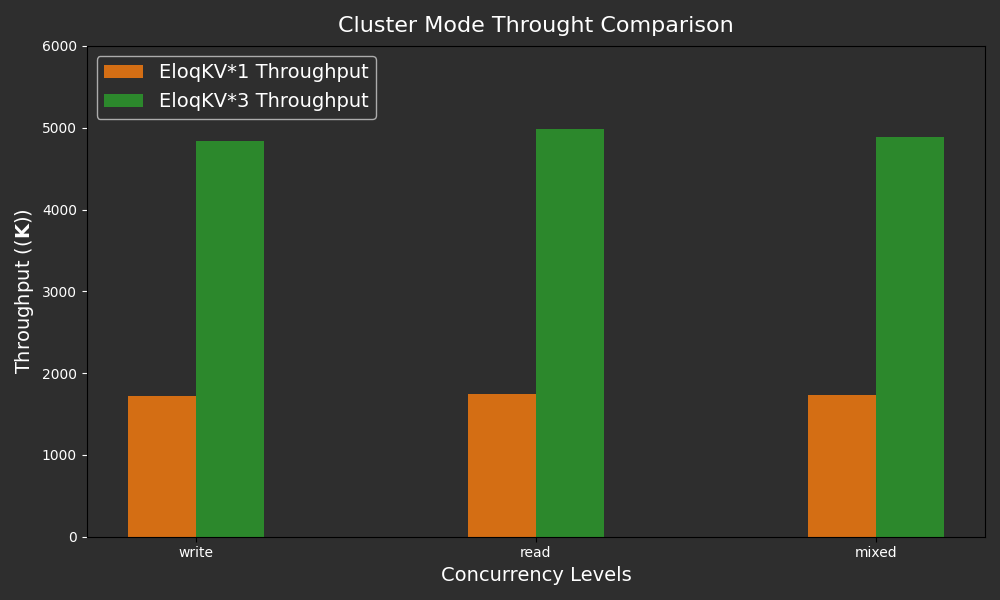

In previous blog, we benchmarked **EloqKV** to evaluate it as an in-memory cache, focusing on single-node performance. In this blog, we focus on a cluster of **Eloq** servers.

<!--truncate-->

All benchmarks were conducted on AWS (region: us-east-1) EC2 instances, with Ubuntu 22.04. Workloads were generated using the [memtier-benchmark](https://github.com/RedisLabs/memtier_benchmark) tool.

## EloqKV Cluster

For most real world applications that only needs KV cache, even single-threaded Redis is already [plenty fast](https://medium.com/hprog99/why-is-redis-incredibly-fast-unpacking-the-secrets-of-its-speed-f10f051b3f23). Indeed, more often than not, the limiting factor is actually memory capacity. In this case, KV caches have to be deployed as a _cluster_.

Most key-value caches support horizontal scaling and can operate in a _cluster mode_. They partition data into multiple slots and distribute the slots to each shards. In a horizontally scaled cluster, KV caches pretty much scales linearly, modulo load imbalances and failure cases. To achieve such scalability, application developers need to understand the concept of _"slots"_ and _"shards"_ and _"tags"_. And the so called _cluster-aware_ clients need to know the topology of the cluster and direct requests to the proper server where data reside.

Clustering for KV cache is notoriously full of pitfalls, not least because nodes in a cluster may fail. Sometimes external tools (such as [Sentinel](https://redis.io/docs/latest/operate/oss_and_stack/management/sentinel/), [Twemproxy](https://github.com/twitter/twemproxy), [Dragonfly Cloud services](https://www.dragonflydb.io/docs/managing-dragonfly/cluster-mode)) are used to monitor the health and perform fail-over for the cluster. How these tools' interact with the clients are often not well specified. Moreover, a cluster of kv cache nodes behaves differently from a single node kv cache server. For example, the "MULTI / EXEC" commands do not work in a KV cache cluster environment.

The fundmental reason is that many of the KV caches were first designed as a single node server, while clustering is often an afterthought and a bolt-on feature. For example, [Redis](https://en.wikipedia.org/wiki/Redis) was released on May, 2009, while Sentinel was officially supported in Redis 2.8 in December 2013. Redis Cluster was not a stable feature until Redis 3.0, released in April, 2015. Though [DragonflyDB](https://github.com/dragonflydb/dragonfly) was a re-thinking of the in-memory data store architecture not started till 2022, it was still designed as a _single node server_, not a distributed system. It is not cluster aware, and requires external mechinanary to scale out. The same can be said for many other similar kv stores.

**EloqKV** fully eliminates these issues as it was designed as a full blown distributed transactional database. **EloqKV** can work as a single node server while leveraging various clustering tools to provide horizontal scalability. In this mode, it can work with all the _"smart Redis clients"_ and provide the same scalability as other caching solutions. However, as a general purpose distributed database, a **EloqKV** cluster can also work as a whole, without exposing cluster details to the clients. A client can just interact with any node in an **EloqKV** cluster without worrying about whether the key is local to the server, how many servers are in the cluster, how data are sharded among the servers, whether there is a failure happening in the cluster, or whether the cluster is reconfiging to dynamically increase or reduce capacity.

We need to point out that even working as part of a cluster, each **EloqKV** node can still behave as a regular single node KV server. Therefore, the _"smart Redis clients"_ that need the cluster topology can still work as expected. A flag can be turned on so that **EloqKV** servers will follow Redis cluster prototol and will not redirect requests for data that is not local. Unlike most KV cache clusters, **EloqKV** cluster is _strongly consistent_. For example, a node knows if it is part of a cluster. If a node is dropped by other nodes from the cluster due to network partition, it will refuse to serve external requests.

However, in the general case, any node in a **EloqKV** cluster can serve as an entry point to requests. Obviously, shielding cluster details has cost. In particular, a node redirecting requests will cause an extra network round trip. In this section, we compare the performance of a single-node **EloqKV** instance with that of an **EloqKV** cluster to evaluate the scalability.

In this assessment, **EloqKV** operates in pure memory mode, with persistent storage and transactional features disabled.

### Hardware and Software Specification

**Server Machine:**

| Service type         | Node type    | Node count |
| -------------------- | ------------ | ---------- |
| EloqKV 0.6.9         | c7g.8xlarge  | 1          |
| EloqKV 0.6.9 Cluster | c7g.8xlarge  | 3          |
| Client - Memtier     | c6gn.8xlarge | 3          |

### Experiment:

We benchmarked a single-node **EloqKV** with different read-write ratios using the following command:

```
memtier_benchmark -t 32 -c 20 -s $server_ip -p $server_port --distinct-client-seed --ratio=$ratio --key-prefix="kv_" --key-minimum=1 --key-maximum=5000000 --random-data --data-size=128 --hide-histogram --test-time=300
```

To assess **EloqKV**’s scalability under different workloads, we ran memtier_benchmark in cluster mode with varying read-write ratios using the following configuration:

```
memtier_benchmark -t 32 -c 20 --cluster-mode -s $server_ip1 -p $server_port1 -s $server_ip2 -p $server_port2 -s $server_ip3 -p $server_port3 --distinct-client-seed --ratio=$ratio --key-prefix="kv_" --key-minimum=1 --key-maximum=5000000 --random-data --data-size=128 --hide-histogram --test-time=300
```

#### Results

Below are the results of **EloqKV**'s scalability benchmark, comparing the throughput between a single-node **EloqKV** and a three-node **EloqKV** cluster across various workloads.

X-axis: Represents the different workload types (read/write/mixed) used in the benchmark, simulating a range of real-world scenarios.

Y-axis: Measures the QPS (Queries Per Second).

<p align="center">
<div style={{ width: '720px', textAlign: 'center'}}>

</div>
</p>

As we can see, **EloqKV** three nodes cluster's throughput is almost three times higher than the single node **EloqKV** among different types of workload. It verify **EloqKV**'s capability to maintain performance as it scales horizontally. We can conclude that **EloqKV** is a robust cache solution, particularly well-suited for all kinds of workloads.
