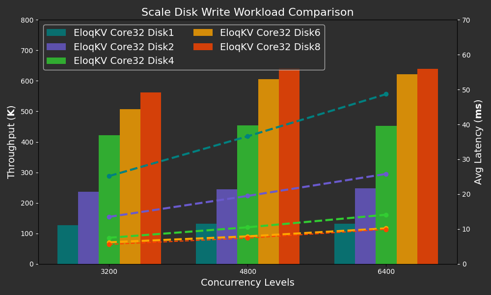
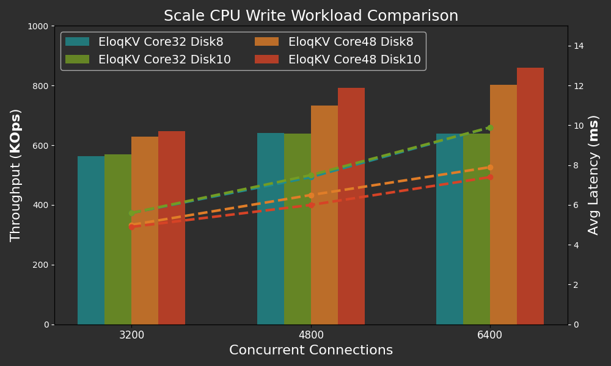

In our previous blog, we benchmarked **EloqKV** in memory cache mode, discussing both single-node and cluster performance. In this post, we delve into its write performance in transaction mode. The benchmarks were conducted using the memtier-benchmark tool.

<!--truncate-->

### Hardware and Software Specification

The benchmark was conducted on AWS (region: us-east-1) EC2 instances, with Ubuntu 22.04.

**Server Machine:**

| Service type     | Node type    | Node count | Gp3 EBS disk count |
| ---------------- | ------------ | ---------- | ------------------ |
| EloqKV TX 8x     | c7g.8xlarge  | 1          | 1                  |
| EloqKV TX 12x    | c7g.12xlarge | 1          | 1                  |
| EloqKV Log       | c7g.12xlarge | 1          | up to 10 WAL disks |
| client - Memtier | c6gn.8xlarge | 1          | 0                  |

EloqKV version 0.6.9 is used for the tests.

### Software Deployment and Configuration

Follow link [Deploy Single Node](/eloqkv/quick-start) to setup **EloqKV**. The Txservice and Logservice should be deployed on separate nodes.

Note: To enable transaction mode, please enable persistent storage and turn on WAL (Write-Ahead Logging).

```
# set it to none to turn off persistent storage for all databases
enable_data_store=all
# set it to none to turn off WAL for all databases
enable_wal=all
```

### Experiment:

We benchmarked **EloqKV** with varying core numbers and WAL disk counts using the following command:

```
memtier_benchmark -t 32 -c 20 -s $server_ip -p $server_port --distinct-client-seed --ratio=1:0 --key-prefix="kv_" --key-minimum=1 --key-maximum=5000000 --random-data --data-size=128 --hide-histogram --test-time=300
```

- Thread Number (-t): Specifies the number of threads for parallel execution, which we have set to a fixed value of 80.
- Client Number (-c): Represents the number of clients per thread. We configured it to 40, 60, 80, 100, and 120 to evaluate different concurrency levels. In our experiment, this resulted in total concurrency values of 3200, 4800, 6400, 8000, and 9600, calculated as `thread_num` × `client_num`.

#### Results

Below are the results of the write-only workload, which illustrates **EloqKV**'s throughput and latency with different disk and CPU core counts across varying thread numbers, simulating different levels of concurrent database access. The first graph shows how disk count impacts the performance of **EloqKV**.

X-axis: Represents the different workload types (read/write/mixed) used in the benchmark, simulating a range of real-world scenarios.

Y-axis: Measures the QPS (Queries Per Second).

<p align="center">
<div style={{ width: '640px', textAlign: 'center'}}>

</div>
</p>

From the results above, we can observe that as the number of disks increases, the throughput scales nearly linearly when the disk count is 1, 2, and 4, with a corresponding decrease in latency. However, adding more disks continues to boost throughput, but at a much slower rate. For 6 and 8 disks, the throughput levels off and remains nearly the same under high concurrency. This indicates that the disk is no longer the bottleneck, and attention should shift to increasing CPU resources to further improve throughput, as illustrated in the next graph.

The second graph shows how the number of CPU cores affects the performance of **EloqKV**.

<p align="center">
<div style={{ width: '640px', textAlign: 'center'}}>

</div>
</p>

As we can see, adding more disks beyond 8 on a 32-core CPU does not significantly increase throughput. However, by scaling the CPU from 32 to 48 cores, we can achieve a notable increase in throughput and a decrease in latency. Under heavy concurrency, latency decreases significantly from 10ms to under 8ms when more CPU cores are added. This demonstrates the advantage of **EloqKV**—the ability to scale the appropriate component when encountering a bottleneck.
