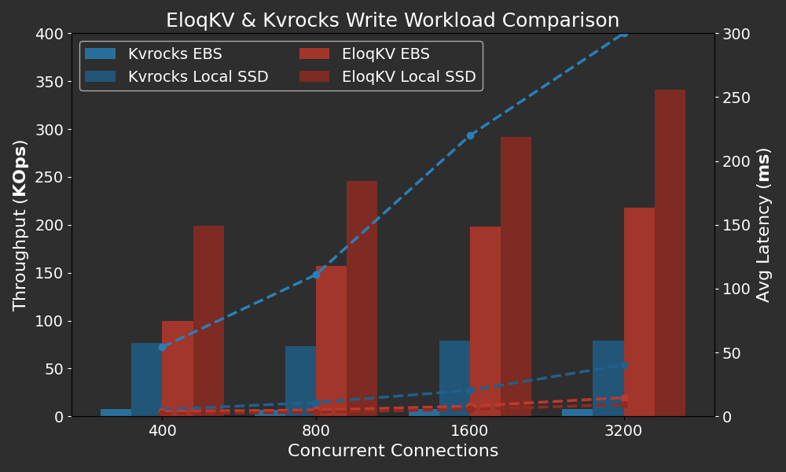

In our previous blogs, we benchmarked **EloqKV** in memory cache mode, discussing both [single node](/blog/2024/08/22/benchmark-single-node) and [cluster](/blog/2024/08/25/benchmark-cluster) performance. In this post, we delve into its write performance in transaction mode. In this blog, we first benchmark **EloqKV** when durability is enforced. In the next blog, we will benchmark it with distributed atomic operations with the Redis _WATCH / MULTI / EXEC_ commands.

<!--truncate-->

All benchmarks were conducted on AWS (region: us-east-1) EC2 instances, with Ubuntu 22.04. Workloads were generated using the [memtier-benchmark](https://github.com/RedisLabs/memtier_benchmark) tool. In all tests, we use EloqKV version 0.6.9.

### Comparing with Kvrocks

In the first experiment, we compare EloqKV with Apache [Kvrocks](https://kvrocks.apache.org/), a Redis-compatible NoSQL database that supports persistence. We evaluate the performance of EloqKV and Kvrocks under write-intensive workloads. To ensure data durability, we enable fsync Write-Ahead Logging (WAL) for both databases. For EloqKV, both the transaction service and log service are deployed on the same node (c7gi.8xlarge). To fully utilize available disk IO, we start two LogService processes to write WAL logs in EloqKV.

### Hardware and Software Specification

**Server Machine:**

| Service type | Node type    | Node count | Local SSD       | EBS gp3 volume |
| ------------ | ------------ | ---------- | --------------- | -------------- |
| Kvrocks      | c7gd.8xlarge | 1          | 1 x 1900GB NVME | 1              |
| EloqKV       | c7gd.8xlarge | 1          | 1 x 1900GB NVME | 1              |

For EloqKV, to enable transaction mode, we enable persistent storage and turn on WAL (Write-Ahead Logging).

```
# set it to none to turn off persistent storage for all databases
enable_data_store=all
# set it to none to turn off WAL for all databases
enable_wal=all
```

For Kvrocks, we mainly changed two configuration options.

```
# If yes, the write will be flushed from the operating system
# buffer cache before the write is considered complete.
# If this flag is enabled, writes will be slower.
# If this flag is disabled, and the machine crashes, some recent
# writes may be lost.  Note that if it is just the process that
# crashes (i.e., the machine does not reboot), no writes will be
# lost even if sync==false.
#
# Default: no
# rocksdb.write_options.sync no
rocksdb.write_options.sync yes

# The number of worker's threads, increase or decrease would affect the performance.
# workers 8
workers 24
```

Disk performance plays a critical role in write-intensive workloads. Therefore, we conduct benchmarks using both local SSDs and Elastic Block Store (EBS), which are commonly used as WAL log disks in cloud environments. Local SSDs offer low latency and high IOPS, making them ideal for high-performance needs. However, in a cloud setup local data will be lost if the virtual machine (VM) is stopped. On the other hand, EBS provides high availability, allowing the volume to be attached to a new VM if the original VM fails. Moreover, EBS is elastic, enabling precise control over disk size and number to better suit specific requirements. In our case, a 50GB [EBS gp3](https://aws.amazon.com/ebs/volume-types/) volume is plenty for our WAL needs. Such a volume only cost $4 per month while providing 3000 IOPS and 125 MB/s throughput. Given the distinct advantages and limitations of local SSDs and EBS, we conduct our experiments using both types of disks.

We run `memtier_benchmark` with the following configuration:

```
memtier_benchmark -t $thread_num -c $client_num -s $server_ip -p $server_port --distinct-client-seed --ratio=$ratio --key-prefix="kv_" --key-minimum=1 --key-maximum=5000000 --random-data --data-size=128 --hide-histogram --test-time=300
```

- `-t`: Number of threads for parallel execution, which we set to 80.

- `-c`: Number of clients per thread. We set it to 5, 10, 20, 40 to evaluate different concurrency levels. This resulted in total concurrency values of 400, 800, 1600, and 3200, calculated as `thread_num × client_num`.
- `--ratio`: Put\:Get ratio is set to 1:0 for write-only workload.

#### Results

Below are the results of the write-only workload.

X-axis: Represents the varying concurrencies (`thread_num × client_num`), simulating different levels of concurrent database access.

Left Y-axis: Throughput in Thousand QPS (Queries Per Second).

Right Y-axis: 99.9 Percentile latency in milli seconds (ms).

<p align="center">
<div style={{ width: '720px', textAlign: 'center'}}>

</div>
</p>

The results show that EloqKV significantly outperforms Kvrocks on both EBS and local SSD. On EBS, EloqKV achieves a write throughput that is 10 times higher than Kvrocks, while on local SSD, it is 2-4 times faster. This performance improvement is due to EloqKV's architecture, which decouples transaction and log services, allowing multiple log workers to write Write-Ahead Logs (WAL) and perform fsync operations in parallel, thereby enhancing overall throughput. Additionally, EloqKV maintains significantly lower latency compared to Kvrocks, even under high concurrency.

### Experiment II: Scaling Disks of WAL

EloqKV's decoupled WAL log service can deploy multiple log workers writing WAL logs to multiple disks. Since WAL logs can be truncated once a checkpoint is completed, the required disk size is often quite small.

Kvrocks does not support writing redo logs across multiple disks, so this experiment is conducted with **EloqKV** only. We benchmarked EloqKV with different numbers of WAL disks and varying thread counts using the following command:

**Server Machine:**

| Service type     | Node type    | Node count | EBS gp3 volume |
| ---------------- | ------------ | ---------- | -------------- |
| EloqKV Log       | c7g.12xlarge | 1          | up to 10       |
| client - Memtier | c6gn.8xlarge | 1          | 0              |

Workload is driven by memtier_benchmark.

```
memtier_benchmark -t $thread_num -c $client_num -s $server_ip -p $server_port --distinct-client-seed --ratio=1:0 --key-prefix="kv_" --key-minimum=1 --key-maximum=5000000 --random-data --data-size=128 --hide-histogram --test-time=300
```

- `-t`: Number of threads for parallel execution, which we have set to a fixed value of 80.
- `-c`: Number of clients per thread. We configured it to 40, 60 and 80, this resulted in total concurrency values of 3200, 4800 and 6400, calculated as `thread_num × client_num`.

Notice that in this experiment, we have a higher concurrency compared with previous experiments, due to increased latency caused by seperating LogService from TxService.

#### Results

Below are the results illustrates **EloqKV**'s throughput and latency with different number of disks with varying concurrencies simulating different levels of concurrent database access. The following graph shows how disk count impacts the performance of **EloqKV**.

X-axis: Represents the varying thread numbers employed during the benchmark, simulating different levels of concurrent database access.

Left Y-axis: The throughput in Thousand Queries Per Second (KQPS)

Right Y-axis: The average Latency in ms.

<p align="center">
<div style={{ width: '720px', textAlign: 'center'}}>

</div>
</p>

From the results above, we can observe that as the number of disks increases, the throughput scales near linearly when the disk count is 1, 2, and 4, with a corresponding decrease in latency. Adding even more disks continues to boost throughput, but at a slower rate. For 6 and 8 disks, the throughput levels off and remains nearly the same even under high concurrency. This indicates that the disk is no longer the bottleneck.

### Experiment III: Scaling Up TxServer

As observed in the experiment above, throughput does not increase further when the number of disks exceeds six. This indicates that logging is no longer the bottleneck; to achieve even higher throughput, scaling up the CPU in TxServer could be the next step. Obviously, scaling-out could be another option, but we will leave that to another blog.

**Server Machine:**

| Service type  | Node type    | Node count | EBS gp3 volume |
| ------------- | ------------ | ---------- | -------------- |
| EloqKV TX 8x  | c7gi.8xlarge | 1          | 1              |
| EloqKV TX 12x | c7g.12xlarge | 1          | 1              |

#### Result

The following graph shows how the number of CPU cores affects the performance of **EloqKV** as we have many disks providing logging IOPs.

<p align="center">
<div style={{ width: '720px', textAlign: 'center'}}>

</div>
</p>

Adding more disks beyond 8 on a 32-vcore CPU does not significantly increase throughput. By scaling up the CPU of TxServer from 32 to 48 vcores, we can achieve a notable increase in throughput and a decrease in latency. Under heavy concurrency, latency decreases significantly from 10ms to under 8ms when more CPU cores are added.

### Analysis and Conclusion

In this blog, we evaluate **EloqKV** and show its performance when data durability is strongly enforced. With reasonable hardware, **EloqKV** can sustain over 100,000 writes per second with acceptable latency. While this is lower than the pure in-memory cache performance highlighted in our [previous blog](/blog/2024/08/17/benchmark), it remains quite suitable for many real-world applications. In fact, when **EloqKV** is used as a durable data store, its performance is comparable to Redis in pure memory mode on similar hardware.

Additionally, we showcase **EloqKV**'s architectural advantage by scaling the LogService to enhance write throughput while maintaining resources used by the TxService. This capability is made possible by our revolutionary [Data Substrate](/blog/2024/08/11/data-substrate) architecture. Imaging scenarios where, despite high volume of updates, the total data volume can easily fit on a single server's memory. **EloqKV**'s full scalability is crucial to support such applications without wasting valuable resources.
