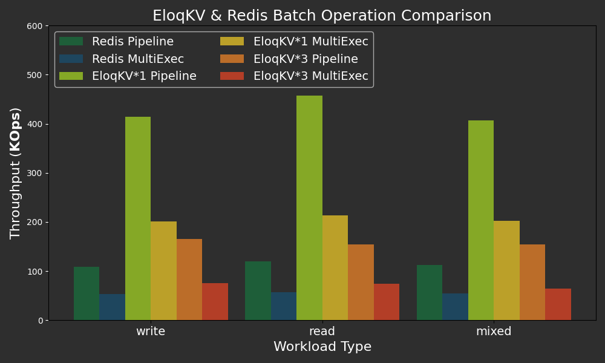

In the previous blogs, we discussed the [ACID feature](/blog/2024/08/25/benchmark-txlog) of **EloqKV** and benchmarked the write performance of **EloqKV** with the Write-Ahead-Log enabled. In this blog, we will continue to explore the transaction capabilities of **EloqKV** and demonstrate the performance of distributed atomic operations using the Redis _WATCH / MULTI / EXEC_ commands.

<!--truncate-->

All benchmarks were conducted on AWS (region: us-east-1) EC2 instances, with Ubuntu 22.04. Workloads were generated using the [memtier-benchmark](https://github.com/RedisLabs/memtier_benchmark) tool. In all tests, we use **EloqKV** version 0.6.9.

### Distributed Atomic Operations

In the first experiment, we compare EloqKV and Redis in batch mode across different workloads. We focus on two batch modes:

1. Pipeline Mode: In this mode, the client sends multiple commands to the server without waiting for responses to previous commands. The server processes these commands sequentially and returns all the responses at once. This approach significantly reduces network communication time, especially when executing many commands.

2. WATCH / MULTI / EXEC Command Mode: This mode ensures that a group of commands is executed as a single atomic operation, meaning either all commands are executed or none are.

Typically, pipeline mode offers higher performance compared to MULTI / EXEC due to the absence of atomicity overhead. However, our experiment demonstrates that while MULTI / EXEC is slower than pipeline mode, it still achieves more than one million operations per key, which is more than sufficient for most workloads. Performance is not the main barrier to implementing atomic operations in caching solutions. The real challenge lies in Redis's limitation on cross-shard MULTI / EXEC commands in a cluster, requiring applications to use hashtag to ensure all keys in a MULTI / EXEC command reside in the same shard.

EloqKV overcomes this limitation by natively supporting cross-shard MULTI / EXEC commands and distributed transactions. This allows users to benefit from transactional guarantees in an EloqKV cluster just as they would on a single EloqKV node.

In the following experiment, **EloqKV** operates in pure memory mode, with persistent storage and transactional features disabled.

### Hardware and Software Specification

**Server Machine:**

| Service type         | Node type    | Node count |
| -------------------- | ------------ | ---------- |
| EloqKV 0.6.9         | c7g.8xlarge  | 1          |
| EloqKV 0.6.9 Cluster | c7g.8xlarge  | 3          |
| Redis 7.2.5          | c7g.8xlarge  | 1          |
| Client - Memtier     | c6gn.8xlarge | 3          |

### Experiment:

We developed a new benchmarking tool, `eloq_benchmark`, specifically to test the transaction performance of Redis and EloqKV, as memtier_benchmark does not support `MultiExec`. You can download `eloq_benchmark` from [here](/blog/2024/08/25/benchmark-txlog).

We run `eloq_benchmark` with the following configuration:

```
eloq_benchmark --NumConnections=$conn -h $server_ip -p $server_port --GetRatio=$ratio --OpType=$optype --BatchSize=$batchsize --NumKeys=$keynum
```

- `--NumConnections`: Number of concurrent connnections, which is set to 256 for single-node and 768 for three-node cluster.

- `--GetRatio`: Set it to 0 for write-only workload, 0.5 for mixed workload and 1 for read-only workload.

- `--OpType`: Set batch mode, set it to `pipeline` for pipeline mode, set it to `tx` for `MutilExec` atomic mode.

- `--BatchSize`: Number of keys in a batch command, which we set to 6.

- `--NumKeys`: Number of keys, which is set to 1000000.

#### Results

Below are the performance results of batch mode of Redis and EloqKV among various workload.

X-axis: Represents the different workload types (read/write/mixed) used in the benchmark, simulating a range of real-world scenarios.

Y-axis: Throughput in Thousand OPS (Operations Per Second).

<p align="center">
<div style={{ width: '720px', textAlign: 'center'}}>

</div>
</p>

The results demonstrate that EloqKV significantly outperforms Redis in both pipeline and MultiExec atomic modes on a single node. In this comparison, a fixed batch size of 6 keys was used, with EloqKV achieving a throughput exceeding 100 million operations per key in atomic mode. Although this throughput is lower than that in pipeline mode, it is sufficient for most workloads while preserving atomic se
However, memory capacity can become a bottleneck, necessitating a cluster solution for handling larger datasets. Notably, Redis `MultiExec` is not supported in cluster mode if keys in a single batch are distributed across different shards. To work around this, users must use key `hashtags` to ensure all keys in a batch are located on the same shard, which can be cumbersome. EloqKV, on the other hand, does not have this limitation. It allows you to scale memory capacity seamlessly and maintain transactional integrity across a cluster, just as if you were operating on a single node.

It's worth mentioning that the throughput of a three-node EloqKV cluster is lower than that of a single-node EloqKV. This reduction is attributed to the additional network round trips and scheduling overhead introduced by automatic request redirection. We are actively working on optimizing network costs in future EloqKV releases.

### Analysis and Conclusion
