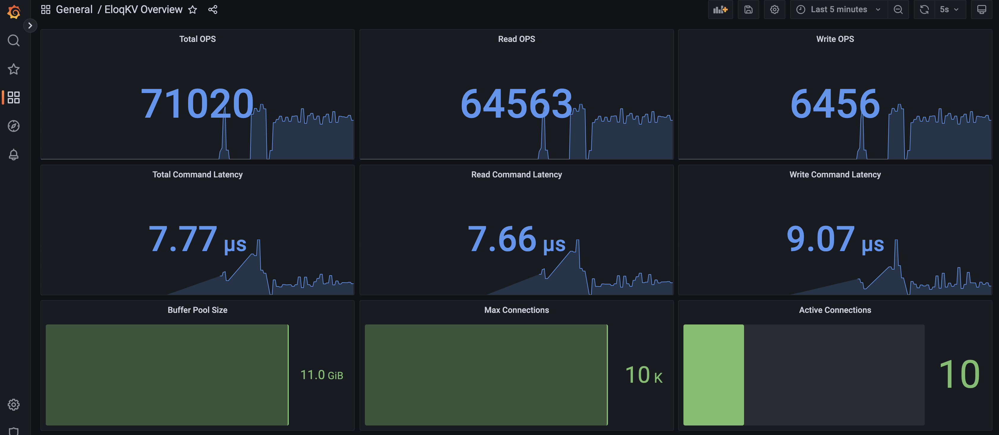
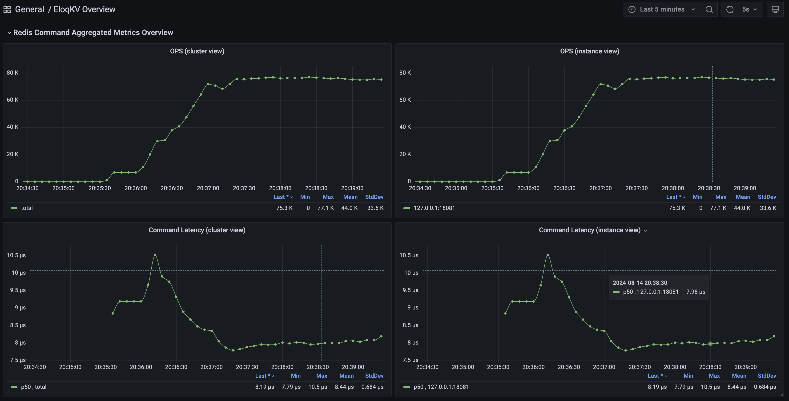

# EloqKV 监控概述

**EloqKV** 监控框架是维护和优化 EloqKV 分布式键值存储性能和可靠性的重要组成部分。监控对于了解系统健康状况、诊断问题以及做出有关扩展和优化的明智决策至关重要。为了实现全面监控,EloqKV 集成了两个广泛使用的开源项目:**Prometheus** 和 **Grafana**。

**Prometheus** 用于收集、存储和查询监控和性能指标。它是一个强大的时间序列数据库,擅长处理高基数和维度数据,非常适合像 EloqKV 这样的分布式系统。**Grafana** 用于可视化这些指标,提供了一个强大而灵活的平台来创建动态和交互式仪表板。

## 组件概述

### Prometheus: 数据收集和存储

Prometheus 在 EloqKV 监控框架中扮演着关键角色,通过定期从 EloqKV 服务器拉取数据来收集和存储与系统性能各个方面相关的时间序列数据。

**Prometheus 收集的关键指标**

- 集群节点信息: Prometheus 收集有关 EloqKV 集群中每个节点的信息。
- 每秒命令操作数(OPS): 此指标跟踪 EloqKV 集群每秒处理的命令数,提供系统负载和响应能力的洞察。
- 命令延迟: 测量处理并发命令所需的时间,有助于识别性能瓶颈并优化系统效率。
- 内存使用: Prometheus 监控每个节点上 EloqKV 消耗的内存。
- 缓存命中率: 此指标显示从缓存服务的请求与需要持久化数据存储查找的请求的百分比。
- 远程请求延迟: 跟踪需要与远程进程或节点通信的请求所需的时间,即 WAL 日志延迟或远程读取请求。

### Grafana: 可视化和仪表板

Grafana 作为 EloqKV 监控框架的可视化层。它提供了一个灵活而强大的界面,可以基于 Prometheus 收集的数据创建、探索和共享仪表板。Grafana 丰富的功能集允许用户通过交互式和动态可视化将原始数据转化为有意义的洞察。

EloqKV 监控中的 Grafana 功能

- 自定义仪表板: Grafana 允许基于预定义的仪表板创建定制仪表板,这些预定义仪表板已经包括节点健康状况、命令吞吐量和延迟以及内存使用趋势的实时监控。
- 交互式探索: Grafana 的仪表板允许用户深入研究指标、应用过滤器并在不同时间范围内探索数据,使诊断问题和发现趋势变得更容易。

以下是 EloqKV Grafana 界面的示例:

import EnlargeableImage from '@site/src/pages/enlarge_pic';

<EnlargeableImage src={require('./media/grafana1.png').default} alt="EloqKV Grafana 1" />

<EnlargeableImage src={require('./media/grafana2.png').default} alt="EloqKV Grafana 2" />

<!-- 

 -->
