# client connection

This document describes how to use a client other than a terminal to connect to EloqSQL.

The document operating environment is

- win11 operating system

Examples of client connections include but are not limited to the following:

- Navicat
- Oracle MySQL Workbench
- SQLyog

1. [Navicat](https://navicat.com/en/products)
   Download and install the Navicat for MySQL client installation package of the corresponding operating system.
   
   Open the Navicat client and create a MariaDB connection
   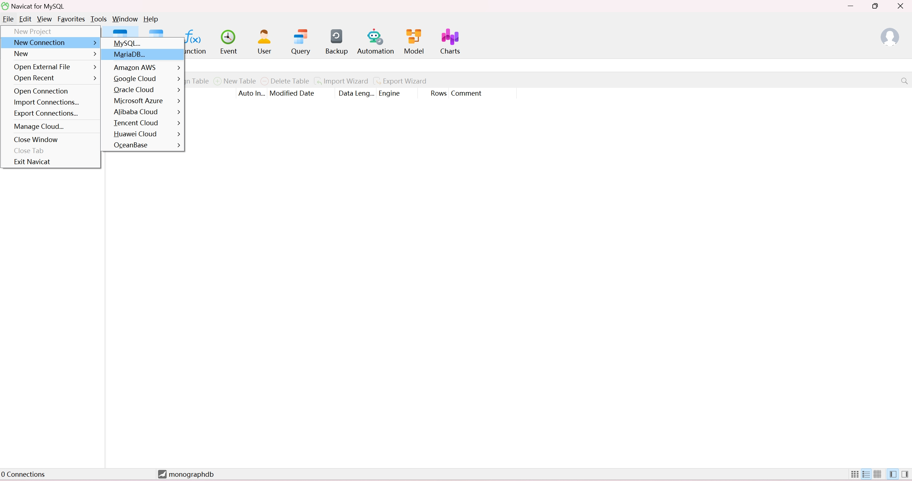
   Enter the IP of the server (Host) where the database is located, the port (Port) number (3300 by default), the database user name (User Name) is `mono` and the user password set when creating the user to complete the connection settings .
   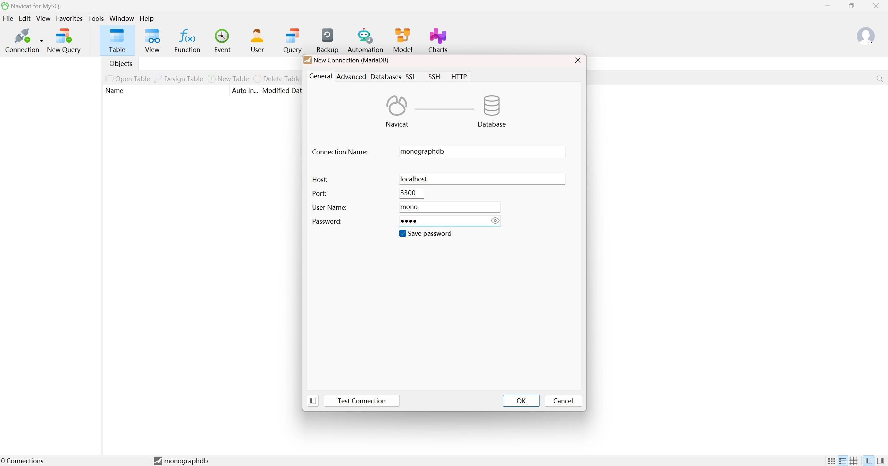
   After the test connection is successful, save the connection and create a new query
   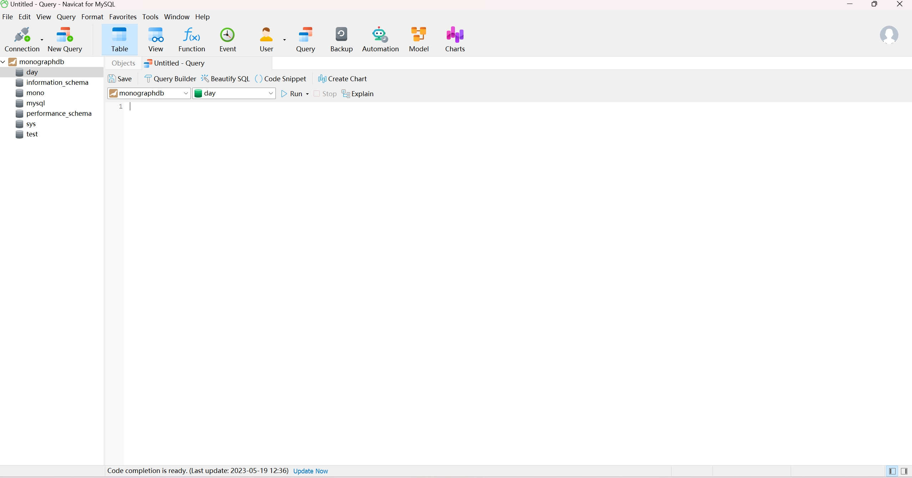
   Write the SQL statement and click Run, it runs successfully.
   

2. [Oracle MySQL Workbench](https://dev.mysql.com/downloads/file/?id=517975)
   Download and install the Mysql Workbench client installation package from the official website.
   Open the Mysql Workbench client and create a new Mysql connection.
   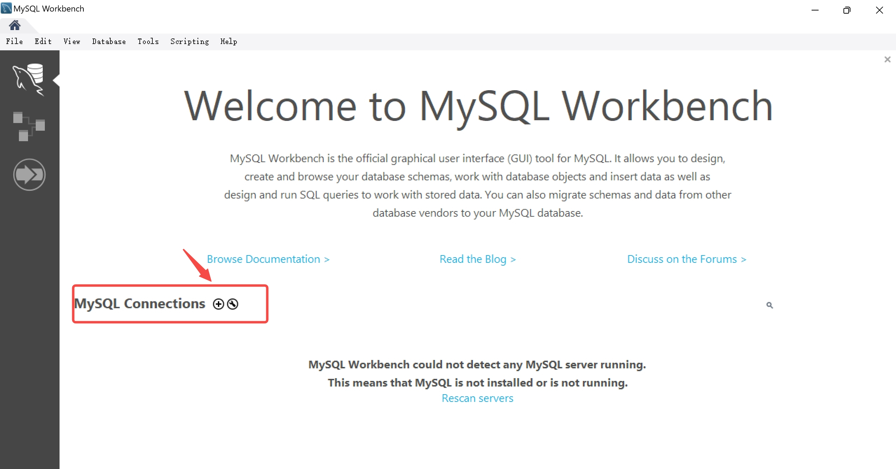
   Enter the IP of the server (Host) where the database is located, the port (Port) number (3300 by default), the database user name (User Name) is `mono` and the user password set when creating the user to complete the connection settings .
   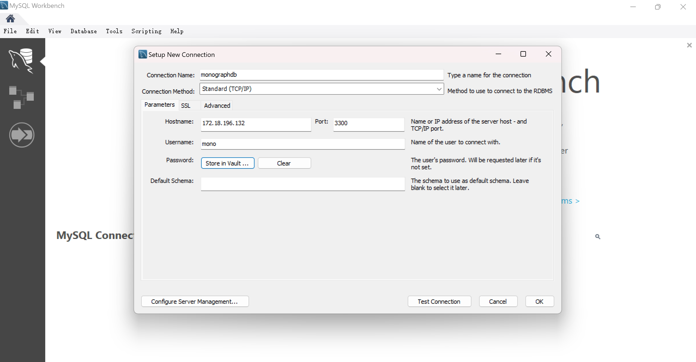
   connection succeeded
   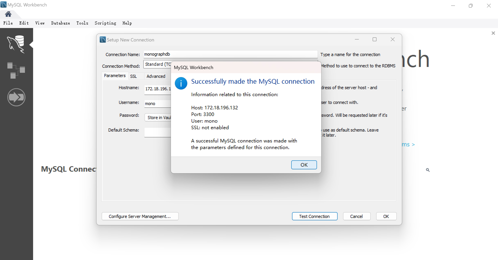
   Create a new query, write a SQL statement and click Run.
   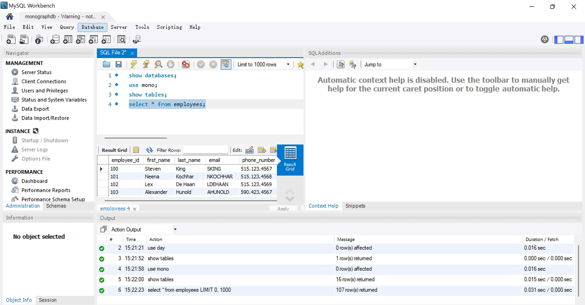

3. [SQLyog](https://webyog.com/product/sqlyog/)

Download and install the SQLyog installation package for the corresponding operating system.
Open the SQLyog client and create a new connection
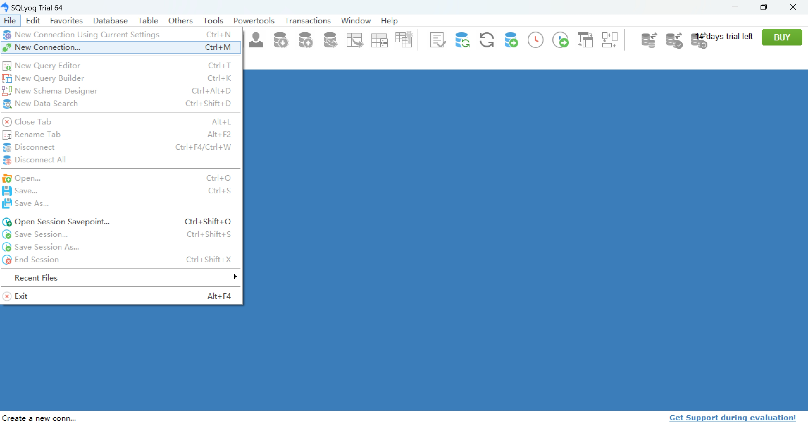
Enter the IP of the server (Host) where the database is located, the port (Port) number (3300 by default), the database user name (User Name) is `mono` and the user password set when creating the user to complete the connection settings .
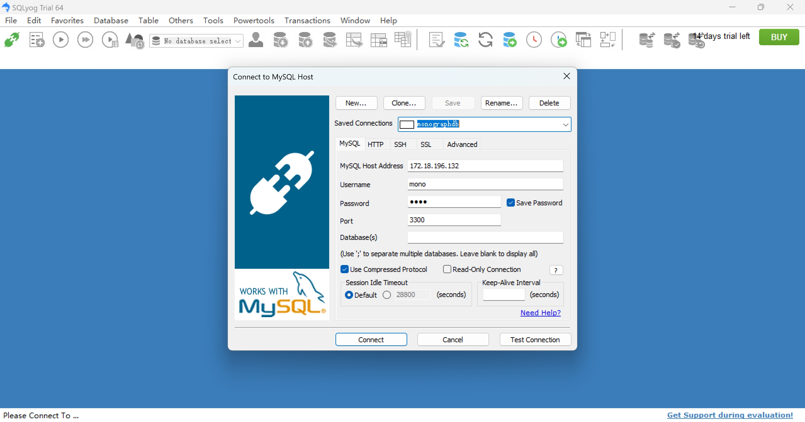
connection succeeded
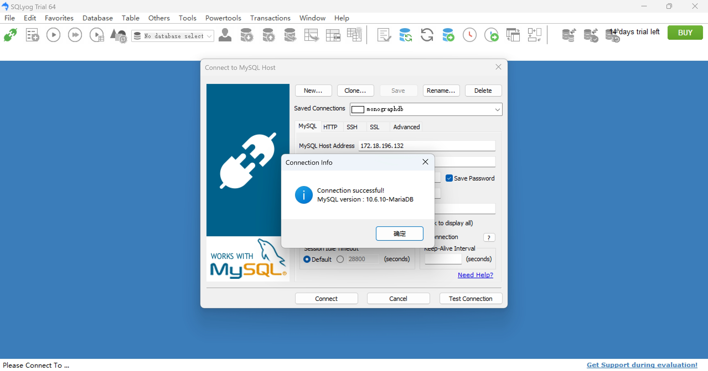
Create a new query, write a SQL statement and click Run.
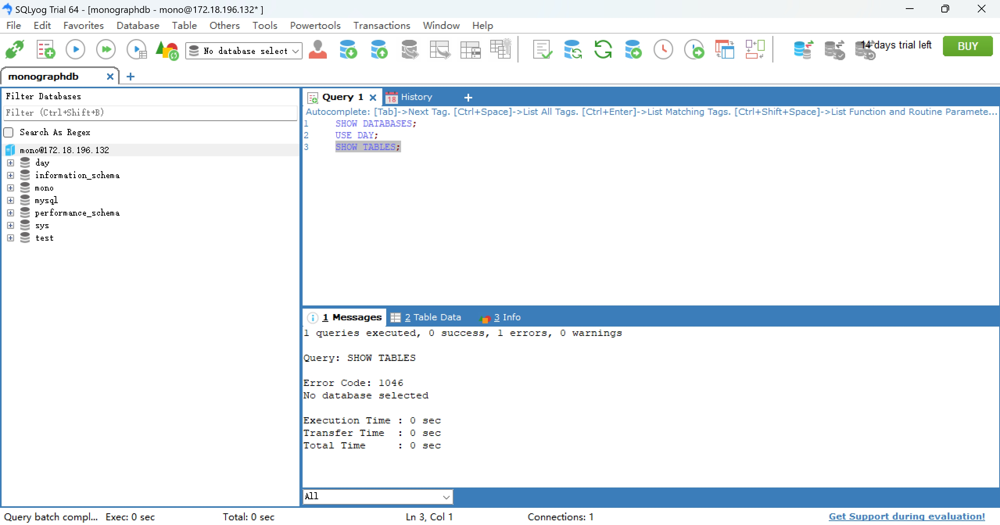
