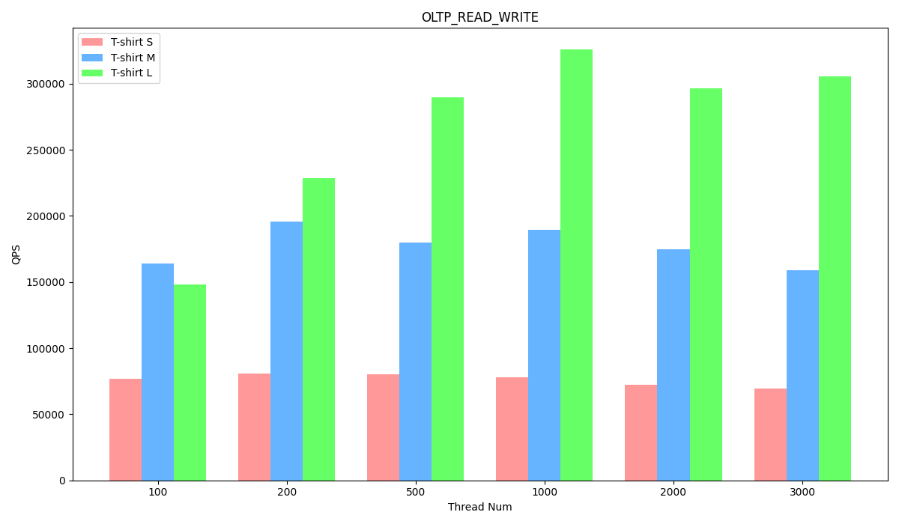

# Sysbench 性能测试报告

## 测试环境 (GCP)

### 硬件配置

本测试旨在评估 EloqSQL 在不同集群规模下的可伸缩性和性能，集群规模分别为：

1. T-Shirt S: 单 txservice 节点低 CPU 配置，16vcore。
2. T-Shirt M: 单 txservice 节点高 CPU 配置，48vcore。
3. T-Shirt L: 三 txservice 节点高 CPU 配置，48vcore。

从 T-Shirt S 到 T-Shirt M 验证 MonogrpahDB 的 scale up 能力，从 T-Shirt M 到 T-Shirt L 验证 MonogrpahDB 的 scale out 能力。传统 DB 在 scale up 的时候无法提升写入能力，因为磁盘往往成为系统瓶颈，但是 EloqSQL 支持水平扩展 logservice，并发写入多块磁盘，因此具有优秀的写入负载 scale up 的能力。

以下是机器配置的详细信息：

T-Shirt Size: S

| Service type | EC2 type       | Node count | SSD count |
| ------------ | -------------- | ---------- | --------- |
| txservice    | n2-standard-16 | 1          | 1         |
| logservice   | n2-standard-8  | 1          | 3         |
| cassandra    | n2-standard-16 | 1          | 1         |
| sysbench     | n2-standard-32 | 1          | 1         |

T-Shirt Size: M

| Service type | EC2 type       | Node count | SSD count |
| ------------ | -------------- | ---------- | --------- |
| txservice    | n2-standard-48 | 1          | 1         |
| logservice   | n2-standard-8  | 1          | 3         |
| cassandra    | n2-standard-16 | 1          | 1         |
| sysbench     | n2-standard-32 | 1          | 1         |

T-Shirt Size: L

| Service type | EC2 type       | Node count | SSD count |
| ------------ | -------------- | ---------- | --------- |
| txservice    | n2-standard-48 | 3          | 1         |
| logservice   | n2-standard-16 | 1          | 6         |
| cassandra    | n2-standard-16 | 1          | 1         |
| sysbench     | n2-standard-32 | 1          | 1         |

### 软件版本

| Service type | Software version |
| ------------ | ---------------- |
| EloqSQL      | 0.3.0            |
| Sysbench     | 1.0.20_2         |
| OS           | Ubuntu20.04      |

### 参数配置

**EloqSQL 参数配置**

T-Shirt Size: S

```
max_connections=5000
mariadb_thread_pool_size=6
eloq_core_num=6
eloq_node_memory_limit=32000
```

T-Shirt Size: M

```
max_connections=5000
mariadb_thread_pool_size=16
eloq_core_num=16
eloq_node_memory_limit=96000
```

T-Shirt Size: L

```
max_connections=5000
mariadb_thread_pool_size=16
eloq_core_num=16
eloq_node_memory_limit=96000
```

## 准备测试数据

请首先在 sysbench 节点安装 [haproxy](https://www.haproxy.org/)，并使用 haproxy 连接多个 txservice 节点。

执行下面命令准备 sysbench 数据。端口 3390 由 haproxy 使用。

```
sysbench /usr/share/sysbench/oltp_common.lua --mysql_storage_engine=eloq --tables=10 --table_size=1000000 --mysql-user=sysbench_test --mysql-password=sysbench123 --mysql-host=127.0.0.1 --mysql-port=3390 --mysql-db=sbtest --threads=100 --report-interval=10 --auto_inc=off prepare
```

## 执行测试

执行下面命令进行不同 sysbench workload 的测试：

其中`test_name`包括: oltp_point_select/oltp_write_only/oltp_read_write。`thread_num`包括: 100/200/500/1000/2000/3000

```
sysbench /usr/share/sysbench/$testname.lua --mysql_storage_engine=eloq --tables=10 --table_size=1000000 --mysql-user=sysbench_test --mysql-password=sysbench123 --mysql-host=127.0.0.1 --mysql-port=3390 --mysql-db=sbtest --time=60 --threads=$threadnum --report-interval=10 --mysql-ignore-errors=all --rand-type=special --auto_inc=off --range_selects=true run
```

下面的测试结果显示 EloqSQL 在只读场景下具有近乎线性的水平扩展能力，写入流量大场景具有非常好的单机性能以及垂直和水平扩展能力。

**OLTP_POINT_SELECT Performance**

T-Shirt Size: S

| Thread Num | TPS       | QPS       | 95th percentile |
| ---------- | --------- | --------- | --------------- |
| 100        | 145709.23 | 145709.23 | 0.97            |
| 200        | 147126.59 | 147126.59 | 2.11            |
| 500        | 120378.40 | 120378.40 | 5.18            |
| 1000       | 113480.04 | 113480.04 | 10.27           |
| 2000       | 111825.66 | 111825.66 | 19.65           |
| 3000       | 111853.52 | 111853.52 | 29.19           |

T-Shirt Size: M

| Thread Num | TPS       | QPS       | 95th percentile |
| ---------- | --------- | --------- | --------------- |
| 100        | 378984.20 | 378984.20 | 0.36            |
| 200        | 381346.88 | 381346.88 | 0.75            |
| 500        | 376213.56 | 376213.56 | 2.11            |
| 1000       | 339065.83 | 339065.83 | 3.96            |
| 2000       | 306995.35 | 306995.35 | 8.13            |
| 3000       | 293260.17 | 293260.17 | 11.87           |

T-Shirt Size: L

| Thread Num | TPS       | QPS       | 95th percentile |
| ---------- | --------- | --------- | --------------- |
| 100        | 300504.05 | 300504.05 | 0.50            |
| 200        | 512275.19 | 512275.19 | 0.58            |
| 500        | 750484.17 | 750484.17 | 1.18            |
| 1000       | 859885.48 | 859885.48 | 2.26            |
| 2000       | 854481.67 | 854481.67 | 4.65            |
| 3000       | 812597.52 | 812597.52 | 6.09            |


**OLTP_WRITE_ONLY Performance**

T-Shirt Size: S

| Thread Num | TPS      | QPS       | 95th percentile |
| ---------- | -------- | --------- | --------------- |
| 100        | 18969.98 | 114024.78 | 6.79            |
| 200        | 20285.62 | 122059.31 | 14.21           |
| 500        | 19608.02 | 118383.20 | 36.89           |
| 1000       | 18738.20 | 113850.77 | 77.19           |
| 2000       | 18228.53 | 111994.08 | 158.63          |
| 3000       | 19035.88 | 118349.57 | 227.40          |

T-Shirt Size: M

| Thread Num | TPS      | QPS       | 95th percentile |
| ---------- | -------- | --------- | --------------- |
| 100        | 22495.50 | 135235.11 | 5.47            |
| 200        | 38246.14 | 230340.29 | 6.32            |
| 500        | 55957.52 | 338667.67 | 11.65           |
| 1000       | 55699.45 | 339019.13 | 23.52           |
| 2000       | 50350.94 | 309962.83 | 63.32           |
| 3000       | 49213.04 | 306280.23 | 101.13          |

T-Shirt Size: L

| Thread Num | TPS      | QPS       | 95th percentile |
| ---------- | -------- | --------- | --------------- |
| 100        | 21873.79 | 131499.62 | 5.47            |
| 200        | 38271.08 | 230439.25 | 6.21            |
| 500        | 60839.96 | 368035.89 | 11.87           |
| 1000       | 71618.89 | 436397.47 | 21.89           |
| 2000       | 76147.14 | 470420.96 | 43.39           |
| 3000       | 78195.09 | 489690.61 | 62.19           |


**OLTP_READ_WRITE Performance**

T-Shirt Size: S

| Thread Num | TPS     | QPS      | 95th percentile |
| ---------- | ------- | -------- | --------------- |
| 100        | 3839.92 | 76893.95 | 31.94           |
| 200        | 4020.89 | 80552.95 | 58.92           |
| 500        | 3999.69 | 80425.53 | 150.29          |
| 1000       | 3854.17 | 77794.61 | 308.84          |
| 2000       | 3572.60 | 72579.76 | 601.29          |
| 3000       | 3393.22 | 69706.56 | 926.33          |

T-Shirt Size: M

| Thread Num | TPS     | QPS       | 95th percentile |
| ---------- | ------- | --------- | --------------- |
| 100        | 8199.31 | 164273.10 | 17.01           |
| 200        | 9759.38 | 195694.06 | 25.74           |
| 500        | 8960.47 | 179847.43 | 376.49          |
| 1000       | 9413.23 | 189506.90 | 816.63          |
| 2000       | 8619.23 | 174610.38 | 419.45          |
| 3000       | 7879.51 | 159079.63 | 4280.32         |

T-Shirt Size: L

| Thread Num | TPS      | QPS       | 95th percentile |
| ---------- | -------- | --------- | --------------- |
| 100        | 7410.98  | 148413.65 | 16.12           |
| 200        | 11409.70 | 228829.64 | 23.52           |
| 500        | 14427.15 | 289716.38 | 45.79           |
| 1000       | 16198.52 | 326014.85 | 90.78           |
| 2000       | 14696.28 | 296302.22 | 240.02          |
| 3000       | 15133.48 | 305691.68 | 287.38          |


