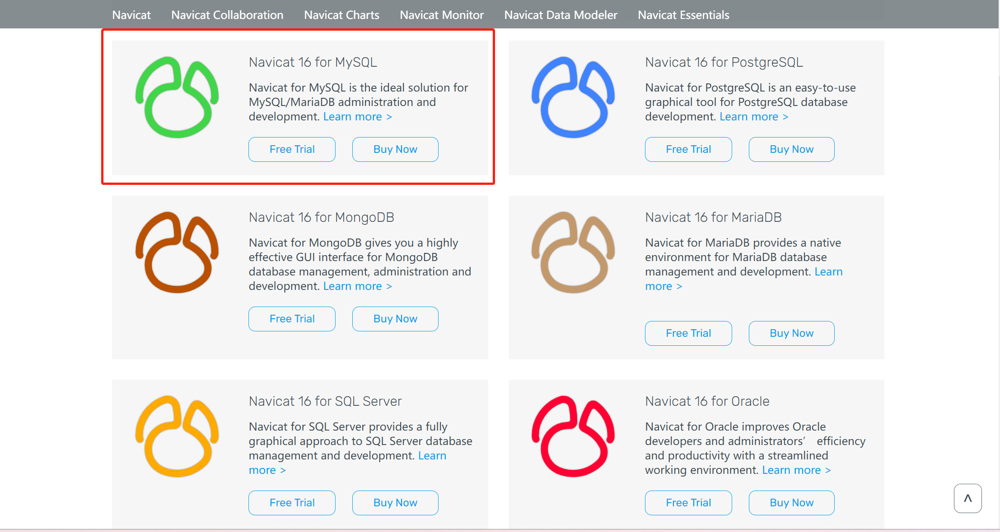
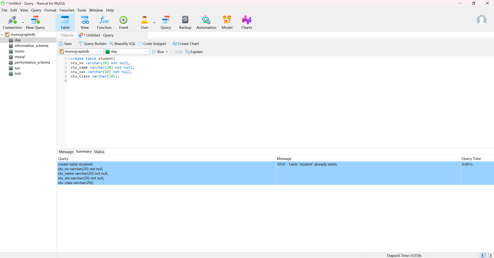
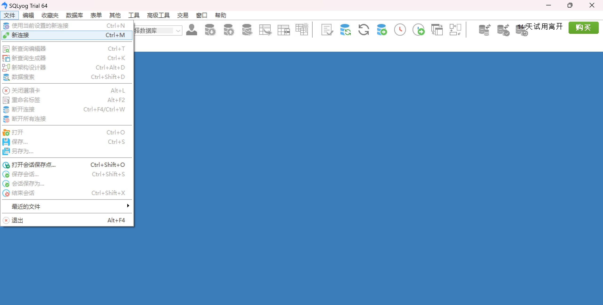
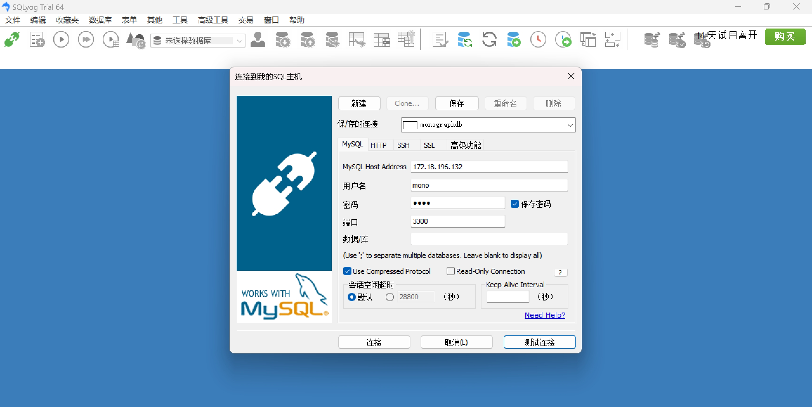
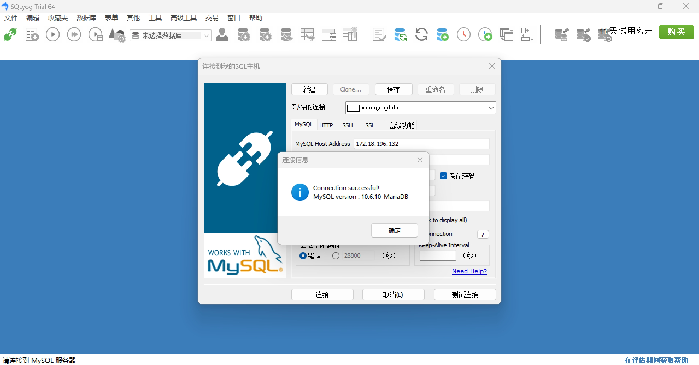
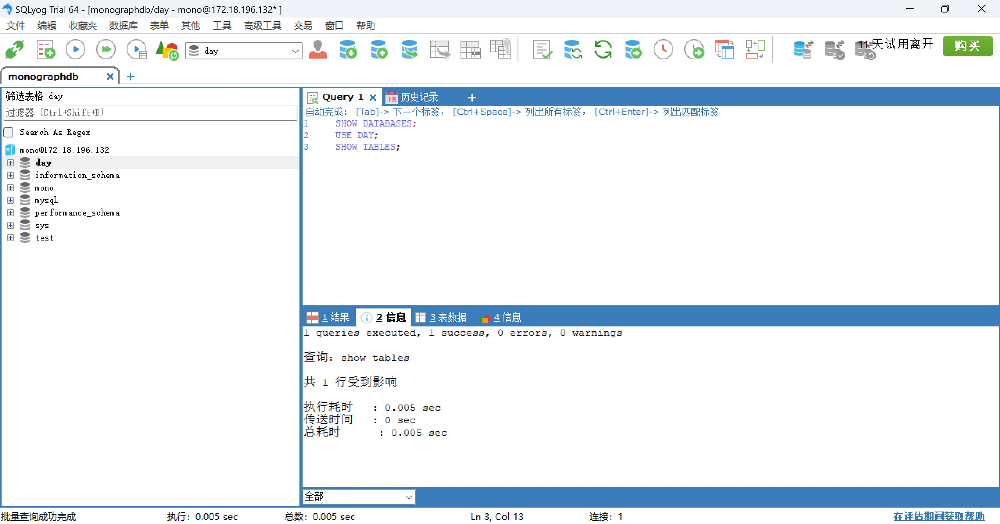

# 客户端接入

本文档介绍了如何使用终端之外的客户端连接 EloqSQL 并进行查询。

文档操作环境为

- win11 操作系统

客户端连接示例包括但不限于如下几种：

- Navicat
- Oracle MySQL Workbench
- SQLyog

1. [Navicat](https://navicat.com/en/products)
   下载并安装相应操作系统的 Navicat for MySQL 客户端安装包。
   
   打开 Navicat 客户端，新建 MariaDB 连接
   
   输入数据库所在的服务器(Host)的 IP，端口(Port)号(默认情况下 3300)，数据库用户名(User Name)为`mono`以及在创建该用户时的设置的用户密码即可完成连接设置。
   
   测试连接成功后，保存连接，新建查询
   
   写 SQL 语句并点击运行，运行成功。
   

2. [Oracle MySQL Workbench](https://dev.mysql.com/downloads/file/?id=517975)
   从官网上下载并安装 Mysql Workbench 客户端安装包。
   打开 Mysql Workbench 客户端，新建 Mysql 连接。
   
   输入数据库所在的服务器(Host)的 IP，端口(Port)号(默认情况下 3300)，数据库用户名(User Name)为`mono`以及在创建该用户时的设置的用户密码即可完成连接设置。
   
   连接成功
   
   新建查询，写 SQL 语句并点击运行。
   

3. [SQLyog](https://webyog.com/product/sqlyog/)

下载并安装相应操作系统的 SQLyog 安装包。
打开 SQLyog 客户端，新建连接

输入数据库所在的服务器(Host)的 IP，端口(Port)号(默认情况下 3300)，数据库用户名(User Name)为`mono`以及在创建该用户时的设置的用户密码即可完成连接设置。

连接成功

新建查询，写 SQL 语句并点击运行。

