# MonoSQL 部署指南

## MonoSQL 产品介绍

MonoSQL 是[成章数据](http://www.monographdata.com/)公司自主设计、研发的基于 DynamoDB 的封装器，是一款可以帮助用户从 Mysql 或者 MariaDB 迁移到 DynamoDB 的虚拟镜像产品，具备无状态，自动扩容，数据安全等优点，借助 MonoSQL，您可以继续使用 JDBC 或 ODBC 协议在 DynamoDB 实现数据的存储、检索和更新等操作，而不需更改原先的引用程序。

### 产品功能特性

MonoSQL server 是无状态的，所有的目录和数据都存储在 DynamoDB 中。SQL 查询将被 MonoSQL 服务器解析、优化和执行，而 MonoSQL 服务器将通过使用 GetItem、PutItem 等请求向 DynamoDB 请求实际数据。MonoMonitor 实现对整个 Auto Scaling 组的监控，AWS Cloud Watch 实现整个 Auto Scaling 组日志的存储。

- 用户和权限管理。使用 CREATE USER 命令在 MonoSQL 中管理用户。使用 GRANT 命令管理权限。两者都与 MySQL 兼容。
- DDL 操作。使用 CREATE TABLE 和 DROP TABLE 来管理表结构。
- DML 操作。支持 SELECT、INSERT、UPDATE、DELETE 命令。
- 连接操作符。
- 聚合操作符。
- CTE 和递归 CTE 操作符。

相比于 Mysql 与 MariaDB，DynamoDB 具有如下特点：

- 高扩展性：DynamoDB 是一种高度可扩展的 NoSQL 数据库，可以轻松地扩展到数十亿行数据和高并发访问，而 MySQL 或 MariaDB 则需要复杂的集群架构和调优才能达到类似的规模和性能。

- 无服务器架构：DynamoDB 是 AWS 提供的一种无服务器数据库，可以免去维护数据库服务器的繁琐任务，让开发者能够专注于应用程序的开发和部署。

- 高性能：DynamoDB 是一种高性能的数据库，支持毫秒级别的响应时间和数百万次的并发访问。这使得它非常适合处理实时应用程序和高并发负载，而 MySQL 或 MariaDB 则需要进行复杂的优化和调整才能达到类似的性能。

- 弹性伸缩：DynamoDB 支持弹性伸缩，可以根据实际负载自动调整数据库实例的数量和配置。这使得它非常适合处理不稳定的负载和峰值访问，而 MySQL 或 MariaDB 则需要进行手动调整和管理。

- 可用性和耐用性：DynamoDB 具有高可用性和耐用性，可以保证数据不会丢失或损坏。这使得它非常适合处理重要的数据和应用程序，而 MySQL 或 MariaDB 则需要进行复杂的备份和恢复操作才能达到类似的效果。

从 MySQL 或 MariaDB 到 DynamoDB 的迁移最大的**难点与痛点**在于：由于 DynamoDB 和 MySQL/MariaDB 具有不同的 API 和查询语言，因此需要相应地修改应用程序和代码，以便能够正确地访问 DynamoDB。MonoSQL 可以帮助您直接使用原来的程序完成上述的数据访问操作，极大的节省企业或个人的转型成本。

### 产品部署概述

#### 初始化 MonoSQL 在 DynamoDB 中创建系统表

DynamoDB 是有 AWS 提供的 NoSQL 数据库服务，它可以快速、可靠地存储和检索数据。借助 MonoSQL，您可以无痛的从 Mysql 或者 MariaDB 的轻松迁移到 DynamoDB。在使用 MonoSQL 进行 DynamoDB 的访问之前需要先在 DynamoDB 上创建系统表，系统表是 DynamoDB 中的一种特殊表格，用于存储与 DynamoDB 服务本身相关的元数据和配置信息。通过运行初始化程序来创建系统表格，可以确保 DynamoDB 服务能够正常运行并提供所需的功能。

1.  基于 MonoSQL 的 EC2 实例创建

2.  在 DynamoDB 中创建 MonoSQL 对应的系统表,以 ssh 登陆到新建的 EC2 实例运行下面的命令，初始化 MonoSQL 在`AWS DynamoDB`中创建系统表格
    `bash
    /home/ubuntu/install/scripts/mysql_install_db --defaults-file=/home/ubuntu/dynosql.cnf --basedir=/home/ubuntu/install --datadir=/home/ubuntu/data0 --plugin-dir=/home/ubuntu/install/lib/plugin > log 2>&1 &
    `
3.  启动数据库服务
    `bash
    /home/ubuntu/install/bin/mysqld --defaults-file=/home/ubuntu/dynosql.cnf > mysql_log 2>&1 &
    `
4.  使用 sock 连接数据库
    `bash
    # connect to db.
    cd ~/install
    sudo ./bin/mysql -S /tmp/mysqld3306.sock test
    `
5.  通过下面的命令创建 SQL 用户`sysb`进行基准测试，创建用户`mono`用于数据库监控。
    ```sql # create sysbench user and monitor user.
    delete from mysql.user where User='';
    CREATE USER 'sysb'@'%' IDENTIFIED BY 'sysb';
    GRANT ALL PRIVILEGES ON _ . _ TO 'sysb'@'%';

        CREATE USER IF NOT EXISTS 'mono'@'%' IDENTIFIED BY 'mono' WITH MAX_USER_CONNECTIONS 5;
        GRANT ALL PRIVILEGES ON *.* TO 'mono'@'%' IDENTIFIED BY 'mono' WITH GRANT OPTION;
        FLUSH PRIVILEGES;
        ```
        创建上述角色后，可以进入`mysql`数据库下，查看`user`表中，是否存在用户`sysb`与`mono`，验证创建是否成功
        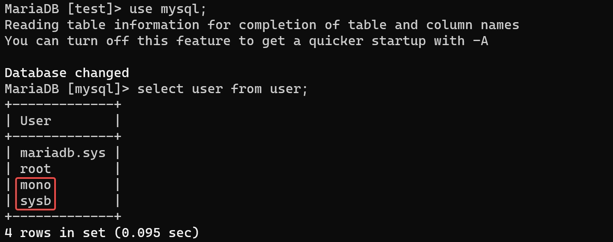

#### 基于 MonoSQL 创建 Auto Scaling Group

Auto Scaling Group 是 AWS 提供的一种云端服务，它允许您自动地调整 EC2 实例的数量，以满足应用程序的需求。借助 Auto Scaling Group，您可以实现根据请求流量自动配置 MonoSQL 的实例数量，而无需手动干预。
选择 **EC2** > **Auto Scaling** > **Auto Scaling 组**，进入如下界面
点击**创建 Auto Scaling 组**，进入后续的 Auto Scaling Group 具体配置。
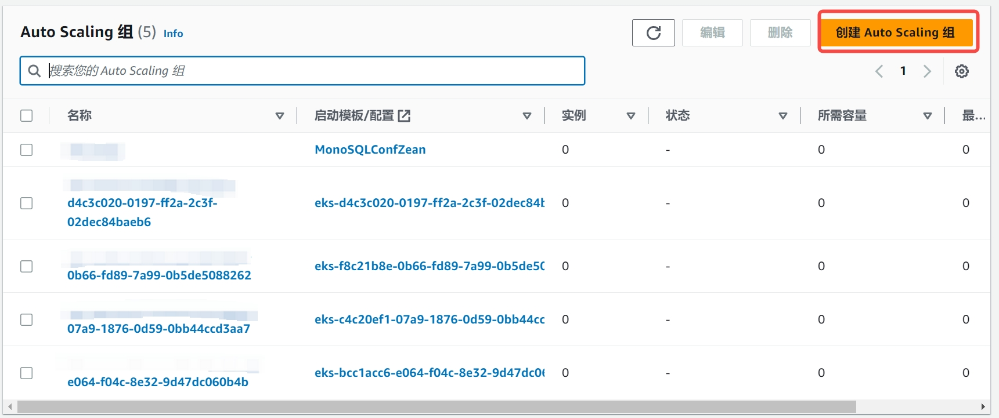

1. **步骤 1** 选择启动模板或配置
   - 设置`Auto Scaling`组名称，注意此处的组名称**必须**设置为`MonoSQL`，因为后续的监控组件`Prometheus`与`Grafana`会依据此名称来对该资源组进行监控。
     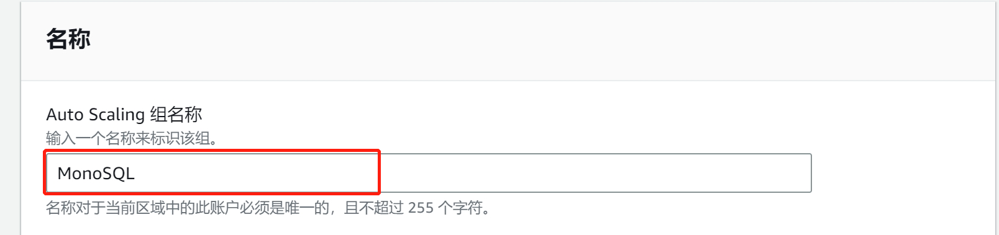
   - 设置`启动模板`，启动模板选择`启动配置`，忽略警告项，选择创建启动配置
     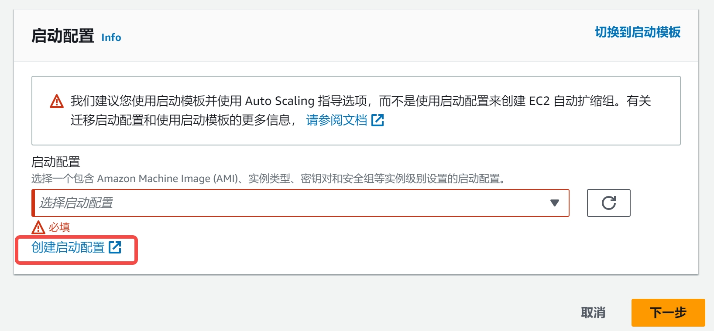
     按照如下的演示，配置自定义的启动模板
     
     > **注意**
     >
     > 在配置启动模板的时候，设置的 IAM 实例配置文件需要满足[部署准备](#部署准备)中的条件 2，即选择已经创建好的名称为**monosql**的用户角色。
     > 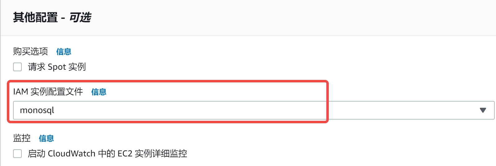
2. **步骤 2** 选择实例启动选项
   选择相应的可用区与子网为`ap-northeast-1a | subnet-015bc66fedce1b8c0`
   
3. **步骤 3** 配置高级选项
   - 创建新的网络负载均衡器(Network Load Balancer)
   - 设置`负载均衡器类型`为`Network Load Balancer`
   - 配置`负载均衡器名称`，此处可自行配置想要的名称，符合 AWS 命名规范即可，此处设置为**MonoSQL-LB-ALPHA**
   - 设置`负载均衡器方案`为`Internal`
   - 设置`可用区与子网`为`subnet-015bc66fedce1b8c0(公有)`
   - 设置`侦听器与路由`监听 3306 端口，并且默认路由转发到`MonoSQL_LB|TCP`
4. **步骤 4** 配置组大小和扩展策略
   此处设置 vm 实例的需求值为 3，最大值为 8，最小值为 0。这里可以按需进行配置
   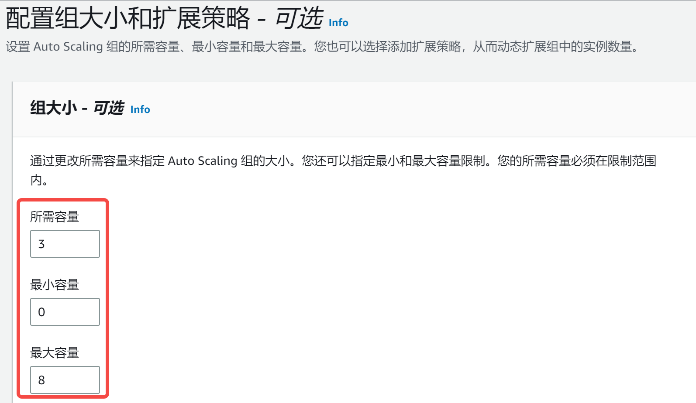

上述选项设置完成后，其他步骤设置为默认即可，不需要特别修改。所有的设置完成后，即可成功创建名称为`MonoSQL`的`Auto Scaling`组，随之一同创建成功的还有负载均衡器**MonoSQL-LB-ALPHA**。

- 在 AWS 控制台中，选择 **负载平衡** > **负载均衡器**，进入如下页面
  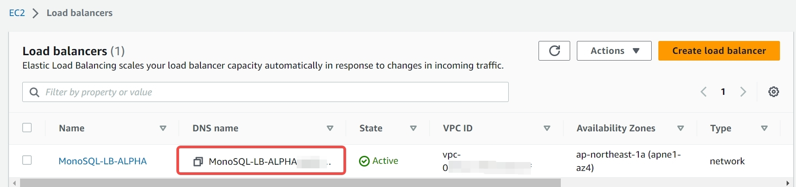
- 在 AWS 控制台中，选择 **实例** > **实例**，进入如下页面
  
  可以发现多了三个新的运行实例，这三个实例就是我们在`Auto Scaling`组中设置的 3 个需求节点。

#### 基于 MonoSQLMonitor 虚拟镜像创建监控实例

MonoSQLMonitor 虚拟镜像中集成了 Prometheus 与 Grafana 监控组件，可以实现对 Auto Scaling Group 的监控。Prometheus 是一种监控工具，可以收集和存储分布式数据库的指标数据，而 Grafana 则是一种数据可视化工具，可以将这些指标数据以图表等形式展示出来，帮助用户更好地理解和分析分布式数据库的性能和运行状况。

1.  创建基于 MonoSQLMonitor 的 EC2 实例
2.  访问 WebUI，查看 Grafana 监控情况
    创建完 MonoSQLMonitor 监控实例后，该实例默认会监控名称为`MonoSQL`的`Auto Scaling`组，您可以在浏览器中输入`监控EC2实例ip:3000`，查看组件对于该`Auto Scaling`组的监控.

### 部署选项

1. 单 Region 部署

在特定 AWS Region，启动 Auto Scaling Group，实例会自动连接当前 region 的 AWS DynamoDB。

2. 多 Region 部署

在多个 AWS Region 分别启动多个 Auto Scaling Group，实例会自动连接到对应 region 的 AWS DynamoDB。
设置 DynamoDB 的表为 Global Table，实现数据多写和跨 Region 自动同步。

### 部署时间

产品在 AWS 完成部署时间为 1 个工作日。

### 部署支持的区域

MonoSQL 产品支持的 AWS 区域（Region）包括

1. Asia Pacific (Hong Kong)
2. Asia Pacific (Tokyo)
3. Asia Pacific (Seoul)
4. Asia Pacific (Singapore)
5. US East (N. Virginia)
6. US East (Ohio)
7. US West (N. California)
8. US West (Oregon)

## 产品部署前提要求

### 对部署资源的要求

在 AWS 上部署产品需要的资源如下：

1. 获取 MarketPlace 上的 MonoSQL AMI，操作系统需使用 Ubuntu20.04。
2. 配置 AWS AutoScaling group，动态伸缩 MonoSQL 集群规模
3. AWS DynamoDB 权限
4. MonoSQL 监控服务器一台，使用 MarketPlace 上 MonoSQLMonitor AMI。

### 对技能或专业知识要求

熟悉 MySQL 数据库

熟悉 AWS 控制台和 AWS 相关服务

1. Amazon Network Load Balancer
2. Amazon Auto Scaling Group
3. Amazon EC2
4. Amazon VPC
5. Amazon SQS
6. Amazon DynamoDB
7. Amazon Cloud Watch

### 系统部署所需的环境配置

客户需要具备 AWS 账号，如没有，建议联系 AWS 销售或通过 AWS 官网进行账号的注册和认证。需使用 Ubuntu20.04 操作系统进行部署。

## 产品部署架构图

部署产品时通过 Amazon Auto Scaling Group 实现根据负载动态调整集群规模。

在内核设计上，MonoSQL 整体架构可以拆分为多个模块，各个模块之间互相通信，组成一体化的服务、运维、监控系统，对应的架构图如下：
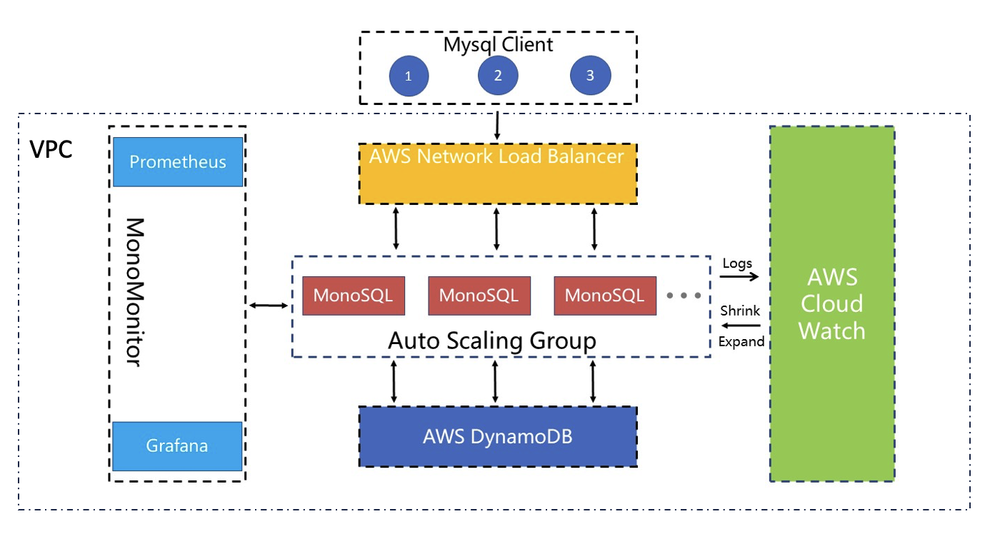

子网信息： MonoSQL 计算节点和 MonoSQL 监控节点应该在同一个 VPC 和同一个子网内部。

## 产品部署成本预估

### 产品部署项目所需计费服务列表

产品提供下列服务（以下均必选）
AWS EC2 with MonoSQL: 推荐 c5.4xlarge 机型，80GB gp2 存储
AWS Simple Queue Service
AWS DynamoDB

### 产品 license 费用及 AWS 实价参考

产品无 license 费用，计价模型是 marketplace 按小时计费，不同机型的价格不一样，详见 Marketplace 页面
以 c5.4xlarge 为例，价格为$0.68/小时软件费用

附 EC2 官方报价链接 https://www.amazonaws.cn/en/ec2/pricing/ec2-linux-pricing/

## 产品部署安全设置

### 安全概述

1. MonoSQL 产品不需要使用 Root 用户进行部署。用户需要拥有 EC2FullAccess 权限。

2. 本产品没有使用 S3 等公有资源

### 最低特权策略

用户应遵循 AWS 最低特权策略来管理用户权限，MonoSQL 产品的部署仅需要 EC2FullAccess 权限。

### 产品需要的 IAM 角色和权限

DBA 需要一个 EC2FullAccess 权限的用户来管理 AutoScaling Group。如果 DBA 需要访问 MonoSQL 的其他组件，需要添加对应权限，比如 AmazonDynamoDBFullAccess， AmazonSQSFullAccess 等。

MonoSQL 实例会使用特定的角色`monosql`来访问其他服务，需要 AWS 服务权限列表如下：

1. CloudWatchLogsFullAccess
2. AmazonDynamoDBFullAccess
3. AmazonEC2FullAccess
4. AmazonSQSFullAccess
5. CloudWatchAgentServerPolicy

### 产品密钥

MonoSQL 是无状态计算节点，不需要存储密钥
MonoSQL 访问的用户名和密码，存储在 DynamoDB 中。

### 有关客户敏感数据存储的位置

MonoSQL 所有数据存储在 DynamoDB 中，由 DynamoDB 提供数据敏感性最佳实践。

详情请参考 https://aws.amazon.com/blogs/database/applying-best-practices-for-securing-sensitive-data-in-amazon-dynamodb/

### 数据加密配置

MonoSQL 是无状态计算节点，不会存储数据。

数据加密及安全性保证由 DynamoDB 提供。

详情请参考 https://docs.aws.amazon.com/amazondynamodb/latest/developerguide/EncryptionAtRest.html

### 网络的相关配置说明及步骤

具体步骤如下：

1. 创建 VPC：xxxx

2. 创建子网：10.0.0.0/24 段

3. 创建互联网网关：网段 10.168.254.0/24

4. 创建安全组并配置入站及出站规则，开放端口: 3000,3306,3307,9090,9104,9200,18081。

### 关于 IMDSv1

本产品不需要调用 AWS API，本产品访问 AWS DynamoDB 使用 AWS Client

## 产品资源选择

MonoSQL 使用 EC2 实例，用户可以选择不同的实例类型。类型选项包括:

1. c5.large
2. c5.xlarge
3. c5.2xlarge
4. c5.4xlarge
5. c5.9xlarge
6. c5.12xlarge
7. c5.24xlarge

## 产品部署具体步骤

### 产品型部署架构在 AWS 上搭建的分步说明

#### 引导 MonoSQL 在 DynamoDB 中创建系统表

DynamoDB 是有 AWS 提供的 NoSQL 数据库服务，它可以快速、可靠地存储和检索数据。借助 MonoSQL，您可以无痛的从 Mysql 或者 MariaDB 的轻松迁移到 DynamoDB。在使用 MonoSQL 进行 DynamoDB 的访问之前需要先在 DynamoDB 上创建系统表，系统表是 DynamoDB 中的一种特殊表格，用于存储与 DynamoDB 服务本身相关的元数据和配置信息。通过运行引导程序来创建系统表格，可以确保 DynamoDB 服务能够正常运行并提供所需的功能。

1. 基于 MonoSQL 的 EC2 实例创建
   选择**EC2** > **实例** > **实例**，进入如下页面
   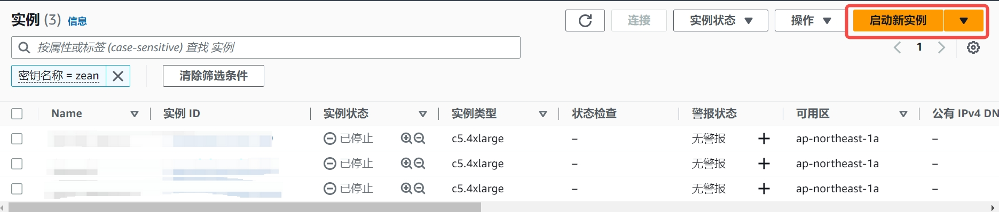
   点击`启动新实例`，进入后续的 EC2 实例具体配置环节。

   - 步骤 1：配置实例名称，设置为`Mono-Bootstrap`。
   - 步骤 2：从`AWS Market Place`中查找 AMI 镜像`MonoSQLServer`，设置 AMI 为`MonoSQLServer`。
   - 步骤 3：设置实例类型为`c5.4xlarge`
   - 步骤 4：设置密钥对，用于 ssh 免密登陆，可以使用已有密钥对或者创建新密钥对
   - 步骤 4：配置 EC2 实例的网络，注意此处设置的安全组必须允许来自 3306 端口的流量，以进行数据库的访问与设置。
     完成上述配置后，检查无误后，则可以启动实例。具体设置过程可以查看如下的演示：
     

1. 在 DynamoDB 中创建 MonoSQL 对应的系统表

   - 以 ssh 登陆到新建的 EC2 实例运行下面的命令，引导 MonoSQL 在`AWS DynamoDB`中创建系统表格
     ```bash
     /home/ubuntu/install/scripts/mysql_install_db --defaults-file=/home/ubuntu/dynosql.cnf --basedir=/home/ubuntu/install --datadir=/home/ubuntu/data0 --plugin-dir=/home/ubuntu/install/lib/plugin > log 2>&1 &
     ```
     
     运行`tail -f log`命令查看执行是否成功，如出现`ok`提示，则说明引导成功
     
   - 查看此时`AWS DynamoDB`中的表格，可以看到我们通过 MonoSQL 在`AWS DynamoDB`中创建的表格，进一步表明 MonoSQL 引导成功。
     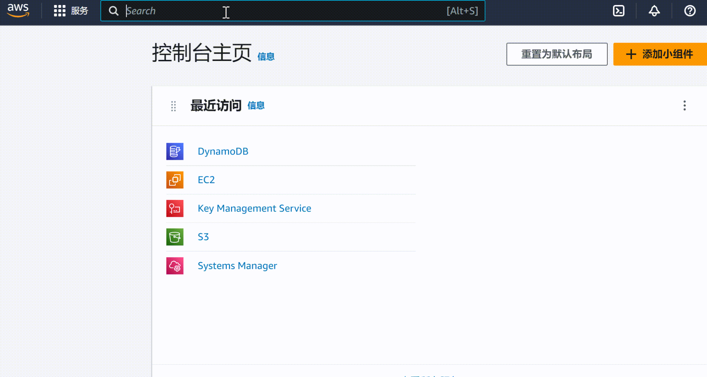
   - 启动数据库服务
     ```bash
     /home/ubuntu/install/bin/mysqld --defaults-file=/home/ubuntu/dynosql.cnf > mysql_log 2>&1 &
     ```
   - 使用 sock 连接数据库
     ```bash
     # connect to db.
     cd ~/install
     sudo ./bin/mysql -S /tmp/mysqld3306.sock test
     ```
   - 通过下面的命令创建 SQL 用户`sysb`进行基准测试，创建用户`mono`用于数据库监控。

     ```sql
     # create sysbench user and monitor user.
     delete from mysql.user where User='';
     CREATE USER 'sysb'@'%' IDENTIFIED BY 'sysb';
     GRANT ALL PRIVILEGES ON * . * TO  'sysb'@'%';

     CREATE USER IF NOT EXISTS 'mono'@'%' IDENTIFIED BY 'mono' WITH MAX_USER_CONNECTIONS 5;
     GRANT ALL PRIVILEGES ON *.* TO 'mono'@'%' IDENTIFIED BY 'mono' WITH GRANT OPTION;
     FLUSH PRIVILEGES;
     ```

     创建上述角色后，可以进入`mysql`数据库下，查看`user`表中，是否存在用户`sysb`与`mono`，验证创建是否成功
     

#### 基于 MonoSQL 创建 Auto Scaling Group

Auto Scaling Group 是 AWS 提供的一种云端服务，它允许您自动地调整 EC2 实例的数量，以满足应用程序的需求。借助 Auto Scaling Group，您可以实现根据请求流量自动配置 MonoSQL 的实例数量，而无需手动干预。
选择 **EC2** > **Auto Scaling** > **Auto Scaling 组**，进入如下界面
点击**创建 Auto Scaling 组**，进入后续的 Auto Scaling Group 具体配置。


1. **步骤 1** 选择启动模板或配置
   - 设置`Auto Scaling`组名称，注意此处的组名称**必须**设置为`MonoSQL`，因为后续的监控组件`Prometheus`与`Grafana`会依据此名称来对该资源组进行监控。
     
   - 设置`启动模板`，启动模板选择`启动配置`，忽略警告项，选择创建启动配置
     
     按照如下的演示，配置自定义的启动模板
     
     > **注意**
     >
     > 在配置启动模板的时候，设置的 IAM 实例配置文件需要满足[部署准备](#部署准备)中的条件 2，即选择已经创建好的名称为**monosql**的用户角色。
     > 
2. **步骤 2** 选择实例启动选项
   选择相应的可用区与子网为`ap-northeast-1a | subnet-015bc66fedce1b8c0`
   
3. **步骤 3** 配置高级选项
   - 创建新的网络负载均衡器(Network Load Balancer)
     
   - 设置`负载均衡器类型`为`Network Load Balancer`  
     
   - 配置`负载均衡器名称`，此处可自行配置想要的名称，符合 AWS 命名规范即可，此处设置为**MonoSQL-LB-ALPHA**
   - 设置`负载均衡器方案`为`Internal`
     
   - 设置`可用区与子网`为`subnet-015bc66fedce1b8c0(公有)`
     
   - 设置`侦听器与路由`监听 3306 端口，并且默认路由转发到`MonoSQL_LB|TCP`
     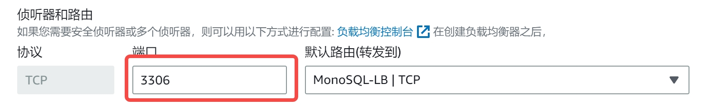
4. **步骤 4** 配置组大小和扩展策略
   此处设置 vm 实例的需求值为 3，最大值为 8，最小值为 0。这里可以按需进行配置
   

上述选项设置完成后，其他步骤设置为默认即可，不需要特别修改。所有的设置完成后，即可成功创建名称为`MonoSQL`的`Auto Scaling`组，随之一同创建成功的还有负载均衡器**MonoSQL-LB-ALPHA**。

- 在 AWS 控制台中，选择 **负载平衡** > **负载均衡器**，进入如下页面
  
- 在 AWS 控制台中，选择 **实例** > **实例**，进入如下页面
  
  可以发现多了三个新的运行实例，这三个实例就是我们在`Auto Scaling`组中设置的 3 个需求节点。

### 基于 MonoSQLMonitor 虚拟镜像创建监控实例

MonoSQLMonitor 虚拟镜像中集成了 Prometheus 与 Grafana 监控组件，可以实现对 Auto Scaling Group 的监控。Prometheus 是一种监控工具，可以收集和存储分布式数据库的指标数据，而 Grafana 则是一种数据可视化工具，可以将这些指标数据以图表等形式展示出来，帮助用户更好地理解和分析分布式数据库的性能和运行状况。

1.  创建基于 MonoSQLMonitor 的 EC2 实例
    创建监控实例的过程与创建 MonoSQLServer 实例基本一致，需要注意的一点是相应的 AMI,需要设置为`MonoSQLMonitor`。
    
2.  访问 WebUI，查看 Grafana 监控情况
    创建完 MonoSQLMonitor 监控实例后，该实例默认会监控名称为`MonoSQL`的`Auto Scaling`组，您可以在浏览器中输入`监控EC2实例ip:3000`，查看组件对于该`Auto Scaling`组的监控情况，出现如下界面
    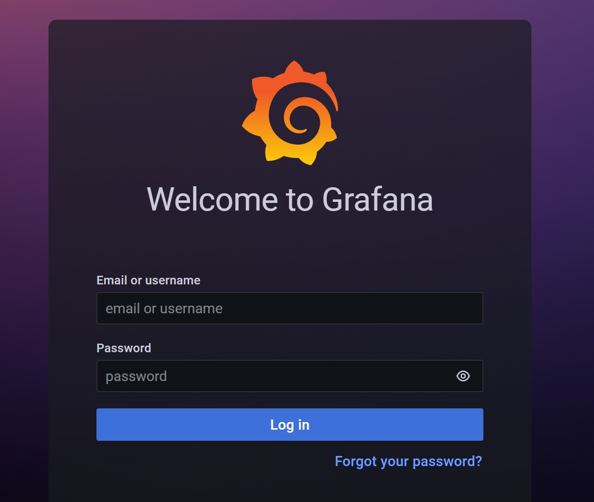
    默认用户名与密码都为**admin**，
    选择**Dashboards**> **General** > **Monograph Server**，进入如下界面
    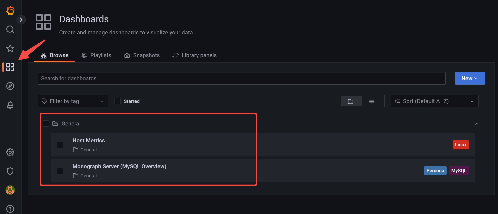
    点击**Monograph Server**，进入如下界面，可以看到`Auto Scaling`组下的三个启动实例都处在监控实例的监控中
    

### 使用 Sysbench 进行基准测试

1.  创建 MySQL Client EC2 实例
    创建 Mycleint 实例的过程与创建 MonoSQLServer 实例基本一致，但是需要注意的是相应的 AMI，需要设置为`dynosqlalpha`。创建该 EC2 实例的目的在于使得该实例作为 MySQL 客户端，与我们设置的`Network Load Balancer`进行交互
1.  进行基准测试 + 登陆到创建的 MySQL Client 实例，执行下述命令进行`Sysbench`测试
    `shell
        sysbench /usr/share/sysbench/oltp_insert.lua --mysql_storage_engine=monograph --tables=1 --table_size=100000 --mysql-user=sysb --mysql-host=<MonoSQL-dns-example> --mysql-port=3306 --mysql-password=sysb --mysql-db=test --time=120 --threads=100 --report-interval=5 --auto_inc=off --create_secondary=false --mysql-ignore-errors=all prepare
        sysbench /usr/share/sysbench/oltp_insert.lua --mysql_storage_engine=monograph --tables=1 --table_size=100000 --mysql-user=sysb --mysql-host=<MonoSQL-dns-example> --mysql-port=3306 --mysql-password=sysb --mysql-db=test --time=120 --threads=300 --report-interval=5 --auto_inc=off --create_secondary=false --mysql-ignore-errors=all run
        `
    将字段`<MonoSQL-dns-example>`字段替换为[基于 MonoSQL 创建 Auto Scaling Group](#monosql启动实例的创建)中创建的负载均衡器的实际 DNS。
    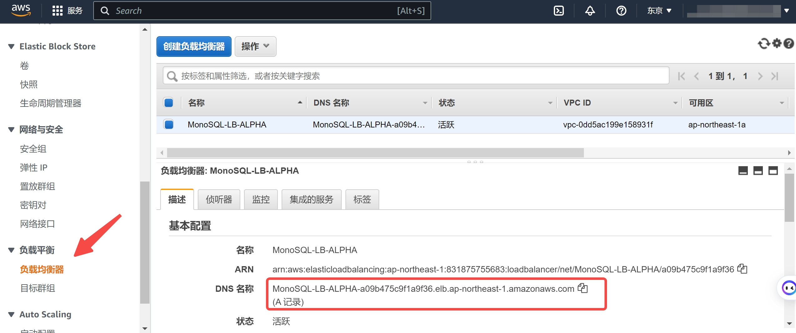
    根据我们配置的 Auto Scaling Group 中的实例数量为 3，您可以将线程数`threads`设置为 300，下图展示了测试时的运行结果
    
    关于利用`Sysbench`进行基准测试的详细解释与过程，参考[MonoSQL Benchmark Result](https://github.com/zhangh43/dynosql/blob/main/monosql_benchmark.md)

## 产品备份和恢复

MonoSQL 产品无状态，备份和恢复请参考 DynamoDB 文档
https://aws.amazon.com/dynamodb/backup-restore/

## 产品日常维护

### 产品系统凭证和加密密钥的分步说明

MonoSQL 是 AWS Marketplace 的 AMI，需要通过 AMI role 进行绑定，用于访问 AWS DynamoDB，AWS SQS，AWS CloudWatch 等服务。

AMI role 的管理可通过 AWS IAM 界面。

启动 AWS AutoScaling Group 需要特定 AWS 用户，该用户的密钥管理步骤如下：

1. 访问我的安全凭证,选择用户，点击要更新的用户。
2. 选择安全证书选项，点击停用 访问密钥，然后选择删除密钥。
3. 创建访问密钥，下载密钥。更新密钥完成。

### 软件补丁和升级

MonoSQL 产品是无状态服务，用户只需要将当前 AWS AutoScaling Group 的期待实例数设置为 0，之后重新设置启动模版 AMI，选取 MonoSQL 的新版本即可。

### 平台管理许可证的简要说明

MonoSQL 不支持 BYOD(Bring your own license)模式，用户无需购买和管理软件许可。

用户可以通过按小时计费模式按需启动 MonoSQL 计算实例。

### AWS 服务限制规范性指导

MonoSQL 会使用 AWS EC2，DynamoDB 等服务，这些服务都会涉及 AWS 服务配额。

AWS 为每个账户维护服务配额（以前称为服务限制），以帮助确保 AWS 资源的可用性并防止意外预置超出需要的资源。有些服务配额会在您使用 AWS 时随着时间自动提高。但是，大多数 AWS 服务需要您手动请求提高配额。

具体请参阅链接
https://repost.aws/zh-Hans/knowledge-center/manage-service-limits

## 产品紧急维护

### 产品故障处理分步说明

公司提供 Support 支持，可以通过电子邮件，在线会议和线下等方式解决故障问题。

1. 针对 MonoSQL 计算节点问题，由公司 Support 团队负责。
2. 针对数据存储问题，可通过 AWS Support 渠道，进行 DynamoDB 相关问题反馈。
3. 针对监控系统问题，由公司 Support 团队负责。

### 恢复软件分步说明

1. 针对 MonoSQL 计算节点问题，因为计算节点无状态，用户只需要关闭错误节点，通过 AutoScaling Group 自动拉起新计算节点。
2. 针对数据存储，DynamoDB 支持跨 Region 高可用，数据恢复对用户完全透明。

## 产品售后支持

产品售后维护保障解决方案，主要包括邮件技术支持服务、远程技术支持服务、现场技术支持服务等，帮助客户维护更加稳定、高效的业务运行环境。

1. 邮件技术支持服务：
   交付后，系统进入维护期，操作人员在操作过程中出错并影响业务运行的问题可以直接发送邮件到AWSMarketplace@monographdb.com。我司安排有经验的工程师值班。当设备出现故障时，可通过该途径进行邮件故障申报。

2. 远程技术支持服务：

对于通过邮件指导不能解决的故障，我司在征得甲方同意后，通过远程接入手段，登陆到故障设备，进行故障诊断，查找故障原因，指导现场维护人员处理故障。

要求：我司工程师登陆到故障设备，通过诊断，分析故障产生的原因，指定故障解决技术方案后，并将技术护方案通过电话、邮件、微信群等方式通知甲方，经审批后，才能进行故障解决方案的具体措施。
在远程登陆过程中，我司工程师通过远程发送的任何指令，同命令日志文件一同整理进故障报告中。

3. 现场技术支持服务：

对于通过邮件技术支持和远程技术支持都不能解决的故障问题，我司迅速提供现场支持服务，安排经验丰富的技术支持工程师赴现场分析故障原因，制定故障解决方案，并最终排除故障。

4. 联系方式：

邮箱：AWSMarketplace@monographdb.com
