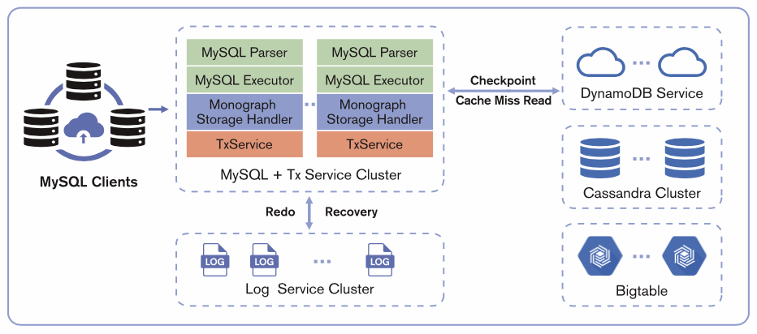

# Monostrate: A Distributed SQL Database for Elastic Performance at Any Scale

## Introduction

In today's data-driven world, organizations face the challenge of managing ever-increasing volumes of data while ensuring high performance, scalability, and cost-effectiveness. Traditional database systems often struggle to meet these demands, leading to bottlenecks and performance limitations.

Monostrate is a revolutionary distributed NewSQL database that addresses these challenges head-on. Powered by its innovative Data Substrate, Monostrate delivers exceptional elasticity, scalability, and performance for latency-sensitive workloads, making it an ideal choice for modern enterprises.

## Achitecture

Monostrate is a decoupled distributed database powered by Data Substrate. Its architecture includes a frontend compute engine compatible with the MySQL protocol. Within Data Substrate, the TxService is responsible for caching hot data and managing transaction processing, while the LogService handles data persistence. LogService replicas are distributed across different availability zones (AZs) to ensure tolerance to AZ-level failures. The underlying storage layer supports pluggable key-value (KV) storages, such as AWS DynamoDB, Google Bigtable, and Cassandra. These cloud storage services store cold data for cache misses and provide high availability for baseline data.

## Key Features

### MySQL Compatibility:

- Seamless integration with existing MySQL applications
- Leverages familiar MySQL protocol and syntax

### Elastic Parallel Logging:

- Patented one-phase commit technique for distributed transaction performance
- 4x improvement in transactions per second in single node mode compared to MySQL
- Eliminates logging bottlenecks for write-intensive workloads

### Elastic Memory Cache:

- Minimizes read latency with highly scalable in-memory data storage
- Supports hash and range partitioning for efficient data distribution
- Automatic scaling and rebalancing for optimal performance
- Cold data checkpointed to cloud storage for efficient cache miss read

### Decoupled Cloud Storage:

- Independent scaling of storage and compute resources
- Cost-effective management of large datasets
- Optimized resource utilization for cold data
- Avoid cloud vendor lock-in and future-proof your data ecosystem with Monostrate's seamless hybrid cloud storage

## Use Cases

Monostrate's unique blend of performance, elasticity, and cost-effectiveness makes it ideal for a wide range of use cases across industries. Here are just a few examples:

- **FinTech**: Payment Processing: Handle high-volume transactions with blazing-fast speed and rock-solid reliability. Guarantee data consistency while keeping the latency of complex transactions low.

- **Gaming**: Game Persistence: Deliver seamless gameplay experiences with reliable transaction handling and consistent game state management. Ensure players never lose progress or encounter disruptions.

- **E-Commerce**: Order Management: Process orders quickly and efficiently with elastic scalability that handles peak traffic without delays. Ensure data accuracy and prevent order fulfillment errors.

- **Saas**: Metadata Management: Manage huge amount of metadata of your SaaS platform efficiently with Monostrate's distributed architecture. Scale seamlessly to accommodate growing metadata volumes without compromising performance or availability.

## Monostrate: Embrace the Future of Distributed SQL:

Gone are the days of performance trade-offs and inflexible scalability in distributed SQL. Monostrate rewrites the rules with:

- Elastic Scaling on Demand: Scale seamlessly to match your workload. Need blazing-fast queries? Scale up the compute engine. Facing write-heavy traffic? Scale out the log service. Monostrate adapts precisely, ensuring optimal performance without overpaying.
- Cost-Effective Efficiency: Leave expensive two-phase commit behind. Monostrate's innovative architecture delivers exceptional performance without unnecessary bloat, significantly reducing operational costs compared to traditional NewSQL systems.
- Ditch the Clunky Workarounds: Forget about complex sharding and cumbersome data management. Monostrate simplifies your infrastructure, empowering you to focus on building great applications, not battling database overhead.

Monostrate is the future of distributed SQL. Are you ready to break free?
