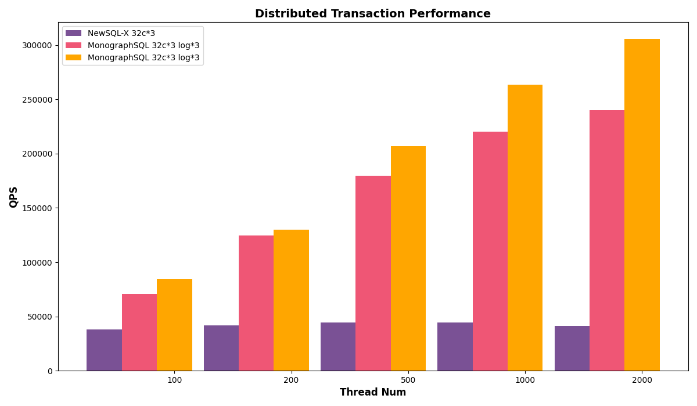
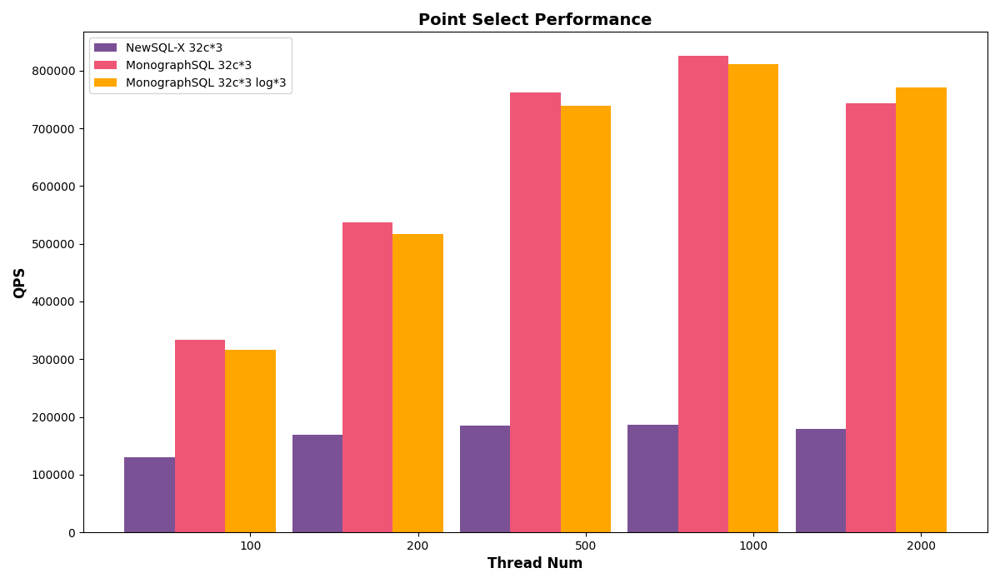
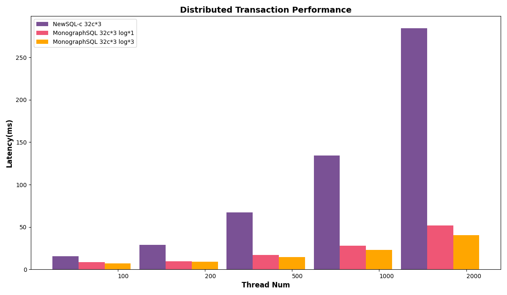
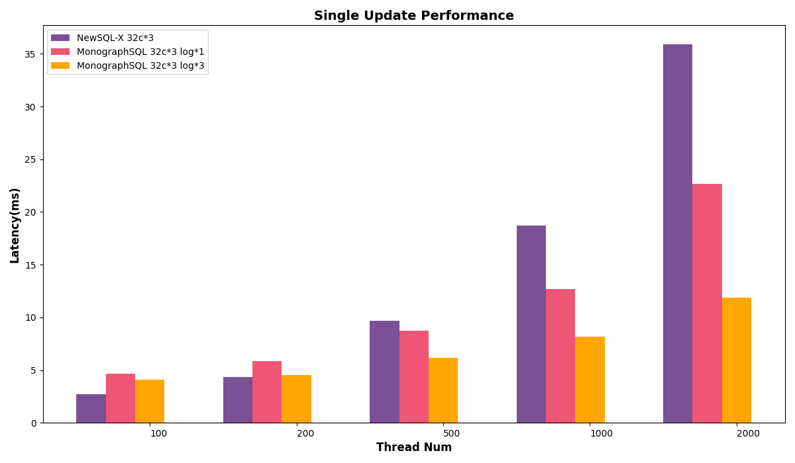
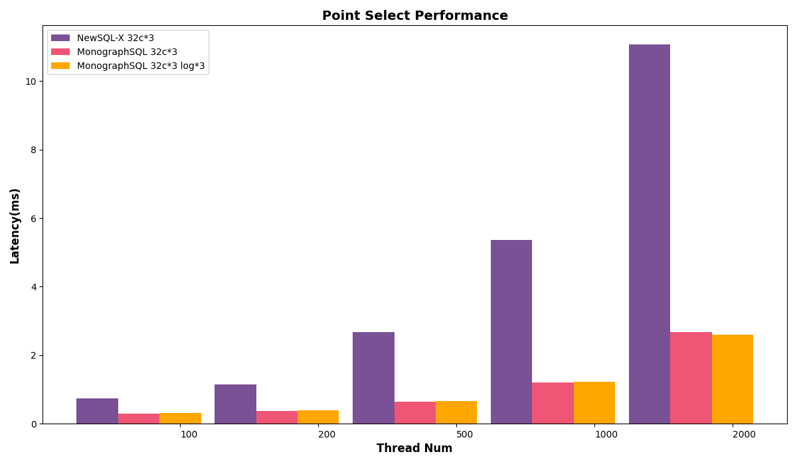
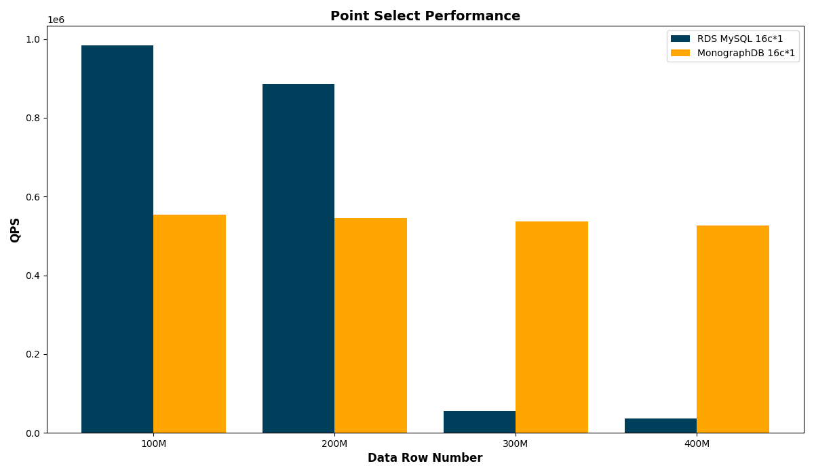
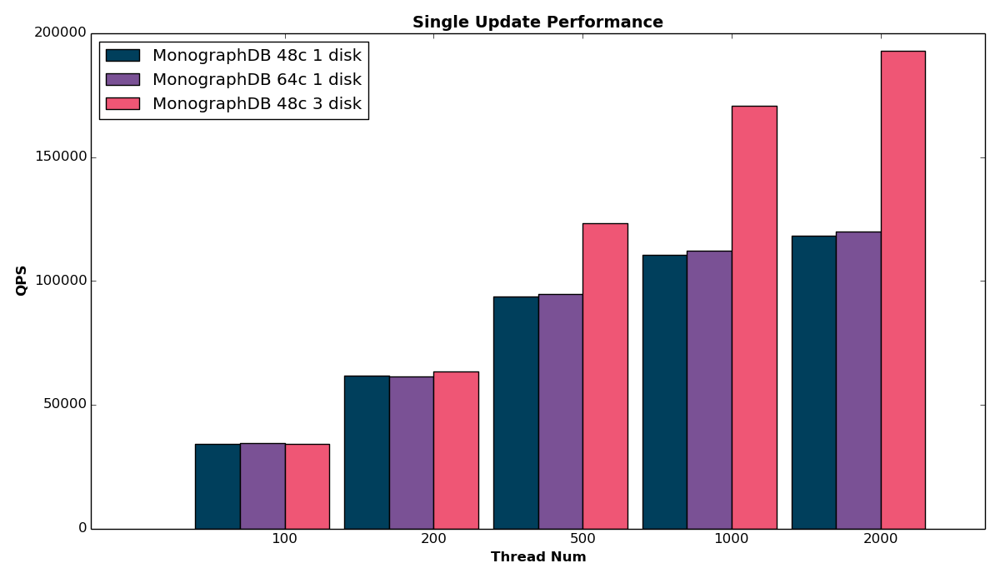
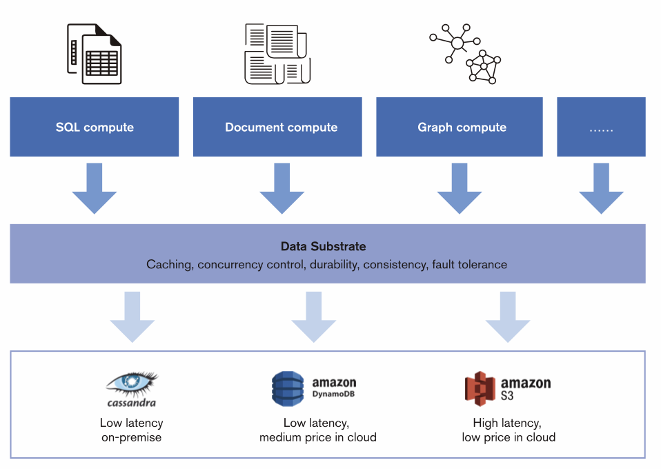

# Table of Contents

- **MonographSQL**
  - MonographSQL: A Distributed NewSQL Database for Elastic Performance at Any Scale
  - Benchmark Report of MonographSQL
- **MonographKV**
  - MonographKV: Unleashing Blazing-Fast Performance with Transactional Store
  - Benchmark Report of MonographKV
- **Appendix**
  - Assemble your database using Data Substrate

  
  

# MonographSQL: A Distributed NewSQL Database for Elastic Performance at Any Scale

## Introduction

In today's data-driven world, organizations face the challenge of managing ever-increasing volumes of data while ensuring high performance, scalability, and cost-effectiveness. Traditional database systems often struggle to meet these demands, leading to bottlenecks and performance limitations.

MonographSQL is a revolutionary distributed NewSQL database that addresses these challenges head-on. Powered by its innovative Data Substrate, MonographSQL delivers exceptional elasticity, scalability, and performance for latency-sensitive workloads, making it an ideal choice for modern enterprises.

## Achitecture

MonographSQL is a decoupled distributed database powered by Data Substrate. Its architecture includes a frontend compute engine compatible with the MySQL protocol. Within Data Substrate, the TxService is responsible for caching hot data and managing transaction processing, while the LogService handles data persistence. LogService replicas are distributed across different availability zones (AZs) to ensure tolerance to AZ-level failures. The underlying storage layer supports pluggable key-value (KV) storages, such as AWS DynamoDB, Google Bigtable, and Cassandra. These cloud storage services store cold data for cache misses and provide high availability for baseline data.

## Key Features

### MySQL Compatibility:

- Seamless integration with existing MySQL applications
- Leverages familiar MySQL protocol and syntax

### Elastic Parallel Logging:

- Patented one-phase commit technique for distributed transaction performance
- 4x improvement in transactions per second in single node mode compared to MySQL
- Eliminates logging bottlenecks for write-intensive workloads

### Elastic Memory Cache:

- Minimizes read latency with highly scalable in-memory data storage
- Supports hash and range partitioning for efficient data distribution
- Automatic scaling and rebalancing for optimal performance
- Cold data checkpointed to cloud storage for efficient cache miss read

### Decoupled Cloud Storage:

- Independent scaling of storage and compute resources
- Cost-effective management of large datasets
- Optimized resource utilization for cold data
- Avoid cloud vendor lock-in and future-proof your data ecosystem with MonographSQL's seamless hybrid cloud storage

## Use Cases

MonographSQL's unique blend of performance, elasticity, and cost-effectiveness makes it ideal for a wide range of use cases across industries. Here are just a few examples:

- **FinTech**: Payment Processing: Handle high-volume transactions with blazing-fast speed and rock-solid reliability. Guarantee data consistency while keeping the latency of complex transactions low.

- **Gaming**: Game Persistence: Deliver seamless gameplay experiences with reliable transaction handling and consistent game state management. Ensure players never lose progress or encounter disruptions.

- **E-Commerce**: Order Management: Process orders quickly and efficiently with elastic scalability that handles peak traffic without delays. Ensure data accuracy and prevent order fulfillment errors.

- **Saas**: Metadata Management: Manage huge amount of metadata of your SaaS platform efficiently with MonographSQL's distributed architecture. Scale seamlessly to accommodate growing metadata volumes without compromising performance or availability.

## MonographSQL: Embrace the Future of Distributed SQL:

Gone are the days of performance trade-offs and inflexible scalability in distributed SQL. MonographSQL rewrites the rules with:

- Elastic Scaling on Demand: Scale seamlessly to match your workload. Need blazing-fast queries? Scale up the compute engine. Facing write-heavy traffic? Scale out the log service. MonographSQL adapts precisely, ensuring optimal performance without overpaying.
- Cost-Effective Efficiency: Leave expensive two-phase commit behind. MonographSQL's innovative architecture delivers exceptional performance without unnecessary bloat, significantly reducing operational costs compared to traditional NewSQL systems.
- Ditch the Clunky Workarounds: Forget about complex sharding and cumbersome data management. MonographSQL simplifies your infrastructure, empowering you to focus on building great applications, not battling database overhead.

MonographSQL is the future of distributed SQL. Are you ready to break free?

# Benchmark Report of MonographSQL

## Introduction

The demand for high-performance, scalable databases that can meet the challenges of modern data-intensive applications continues to grow. NewSQL databases have emerged to address these needs, offering the transactional consistency of traditional RDBMS systems with the scalability of NoSQL databases.

While NewSQL promises both scalability and transactional consistency, many struggle with performance. Compared to single-node solutions like MySQL, their cost-efficiency suffers, and high latency renders them unsuitable for latency-sensitive tasks.

MonographSQL shatters NewSQL performance barriers with a unique approach: in-memory transaction processing powered by data substrate, a one-phase commit protocol to minimize disk I/O, and asynchronous key-value store access to eliminate latency bottlenecks.

To illuminate MonographSQL's edge, we'll conduct experiments focusing on:

- Benchmarking MonographSQL against leading NewSQL databases on mixed workload including distributed transaction to prove its performance superiority.
- Exposesing the limits of traditional databases and underscores the crucial role of scalable memory for consistent performance, with AWS RDS plummeting due to cache misses, unfixable even by adding read replicas.
- Revealing how write-intensive workloads in the cloud benefit less from scaling CPU and memory, demonstrating the value of MonographSQL's decoupled architecture. Instead, focusing on scaling the true bottleneck like the log service unlocks unmatched performance.

## Experiment I:

In the first senario, we compare the performance of MonographSQL, a distributed NewSQL database powered by Data Substrate, with a popular open-source NewSQL database (refer to NewSQL-X in this report). The goal of this comparison is to evaluate the performance of MonographSQL under various workloads especially distributed transaction workloads and its potential to deliver exceptional performance for demanding applications.

A mixed workload was used, simulating a combination of read and write operations to assess overall performance.

- Distributed Transaction: Transactions spanned multiple database instances, ensuring a thorough evaluation of distributed transaction handling capabilities. Each transaction involved a combination of update, delete, or insert queries, simulating the complexity of real-world applications.
- Single Update: Transactions featured a single non-index update, assessing the efficiency of handling basic write operations.
- Point Select: Transactions involved a single point select query, measuring the speed and efficiency of basic read operations.

### Hardware and Software:

To test against NewSQL database in the same hardware configuration, we deploy MonographSQL in co-locate mode, i.e. deploy TxService, LogService and KVStore in the same node. The deployment details is as follows:

| Service type | Node type      | Node count | Disk count |
| ------------ | -------------- | ---------- | ---------- |
| NewSQL-X     | n2-standard-32 | 3          | 500G\*1    |

| Service type | Node type      | Node count | Disk count |
| ------------ | -------------- | ---------- | ---------- |
| MonographSQL | n2-standard-32 | 3          | 500G\*1    |

To illustrate MonographSQL's parallel logging capabilities and maximize I/O performance, we setup a new MonographSQL deployment with three 50GB SSD disks. Note that three 50GB SSD disks are significantly cheaper than 96 cores of compute resources in the cloud.

| Service type | Node type      | Node count | Disk count       |
| ------------ | -------------- | ---------- | ---------------- |
| MonographSQL | n2-standard-32 | 3          | 350G\*1 + 50G\*3 |

Disk Considerations:

- NewSQL-X's official benchmark report employed local SSDs, which cannot persist data after instance restarts.
- To align with cloud-native environments and ensure data persistence, this benchmark utilized PD-SSD disks in GCP for both databases.

### Results

Firstly, we study the throughput of the two databases under diffrent workloads.

X-axis: Represents the varying thread numbers employed during the benchmark, simulating different levels of concurrent database access.

Y-axis: Measures the QPS (Queries Per Second).

- Distributed Transaction Workload:

- Single Update Workload:

- Point Select Workload:

Next, we study the latency of the two databases.

X-axis: Represents the varying thread numbers employed during the benchmark, simulating different levels of concurrent database access.

Y-axis: Measures the Latency.

- Distributed Transaction Workload:

- Single Update Workload:

- Point Select Workload:

The above results shows that MonographSQL consistently outperformed NewSQL-X in terms of QPS and latency among different kinds of workloads. This advantage is particularly evident for distributed transactions. When configured with three additional disks for Parallel Logging, MonographSQL further elevates its write throughput.

### Key Takeaways

Compared with NewSQL, MonographSQL has superior ability to handle distributed transactions and deliver high performance under demanding workloads. Its innovative Data Substrate architecture enables it to achieve significantly higher QPS compared to NewSQL-X, making it a compelling choice for organizations seeking a high-performance, scalable NewSQL database solution.

## Expeiment II:

Many organizations fall into the trap of adding read replicas to RDS MySQL, hoping to address cache misses. This experiment reveals the futility of such efforts and introduces MonographSQL's memory scale out capability for maintaining performance under memory constraints.

### Hardware and Software:

To ensure a level hardware playing field for benchmarking against MySQL RDS, we deployed MonographSQL in co-locate mode, housing TxService, LogService, and KVStore within the same node. Here's a breakdown of the deployment configurations:

- MonographSQL: 6 nodes with 16 cores/64GB memory each node
- AWS RDS(MySQL): 1 read-write node + 5 read-only nodes with 16 cores/64GB memory each node

### Results

X-axis: Represents the varying hot data size from 100 milltion records to 400 million records, simulating the cache miss as data size increases.

Y-axis: Measures the QPS (Queries Per Second).

- We utilize Point Select with uniform distribution to randomly select search keys, ensuring each key has an equal probability of being chosen.

Results demonstrate that AWS RDS outperforms MonographSQL when data size is small and can be fully cached in a single node's memory. As data size increases, the QPS of AWS RDS drops sharply which is caused by a large amount of cache miss. However, MonographSQL can keep consistent performance.

### Key Takeaways

- For datasets that fit within a single node's memory (under 200 million records), read replicas provide a performance advantage over distributed memory architectures. This is due to: RDS read replicas operate as independent databases, ensuring all queries are executed locally, eliminating the overhead of remote communication. Conversely, MonographSQL's distributed memory architecture necessitates remote memory access via RPC (Remote Procedure Calls) for read requests spanning multiple shards, introducing latency and potentially impacting performance.

- For datasets exceeding single-node memory capacity (around 300 million records), distributed memory architectures like MonographSQL outperform read replicas in read performance. The reason is twofold. 1. RDS cache misses hamper performance: as data surpasses single-node memory, RDS experiences frequent cache misses due to randomly distributed queries, leading to significantly slower reads. Even adding more read replicas doesn't mitigate this issue. 2. MonographSQL scales to cache everything: MonographSQL's distributed memory architecture shines in these scenarios. It scales horizontally, effectively caching all hot data across multiple nodes, ensuring consistent and high read performance regardless of dataset size.

## Expeiment III:

Harnessing its decoupled architecture, MonographSQL empowers strategic resource allocation to optimize performance across different components. In this benchmark, we reveals the fact that scaling CPU and memory doesn't help when disk becomes the bottleneck for write-intensive workloads. We demonstrate the value of MonographSQL's decoupled architecture which supports to focus on scaling the true bottleneck like the log service by allocating additional disks to unlocks unmatched performance.

### Hardware and Software:

Leveraging MonographSQL's decoupled architecture, we strategically distributed its components across nodes for optimal resource utilization. Our baseline configuration featured a 48-core TxService node coupled with a single-disk LogService node. We then explored performance gains by scaling the TxService node to 64 cores and increasing LogService disk count to 3.

| Service type | Node type      | Node count | Disk count |
| ------------ | -------------- | ---------- | ---------- |
| txservice    | n2-standard-48 | 1          | 1          |
| logservice   | n2-standard-8  | 1          | 1          |
| cassandra    | n2-standard-8  | 1          | 1          |

| Service type | Node type      | Node count | Disk count |
| ------------ | -------------- | ---------- | ---------- |
| txservice    | n2-standard-64 | 1          | 1          |
| logservice   | n2-standard-8  | 1          | 1          |
| cassandra    | n2-standard-8  | 1          | 1          |

| Service type | Node type      | Node count | Disk count |
| ------------ | -------------- | ---------- | ---------- |
| txservice    | n2-standard-48 | 1          | 1          |
| logservice   | n2-standard-8  | 1          | 3          |
| cassandra    | n2-standard-8  | 1          | 1          |

### Results

Firstly, we study the read throughput of different choice of scaling.

X-axis: Represents the varying thread numbers employed during the benchmark, simulating different levels of concurrent database access.

Y-axis: Measures the QPS (Queries Per Second).

- Point Select Workload

Results demonstrate that scaling CPU cores from 48 to 64 yields a notable increase in read throughput, while scaling log resources offers no improvement. This aligns with expectations, as read-intensive workloads primarily benefit from additional processing power rather than enhanced logging capabilities.

Next, we study the write throughput of different choice of scaling.

X-axis: Represents the varying thread numbers employed during the benchmark, simulating different levels of concurrent database access.

Y-axis: Measures the QPS (Queries Per Second).

- Single Update Workload

Results show that scaling CPU beyond 48 cores didn't enhance write throughput, but scaling logs did, uncovering disk I/O as the system's primary bottleneck.

### Key Takeaways

MonographSQL's revolutionary decoupled architecture breaks free from monolithic scaling limitations. Its distinct components—CPU/memory, logs, and key-value store—scale independently, enabling targeted resource allocation. Optimize write throughput by scaling logs, unleash read performance with CPU/memory scaling, and accommodate massive datasets with key-value store expansion.

# MonographKV: Unleashing Blazing-Fast Performance with Transactional Cache

## Introduction

In today's fast-paced digital landscape, speed and reliability are paramount. Latency is the enemy, and data integrity is a non-negotiable. Traditional caching solutions like Redis offer fast reads, but lack the robust transaction support needed for mission-critical applications. Introducing MonographKV, a revolutionary distributed transactional cache powered by Data Substrate, that shatters performance barriers while ensuring rock-solid data consistency.

## Achitecture

MonographKV is a decoupled distributed database powered by Data Substrate. Its architecture includes a frontend compute engine compatible with the Redis protocol. Within Data Substrate, the TxService is responsible for caching hot data and managing transaction processing, while the LogService handles data persistence. LogService replicas are distributed across different availability zones (AZs) to ensure tolerance to AZ-level failures. The underlying storage layer supports pluggable key-value (KV) storages, such as AWS DynamoDB, Google Bigtable, and Cassandra. These cloud storage services store cold data for cache misses and provide high availability for baseline data.

## Beyond Caching, Embracing Transactions

Unlike its peers, MonographKV transcends the limitations of simple key-value stores. It seamlessly integrates full ACID (Atomicity, Consistency, Isolation, Durability) properties across distributed transactions and clusters. This unlocks unprecedented functionality, empowering you to:

- Ditch the Duo: Say goodbye to the cumbersome MySQL + Redis combo. MonographKV eliminates cache coherence issues entirely, simplifying your architecture and boosting efficiency.
- Transactional Confidence: Ensure data integrity across reads and writes, even in complex distributed environments.
- Unlock New Application Scenarios: Tackle use cases beyond traditional caching, venturing into the realm of transactional microservices and stateful data management.

## Cost-Conscious Performance Made Simple

MonographKV leverages Data Substrate's innovative architecture to deliver performance and cost-effectiveness in perfect harmony:

- Memory for Speed: Frequently accessed data dances in-memory, guaranteeing lightning-fast reads and blazing-fast write performance through parallel logging.
- Cloud for Cold Data: As data cools, it gracefully migrates to cost-effective cloud key-value stores, freeing up precious DRAM resources.
- Asynchronous Checkpoints: Minimize IOPS requirements and optimize performance while keeping transactional reads readily available for cache misses.
- Operational Efficiency: Slash operational costs with cloud storage and enjoy streamlined maintenance thanks to Data Substrate's modular design.

## Leverage Parallel Processing Power:

MonographKV doesn't settle for single-threaded limitations. It flexes its multi-threaded architecture to:

- Maximize Hardware Potential: Uncork the full power of modern CPUs, maximizing resource utilization and delivering exceptional performance.
- Crush Bottlenecks with Concurrent Execution: Say goodbye to single-threaded limitations. MonographKV's multi-threaded architecture handles tasks simultaneously, significantly boosting performance and efficiency.

## Scale on Demand, Optimize on the Fly

MonographKV adapts to your dynamic needs, scaling seamlessly to match your workload:

- Memory Scaling: When hot data demands grow, instantly expand in-memory capacity for uninterrupted performance.
- Log Service Optimization: Handle surges in write traffic by effortlessly scaling the log service.
- Cloud Storage Growth: As historical data accumulates, seamlessly expand the cloud storage layer to accommodate your evolving needs.

## Use Cases

- **GenAI-Ready File System**: Empower the era of general artificial intelligence with a metadata engine capable of handling billions of files seamlessly.

- **Gaming**: Leaderboards and Player Profiles: Manage global leaderboards and player data with high concurrency and low latency, ensuring a smooth and responsive experience for millions of gamers.

- **Ad-tech:**: Real-time Bidding and Ad Serving: Handle high-volume ad requests and deliver relevant ads with millisecond latency, maximizing ad performance and revenue.

- **E-commerce**: Inventory Management and Product Catalog: Ensure real-time inventory updates and fast product searches for millions of items, optimizing customer experience and preventing stockouts.

## MonographKV: The Future of Caching is Here

Forget about performance compromises and sacrificing data integrity. MonographKV delivers the best of both worlds: blazing speed, unwavering reliability, and cost-effective scalability. So, ditch the clunky workarounds and embrace the future of caching with MonographKV.

# Appendix: Assemble your database using Data Substrate

In today's data-driven world, organizations face mounting challenges managing and utilizing information effectively. Traditional database systems often struggle to adapt to rapidly evolving business needs, leading to complex setups, rigid scalability, and operational headaches. Introducing Data Substrate, a revolutionary abstraction layer that empowers you to build customized, dynamic databases tailored to your specific requirements.

## What is Data Substrate?

Think of Data Substrate as the invisible backbone of your data management solution. It acts as a unified platform, encapsulating critical functionalities commonly needed across diverse data scenarios. From ensuring consistency and data durability to handling concurrency and fault tolerance, Data Substrate takes care of the essential groundwork, freeing you to focus on building the bespoke database your business needs.

Moreover, Data Substrate's modular design and vertical scalability let you tailor it to your specific requirements. This means you can independently scale each layer – compute engines, Data Substrate itself, and cloud storage – to perfectly match your workload demands. Additionally, its cloud-powered cost-efficiency utilizes low-cost storage options for cold data, keeping your resources optimized. With a range of flexible engines at your disposal, you can craft a database perfectly suited to your application, whether it's a high-performance SQL engine for online transaction processing or a kv-based engine for flexible content management, and even wasm based engine for any user defined function.

<!--  -->

<!--  -->

### Key Components:

- Compute Engines: The architecture's top layer consists of a variety of adaptable compute engines, including SQL, KV, document, and graph engines. These engines seamlessly integrate with Data Substrate, offering flexibility in data processing and analysis.
- Data Substrate: This core layer acts as the backbone of the architecture, providing essential functionalities:
  - Caching: Optimizes performance by storing frequently accessed data in memory for rapid retrieval.
  - Concurrency Control: Ensures transaction ACID and supports multi-write architecture.
  - Data Persistence: Guarantees data durability by storing it persistently, even in case of system failures.
  - Consistency: Maintains data coherence across multiple components and operations.
  - Fault Tolerance: Enhances resilience by handling errors and fast recovery without data loss.
- Cloud Storage: Data Substrate integrates with diverse cloud storage solutions like AWS DynamoDB and Google Bigtable, serving two crucial purposes:
  - Cold Data Storage: Cost-effectively stores less frequently accessed data, reducing compute resource requirements.
  - Cache Miss Handling: Fetches data from cloud storage when it's not found in the cache, ensuring comprehensive data accessibility.
  - Break free from vendor lock-in and embrace true cloud independence with Data Substrate's seamless hybrid cloud storage architecture.

## Why Choose Data Substrate?

Modern enterprises require nimble data systems that can seamlessly adapt to their unique workload demands. Data Substrate empowers you to break free from the limitations of traditional database approaches, addressing common pain points such as:

- Long, cumbersome data pipelines: Data Substrate streamlines data flow, eliminating redundant processing and simplifying your data infrastructure.
- Repetitive hand-coding of core functionalities: No more reinventing the wheel! Data Substrate provides a robust foundation, letting you focus on your specific data logic.
- Low resource utilization: Data Substrate ensures efficient resource allocation, scaling the right components to match your workload demands and preventing wasted capacity.
- Inconsistent data synchronization: Eliminate data siloes and ensure seamless data consistency across your entire system with Data Substrate's transactional cache mechanism.
- Choose your cloud, your way: Data Substrate empowers you to orchestrate your data seamlessly across multiple clouds, creating a hybrid environment that aligns perfectly with your business needs and empowers strategic decision-making.

## Key Features of Data Substrate:

Data Substrate shines through its unparalleled elasticity and adaptability. It automatically adjusts to your needs, ensuring optimal performance regardless of workload variations. Here are some key highlights:

- Elastic Scaling: Adapt to diverse workloads effortlessly. For read-intensive scenarios, Data Substrate scales out its memory, enabling distributed caching and lightning-fast data retrieval.
- Parallel Write Optimization: No more bottlenecks! Data Substrate's patented one-phase commit protocol and parallel logging capabilities handle write-heavy workloads with ease, guaranteeing data durability and high availability even under extreme pressure.
- Cost-Effective Scalability: Large datasets are no match for Data Substrate. Seamlessly scale out your cloud storage without overloading compute resources, minimizing costs for infrequently accessed data.
