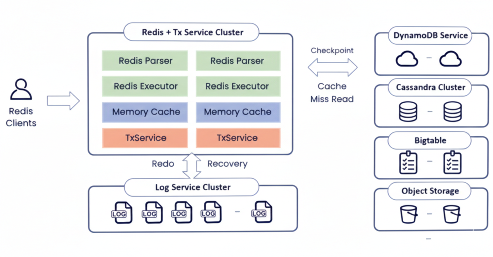
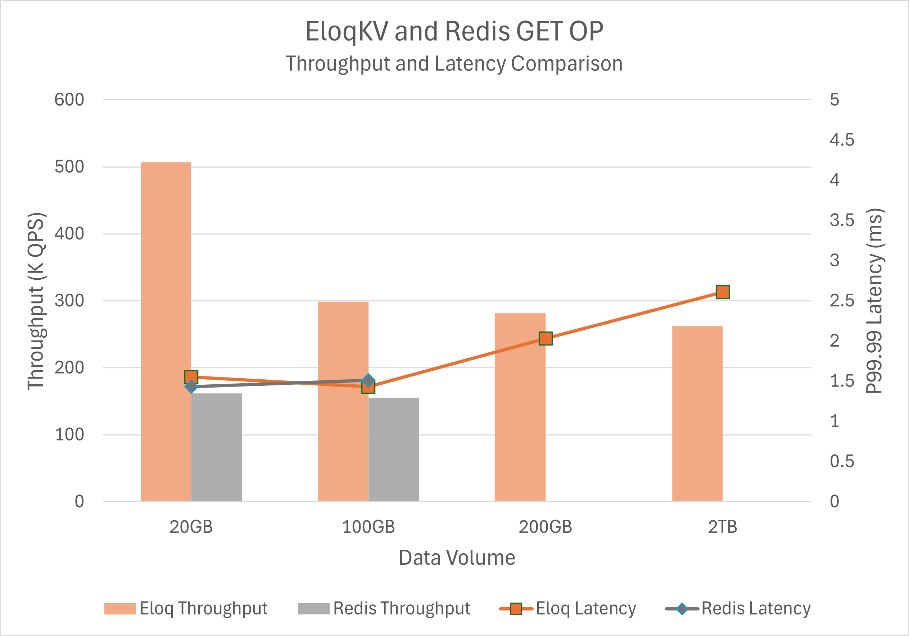
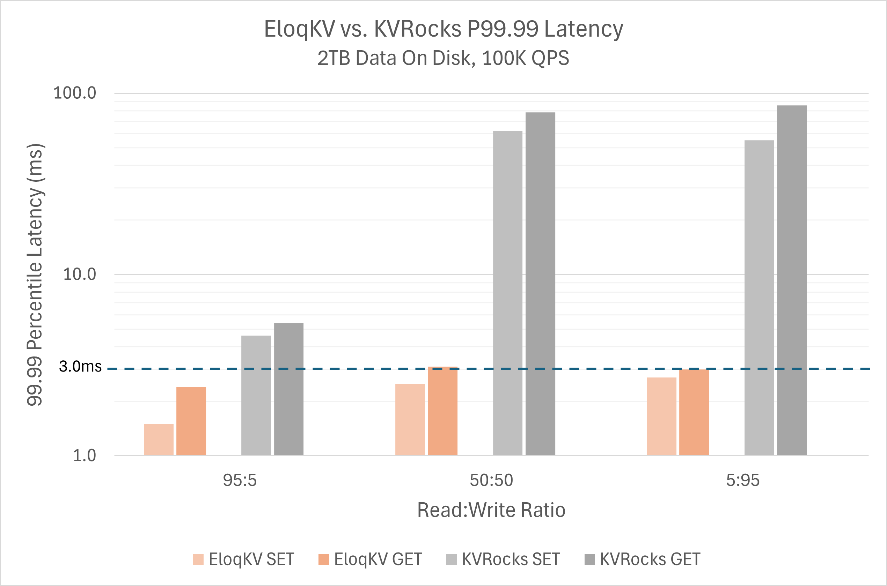
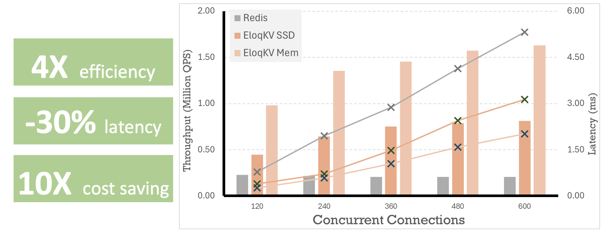

# 目录

- **EloqKV**
  - 简介
  - 架构
  - 核心特性
  - 性能评测
  - 典型场景

<p align="center">
<br/><br/>
<br/><br/>
<br/><br/>
<br/><br/>

</p>

<div style="page-break-after: always;"></div>

# EloqKV：具备内存级性能与 SSD 级成本的 Redis 兼容键值存储

## **简介**

EloqKV 是新一代 Redis 兼容的键值数据库，在保持内存级性能的同时，将成本降至 SSD 水平。与传统以内存为主的缓存系统不同，EloqKV 从设计之初就定位为一个**主存储级的持久化数据库**，而不是最佳努力（best-effort）的缓存层。它保证数据持久化，在分布式集群间提供强一致性，并且与现有 Redis 客户端和生态工具无缝集成——通常**无需对应用代码做任何修改**。

通过将绝大部分数据从昂贵的 DRAM 迁移到 NVMe SSD 上，EloqKV 消除了基于 DRAM 的系统在容量上的硬性上限，同时在大规模场景下可将整体 TCO（总拥有成本）降低**最多 10 倍**。

---

## **架构**

EloqKV 是一个由 Data Substrate 提供驱动的 Redis 兼容分布式键值存储。其架构包含一个兼容 Redis 协议的前端计算引擎。在 Data Substrate 内部，TxService 负责缓存热数据并管理事务处理，而 LogService 负责数据持久化。LogService 副本分布在不同可用区（AZ）之间，以保证在可用区级别故障下依然能够容灾。底层存储层支持可插拔的键值（KV）存储，例如 EloqStore、AWS DynamoDB、Google Bigtable 和 Cassandra。这些存储服务用于保存缓存不命中时的冷数据，并为基础数据提供高可用性。

<p align="center">

</p>

---

## **核心特性**

### **10 倍级别的规模化成本优势**

EloqKV 针对标准的 Redis 数据结构和访问模式进行了优化，但底层却围绕 SSD 原生的数据管理重新设计。对于单集群 **100 GB–100 TB** 这一类以内存为瓶颈的工作负载，EloqKV 可以：

- **将冷数据和温数据卸载到 NVMe SSD 上**，同时在 DRAM 中保留热点工作集。
- **保持与 Redis 相近的时延特征**，即便整体数据规模远超内存容量。
- **最多压缩约 10 倍的基础设施资源占用**，常见情形下可以用更少的 NVMe 优化节点替代庞大的 Redis 集群。

这让团队可以基于 SSD 的价格来扩容容量，而不是被 DRAM 的成本和上限所束缚。

### **主库级别的持久性与一致性**

EloqKV 从一开始就被设计为数据库级系统，而不仅仅是缓存：

- **预写日志（WAL）** 确保每一次写入都具备持久化与崩溃恢复能力。
- **无需处理复杂的缓存失效逻辑**：应用只需对一个统一的数据源进行读写，而不是在缓存与后端数据库之间来回同步。
- **内建分布式执行能力**，可以在分片间安全地支持多键事务（`MULTI/EXEC`）和 Lua 脚本——这些通常在标准 Redis 部署中较难实现或伴随巨大风险。
- **全集群级的事务语义**，在跨节点事务中保持状态一致，使 EloqKV 能够支撑关键在线业务系统。

### **在高压下依然保持时延稳定**

传统 Redis 集群在执行后台任务（基于 fork 的快照、大型 RDB 生成或副本重同步）时，往往会出现明显的时延抖动；当单节点内存规模不断增大时，也会接近实际可运维的上限。EloqKV 则通过以下设计规避了这些问题：

- **无 fork 的增量检查点机制**，仅刷新脏数据，避免昂贵的内存 fork 操作。
- **可预测的长尾时延**：检查点与压缩过程被精细调度，不会影响 P99–P9999 延迟曲线。
- **没有实际意义上的单节点内存上限**：在单节点 DRAM 达到 **50 GB+** 的同时，仍可利用 SSD 安全管理多 TB 级别的数据集。
- **健壮的副本加入与恢复流程**：备用节点加入时不会压垮主节点，从而避免大型 Redis 集群中常见的“重连风暴”（写缓冲 OOM → 重连 → 再次失败）模式。

### **简化的灾备能力与秒级分支克隆**

EloqKV 面向云原生场景打造了高可用与快速迭代能力：

- **通过对象存储实现灾备（DR）**：系统会定期将快照直接流式写入云对象存储，并做跨 Region 复制。这样无需额外引入 Redis Streams 或 Kafka 等系统进行日志传输，同时让异地备份 Region 在实际切换前几乎零成本。
- **秒级创建数据库分支**：团队可以基于对象存储中的快照，利用**零拷贝克隆**快速创建隔离、完整可用的数据库分支。即便在 **100 TB+** 规模的数据集上，也能在不复制物理存储的前提下，进行真实的预发布环境搭建、压测和实验。

---

## **性能评测**

我们在 NVMe SSD 基础设施上对 EloqKV 进行了大量性能评测，以验证其在真实负载下的时延与吞吐表现。

- **硬件配置**：测试部署在 Google Cloud 的 `z3-highmem-16` 实例上，每个节点配备 **16 vCPU、128 GB 内存**，以及 **2.9 TB NVMe SSD × 2**。
- **在 DRAM 与 SSD 规模下均具备高吞吐**：在数据集大小从 **20 GB（完全驻留 DRAM）** 到 **200 GB–2 TB（主要驻留 SSD）** 的范围内，EloqKV 在全部数据命中内存时可持续稳定在 **~600K QPS** 左右，在完全从磁盘读取的情形下约为 **~300K QPS**。
- **长尾时延始终保持较低水平**：在 **2 TB** 数据集（约 8 亿条 key，单值平均 2.5 KB）上，仅使用 **100 GB DRAM**，在 **100K QPS** 负载下，根据读写比不同，EloqKV 的 **P99.99 时延保持在 1.5 ms–3.1 ms** 之间。
- **近似线性的横向扩展能力**：吞吐量随节点数近似线性增长（例如，节点数增加 10 倍，吞吐基本也提升约 10 倍）。EloqKV 完全 **兼容 Redis 智能客户端**，并支持在客户端侧进行分片路由。

### **硬件与软件环境**

基准测试环境配置如下：

| 服务类型 | 节点规格      | 节点数量 | 磁盘配置        |
| -------- | ------------- | -------- | --------------- |
| EloqKV   | z3-highmem-16 | 1        | 2.9 TB × 1 NVMe |
| Redis    | z3-highmem-16 | 1        | 2.9 TB × 1 NVMe |
| KvRocks  | z3-highmem-16 | 1        | 2.9 TB × 1 NVMe |

### **测试方法**

所有基准测试均使用 `memtier_benchmark` 工具，采用如下具有代表性的命令：

```bash
# 加载数据
memtier_benchmark -t 10 -c 5 -s $SERVER_PRIVATE_IP -p 6379 -n allkeys --distinct-client-seed --ratio=1:0 --key-prefix="kvkeyprefix_" --key-minimum=1 --key-maximum=2000000000 --random-data --data-size=1000 --hide-histogram --key-pattern=P:P
# 查询数据
memtier_benchmark -t 10 -c 5 -s $SERVER_PRIVATE_IP -p 6379 --distinct-client-seed --ratio=5:95 --key-prefix="kvkeyprefix_" --key-minimum=1 --key-maximum=2000000000 --random-data --data-size=1000 --hide-histogram --print-percentiles=50,99,99.9,99.99 --test-time=360 --randomize --rate-limit=2000
```

我们基于多种工作负载，对 EloqKV 与 Redis 及其他支持 SSD 的系统进行了对比测试。

### **测试结果**

**测试一 – EloqKV 与 Redis 在不同数据规模下的吞吐与 P99.99 时延对比：**

<p align="center">

</p>

传统的 DRAM 中心化系统（例如 Redis）在容量上从根本上受制于内存大小。当数据集的体量逼近节点内存容量时，运维人员要么被迫严重超配 DRAM，要么只能通过激进分片来扩容。在我们的测试中，Redis 在小规模数据时表现良好，但一旦超过内存容量便难以继续扩展；而 EloqKV 则可以持续稳定运行，通过充分利用 NVMe 来支撑更大的数据集。

在 **20 GB** 和 **100 GB** 数据集下，EloqKV 的吞吐量**高于 Redis**，同时 P99.99 时延曲线几乎一致。当数据规模超过内存容量后，Redis 无法继续承担该工作负载，而 EloqKV 则顺利扩展到 **2 TB** 的数据集，并将 P99.99 时延稳定控制在几毫秒内——这类表现过去只能在纯 DRAM 的架构中实现。

**测试二 – EloqKV 与 Apache KvRocks（在不同负载下的长尾时延对比）：**

<p align="center">

</p>

我们同样将 EloqKV 与另一款支持 SSD 的键值存储 Apache KvRocks 进行了对比。在 IO 压力较大的工作负载下，KvRocks 的 P99.99 时延会随后台任务对前台读请求的干扰迅速攀升（图表采用对数坐标）。相比之下，EloqKV 能够将 P99.99 长尾时延保持在可控、可预测的范围内。

在现实部署中，要承载 **2 TB** 的数据集，企业通常需要部署 **约 20 个 Redis 节点**，以获得足够的总 DRAM 容量。EloqKV 则可以在**单个 NVMe 优化节点**上实现相当甚至更好的长尾时延表现，在简化运维的同时，将基础设施成本降低**最高可达 20 倍**。

---

## **关键技术场景**

### **1. 某头部智能手机厂商的 AI 聊天记录存储**

- **业务场景：** 某全球顶级智能手机厂商，为数以亿计的终端设备提供 AI 聊天助手服务。与传统人与人的聊天不同，AI 会话需要携带大量的提示词、系统上下文与模型输出，单次消息的体量更大，长期积累后需要实时读写的聊天记录规模呈指数增长。
- **原方案挑战：** 该客户此前基于 **AWS ElastiCache for Redis** 运行该业务。由于 Redis 需要将完整数据集常驻内存，随着提示词与历史消息持续增长，集群的内存需求以及对应的成本急剧攀升。
- **EloqKV 部署方案：** 客户将业务迁移至 EloqKV，将热点会话状态保留在内存中，同时将绝大部分历史记录安全地下沉到 NVMe SSD，在对外接口上仍保持 Redis 兼容。
- **业务收益：** 相比原先的 ElastiCache 方案，该客户的整体成本大约**降低了 10 倍**，同时仍然满足交互式 AI 聊天对低时延的严格要求。

<p align="center">

</p>

### **2. 大型电商推荐系统的特征库（Feature Store）**

- **业务场景：** 某大型电商平台维护着一个包含**数十亿商品 SKU** 的特征库，存储价格、库存、向量嵌入以及用户–商品交互等多种特征。每一次推荐请求都需要在单次调用中拉取**多达 1,000 个 SKU 的特征向量**，并且整体 P99 时延 SLA 要求控制在 **20 ms 以内**。
- **原方案挑战：** 该特征库最初部署在 Redis 上。为了满足时延要求，团队将全部特征数据放在 DRAM 中，并搭建了体量巨大的 Redis 集群。随着商品数量和特征维度持续增长，内存成本和运维复杂度都变得难以承受。
- **EloqKV 部署方案：** 企业将特征库迁移到 EloqKV，继续使用 Redis 兼容的数据结构以支持高速的 scatter–gather 访问模式。热点特征保留在 DRAM，而海量长尾 SKU 则直接由 NVMe SSD 提供，在不违反时延 SLA 的前提下完成访问。
- **业务收益：** EloqKV **将 DRAM 使用量和集群规模大约降低了 10 倍**，同时在 1,000 SKU 批量拉取的场景下依旧可以满足 **P99 < 20 ms** 的严格要求，使推荐系统可以在商品规模与模型复杂度不断增长的情况下仍具备可持续的经济性。

### **3. 某大型社交平台的社交图存储**

- **业务场景：** 某社交平台需要存储数亿用户之间的好友、关注关系。当前社交图约为 **500 GB**，预计将增长到 **1 TB+**。当用户在线时，相关好友关系会被高频访问，用于信息流生成、共同好友推荐以及安全风控等。
- **原方案挑战：**
  - 使用 **Redis** 时，所有在线与离线的好友关系都必须完整常驻内存，这不仅成本极高，还需要额外维护一套 MySQL 集群来负责持久化和恢复。
  - 后来迁移到 **Amazon DynamoDB** 后，虽然初始存储成本有所下降，但随着用户活跃度与 QPS 提升到 **~30K 请求/秒** 以上，读写吞吐计费与自动扩缩容行为叠加，使成本急剧攀升，在更高流量下甚至超过预计的 Redis TCO。
- **EloqKV 部署方案：** 通过采用 EloqKV 作为好友关系图的主存储，该平台将缓存与持久化整合为一套统一、Redis 兼容的系统。热点社交邻域可以从内存中快速返回，其余关系则持久保存在 NVMe SSD 上，并具备数据库级的耐久性保障。
- **业务收益：** 与继续扩容 Redis 或 DynamoDB 两条路径相比，该平台在该工作负载上的整体成本预估**节省约 10 倍**，同时在高峰流量下仍然能够提供实时社交体验所需的低时延图查询能力。

