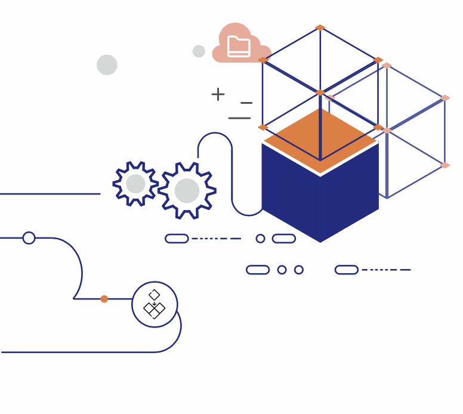
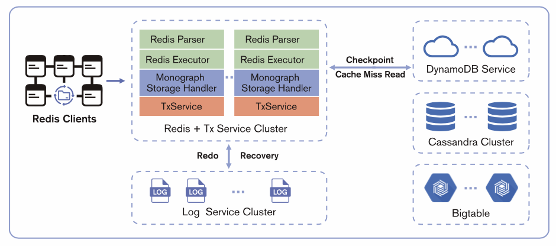
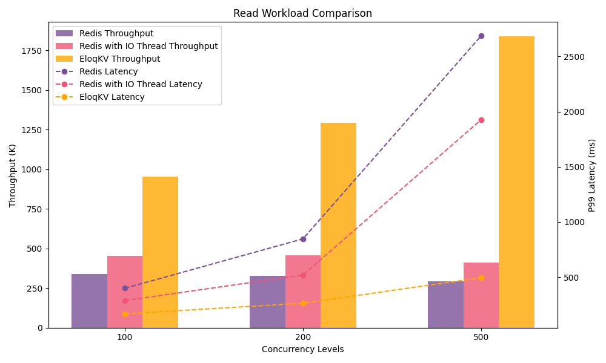
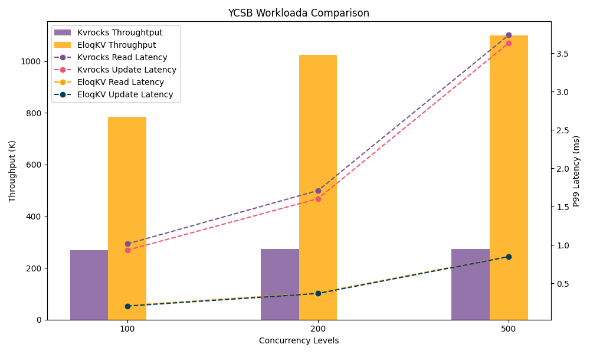

# Table of Contents

- **EloqKV**
  - EloqKV: Redis Compatible Blazing-Fast Transactional KV Store
  - Benchmark Report of EloqKV

<p align="center">
<br/><br/>
<br/><br/>

</p>

<div style="page-break-after: always;"></div>

# EloqKV: Redis Compatible Blazing-Fast Transactional KV Store

## Introduction

In today's fast-paced digital landscape, speed and reliability are paramount. Latency is the enemy, and data integrity is a non-negotiable. Traditional caching solutions like Redis offer fast reads, but lack the robust transaction support needed for mission-critical applications. Introducing EloqKV, a revolutionary distributed transactional cache powered by Data Substrate, that shatters performance barriers while ensuring rock-solid data consistency.

## Achitecture

EloqKV is a decoupled distributed database powered by Data Substrate. Its architecture includes a frontend compute engine compatible with the Redis protocol. Within Data Substrate, the TxService is responsible for caching hot data and managing transaction processing, while the LogService handles data persistence. LogService replicas are distributed across different availability zones (AZs) to ensure tolerance to AZ-level failures. The underlying storage layer supports pluggable key-value (KV) storages, such as AWS DynamoDB, Google Bigtable, and Cassandra. These cloud storage services store cold data for cache misses and provide high availability for baseline data.

<p align="center">

</p>

## Beyond Caching, Embracing Transactions

Unlike its peers, EloqKV transcends the limitations of simple key-value stores. It seamlessly integrates full ACID (Atomicity, Consistency, Isolation, Durability) properties across distributed transactions and clusters. This unlocks unprecedented functionality, empowering you to:

- Ditch the Duo: Say goodbye to the cumbersome MySQL + Redis combo. EloqKV eliminates cache coherence issues entirely, simplifying your architecture and boosting efficiency.
- Transactional Confidence: Ensure data integrity across reads and writes, even in complex distributed environments.
- Unlock New Application Scenarios: Tackle use cases beyond traditional caching, venturing into the realm of transactional microservices and stateful data management.

## Cost-Conscious Performance Made Simple

EloqKV leverages Data Substrate's innovative architecture to deliver performance and cost-effectiveness in perfect harmony:

- Memory for Speed: Frequently accessed data dances in-memory, guaranteeing lightning-fast reads and blazing-fast write performance through parallel logging.
- Cloud for Cold Data: As data cools, it gracefully migrates to cost-effective cloud key-value stores, freeing up precious DRAM resources.
- Asynchronous Checkpoints: Minimize IOPS requirements and optimize performance while keeping transactional reads readily available for cache misses.
- Operational Efficiency: Slash operational costs with cloud storage and enjoy streamlined maintenance thanks to Data Substrate's modular design.

## Leverage Parallel Processing Power:

EloqKV doesn't settle for single-threaded limitations. It flexes its multi-threaded architecture to:

- Maximize Hardware Potential: Uncork the full power of modern CPUs, maximizing resource utilization and delivering exceptional performance.
- Crush Bottlenecks with Concurrent Execution: Say goodbye to single-threaded limitations. EloqKV's multi-threaded architecture handles tasks simultaneously, significantly boosting performance and efficiency.

## Scale on Demand, Optimize on the Fly

EloqKV adapts to your dynamic needs, scaling seamlessly to match your workload:

- Memory Scaling: When hot data demands grow, instantly expand in-memory capacity for uninterrupted performance.
- Log Service Optimization: Handle surges in write traffic by effortlessly scaling the log service.
- Cloud Storage Growth: As historical data accumulates, seamlessly expand the cloud storage layer to accommodate your evolving needs.

## Use Cases

- **GenAI-Ready File System**: Empower the era of general artificial intelligence with a metadata engine capable of handling billions of files seamlessly.

- **Gaming**: Leaderboards and Player Profiles: Manage global leaderboards and player data with high concurrency and low latency, ensuring a smooth and responsive experience for millions of gamers.

- **Ad-tech:**: Real-time Bidding and Ad Serving: Handle high-volume ad requests and deliver relevant ads with millisecond latency, maximizing ad performance and revenue.

- **E-commerce**: Inventory Management and Product Catalog: Ensure real-time inventory updates and fast product searches for millions of items, optimizing customer experience and preventing stockouts.

## EloqKV: The Future of Caching is Here

Forget about performance compromises and sacrificing data integrity. EloqKV delivers the best of both worlds: blazing speed, unwavering reliability, and cost-effective scalability. So, ditch the clunky workarounds and embrace the future of caching with EloqKV.

# Benchmark Report of EloqKV

## Introduction

EloqKV is a Redis-compatible key-value store with high performance and linear scalability. Unlike Redis, EloqKV leverages multiple worker threads to fully utilize CPU resources, avoiding the need for a Redis cluster even on a single machine. Compared with LSM tree-based persistent Redis like Kvrocks, EloqKV accesses key-value stores asynchronously, eliminating latency bottlenecks and enabling decoupled compute and storage with microsecond latency.

To highlight EloqKV's advantages, we will conduct the following experiments:

- Benchmarking EloqKV against a pure caching service like Redis.

- Benchmarking EloqKV against a Redis-compatible key-value store like Kvrocks, which supports persistence.

## Experiment I: EloqKV vs. Redis

In the first scenario, we compare the performance of EloqKV with Redis. The goal of this comparison is to evaluate the performance of EloqKV in pure memory mode, without enabling SSD-based key-value storage, and to assess its capability to fully utilize CPU cores.

### Hardware and Software

The deployment details is as follows:

| Service type | Node type   | Node count | Disk count |
| ------------ | ----------- | ---------- | ---------- |
| Redis        | m6i.8xlarge | 1          | 500GB\*1   |

| Service type | Node type   | Node count | Disk count |
| ------------ | ----------- | ---------- | ---------- |
| EloqKV       | m6i.8xlarge | 1          | 500GB\*1   |

### Benchmark Method

Tool: `memtier_benchmark`.

Commands:

```
memtier_benchmark -s $SERVER_PRIVATE_IP --distinct-client-seed --hide-histogram --ratio 1:0 -t 10 -c 10 --test-time=300
memtier_benchmark -s $SERVER_PRIVATE_IP --distinct-client-seed --hide-histogram --ratio 0:1 -t 10 -c 10 --test-time=300
```

### Results

We study the throughput and latency of the two databases under diffrent workloads.

X-axis: Represents the varying thread numbers employed during the benchmark, simulating different levels of concurrent database access.

Left Y-axis: Measures the QPS (Queries Per Second).

Right Y-axis: Measures the Latency (P99).

- Read Only Workload:

<p align="center">

</p>

- Write Only Workload:

<p align="center">

</p>

EloqKV consistently outperformed Redis in terms of Queries Per Second (QPS) and latency across various workloads. Redis, even with IO threads, could not fully utilize CPU resources, and its latency increased sharply with higher concurrency. In contrast, EloqKV maintained stable latency under 500 microseconds, even at high concurrency.

## Experiment II: EloqKV vs. Kvrocks

In the second scenario, we compare the performance of EloqKV with Kvrocks. Kvrocks is an LSM tree-based persistent Redis, designed to store cold data on SSDs to reduce costs. The goal of this comparison is to evaluate the performance of EloqKV in persistent mode by enabling SSD-based key-value storage.

### Hardware and Software

The deployment details is as follows:

| Service type | Node type    | Node count | Disk count |
| ------------ | ------------ | ---------- | ---------- |
| Kvrocks      | m6id.8xlarge | 1          | 1.9TB\*1   |

| Service type | Node type    | Node count | Disk count |
| ------------ | ------------ | ---------- | ---------- |
| EloqKV       | m6id.8xlarge | 1          | 1.9TB\*1   |

### Benchmark Method

Tool: `ycsb`.

Command:

```
ycsb load redis -P workloada
ycsb run redis -P workloada
```

### Results

We study the throughput and latency of the two databases under diffrent workloads.

X-axis: Represents the varying thread numbers employed during the benchmark, simulating different levels of concurrent database access.

Left Y-axis: Measures the QPS (Queries Per Second).

Right Y-axis: Measures the Latency (P99).

- YCSB Workloada with 50% read and 50% update:

<p align="center">

</p>

EloqKV consistently outperformed Kvrocks in terms of QPS and latency in read and write mixed workloads, demonstrating its superiority in handling concurrent database access.

## Takeaways:

EloqKV delivers blazing speed, unwavering reliability, and cost-effective scalability, making it the future of caching. Ditch the clunky workarounds and embrace the next generation of transactional key-value stores with EloqKV.
