# 目录

- **EloqSQL**
  - EloqSQL：支持弹性扩展的分布式高性能SQL数据库
  - EloqSQL基准测试报告
- **EloqKV**
  - EloqKV：支持事务的分布式Redis兼容键值数据库
  - EloqKV基准测试报告
- **附录**
  - 使用数据基层构建您的数据库

<p align="center">
<br/><br/>
<br/><br/>

</p>

<div style="page-break-after: always;"></div>

# EloqSQL：支持弹性扩展的分布式高性能SQL数据库

## 简介

在当今数据驱动的世界中，组织机构面临着管理不断增长的数据量的挑战，同时需要确保高性能、可扩展性和成本效益。传统数据库系统往往难以满足这些需求，导致性能瓶颈和资源浪费。

EloqSQL是一个革命性的分布式SQL数据库，直接应对这些挑战。由其创新的Data Substrate驱动，EloqSQL为延迟敏感的工作负载提供卓越的弹性、可扩展性和性能，使其成为现代企业的理想选择。

## 架构

EloqSQL是一个由Data Substrate驱动的解耦分布式数据库。其架构包括一个兼容MySQL协议的前端计算引擎。在Data Substrate内部，TxService负责缓存热数据和管理事务处理，而LogService负责数据持久化。LogService副本分布在不同的可用区（AZ）以确保对AZ级故障的容错。底层存储层支持可插拔的键值（KV）存储，如AWS DynamoDB、Google Bigtable和Cassandra。这些云存储服务存储缓存未命中的冷数据，并为基线数据提供高可用性。

<p align="center">
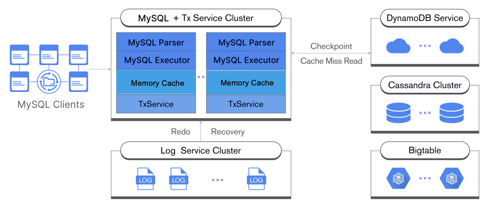
</p>

## 主要特性

### MySQL兼容性：

- 与现有MySQL应用程序无缝集成
- 利用熟悉的MySQL协议和语法

### 弹性并行日志：

- 专利的一阶段提交技术，提升分布式事务性能
- 单节点模式下事务每秒处理量比MySQL提高4倍
- 消除写密集型工作负载的日志瓶颈

### 弹性内存缓存：

- 通过高度可扩展的内存数据存储最小化读取延迟
- 支持哈希和范围分区以实现高效的数据分布
- 自动扩展和重新平衡以实现最佳性能
- 将冷数据检查点存储到云存储以实现高效的缓存未命中读取

### 解耦云存储：

- 存储和计算资源独立扩展
- 大型数据集的成本效益管理
- 优化冷数据的资源利用
- 通过EloqSQL的无缝混合云存储避免云厂商锁定，确保数据生态系统的未来发展

## 用例

EloqSQL的独特性能、弹性和成本效益使其成为跨行业广泛用例的理想选择。以下是一些例子：

- **FinTech**：支付处理：处理高交易量的交易，速度快且可靠。确保数据一致性，同时保持复杂交易延迟低。

- **游戏**：游戏持久性：提供无缝的游戏体验，可靠的事务处理和一致的游戏状态管理。确保玩家不会失去进度或遇到中断。

- **电子商务**：订单管理：快速高效地处理订单，具有弹性扩展能力，无需延迟即可处理高峰流量。确保数据准确性并防止订单履行错误。

- **Saas**：元数据管理：使用EloqSQL的分布式架构高效管理SaaS平台的大量元数据。可无缝扩展以适应不断增长的元数据量，而不会影响性能或可用性。

## EloqSQL：拥抱分布式SQL的未来：

分布式SQL的性能权衡和不可扩展性已成为过去。EloqSQL通过以下方式重写规则：

- 按需弹性扩展：可无缝扩展以匹配工作负载。需要快速查询？扩展计算引擎。面对写密集型流量？扩展日志服务。EloqSQL精确适应，确保在无需过度支付的情况下实现最佳性能。
- 成本效益效率：离开昂贵的两阶段提交。EloqSQL的创新架构在无需不必要的膨胀的情况下提供卓越性能，显著降低了与传统NewSQL系统相比的操作成本。
- 摆脱笨拙的解决方案：忘记复杂的分片和繁琐的数据管理。EloqSQL简化基础设施，让您专注于构建出色的应用程序，而不是与数据库开销作斗争。

EloqSQL是分布式SQL的未来。你准备好打破束缚了吗？

<div style="page-break-after: always;"></div>

# EloqSQL基准测试报告

## 简介

对可以满足现代数据密集型应用程序挑战的高性能、可扩展数据库的需求继续增长。NewSQL数据库已经出现，以满足这些需求，提供传统RDBMS系统的事务一致性和NoSQL数据库的可扩展性。

虽然NewSQL承诺可扩展性和事务一致性，但许多系统在性能方面存在问题。与单节点解决方案（如MySQL）相比，它们的成本效率较低，高延迟使它们不适合延迟敏感任务。

EloqSQL通过独特的方法打破了NewSQL性能障碍：基于数据子结构的内存事务处理，一阶段提交协议以最小化磁盘I/O，以及异步键值存储访问以消除延迟瓶颈。

为了照亮EloqSQL的边缘，我们将重点进行以下实验：

- 将EloqSQL与领先的NewSQL数据库进行混合工作负载实验，以证明其性能优势，包括分布式事务。
- 暴露传统数据库的限制，并强调可扩展内存在一致性能中的关键作用，因为AWS RDS由于缓存未命中而下降，即使添加读取副本也无法修复。
- 揭示云中写密集型工作负载从扩展CPU和内存中受益较少，表明EloqSQL解耦架构的价值。相反，专注于扩展真正的瓶颈，如日志服务，可以解锁未匹配的性能。

## 实验I：

在第一个场景中，我们将EloqSQL与流行的开源NewSQL数据库（参考本报告中的NewSQL-X）进行比较。此比较的目的是评估EloqSQL在各种工作负载下的性能，特别是分布式事务工作负载及其潜在的性能优势。

使用了混合工作负载，模拟读取和写入操作以评估整体性能。

- 分布式事务：事务跨越多个数据库实例，确保分布式事务处理能力的全面评估。每个事务涉及组合更新、删除或插入查询，模拟现实世界应用程序的复杂性。
- 单更新：事务涉及单个非索引更新，评估基本写操作的处理效率。
- 点选择：事务涉及单点选择查询，测量基本读操作的速度和效率。

### 硬件和软件：

为了在相同的硬件配置中测试NewSQL数据库，我们在同一节点中部署EloqSQL，即部署TxService、LogService和KVStore。部署细节如下：

| 服务类型 | 节点类型       | 节点数量 | 磁盘数量 |
| -------- | -------------- | -------- | -------- |
| NewSQL-X | n2-standard-32 | 3        | 500G\*1  |

| 服务类型 | 节点类型       | 节点数量 | 磁盘数量 |
| -------- | -------------- | -------- | -------- |
| EloqSQL  | n2-standard-32 | 3        | 500G\*1  |

为了说明EloqSQL的并行日志功能并最大化I/O性能，我们设置了一个新的EloqSQL部署，具有三个50GB SSD磁盘。请注意，三个50GB SSD磁盘比云中的96个计算资源便宜得多。

| 服务类型 | 节点类型       | 节点数量 | 磁盘数量         |
| -------- | -------------- | -------- | ---------------- |
| EloqSQL  | n2-standard-32 | 3        | 350G\*1 + 50G\*3 |

磁盘注意事项：

- NewSQL-X的官方基准报告使用了本地SSD，无法在实例重启后持久化数据。
- 为了与云原生环境保持一致并确保数据持久性，此基准测试使用了GCP中的PD-SSD磁盘。

### 结果

首先，我们研究两个数据库在不同工作负载下的吞吐量。

X轴：表示基准测试期间使用的不同线程数量，模拟不同的并发数据库访问级别。

Y轴：测量QPS（每秒查询数）。

- 分布式事务工作负载：

<p align="center">

</p>

- 单更新工作负载：

<p align="center">
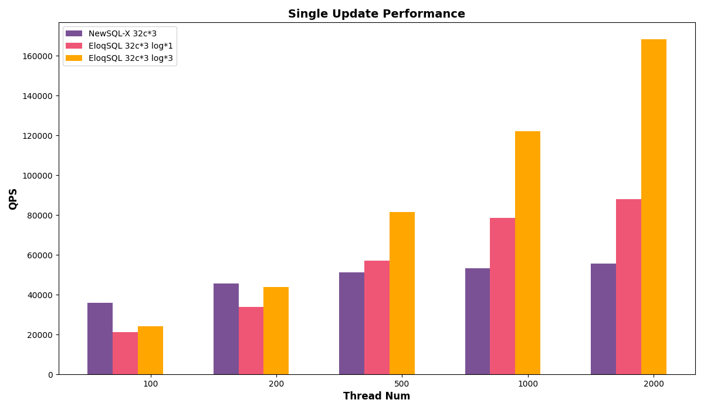
</p>

- 点选择工作负载：

<p align="center">
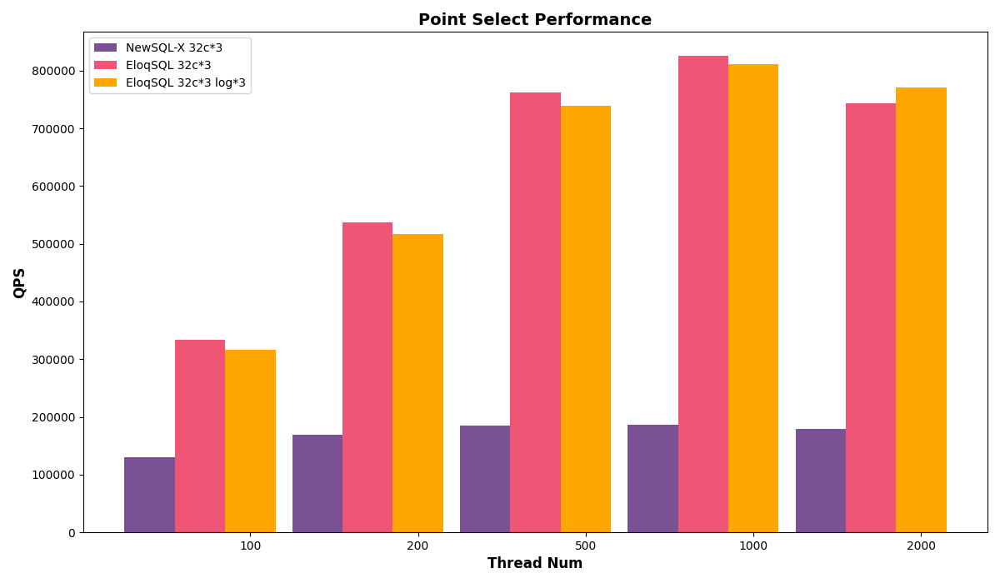
</p>

接下来，我们研究两个数据库的延迟。

X轴：表示基准测试期间使用的不同线程数量，模拟不同的并发数据库访问级别。

Y轴：测量延迟。

- 分布式事务工作负载：

<p align="center">

</p>

- 单更新工作负载：

<p align="center">
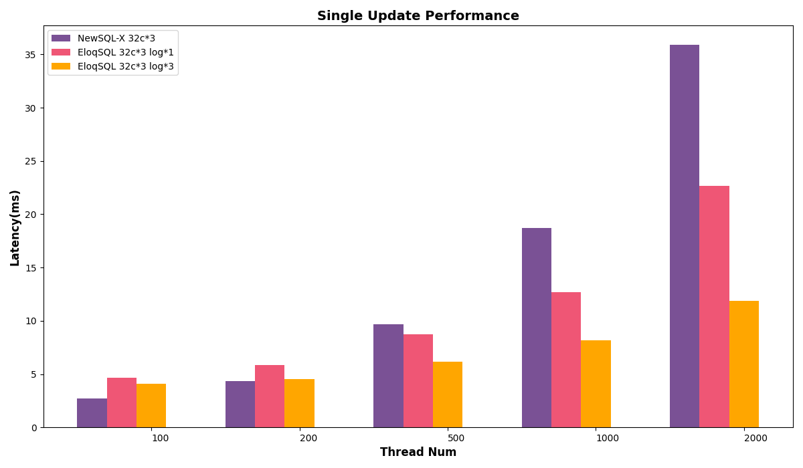
</p>

- 点选择工作负载：

<p align="center">
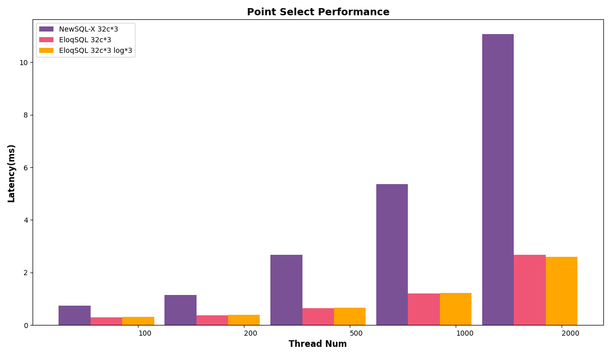
</p>

上述结果表明，EloqSQL在不同类型的负载中始终优于NewSQL-X，在QPS和延迟方面。这种优势在分布式事务中尤为明显。当配置三个附加磁盘以进行并行日志记录时，EloqSQL进一步提高了写入吞吐量。

### 关键要点

与NewSQL相比，EloqSQL具有处理分布式事务和在要求苛刻的工作负载下提供高性能的能力。其创新的数据子结构架构使其能够实现比NewSQL-X高得多的QPS，使其成为寻求高性能、可扩展NewSQL数据库解决方案的组织的吸引力选择。

## 实验II：

许多组织落入陷阱，添加读取副本以解决RDS MySQL的缓存未命中问题。此实验揭示了此类努力的徒劳，并介绍了EloqSQL的内存扩展能力以保持性能，即使在内存限制下。

### 硬件和软件：

为了确保与MySQL RDS进行基准测试的硬件级别，我们在同一节点中部署EloqSQL，将TxService、LogService和KVStore存储在同一节点中。以下是部署配置的分解：

- EloqSQL：6个节点，每个节点16个核心/64GB内存
- AWS RDS（MySQL）：1个读写节点+5个只读节点，每个节点16个核心/64GB内存

### 结果

X轴：表示从100毫秒记录到4亿记录的不同热数据大小，模拟数据大小增加时的缓存未命中。

Y轴：测量QPS（每秒查询数）。

- 我们使用点选择均匀分布随机选择搜索键，确保每个键具有相同的概率被选择。

<p align="center">
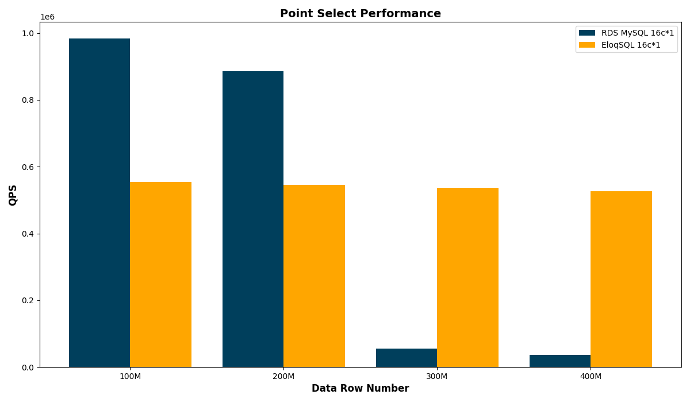
</p>

结果表明，AWS RDS在数据大小较小时优于EloqSQL，并且可以在单个节点内存中完全缓存。随着数据大小增加，AWS RDS的QPS急剧下降，这是由于大量缓存未命中的原因。然而，EloqSQL可以保持一致的性能。

### 关键要点

- 对于适合单个节点内存（少于2亿记录）的数据集，读取副本提供性能优势，因为：RDS读取副本作为独立数据库运行，确保所有查询都在本地执行，消除远程通信的开销。相反，EloqSQL的分布式内存架构需要通过RPC（远程过程调用）进行远程内存访问，以跨越多个分片读取请求，引入延迟并可能影响性能。

- 对于超过单个节点内存容量（约3亿记录）的数据集，分布式内存架构（如EloqSQL）比读取副本在读取性能方面表现更好。原因有两个。1. RDS缓存未命中阻碍性能：随着数据超过单个节点内存，RDS频繁缓存未命中，因为随机分布查询导致读取速度明显变慢。即使添加更多读取副本也无法缓解这个问题。2. EloqSQL扩展到缓存一切：EloqSQL的分布式内存架构在这些场景中表现出色。它水平扩展，有效地跨多个节点缓存所有热数据，确保无论数据集大小如何，一致且高的读取性能。

## 实验III：

利用其解耦架构，EloqSQL使战略资源分配以优化性能，跨不同组件。在此基准测试中，我们揭示了事实，即扩展CPU和内存对写密集型工作负载没有帮助。我们演示了EloqSQL解耦架构的价值，支持专注于扩展真正的瓶颈，如日志服务，通过分配额外的磁盘以解锁未匹配的性能。

### 硬件和软件：

利用EloqSQL的解耦架构，我们战略性地将组件分布在节点上以优化资源利用。我们的基本配置包括48个核心TxService节点与单个磁盘LogService节点。然后，我们探索性能增益，通过将TxService节点扩展到64个核心并增加LogService磁盘数量到3。

| 服务类型   | 节点类型       | 节点数量 | 磁盘数量 |
| ---------- | -------------- | -------- | -------- |
| txservice  | n2-standard-48 | 1        | 1        |
| logservice | n2-standard-8  | 1        | 1        |
| cassandra  | n2-standard-8  | 1        | 1        |

| 服务类型   | 节点类型       | 节点数量 | 磁盘数量 |
| ---------- | -------------- | -------- | -------- |
| txservice  | n2-standard-64 | 1        | 1        |
| logservice | n2-standard-8  | 1        | 1        |
| cassandra  | n2-standard-8  | 1        | 1        |

| 服务类型   | 节点类型       | 节点数量 | 磁盘数量 |
| ---------- | -------------- | -------- | -------- |
| txservice  | n2-standard-48 | 1        | 1        |
| logservice | n2-standard-8  | 1        | 3        |
| cassandra  | n2-standard-8  | 1        | 1        |

### 结果

首先，我们研究不同扩展选择的读取吞吐量。

X轴：表示基准测试期间使用的不同线程数量，模拟不同的并发数据库访问级别。

Y轴：测量QPS（每秒查询数）。

- 点选择工作负载

<p align="center">
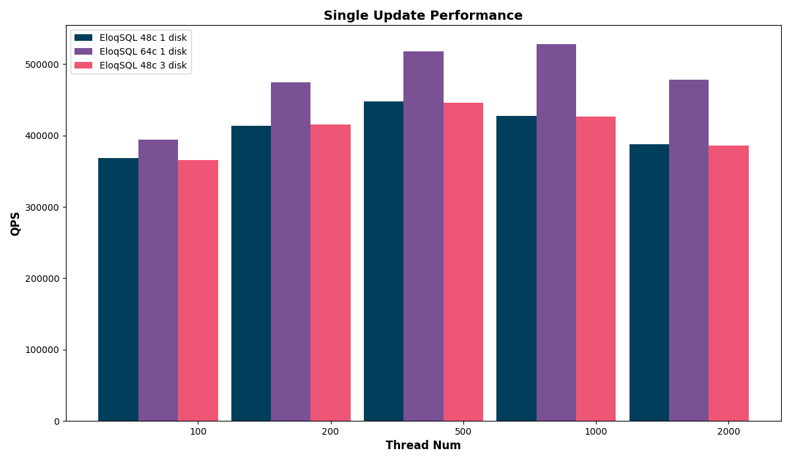
</p>

结果表明，从48个核心扩展到64个核心的CPU核心可以显著提高读取吞吐量，而扩展日志资源则没有改善。这与预期一致，因为读取密集型工作负载主要受益于额外处理能力，而不是增强日志功能。

接下来，我们研究不同扩展选择的写入吞吐量。

X轴：表示基准测试期间使用的不同线程数量，模拟不同的并发数据库访问级别。

Y轴：测量QPS（每秒查询数）。

- 单更新工作负载

<p align="center">
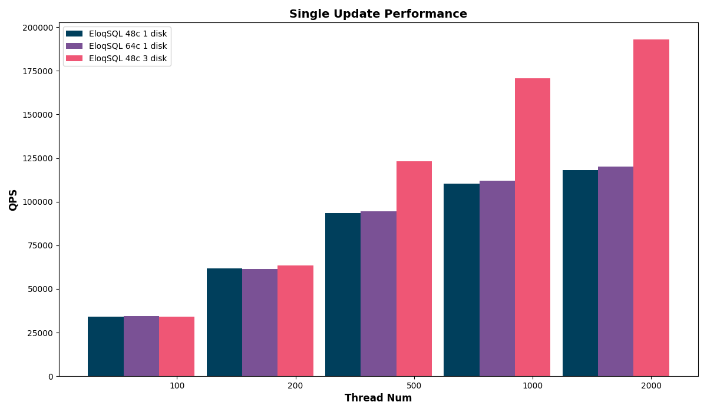
</p>

结果表明，扩展CPU超过48个核心并没有提高写入吞吐量，但扩展日志确实提高了写入吞吐量，揭示了磁盘I/O作为系统主要瓶颈的事实。

### 关键要点

EloqSQL的革命性解耦架构打破了单片扩展限制。其不同组件——CPU/内存、日志和键值存储——独立扩展，使资源分配目标化。优化写入吞吐量，通过扩展日志，释放读取性能，通过扩展CPU/内存，并使用键值存储扩展大量数据集。

<div style="page-break-after: always;"></div>

# EloqKV：重新定义的闪电般快速、分布式和事务性的Redis兼容KV存储

## 简介

在当今快速发展的数字环境中，速度和可靠性至关重要。延迟是敌人，数据完整性是非谈判的。传统缓存解决方案（如Redis）提供快速读取，但缺乏确保关键任务应用程序所需的强大事务支持。介绍EloqKV，一个革命性的分布式事务缓存，由Data Substrate驱动，以打破性能障碍，同时确保坚固的数据一致性。

## 架构

EloqKV是一个由Data Substrate驱动的解耦分布式数据库。其架构包括一个兼容Redis协议的前端计算引擎。在Data Substrate内部，TxService负责缓存热数据和管理事务处理，而LogService负责数据持久化。LogService副本分布在不同的可用区（AZ）以确保对AZ级故障的容错。底层存储层支持可插拔的键值（KV）存储，如嵌入式RocksDB、AWS DynamoDB、Google Bigtable和Cassandra。这些存储服务存储缓存未命中的冷数据，并为基线数据提供高可用性。

<p align="center">
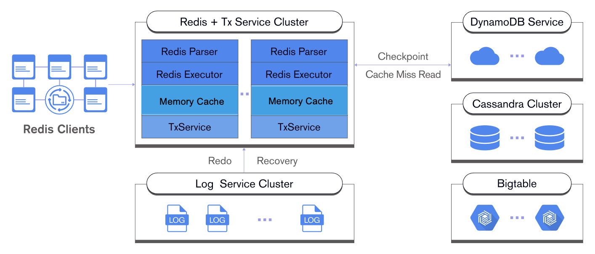
</p>

## 超越缓存，拥抱事务

与同类产品不同，EloqKV超越了简单键值存储的限制。它无缝集成完整的ACID（原子性、一致性、隔离性和持久性）属性，以跨分布式事务和集群。这解锁了前所未有的功能，使您能够：

- 摆脱双：告别繁琐的MySQL + Redis组合。EloqKV完全消除了缓存一致性问题，简化了架构并提高了效率。
- 事务信心：确保读取和写入的数据完整性，即使在复杂的分布环境中。
- 解锁新应用程序场景：解决传统缓存用例之外的用例，进入事务微服务和状态数据管理领域。

## 成本效益性能简单

EloqKV利用Data Substrate的创新架构在成本效益方面提供性能和效率：

- 内存速度：频繁访问的数据在内存中跳舞，确保快速读取和快速写入性能，通过并行日志记录。
- 云冷数据：随着数据冷却，它优雅地迁移到成本效益高的云键值存储，释放宝贵的DRAM资源。
- 异步检查点：最小化IOPS要求并优化性能，同时保持事务读取可用于缓存未命中。
- 操作效率：通过云存储削减操作成本并享受数据子结构模块化设计的简化维护。

## 利用并行处理能力：

EloqKV不满足单线程限制。它利用其多线程架构：

- 最大化硬件潜力：释放现代CPU的全部功能，最大化资源利用并提供卓越性能。
- 通过并发执行粉碎瓶颈：告别单线程限制。EloqKV的多线程架构同时处理任务，显著提高性能和效率。

## 按需扩展，按需优化

EloqKV适应您的动态需求，可无缝扩展以匹配工作负载：

- 内存扩展：当热数据需求增长时，可立即扩展内存容量以实现连续性能。
- 日志服务优化：处理写入流量激增，通过轻松扩展日志服务。
- 云存储增长：随着历史数据积累，可无缝扩展云存储层以适应您的不断变化的需求。

## 用例

- **GenAI就绪文件系统**：使用元数据引擎为通用人工智能时代提供能力，该引擎能够无缝处理数十亿文件。

- **游戏**：排行榜和玩家配置文件：管理全球排行榜和玩家数据，具有高并发性和低延迟，确保流畅且响应性体验，适用于数百万游戏玩家。

- **Ad-tech**：实时出价和广告服务：处理高流量广告请求并提供相关广告，具有毫秒延迟，最大化广告性能和收入。

- **电子商务**：库存管理和产品目录：确保实时库存更新和快速产品搜索，优化客户体验并防止缺货，适用于数百万件商品。

<div style="page-break-after: always;"></div>


# EloqKV基准测试报告

## 实验I EloqKV作为内存缓存：

在第一个场景中，我们将EloqKV评估为内存缓存，重点是其单节点性能。我们将EloqKV与广泛使用的内存数据存储Redis进行比较，以及一个新选项DragonflyDB，由于其多线程架构和优化的实现利用了现代创新。

### 硬件和软件：

服务器机器：

| 服务               | 节点类型     | 节点数量 |
| ------------------ | ------------ | -------- |
| Redis 7.2.5        | c7g.8xlarge  | 1        |
| DragonflyDB 1.21.2 | c7g.8xlarge  | 1        |
| EloqKV 0.7.4       | c7g.8xlarge  | 1        |
| 客户端 - Memtier   | c6gn.8xlarge | 1        |

我们按照官方说明设置[**EloqKV**](/eloqkv/install-from-binary)、[DragonflyDB](https://www.dragonflydb.io/docs/getting-started/binary)和[Redis](https://redis.io/docs/latest/operate/oss_and_stack/install/install-redis/)。

对于Redis，我们禁用了AOF和RDB持久性。

```
redis-server --save "" --appendonly no
```

对于DragonflyDB，我们只需要禁用检查点，因为它不支持日志记录。

```
dragonfly --dbfilename=
```

对于**EloqKV**，我们禁用持久存储并关闭WAL（写前日志）在其`config.ini`文件中。

```
# set it to off to turn off persistent storage
enable_data_store=off
# set it to off to turn off WAL
enable_wal=off
```

### 写入工作负载

为了评估**EloqKV**的写入性能，我们运行`memtier_benchmark`，比例为1:0（写入），使用以下配置：

```
memtier_benchmark -t $thread_num -c $client_num -s $server_ip -p $server_port --distinct-client-seed --ratio=1:0 --key-prefix="kv_" --key-minimum=1 --key-maximum=5000000 --random-data --data-size=128 --hide-histogram --test-time=300
```

- `-t`：线程数量，设置为固定值32。
- `-c`：每个线程的客户端数量。我们将其配置为4、8、16和32，以评估不同的并发级别。这导致总并发量为128、256、512和1024，计算为`thread_num × client_num`。
- `--ratio`：设置：获取比例，1:0用于写入工作负载。

#### 结果

以下是写入工作负载的结果。

X轴：表示不同的并发性（`thread_num × client_num`），模拟不同的并发数据库访问级别。

左Y轴：通过QPS（每秒查询数）测量吞吐量。

右Y轴：99.9百分位延迟以毫秒（ms）为单位测量。

<p align="center">

</p>

**EloqKV**和DragonflyDB都比Redis表现更好，因为它们支持多个工作线程。**EloqKV**在各种并发场景中提供了几乎相同的快速读取和快速写入性能。

### 读取工作负载

对于读取工作负载，我们将设置：获取比例调整为0:1（只读）：

```
memtier_benchmark -t $thread_num -c $client_num -s $server_ip -p $server_port --distinct-client-seed --ratio=0:1 --key-prefix="kv_" --key-minimum=1 --key-maximum=5000000 --random-data --data-size=128 --hide-histogram --test-time=300
```

- `--ratio`：设置为0:1用于读取操作。

#### 结果

<p align="center">
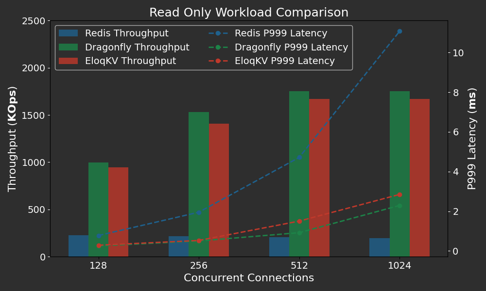
</p>

再次，**EloqKV**提供了略低的吞吐量，但仍然非常尊重的延迟比较DragonflyDB。两者**EloqKV**和DragonflyDB都显著优于Redis，在吞吐量和延迟方面。

### 混合写入读取工作负载

最后，混合工作负载，具有1:10的Put：获取比例：

```
memtier_benchmark -t $thread_num -c $client_num -s $server_ip -p $server_port --distinct-client-seed --ratio=1:10 --key-prefix="kv_" --key-minimum=1 --key-maximum=5000000 --random-data --data-size=128 --hide-histogram --test-time=300
```

- `--ratio`：设置为1:10用于混合写入读取操作。

<p align="center">
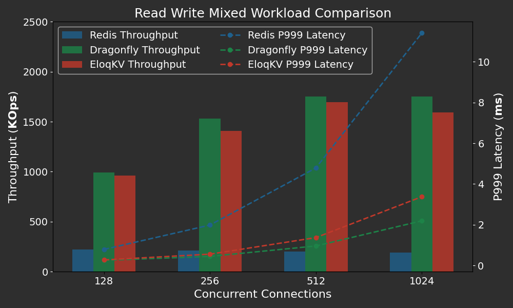
</p>

**EloqKV**显示了与DragonflyDB类似的吞吐量。随着并发性增加，**EloqKV**在999百分位上显示了比DragonflyDB更高的P999延迟，但即使在超过一千个并发连接的情况下，仍然保持在4ms以下。

### 关键要点

基于以前的实验，我们可以获得一些有趣的观察。在此部分，我们将给出一些（主观）分析。

#### 单工作程序与多工作程序

**EloqKV**和DragonflyDB可以在现代多核服务器上的单进程Redis上显著表现更好。差异是Redis的设计哲学选择的结果。Redis将内部内存数据结构操作限制为单个工作程序线程，而多个IO线程处理网络和持久性。这种选择虽然大大简化了Redis的设计，但自然限制了多核系统上的性能。在比较中，两者**EloqKV**和DragonflyDB允许多个工作程序。

#### 我们真的需要专业化吗？

与DragonflyDB相比，**EloqKV**目前缺少一些优化，例如基于io_uring的网络。由于这些限制，我们的分析表明，**EloqKV**在实验中处理工作负载时受到网络堆栈的限制。

即使如此，如实验所示，**EloqKV**在DragonflyDB专门设计和优化的工作负载上工作几乎一样好。这提出了一个问题，即设计特殊数据库软件是否有利可图，用于有限用例。与Redis和DragonflyDB不同，**EloqKV**不仅仅是单节点内存缓存。它在集群、持久和完全ACID兼容事务设置中表现出色。

## 实验II EloqKV作为持久KV存储：

在此实验中，我们将**EloqKV**与支持持久性的Redis兼容NoSQL数据库Apache Kvrocks进行比较。我们评估**EloqKV**和Kvrocks在写入密集型和混合工作负载下的性能。为了确保数据持久性，我们为两个数据库启用fsync写前日志（WAL）。对于**EloqKV**，事务服务和日志服务都部署在同一节点（c7gi.8xlarge）。为了充分利用可用磁盘IO，我们启动两个LogService进程以在**EloqKV**中写入WAL日志。

### 硬件和软件：
**服务器机器：**

| 服务类型 | 节点类型     | 节点数量 | 本地SSD         | EBS gp3卷 |
| -------- | ------------ | -------- | --------------- | --------- |
| Kvrocks  | c7gd.8xlarge | 1        | 1 x 1900GB NVME | 1         |
| EloqKV   | c7gd.8xlarge | 1        | 1 x 1900GB NVME | 1         |

对于**EloqKV**，我们启用持久存储并打开WAL（写前日志）。

```
# set it to on to turn on persistent storage
enable_data_store=on
# set it to on to turn on WAL
enable_wal=on
```

对于Kvrocks，我们主要更改了两个配置选项。

```
# If yes, the write will be flushed from the operating system
# buffer cache before the write is considered complete.
# If this flag is enabled, writes will be slower.
# If this flag is disabled, and the machine crashes, some recent
# writes may be lost.  Note that if it is just the process that
# crashes (i.e., the machine does not reboot), no writes will be
# lost even if sync==false.
#
# Default: no
# rocksdb.write_options.sync no
rocksdb.write_options.sync yes

# The number of worker's threads, increase or decrease would affect the performance.
# workers 8
workers 24
```

### 工作负载

磁盘性能在写入密集型工作负载中起着关键作用。因此，我们使用本地SSD和弹性块存储（EBS）进行了基准测试。本地SSD提供低延迟和高IOPS，使其成为高性能需求的最佳选择。然而，在云设置中，本地SSD上的数据可能会在虚拟机（VM）停止时丢失。另一方面，EBS提供高可用性，允许卷附加到新VM，如果原始VM失败。此外，EBS是弹性的，允许精确控制卷数量和大小。在我们的情况下，50GB [EBS gp3](https://aws.amazon.com/ebs/volume-types/)卷足以满足我们的WAL需求。这样的卷每月仅花费4美元，提供3000 IOPS和125 MB/s吞吐量。鉴于本地SSD和EBS的独特优势和限制，我们进行了两个实验。

我们运行`memtier_benchmark`，使用以下配置：

```
memtier_benchmark -t $thread_num -c $client_num -s $server_ip -p $server_port --distinct-client-seed --ratio=$ratio --key-prefix="kv_" --key-minimum=1 --key-maximum=5000000 --random-data --data-size=128 --hide-histogram --test-time=300
```

- `-t`：用于并行执行的线程数量，我们将其设置为80。

- `-c`：每个线程的客户端数量。我们将其设置为5、10、20、40，以评估不同的并发级别。这导致总并发值为400、800、1600和3200，计算为`thread_num × client_num`。
- `--ratio`：设置：获取比例设置为1:0用于写入工作负载，1:10用于混合工作负载。

#### 结果

以下是写入工作负载的结果。

X轴：表示不同的并发性（`thread_num × client_num`），模拟不同的并发数据库访问级别。

左Y轴：通过千OPS（每秒操作数）测量吞吐量。

右Y轴：平均延迟以毫秒（ms）为单位测量。

<p align="center">

</p>

**EloqKV**在EBS和本地SSD上显著优于Kvrocks。在EBS上，**EloqKV**实现了比Kvrocks高10倍的写入吞吐量，而在本地SSD上，它比Kvrocks快2-4倍。这种性能改进是由于**EloqKV**的架构，它将事务和日志服务分离，允许多个日志工作程序同时写入写前日志（WAL）并执行fsync操作，从而提高整体吞吐量。此外，**EloqKV**保持了比Kvrocks低得多的延迟，即使在高并发情况下也是如此。

以下是混合工作负载的结果。

<p align="center">
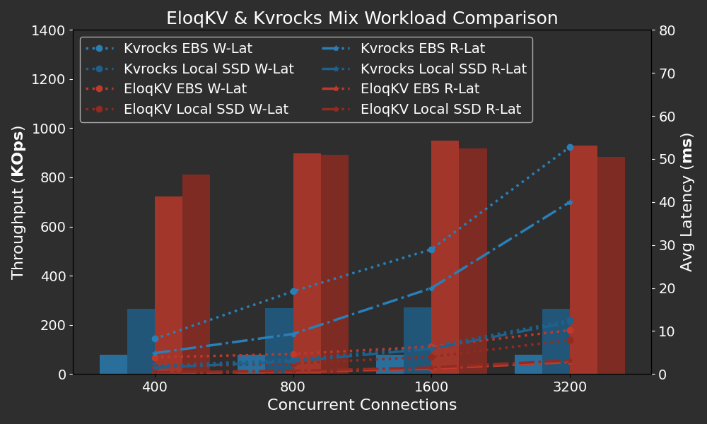
</p>

结果表明，**EloqKV**在混合工作负载中也表现更好。**EloqKV**保持小于1毫秒的读取延迟，即使在接近90万个OPS的重混合工作负载下。相比之下，EBS上的Kvrocks读取延迟仍然高得多，即使在高并发情况下，读取和写入延迟也超过10毫秒，并发性增加到超过50毫秒。即使在本地SSD上，Kvrocks的读取延迟也远高于**EloqKV**。这表明**EloqKV**可以在集群处于重写工作负载时保持低读取延迟。

### 关键要点

在此实验中，我们评估EloqKV并显示其性能，当数据持久性得到强烈执行时。在普通的低端服务器上，EloqKV可以轻松维持超过20万个写入每秒，即使延迟也可以接受。虽然这低于纯内存缓存性能，但它仍然非常适合许多现实世界应用程序。请注意，此性能数字与在同一硬件上以纯内存模式运行的单进程Redis服务器可以实现的数量没有太大不同。

<div style="page-break-after: always;"></div>

# 附录：使用Data Substrate构建您的数据库

在当今数据驱动的世界中，组织机构面临着构建和利用信息有效性的挑战。传统数据库系统往往难以适应快速发展的业务需求，导致复杂设置、刚性扩展和操作头痛。介绍Data Substrate，一个革命性的抽象层，使您能够构建定制的、动态的数据库，以满足您的特定要求。

## 什么是Data Substrate？

将Data Substrate视为数据管理解决方案的隐形骨干。它作为一个统一平台，封装了通常在各种数据场景中需要的常见功能。从确保一致性和数据持久性到处理并发性和故障容错，Data Substrate负责基本工作，让您专注于构建独特的数据库业务需求。

此外，Data Substrate的模块化设计和垂直扩展性使其能够适应您的特定要求。这意味着您可以独立扩展每一层——计算引擎、Data Substrate本身和云存储——以完美匹配您的负载需求。此外，其云供电成本效率利用低成本存储选项存储冷数据，保持资源优化。使用一系列灵活的引擎，您可以制作完美的数据库，无论它是高性能SQL引擎用于在线事务处理，还是kv引擎用于灵活内容管理，甚至是wasm引擎用于任何用户定义函数。

<!-- 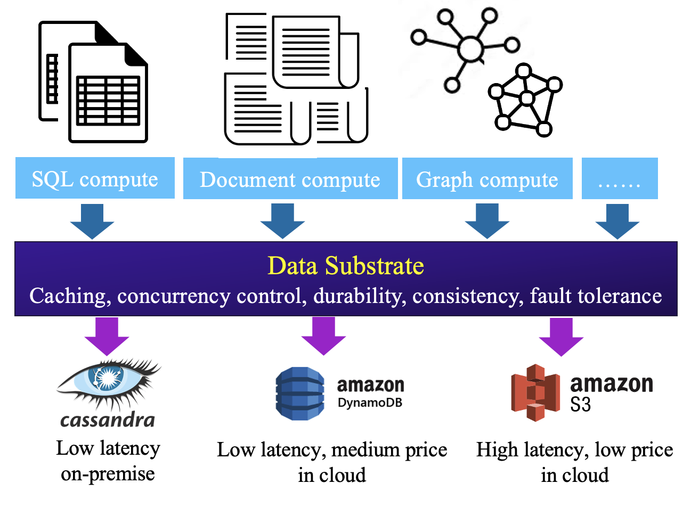 -->
<p align="center">

</p>
<!--  -->

### 关键组件：

- 计算引擎：架构的顶部层由各种可适应计算引擎组成，包括SQL、KV、文档和图形引擎。这些引擎无缝集成到Data Substrate中，提供数据处理和分析的灵活性。
- Data Substrate：这个核心层作为架构的基础，提供基本功能：
  - 缓存：通过在内存中存储频繁访问的数据来优化性能，以快速检索。
  - 并发控制：确保事务ACID并支持多写架构。
  - 数据持久性：通过持久化存储数据，即使在系统故障的情况下也能保证数据持久性。
  - 一致性：保持多个组件和操作的数据一致性。
  - 故障容错：通过处理错误和快速恢复来增强弹性，而不会丢失数据。
- 云存储：Data Substrate与多种云存储解决方案集成，如AWS DynamoDB和Google Bigtable，服务于两个关键目的：
  - 冷数据存储：以成本效益方式存储不频繁访问的数据，减少计算资源要求。
  - 缓存未命中处理：从云存储中获取数据，当它不在缓存中时，确保全面的数据访问。
  - 摆脱云厂商锁定并拥抱真正的云独立性，通过Data Substrate的无缝混合云存储架构。

## 为什么选择Data Substrate？

现代企业需要灵活的数据系统，可以无缝适应其独特的负载需求。Data Substrate使您能够摆脱传统数据库方法的限制，解决常见痛点，如：

- 长、繁琐的数据管道：Data Substrate简化数据流，消除重复处理并简化数据基础设施。
- 核心功能的重复手编码：不再重新发明轮子！Data Substrate提供强大的基础，让您专注于您的特定数据逻辑。
- 低资源利用：Data Substrate确保高效资源分配，扩展正确的组件以匹配您的负载需求，防止浪费容量。
- 不一致的数据同步：消除数据孤岛并确保整个系统中数据的一致性，通过Data Substrate的事务缓存机制。
- 选择您的云，您的路径：Data Substrate使您能够无缝地跨多个云协调数据，创建一个混合环境，完美符合您的业务需求，并促进战略决策。

## Data Substrate的关键功能：

Data Substrate通过其无与伦比的弹性适应性闪耀。它自动调整以满足您的需求，确保在负载变化时实现最佳性能。以下是一些关键亮点：

- 弹性扩展：适应多样化的负载毫不费力。对于读取密集型场景，Data Substrate扩展内存，以实现分布式缓存和快速数据检索。
- 并行写入优化：没有更多瓶颈！Data Substrate的专利一阶段提交协议和并行日志功能轻松处理写密集型工作负载，确保数据持久性和高可用性，即使在极端压力下也是如此。
- 成本效益扩展：大数据集不是Data Substrate的对手。可无缝扩展云存储，而不会过载计算资源，以最小化不频繁访问数据的成本。
